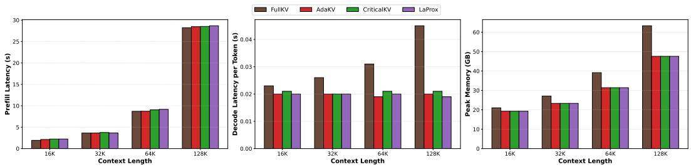
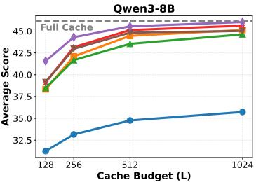
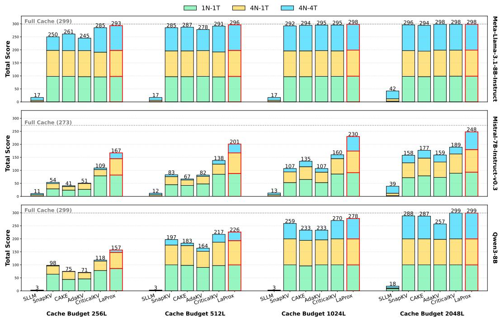
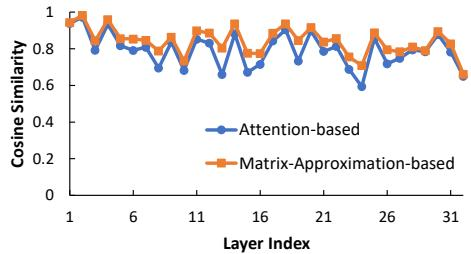
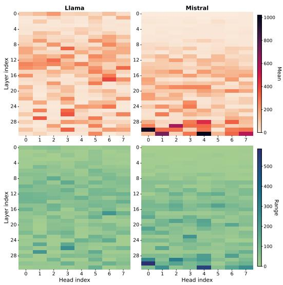

# Reformulating KV Cache Eviction Problem for Long-Context LLM Inference

## 一、论文概述

| 项目 | 内容 |
|------|------|
| **标题** | Reformulating KV Cache Eviction Problem for Long-Context LLM Inference |
| **作者** | Tho Mai, Joo-Young Kim |
| **机构** | KAIST |
| **论文** | [arXiv:2605.07234](https://arxiv.org/abs/2605.07234) |
| **代码** | - |
| **发布** | 2025年5月 |
| **许可** | - |

## 二、核心思想

### 问题定义

大语言模型（LLM）支持长上下文推理，但由于键值（KV）缓存增长，存在显著的内存和运行时开销。现有KV缓存驱逐方法主要依赖**局部注意力权重**，忽略了值表示、输出投影和头间交互的影响。

**现有方法的局限**：
- 仅依赖注意力权重，忽略值状态的影响
- 头级决策，忽略头间依赖
- 局部重要性分数，无法全局比较

### 解决方案概述

本文将KV缓存驱逐从传统的头级、权重平均方法重新定义为**输出感知、层级矩阵乘法近似问题**。提出LaProx，一种新颖的驱逐策略：

1. **输出感知度量**：显式建模注意力图和投影值状态之间的乘法交互
2. **全局可比分数**：分配全局可比较的重要性分数
3. **模型级选择**：启用模型级选择而非局部头级决策

**核心优势**：
- 仅使用5%的KV缓存即可保持模型性能
- 在所有配置下 consistently outperforms 先前工作
- 在极端压缩场景下，相比SOTA基线实现最多2倍精度损失减少
- 最小开销

## 三、技术架构

### 核心公式

#### 问题重新定义

**传统方法**：头级、权重平均

$$
\text{score}_h(i) = \sum_j A_{h,j,i} \cdot w_h
$$

**LaProx方法**：输出感知、层级矩阵乘法近似

$$
\text{score}(i) = \left\| \sum_h \sum_j A_{h,j,i} \cdot V_{h,j,i} \cdot O_h \right\|
$$

其中：
- $A_{h,j,i}$：注意力权重
- $V_{h,j,i}$：值状态
- $O_h$：输出投影

#### 全局可比分数

**关键创新**：将不同头的贡献归一化到同一尺度，实现全局可比。

$$
\text{normalized\_score}(i) = \frac{\text{score}(i) - \mu}{\sigma}
$$

#### 模型级选择

**统一驱逐策略**：跨所有层和头选择最重要的token。

$$
\text{global\_top-k} = \text{TopK}\left(\bigcup_{l,h} \text{normalized\_scores}_{l,h}\right)
$$

### 效率分析

**Figure 5**: 效率分析。

**关键特性**：
- 最小计算开销
- 可与现有推理引擎集成
- 支持不同压缩比率

## 四、核心创新

| 创新点 | 说明 | 理论/实验依据 |
|--------|------|---------------|
| **问题重新定义** | 从权重平均到输出感知近似 | 理论分析 |
| **输出感知度量** | 显式建模注意力×值×投影交互 | 公式推导 |
| **全局可比分数** | 归一化不同头的贡献 | 跨头比较 |
| **模型级选择** | 统一驱逐策略 | 全局top-k |

## 五、实验结果

### LongBench性能

**Figure 2**: 16个LongBench数据集在不同缓存预算下的平均分数。

**评估配置**：
- 基准：LongBench（16个数据集）
- 缓存预算：5%, 10%, 20%, 50%

**关键结果**：
- 仅使用5%的KV缓存即可保持模型性能
- 在所有缓存预算下 consistently outperforms 先前工作
- 在极端压缩场景下优势更明显

### Needle-In-A-Haystack

**Figure 3**: 32K上下文长度下3种NIAH变体的比较。

**关键发现**：
- 在长上下文检索任务中表现优异
- 在不同needle位置下保持稳定性能
- 相比基线方法有显著优势

### 精度损失分析

**Figure 4**: 全注意力层输出与近似注意力层输出之间的相似度分数。

**关键发现**：
- LaProx的输出与全注意力输出高度相似
- 在极端压缩下仍保持较高相似度
- 相比其他方法有明显优势

### 保留token分析

**Figure 6**: 每个头的保留token和变化。

**关键发现**：
- 不同头的保留模式有显著差异
- 全局选择策略能有效捕获重要token
- 头间依赖对选择有重要影响

## 六、相关工作

### KV缓存驱逐方法

| 方法 | 关键特性 | 本文对比 |
|------|----------|----------|
| **H2O** | 重击者Oracle、永久驱逐 | 基准对比 |
| **SnapKV** | 注意力分数选择 | 基准对比 |
| **StreamingLLM** | 滑动窗口 | 基准对比 |
| **Quest** | 查询感知页面选择 | 基准对比 |

### 输出感知方法

| 方法 | 关键特性 | 本文对比 |
|------|----------|----------|
| **DuoAttention** | 双注意力 | 相关工作 |
| **AdaKV** | 自适应KV缓存 | 相关工作 |

## 七、总结

### 核心贡献

1. **问题重新定义**：将KV缓存驱逐从头级权重平均重新定义为输出感知层级矩阵乘法近似问题
2. **LaProx方法**：提出显式建模注意力×值×投影交互的驱逐策略
3. **全局可比分数**：首次提出分配全局可比较重要性分数的统一驱逐策略
4. **显著性能提升**：仅使用5%的KV缓存即可保持模型性能，在所有配置下 outperforms 先前工作
5. **最小开销**：计算开销可忽略不计

### 技术影响

- **KV缓存管理**：为长上下文推理提供了更精确的KV缓存驱逐方法
- **注意力理解**：揭示了值状态和输出投影在token重要性中的作用
- **系统优化**：为设计更高效的推理系统提供了新思路
- **理论基础**：为KV缓存驱逐提供了更坚实的理论基础

### 局限性

- **计算开销**：虽然最小，但仍需额外计算
- **模型依赖**：需要访问注意力权重、值状态和输出投影
- **压缩极限**：在极低预算下性能可能下降
- **实现复杂度**：需要修改现有推理引擎

## 八、参考资源

- **论文**: https://arxiv.org/abs/2605.07234
- **H2O**: https://github.com/FMInference/H2O
- **SnapKV**: https://arxiv.org/abs/2404.02112
- **LongBench**: https://arxiv.org/abs/2308.14508
- **Needle-In-A-Haystack**: https://github.com/gkamradt/LLMTest_NeedleInAHaystack
