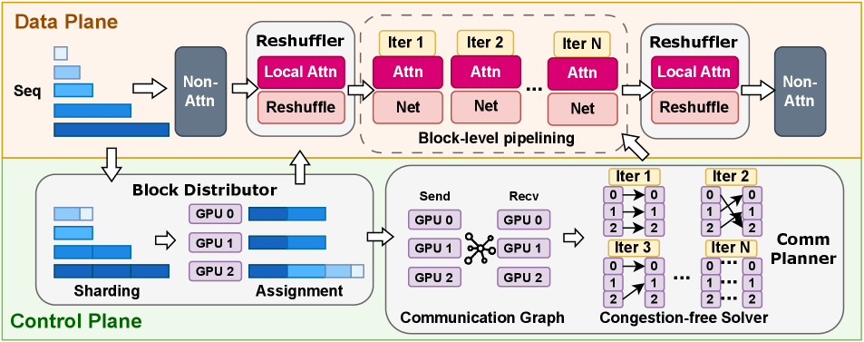
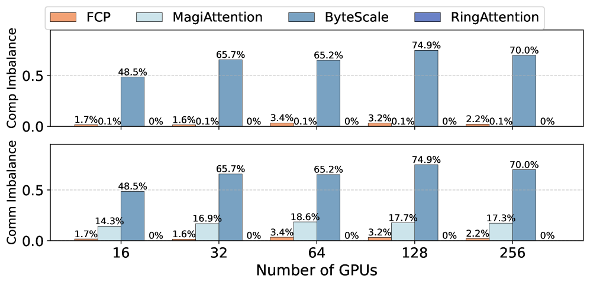
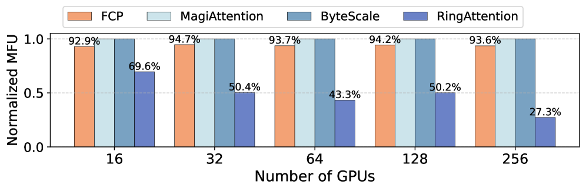
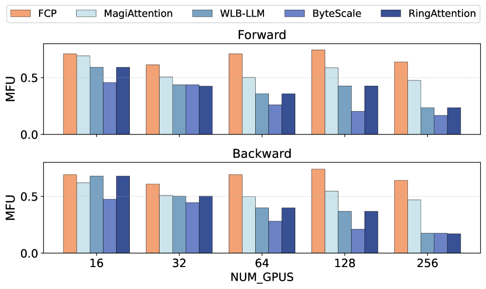
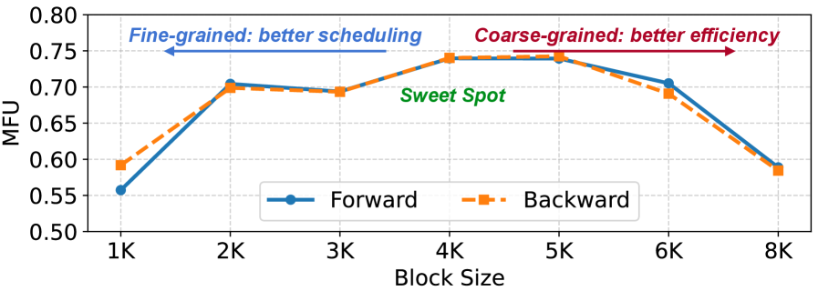
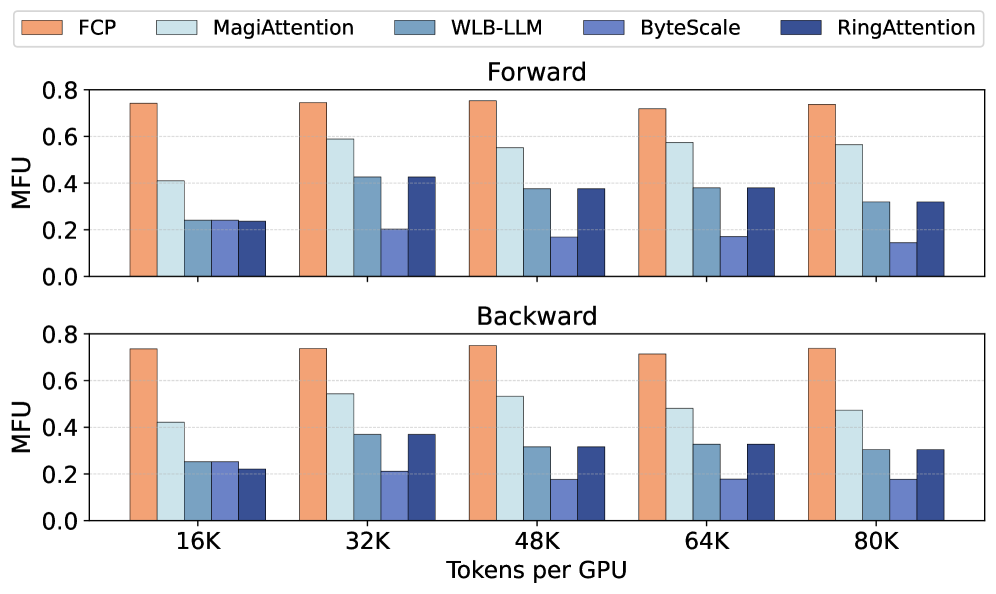
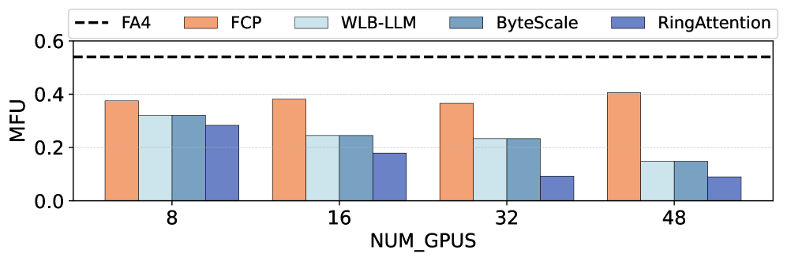

# FCP: 面向基础模型预训练的可扩展上下文并行框架

## 一、论文概述

| 项目 | 内容 |
|------|------|
| **标题** | Unleashing Scalable Context Parallelism for Foundation Models Pre-Training via FCP |
| **作者** | Anonymous Authors |
| **机构** | 未公开 (Under Review) |
| **论文** | [arXiv:2605.08524](https://arxiv.org/abs/2605.08524) |
| **代码** | - |
| **发布** | 2026年5月 |
| **许可** | MLSys 2026 Under Review |

## 二、核心思想

### 问题定义

长上下文预训练（如 512K tokens）需要将序列分布到多个 GPU 上，这要求高效的上下文并行（Context Parallelism, CP）策略。现有 CP 设计面临两个根本矛盾：

1. **计算效率 vs 负载均衡**：均匀分片（如 Ring Attention）导致短序列过度分片，计算效率低；按长度分区（如 ByteScale）导致长尾分布下负载严重不均衡
2. **通信开销**：现有方法使用固定拓扑（Ring/Ulysses），无法适应任意分片模式，导致通信瓶颈

**根本原因**：现有 CP 设计将序列分片与通信拓扑耦合，限制了优化空间。

### 解决方案概述

FCP（Flexible Context Parallelism）提出将序列分片与通信拓扑解耦：

1. **块级分片**：将序列分割为固定大小的块，支持任意分配
2. **任意点对点通信**：摆脱 Ring/Ulysses 固定拓扑限制
3. **无拥塞通信规划**：基于二部图匹配的通信调度
4. **透明重排**：对现有框架透明，无需修改数据加载器和位置编码

## 三、技术架构

### 整体框架图



FCP 由三个核心组件构成：

| 组件 | 职责 | 关键技术 |
|------|------|----------|
| **Block Distributor** | 序列分片与分配 | LPT 调度算法，最小化最大负载 |
| **Communication Planner** | 通信规划 | 二部图匹配，无拥塞求解器 |
| **Transparent Reshuffler** | 透明重排 | 与本地计算重叠的通信重排 |

### 核心公式

#### 问题形式化

给定 $N$ 个 GPU 和一组序列 $\{s_1, s_2, ..., s_M\}$，每个序列长度为 $L_i$。

**目标**：最小化最大计算负载，同时确保无拥塞通信。

$$\min \max_{i \in [N]} \text{workload}(i)$$

**约束**：
$$\sum_{i=1}^{N} \text{mem}(i) \leq \text{mem\_budget}$$

#### 块级分片策略

每个序列被分割为固定大小的块 $B$，块大小由硬件和模型配置决定：

$$\text{len}(B) = f(\text{hardware}, \text{model}, \text{network})$$

**分片优势**：
- 减少调度搜索空间，不损失表达能力
- 自适应不同上下文长度，长序列产生更多块，短序列产生更少块
- 每个块具有相同的通信和计算量，支持系统级建模

#### LPT 调度算法

FCP 采用最长处理时间（Longest Processing Time, LPT）调度算法的变体：

**算法**：
1. 按块大小降序排列所有块
2. 贪心地将每个块分配给负载最低的 GPU

**时间复杂度**：$O(K \log N)$，其中 $K$ 为块数，$N$ 为 GPU 数

**约束**：最大化内存使用约束下的负载均衡

#### 无拥塞通信求解器

将 $N$ 个 GPU 之间的数据流建模为无向二部图 $G = (S \cup R, E)$：

- **发送节点** $S = \{S(1), S(2), ..., S(N)\}$
- **接收节点** $R = \{R(1), R(2), ..., R(N)\}$
- **边** $S(i) \rightarrow R(j)$ 表示块需要从 GPU $i$ 传输到 GPU $j$

**关键引理**：

**引理 1**：单阶段无拥塞通信等价于二部图上的一个匹配。

**引理 2**：最大度为 $\Delta$ 的二部图至少需要 $\Delta$ 个不相交匹配来覆盖所有边。

**最优解**：最小无拥塞子阶段数等于 $\Delta$（最大度），通过 Hopcroft-Karp 算法在 $O(N^{2.5})$ 时间内求解。

#### 块级流水线

FCP 将计算和通信分解为块级子阶段，交错执行：

```
Worker 0: [Pull B0] [Compute B0] [Pull B1] [Compute B1] ...
Worker 1: [Pull B0] [Compute B0] [Pull B1] [Compute B1] ...
...
```

**优势**：
- 通信与计算重叠，隐藏通信延迟
- 粒度灵活，支持细粒度调度
- 底部向上合并器（Bottom-up Coalescer）可合并子阶段，提高内核效率

#### 底部向上合并器

将细粒度块级子阶段合并为粗粒度阶段，不牺牲无拥塞通信：

**合并度** $c$：连续 $c$ 个子阶段合并为一个阶段

**效果**：
- 每个阶段中，每个 worker 发送/接收/计算 $c$ 个块
- 提高内核效率，增加执行块大小
- 解耦调度粒度（块大小）与执行粒度（合并块大小）

#### 透明重排器

对现有框架透明，无需修改数据加载器和位置编码：

**重排策略**：
- 进入注意力模块前：重排用户序列布局为 FCP 工作负载感知布局
- 退出注意力模块后：恢复原始布局

**优化**：
- 将本地计算（不依赖远程块的计算）调度到流水线的开头和结尾
- 重排通信与本地计算重叠

### 模型组件

| 组件 | 说明 | 关键参数 |
|------|------|----------|
| **Block Distributor** | 序列分片与 GPU 分配 | 块大小 $B$，LPT 调度 |
| **Communication Planner** | 构建二部图，求解无拥塞通信 | Hopcroft-Karp 算法，匹配数 $\Delta$ |
| **Transparent Reshuffler** | 透明重排序列布局 | 与本地计算重叠 |
| **Bottom-up Coalescer** | 合并子阶段 | 合并度 $c$ |

### 训练流程

#### 块大小选择

块大小 $B$ 是关键超参数，需平衡：
1. **计算效率**：块大小需充分利用注意力内核 MFU
2. **通信重叠**：块大小需支持计算-通信重叠
3. **负载均衡**：块大小影响调度粒度

**典型配置**：
- GPU-X：4K 块大小
- GPU-Y：4K 块大小
- 合并度：16（默认）

#### CUDA Green Context

使用 CUDA Green Context 空间分区 GPU SM：
- **通信 SM**：GPU-X 6 个，GPU-Y 8 个
- **计算 SM**：剩余 SM
- **隔离**：防止计算和通信干扰

## 四、核心创新

| 创新点 | 说明 | 理论/实验依据 |
|--------|------|---------------|
| **块级分片与任意 P2P 通信** | 解耦序列分片与通信拓扑 | 消除 Ring/Ulysses 限制，扩大优化空间 |
| **无拥塞通信求解器** | 基于二部图匹配的通信调度 | 证明最优子阶段数 = 最大度 $\Delta$ |
| **块级流水线** | 细粒度计算-通信重叠 | 通信延迟隐藏，提高利用率 |
| **底部向上合并器** | 解耦调度与执行粒度 | 提高内核效率，不影响无拥塞性 |
| **透明重排器** | 对现有框架透明 | 无需修改数据加载器和位置编码 |

## 五、实验结果

### 实验设置

| 配置 | 说明 |
|------|------|
| **GPU** | GPU-X (Comp/Comm=5920), GPU-Y (Comp/Comm=2500) |
| **模型** | LLaMA-3-70B 配置，88 KV heads, 64 QO heads, head dim=128 |
| **序列长度** | 最大 512K tokens |
| **每 GPU tokens** | 32K（默认） |
| **基线** | Ring Attention, ByteScale, WLB-LLM, MagiAttention |

### 负载均衡评估



**不均衡率** = (max(load) - mean(load)) / max(load)

| 方法 | 计算不均衡 | 通信不均衡 |
|------|-----------|-----------|
| **FCP** | < 5% | < 5% |
| Ring Attention | ~10% | ~10% |
| ByteScale | ~70% | ~17% |
| MagiAttention | ~5% | ~17% |

**结论**：FCP 在计算和通信上均实现最优负载均衡。

### 计算效率评估



**假设**：所有上下文长度等于平均长度，排除负载不均衡影响。

| 方法 | MFU |
|------|-----|
| **FCP** | > 90% |
| Ring Attention | ~60% |
| ByteScale | ~80% |

**结论**：FCP 在理想负载均衡下仍保持最高计算效率。

### 模块级 MFU 缩放测试



**设置**：每 GPU tokens 固定为 32K，缩放 GPU 数量。

| GPU 数 | FCP | Ring Attention | ByteScale | MagiAttention |
|--------|-----|----------------|-----------|---------------|
| 16 | ~85% | ~80% | ~80% | ~80% |
| 64 | ~80% | ~60% | ~50% | ~70% |
| 128 | ~75% | ~50% | ~30% | ~60% |
| 256 | ~70% | ~40% | ~20% | ~50% |

**结论**：FCP 在所有 GPU 规模下均显著优于基线，实现近线性缩放。

### 消融实验

**设置**：128 GPU-X，逐步添加组件。

| 组件 | 前向 MFU | 后向 MFU |
|------|---------|---------|
| Base (Ring Attention) | 0.29 | 0.37 |
| + Block-level Pipelining (#1) | 0.48 (+64%) | 0.46 (+24%) |
| + Congestion-free Solver (#2) | 0.62 (+29%) | 0.59 (+28%) |
| + Bottom-up Coalescer (#3) | 0.70 (+10%) | 0.69 (+17%) |
| + Transparent Reshuffler (#4) | 0.75 (+7%) | 0.74 (+7%) |

**结论**：每个组件均带来显著改进，总计提升 159%（前向）和 100%（后向）。

### 敏感性测试

#### 块大小敏感性



| 块大小 | MFU |
|--------|-----|
| 2K | ~65% |
| 4K | ~75% |
| 6K | ~70% |
| 8K | ~60% |

**最佳块大小**：4K，在调度粒度和运行时效率之间取得最佳平衡。

#### 每 GPU tokens 敏感性



| 每 GPU tokens | FCP | Ring Attention | ByteScale |
|---------------|-----|----------------|-----------|
| 16K | ~70% | ~40% | ~20% |
| 32K | ~75% | ~50% | ~30% |
| 64K | ~80% | ~60% | ~50% |

**结论**：FCP 在所有配置下均显著优于基线。

#### GPU 类型泛化性



在 GPU-Y 上使用 FlashAttention-4，FCP 保持 >70% MFU，证明方法泛化性。

### 与现有方法对比

| 特性 | FCP | Ring Attention | ByteScale | MagiAttention |
|------|-----|----------------|-----------|---------------|
| **分片粒度** | 块级 | 序列级 | 序列级 | 块级 |
| **通信拓扑** | 任意 P2P | Ring | Ring/Ulysses | Ring |
| **负载均衡** | 计算+通信 | 仅计算 | 仅长度 | 仅计算 |
| **通信拥塞** | 无拥塞 | 可能拥塞 | 可能拥塞 | 可能拥塞 |
| **框架透明** | ✓ | ✗ | ✗ | ✗ |
| **MFU @256 GPU** | ~70% | ~40% | ~20% | ~50% |

## 六、相关工作

### 长上下文并行方法

| 方法 | 关键特性 | 局限性 |
|------|----------|--------|
| **Ring Attention** | 平衡优化设计 | 短序列过度分片 |
| **Ulysses** | 注意力头并行 | 可扩展性受限 |
| **LoongTrain** | 双环拓扑 | 输入无关设计 |
| **ByteScale** | 动态长短序列分区 | 长尾分布不均衡 |
| **FlexSP** | 动态 SP 分区 | 沿头维度并行 |
| **CAD** | 细粒度负载均衡 CP | 未建模通信流量 |
| **MagiAttention** | 块级抽象 | 未考虑通信拥塞 |

### FCP 优势

FCP 是唯一同时实现：
1. **细粒度块级分片**：自适应各种上下文长度
2. **任意 P2P 通信**：摆脱固定拓扑限制
3. **无拥塞通信规划**：基于图论的最优调度
4. **计算+通信联合优化**：同时优化两者
5. **框架透明**：无需修改现有代码

## 七、总结

### 核心贡献

1. **FCP 范式**：首个将序列分片与通信拓扑解耦的 CP 方法
2. **无拥塞通信理论**：证明最优通信子阶段数等于二部图最大度
3. **块级流水线**：细粒度计算-通信重叠
4. **透明部署**：对现有框架零侵入
5. **近线性缩放**：256 GPU 下保持 ~70% MFU

### 技术影响

- **训练效率**：256 GPU 下注意力 MFU 提升 2.21x
- **可扩展性**：支持 512K+ 上下文长度
- **工程友好**：透明部署，无需修改现有框架
- **理论基础**：基于图论的通信优化理论

### 局限性

- **网络拓扑依赖**：需要 fat-tree 或 rail-optimized 网络，不适用于 torus-based TPU
- **块大小选择**：虽有自动选择机制，但特定工作负载可能需要微调
- **仅评估因果掩码**：块稀疏注意力的扩展性未充分验证
- **匿名提交**：作者信息未公开，无法确认机构背景

## 八、参考资源

- **论文**: https://arxiv.org/abs/2605.08524
- **FlashAttention-3**: https://arxiv.org/abs/2407.08608
- **Ring Attention**: https://arxiv.org/abs/2310.01889
- **ByteScale**: ACM SIGCOMM 2025
- **LoongTrain**: https://arxiv.org/abs/2406.18485
- **Ulysses**: https://arxiv.org/abs/2309.14509
