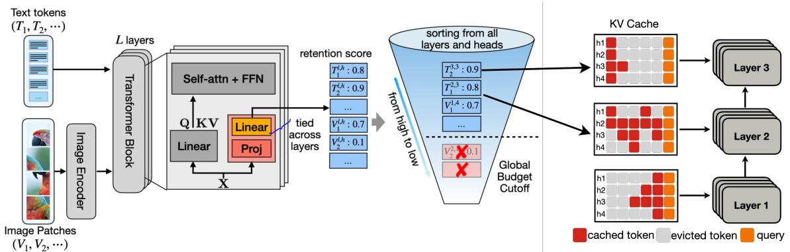
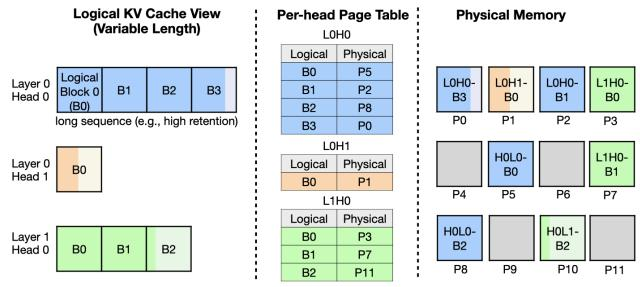
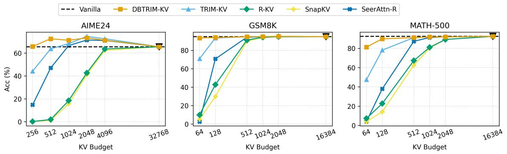
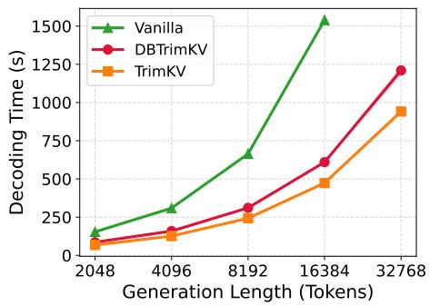
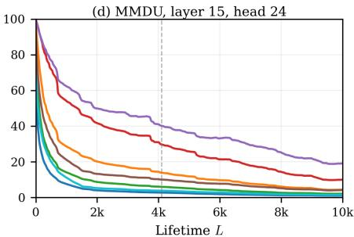
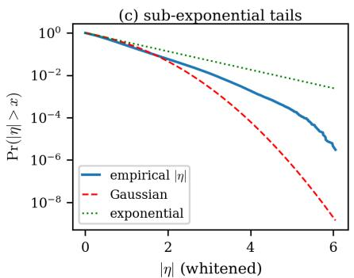

# Make Each Token Count: Towards Improving Long-Context Performance with KV Cache Eviction

## 一、论文概述

| 项目 | 内容 |
|------|------|
| **标题** | Make Each Token Count: Towards Improving Long-Context Performance with KV Cache Eviction |
| **作者** | Ngoc Bui, Hieu Trung Nguyen, Arman Cohan, Rex Ying |
| **机构** | Yale University, The Chinese University of Hong Kong |
| **论文** | [arXiv:2605.09649](https://arxiv.org/abs/2605.09649) |
| **代码** | [GitHub](https://github.com/ngocbh/trimkv) |
| **发布** | 2025年5月 |
| **许可** | - |

## 二、核心思想

### 问题定义

键值（KV）缓存是长上下文推理中的主要瓶颈，其内存和计算量随序列长度线性增长。现有的KV驱逐方法虽然降低了成本，但通常会导致性能下降。**关键洞察**：全缓存注意力并不总是最优的——在长上下文中，不相关token会稀释有用信息的注意力，因此选择性、可学习的驱逐不仅能近似全缓存，还能**改善**生成质量。

### 解决方案概述

本文提出TrimKV（Dynamic Budget TrimKV），一种全局保留门驱动的KV缓存驱逐方法：

1. **轻量级保留门**：为每个缓存的KV条目分配效用分数
2. **共享最终评分投影**：跨所有层和头校准分数，使其可比较
3. **全局驱逐策略**：来自不同层、头和模态的token直接竞争缓存容量

**核心优势**：
- 学习每个token的未来效用，而非仅依赖当前注意力分数
- 统一内存预算下的全局token选择和动态缓存分配
- 理论证明：优先保留有用token可减少注意力稀释
- 在多个长上下文基准上匹配或超越全缓存推理性能

## 三、技术架构

### 整体框架图

**Figure 3**: 方法概述。每层、每头的保留门为每个文本/视觉token分配标量分数；门的最终投影跨层共享以归一化分数。来自所有层、头和模态的token然后被池化并按保留分数全局排名，替代固定的每层/每头KV预算。

### 核心公式

#### KV驱逐问题形式化

在解码步骤t，KV缓存包含所有先前生成的token $C_t = \{1, \ldots, t\}$，注意力输出为：

$$
z_{t,i} := \frac{\mathbf{q}_t^\top \mathbf{k}_i}{\sqrt{d}}, \quad \alpha_{t,i} := \frac{e^{z_{t,i}}}{\sum_{j \in C_t} e^{z_{t,j}}}, \quad \mathbf{o}_t = \sum_{i \in C_t} \alpha_{t,i} \mathbf{v}_i
$$

驱逐策略下的注意力：

$$
\alpha_{t,i}^r = \frac{r_{t,i} e^{z_{t,i}}}{\sum_{j \in C_t} r_{t,j} e^{z_{t,j}}}, \quad r_{t,i} \in \{0, 1\}, \quad r_{t,i} \geq r_{t+1,i} \tag{1}
$$

#### 注意力稀释

**定义**：注意力稀释是分配给干扰token的注意力质量比例：

$$
\delta_t := 1 - \sum_{i \in U_t} \alpha_{t,i} \tag{7}
$$

**命题3.1**（近似干扰导致稀释）：当存在许多logit接近有用token的干扰token时，稀释不可避免。

**推论3.2**（优先保留减少稀释）：对于任何解码步骤t，有：

$$
\delta_t^r = \frac{(\rho_D / \rho_U) \delta_t}{(1 - \delta_t) + (\rho_D / \rho_U) \delta_t}
$$

其中 $\rho_U$ 和 $\rho_D$ 分别是有用token和干扰token的保留率。若 $\rho_D \leq \rho_U$，则 $\delta_t^r \leq \delta_t$。

#### 几何保留作为未来效用代理

**定理3.3**（保留的几何衰减）：假设未来查询状态演化遵循稳定动力学，若token i在其宽松top-K区域内有概率至少 $\epsilon_i > 0$ 在 $b_i$ 步内退出，则存在 $A_i(t)$ 使得：

$$
\bar{G}_i(t) \leq A_i(t) \sum_{s=t+1}^T w_{t,s} \beta_i^{s-t}, \quad \beta_i = (1 - \epsilon_i)^{1/b_i} \in (0,1)
$$

参数 $\beta_i$ 总结了token i的持久性：短暂的局部token有小的 $\beta_i$，而全局有用或结构化token的 $\beta_i$ 接近1。

#### 全局保留门架构

**权重共享保留门**：每层、每门的保留门预测保留系数：

$$
\beta_{\ell,h,t} = g_{\ell,h}(\mathbf{x}_t) \in [0,1]
$$

门的参数化：

$$
g_{\ell,h}(\mathbf{x}) = \sigma(\mathbf{w}_g^\top \operatorname{Proj}_{\ell,h}(\mathbf{x}) + b_g)
$$

其中 $\operatorname{Proj}_{\ell,h}$ 是层/头特定的，而 $(\mathbf{w}_g, b_g)$ 跨所有层和头共享。这种共享读出将保留分数校准到全局尺度。

**训练目标**：

$$
\mathcal{L}_{\text{quality}} = D_{\mathrm{KL}}(p \parallel q_\theta) + \mathbb{E}_{(x,y)}[-\log q_\theta(y|x)] \tag{3}
$$

$$
\mathcal{L}_{\text{cap}} = \sum_{t=1}^T \max\left(0, \sum_{\ell,h} \sum_{i=1}^t \beta_{\ell,h,i}^{t-i} - M_{\text{global}}\right) \tag{4}
$$

$$
\mathcal{L} = \mathcal{L}_{\text{quality}} + \lambda \mathcal{L}_{\text{cap}} \tag{5}
$$

#### 全局KV驱逐

推理时，为每个缓存token $(\ell, h, i)$ 分配保留分数：

$$
\widetilde{G}_{\ell,h,i}(t) = \sum_{s=t+1}^T \beta_{\ell,h,i}^{s-i} = \beta_{\ell,h,i}^{t+1-i} \frac{1 - \beta_{\ell,h,i}^{T-t}}{1 - \beta_{\ell,h,i}} \tag{9}
$$

驱逐规则：保留全局分数 $\widetilde{G}_{\ell,h,i}(t)$ 最大的 $M_{\text{global}}$ 个token。

### PagedAttention实现

**Figure 4**: 支持头特定可变长度KV缓存的PagedAttention。每层-头维护一个可变长度的逻辑KV序列，存储在固定大小的块中。

## 四、核心创新

| 创新点 | 说明 | 理论/实验依据 |
|--------|------|---------------|
| **注意力稀释理论** | 识别全缓存推理中的注意力稀释机制 | 命题3.1和推论3.2 |
| **几何保留理论** | 证明几何衰减是未来token效用的查询无关代理 | 定理3.3 |
| **权重共享保留门** | 跨层/头共享最终投影，校准保留分数到全局尺度 | 跨头比较实验 |
| **全局驱逐策略** | 统一内存预算下的全局token排名 | 动态预算分配 |
| **PagedAttention集成** | 支持头特定可变长度KV缓存 | 可变长度内核实现 |

## 五、实验结果

### 短格式问答（LLaVA-1.5-7B）

| 方法 | 128视觉token | 64视觉token | 32视觉token |
|------|--------------|-------------|-------------|
| Vanilla | 100.0% | 100.0% | 100.0% |
| FastV | - | 75.9% | - |
| DART | 94.6% | 91.0% | 86.6% |
| PruMerge | 93.4% | 88.8% | 84.0% |
| VisionZip | 95.4% | 91.7% | 86.0% |
| CDPruner | 96.1% | 94.5% | 91.5% |
| TrimKV | 99.9% | 99.7% | 99.4% |
| DBTrimKV | 99.9% | 99.7% | 99.4% |

**关键发现**：TrimKV和DBTrimKV在所有视觉token预算下都匹配或超越vanilla性能。

### 长视野推理（Qwen3-VL）

**Figure 5**: 纯语言模型（Qwen3-4B）的长推理性能。

| 预算 | 方法 | MMStar | MathVisionmini | MMMUProvision | VideoMME | 平均(%) |
|------|------|--------|----------------|---------------|----------|---------|
| 1024 | Vanilla | 71.52 | 48.68 | 40.64 | 54.22 | 100 |
| 1024 | SnapKV | 51.84 | 15.13 | 18.27 | 49.22 | 58.03 |
| 1024 | TrimKV | 70.64 | 45.72 | 34.34 | 54.15 | 97.02 |
| 1024 | DBTrimKV | 71.50 | 52.63 | 41.1 | 54.93 | **103.26** |
| 512 | SnapKV | 51.01 | 14.80 | 9.36 | 49.22 | 52.60 |
| 512 | TrimKV | 70.28 | 42.11 | 34.34 | 54.74 | 92.85 |
| 512 | DBTrimKV | 71.85 | 51.97 | 43.87 | 54.41 | **103.73** |
| 256 | SnapKV | 50.89 | 7.89 | 6.24 | 50.15 | 44.35 |
| 256 | TrimKV | 65.67 | 40.79 | 31.45 | 53.15 | 84.83 |
| 256 | DBTrimKV | 69.91 | 51.64 | 41.85 | 54.15 | **101.49** |

**关键发现**：DBTrimKV在多个预算下超越vanilla推理（103.26%、103.73%、101.49%），证明选择性驱逐可以改善推理。

### 效率扩展

**Figure 7**: 随生成长度的效率扩展。

**关键发现**：
- 随上下文长度增加，吞吐量优势更明显
- 随生成长度增加，延迟优势更明显
- 随KV预算减少，精度优势更明显

### 注意力存活分析

**Figure 9**: 全缓存推理下的token注意力存活。top-K曲线随L急剧下降，而更宽松的质量标准保持更高。

**关键发现**：
- 仅13.8%的token存活到L=4096（top-K=256）
- 99%质量标准下，头在L=4096时丢失60%的质量相关token
- 视觉token衰减速率与文本token相似

### 假设验证

**Figure 8**: 假设A.1的经验证据。(a)稳定性：A的特征值严格位于单位圆内。(b)均值回归/遍历性。(c)次指数创新。

## 六、相关工作

### KV缓存驱逐方法

| 方法 | 关键特性 | 本文对比 |
|------|----------|----------|
| **SnapKV** | 基于注意力的token选择 | 基准对比 |
| **AdaKV** | 动态预算分配 | 基准对比 |
| **Ada-Pyramid-KV** | 金字塔式预算分配 | 基准对比 |
| **R-KV** | 基于排名的KV选择 | 基准对比 |
| **TrimKV** | 可学习保留门（本文前身） | 改进基础 |

### 视觉token修剪方法

| 方法 | 关键特性 | 本文对比 |
|------|----------|----------|
| **FastV** | 预填充阶段视觉token修剪 | 基准对比 |
| **DART** | 动态注意力修剪 | 基准对比 |
| **PruMerge** | 视觉token合并 | 基准对比 |
| **VisionZip** | 视觉token压缩 | 基准对比 |
| **CDPruner** | 跨模态修剪 | 基准对比 |

### PagedAttention

| 方法 | 关键特性 | 本文对比 |
|------|----------|----------|
| **PagedAttention** | 分页内存管理 | 基础技术 |
| **vLLM** | 高效推理引擎 | 系统集成 |

## 七、总结

### 核心贡献

1. **注意力稀释理论**：识别并形式化全缓存推理中的注意力稀释机制，证明选择性驱逐可以改善推理
2. **几何保留理论**：证明几何衰减是未来token效用的查询无关代理，为保留门设计提供理论基础
3. **权重共享保留门**：跨层/头共享最终投影，将保留分数校准到全局尺度
4. **全局驱逐策略**：统一内存预算下的全局token排名，替代固定预算分配
5. **显著性能提升**：在多个长上下文基准上匹配或超越全缓存推理，同时大幅减少KV内存

### 技术影响

- **KV缓存管理**：为长上下文推理提供了更智能的KV缓存管理方案
- **注意力机制理解**：揭示了注意力稀释问题及其解决方案
- **多模态推理**：统一处理文本和视觉token的缓存管理
- **工程实践**：与PagedAttention集成，支持可变长度KV缓存

### 局限性

- **训练开销**：需要训练保留门，增加了一定的训练成本
- **理论假设**：几何衰减假设在某些场景下可能不完全成立
- **模型依赖**：需要为每个模型单独训练保留门
- **推理延迟**：全局排名和驱逐操作引入了一定的推理开销

## 八、参考资源

- **论文**: https://arxiv.org/abs/2605.09649
- **代码**: https://github.com/ngocbh/trimkv
- **TrimKV前身**: Bui et al. [2025]
- **PagedAttention**: https://arxiv.org/abs/2309.06180
- **SnapKV**: https://arxiv.org/abs/2404.02112
