# Qwen-Image-2.0 Technical Report: 统一图像生成与编辑的基础模型

## 一、论文概述

| 项目 | 内容 |
|------|------|
| **标题** | Qwen-Image-2.0 Technical Report |
| **作者** | Bing Zhao, Chenfei Wu, Deqing Li, Hao Meng, Jiahao Li, Jie Zhang, Jingren Zhou, Junyang Lin 等 60+ 位作者 |
| **机构** | 阿里巴巴 Qwen 团队 |
| **论文** | https://arxiv.org/abs/2605.10730v1 |
| **代码** | 未开源 |
| **发布** | 2026年5月11日 |
| **许可** | CC BY 4.0 |
| **领域** | cs.CV (计算机视觉与模式识别) |

## 二、核心思想

### 问题定义

当前图像生成基础模型虽然在高质量美学生成和文字渲染方面取得了显著进展，但在实际创意工作流中仍面临多项瓶颈：

1. **超长文本渲染脆弱**：随着渲染字符数增加，现有模型出现字形畸变、字符遗漏和布局崩溃
2. **多语言排版不成熟**：大多数系统主要在英文或中文上训练，其他语言的字符准确性和排版效果差
3. **高分辨率写实生成退化**：在 2K 及以上分辨率下出现重复纹理、不一致光照和细节丢失
4. **复杂指令遵循不足**：涉及多实体、空间约束的提示词常导致概念遗漏或视觉幻觉
5. **统一性不足**：很少有系统能在单一模型中同时实现文本生成和图像编辑

### 解决方案概述

Qwen-Image-2.0 提出一个统一框架，将文本生成图像（T2I）和指令式图像编辑（TI2I）集成在单一模型中：

- 使用 **Qwen3-VL** 作为条件编码器，提取语义特征
- 采用 **多模态扩散 Transformer (MMDiT)** 进行联合条件-目标建模
- 引入 **高压缩 VAE**（16x 空间下采样）实现原生高分辨率生成
- 配套大规模数据管理和定制化多阶段训练流水线
- 支持最多 **1K token** 的指令输入，可直接生成幻灯片、海报、信息图、漫画等富文本视觉内容

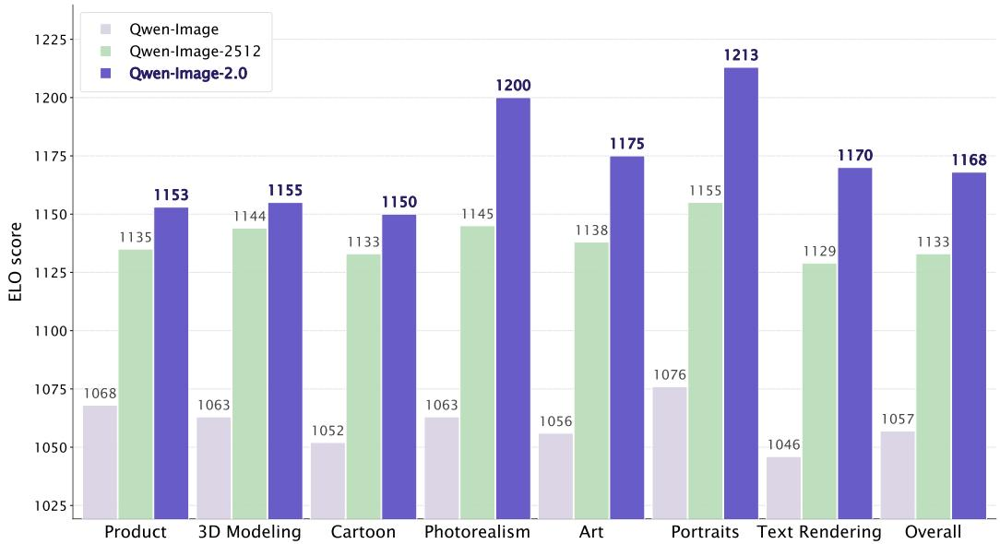
*Figure 1: Qwen-Image-2.0 在 LMArena 上的核心维度提升*

## 三、技术架构

### 整体框架图

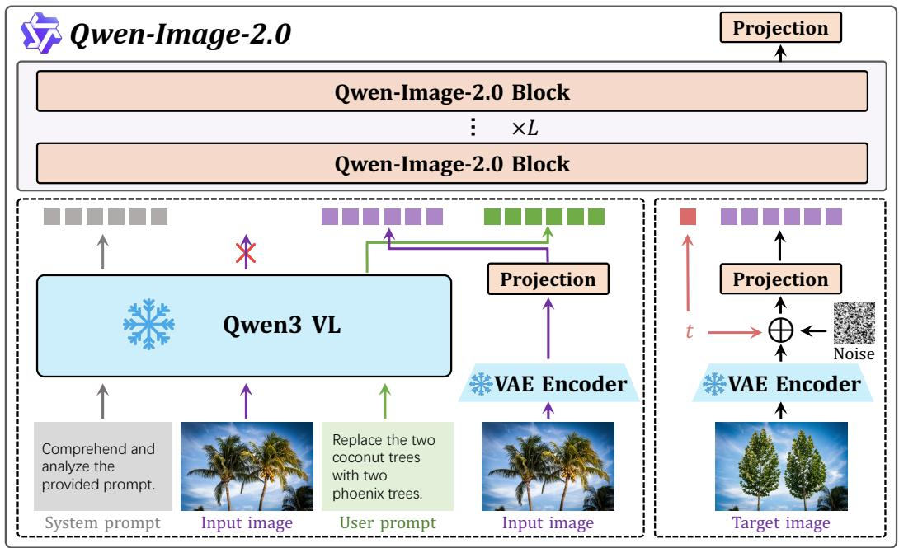
*Figure 8: Qwen-Image-2.0 架构概览。模型采用 MMDiT 架构，输入由冻结的 Qwen3-VL 和 VAE 编码器提供。使用 RMSNorm 进行 QK-Norm，其他归一化层使用 LayerNorm。统一流采用 MSRoPE 编码进行联合位置计算，MLP 层使用 SwiGLU 激活函数。*

### 三大核心组件

#### 1. 高压缩 VAE

- **配置**: f16c64（16x 空间压缩，64 通道潜变量）
- **残差自编码器架构**：引入非参数跳跃连接，保留细粒度空间细节
- **语义对齐损失**：借鉴 VA-VAE，在重建目标之外引入语义对齐，使潜空间更适合扩散建模
- **关键发现**：
  - 动态语义对齐效果显著：早期施加强约束建立可扩散潜空间，后期逐渐放松以平衡重建保真度
  - 对抗损失在大规模 VAE 训练中基本冗余，已移除以提高训练稳定性
- **性能**：在 ImageNet-1k 验证集（256x256）和内部文本密集语料库上，在 16x 压缩比下达到 SOTA

**VAE 重建性能对比 (Table 1):**

| 模型 | 设置 | Enc 参数(M) | Dec 参数(M) | ImageNet PSNR | ImageNet SSIM | Text PSNR | Text SSIM |
|------|------|------------|------------|---------------|---------------|-----------|-----------|
| SD-3.5 | f8c16 | 34 | 50 | 31.22 | 0.8839 | 29.93 | 0.9658 |
| FLUX.1-dev | f8c16 | 34 | 50 | 32.84 | 0.9155 | 32.65 | 0.9792 |
| Qwen-Image | f8c16 | 54 | 73 | 33.42 | 0.9159 | 36.63 | 0.9839 |
| HunyuanImage-3.0 | f16c32 | 389 | 871 | 31.08 | 0.8655 | 29.23 | 0.9521 |
| Wan2.2 | f16c48 | 150 | 555 | 31.30 | 0.8784 | 28.19 | 0.9508 |
| **Qwen-Image-2.0** | **f16c64** | **79** | **259** | **33.42** | **0.9225** | **32.81** | **0.9795** |

#### 2. 多模态扩散 Transformer (MMDiT)

文本和图像 token 在共享 Transformer 骨干中处理，实现联合条件-目标建模。

**核心公式：**

给定视觉输入 x 和文本输入 y，Qwen3-VL 编码为模态感知表示 $h_x$ 和 $h_y$，视觉表示被 VAE 潜变量 $\mathcal{E}_x$ 替换：

$$
\boldsymbol{h} = \text{Concat}(\mathcal{E}_x, h_y) \tag{1}
$$

**调制模块**（纯乘法，移除偏置项）：

$$
\boldsymbol{h}' = \alpha \boldsymbol{h} \tag{2}
$$

**SwiGLU MLP**（解决联合训练中激活幅度过大的问题）：

$$
\boldsymbol{h} = \Phi_1(\boldsymbol{x}) \otimes \sigma(\Phi_2(\boldsymbol{x})) \tag{3}
$$

其中 $\Phi_1(\cdot)$ 和 $\Phi_2(\cdot)$ 为线性投影，$\sigma(\cdot)$ 为 SiLU 激活函数。

**关键设计：**
- **MSRoPE**：跨文本和视觉 token 的统一位置编码
- **RMSNorm QK normalization**：稳定联合文本-图像训练
- **无偏置调制**：简化调制公式

#### 3. Prompt Enhancer (提示增强器)

将用户查询转化为结构化、细节丰富的提示词，帮助下游生成器捕获预期视觉设计。

- **数据构建**：反向工程流水线——将精细标注降级为多样化的口语化用户提示，同时记录反向推理链作为训练监督
- **四类图像分类**：General、Portrait、Text、Complex Text
- **训练**：从 Qwen3.5-9B 初始化，SFT + RL 两阶段训练
- **RL 阶段**：使用 GRPO，奖励包括 MLLM 视觉一致性、美学质量和文本约束

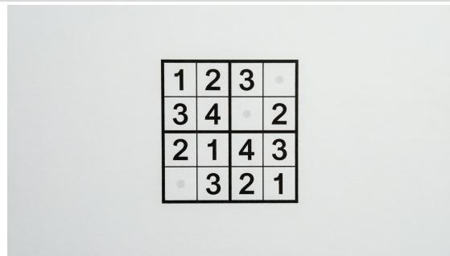
*Figure 9: 使用原始提示词和提示增强后的 T2I 结果对比*

### 训练流程

#### 多阶段训练策略

| 配置 | 预训练 | 持续预训练 | 监督微调 |
|------|--------|-----------|---------|
| **步数** | 700K | 250K | 10K |
| **分辨率** | 256/512 | 512/1024/2048 | 512/1024/2048 |
| **Batch Size** | 32K/16K | 16K/8K/4K | 16K/8K/4K |
| **T2I:TI2I 比例** | 9:1 | 7:3 | 7:3 |
| **学习率** | 1e-4 | 2e-5 | 1e-5 |
| **优化器** | Adam | Adam | Adam |

**阶段说明：**
- **预训练**：学习基本语义表示，700K 步，低分辨率提高数据吞吐
- **持续预训练**：提升生成质量，适应更高分辨率输入，逐步增加至 2048p
- **监督微调**：提升美学质量，约 10K 步，严格过滤 + 人工筛选

#### 数据流水线

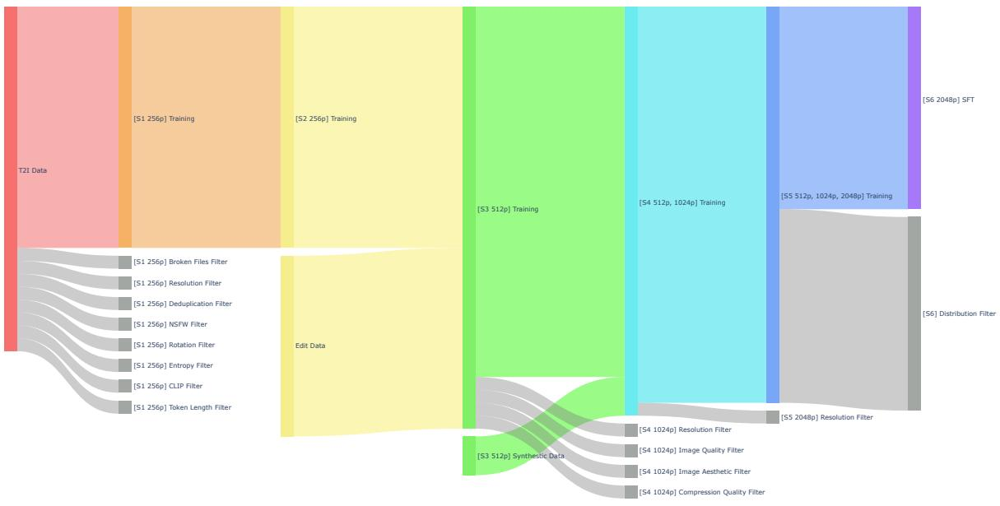
*Figure 6: Qwen-Image-2.0 数据流水线概览*

**六阶段渐进过滤：**
1. **Stage 1 (256P T2I)**：8 项过滤——损坏文件、分辨率、去重、NSFW、旋转、熵、CLIP 对齐、token 长度
2. **Stage 2 (256P T2I+TI2I)**：引入编辑数据
3. **Stage 3 (512P T2I+TI2I)**：分辨率提升至 512p，引入合成数据
4. **Stage 4 (512P/1024P)**：额外质量过滤——分辨率、图像质量、美学、压缩质量
5. **Stage 5 (Multi-Resolution)**：扩展至 512p/1024p/2048p
6. **Stage 6 (SFT)**：严格分布过滤，最终微调

**数据标注四类方案：**
- **General captions**：任意分辨率和复杂度的全面描述
- **Text captions**：针对密集文本/抽象符号的专门模板
- **Knowledge captions**：注入背景知识和上下文
- **Structured captions**：用于关系图、流程图等复杂结构

#### RLHF 流水线

**五个任务特定奖励模型：**
- **美学奖励** (T2I)：视觉质量、构图平衡、纹理保真度
- **图文对齐奖励** (T2I)：语义对应、惩罚概念遗漏
- **人像奖励** (T2I)：解剖合理性、面部比例、皮肤毛发纹理
- **指令遵循奖励** (TI2I)：编辑操作是否准确执行
- **视觉一致性奖励** (TI2I)：未修改区域的身份和结构完整性

**训练策略：**
- 使用 GRPO 框架的扩散 RL
- **混合 CFG 策略**：rollout 采样使用 CFG 生成高质量候选，策略优化目标中排除无条件分支
- 动态调整提示分布和奖励模型权重

#### 少步蒸馏

采用 **Distribution Matching Distillation (DMD)** 将多步模型蒸馏为少步变体：

$$
\nabla_{\boldsymbol{\theta}} \ell_{\mathrm{DMD}}(\boldsymbol{\theta}) = \mathbb{E}\left[(\boldsymbol{s}_{\text{fake}}(\boldsymbol{x}_t, t, \boldsymbol{c}) - \boldsymbol{s}_{\text{real}}(\boldsymbol{x}_t, t, \boldsymbol{c})) \nabla_{\boldsymbol{\theta}} \boldsymbol{x}_{\boldsymbol{\theta}}\right] \tag{4}
$$

**结果**：4-NFE 蒸馏学生模型在视觉质量上与 40 步教师模型相当，大幅降低推理成本。

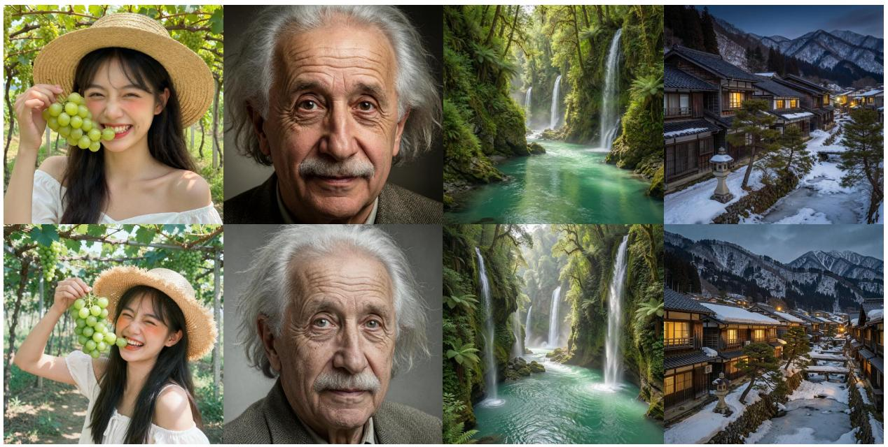
*Figure 11: 多步教师与少步蒸馏学生的对比*

## 四、核心创新

| 创新点 | 说明 | 理论/实验依据 |
|--------|------|---------------|
| **16x 高压缩 VAE** | f16c64 配置，残差自编码器 + 语义对齐损失 | 在 16x 压缩比下 SOTA 重建性能，PSNR 33.42/SSIM 0.9225 |
| **统一 T2I + TI2I** | 单一模型同时支持生成和编辑，无需流水线切换 | 7:3 T2I/TI2I 混合训练，多阶段策略 |
| **Qwen3-VL 条件编码** | 利用多模态大模型的强语义理解 | 支持 1K token 长上下文，复杂指令遵循 |
| **Prompt Enhancer** | SFT + RL 两阶段训练，反向工程数据构建 | 显著提升生成质量和提示遵循 |
| **混合 CFG-GRPO** | rollout 使用 CFG，优化排除无条件分支 | 平衡视觉保真度和计算效率 |
| **闭环数据飞轮** | 错误归因驱动的三轨优化（RL/预训练/Prompt 工程） | 自动化持续改进，减少人工干预 |
| **少步蒸馏** | DMD 蒸馏至 4-NFE | 4 步 ≈ 40 步质量，大幅降低推理成本 |

## 五、代码实现分析

论文未开源代码。根据论文描述，关键实现包括：
- **条件编码器**：Qwen3-VL（冻结）
- **骨干网络**：MMDiT，SwiGLU MLP，RMSNorm QK-Norm，MSRoPE 位置编码
- **VAE**：残差自编码器，16x 压缩，64 通道
- **Prompt Enhancer**：基于 Qwen3.5-9B 初始化
- **RLHF**：GRPO 框架，5 个任务特定奖励模型

## 六、实验结果

### LMArena 基准测试

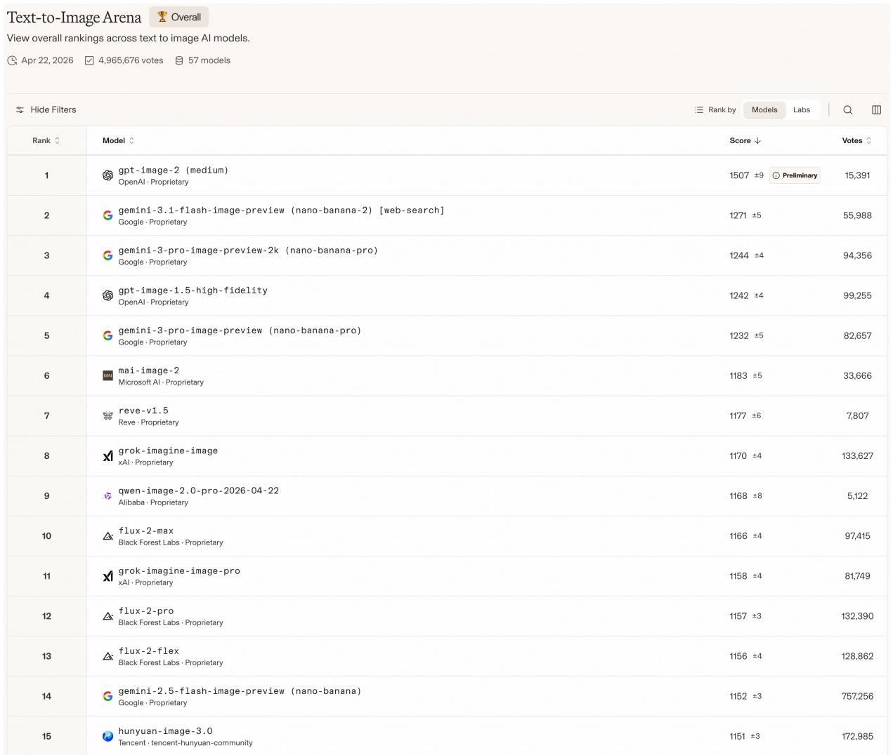
*Figure 12: LMArena 评测结果（2026年4月22日访问）*

- **全球排名 #9**，**中国模型排名 #1**
- ELO 分数 **1168**，超越 Nano Banana
- 相比前代 Qwen-Image 系列在生成和编辑方面均有显著提升

### 定性评估 - 文本渲染

*Figure 13: 文本渲染结果对比*

**对比模型**：GPT-Image-2、NanoBanana Pro、Qwen-Image-2512、Wan2.7 Pro、Seedream 5.0 Lite

**关键发现**：
- Qwen-Image-2.0 是唯一能在复杂中文场景中实现零错误文本渲染的模型
- 其他模型存在：字符过小、字符错误、内容幻觉、空间绑定失败等问题
- 支持垂直排版、多列布局等传统中文排版风格

### 定性评估 - 人像生成

*Figure 14: 人像生成结果对比*

**关键发现**：
- Qwen-Image-2.0 同时实现高保真文本渲染和写实氛围
- 精确的材质纹理、自然光照一致性
- 正确的运动模糊效果和空间定位

### 定性评估 - 图像编辑

**复杂中文文本渲染编辑**：

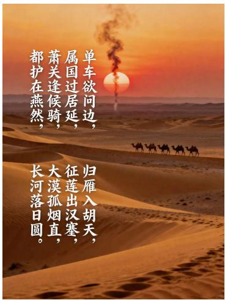
*Figure 16: 复杂中文文本渲染编辑对比*

- Qwen-Image-2.0 是唯一能同时保持字符级准确性、正典行序和连贯竖排构图的模型
- 支持长诗（40+ 字符）的精确渲染

**身份保持编辑**：

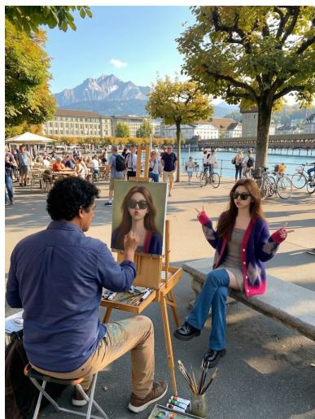
*Figure 17: 身份保持编辑对比*

- 在单图和多图编辑任务中保持细粒度对象细节
- 面部表情、姿态、整体外观均保持一致

### 多语言渲染

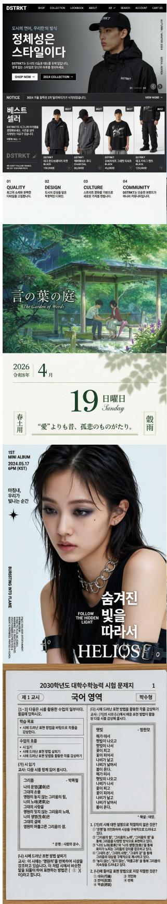
*Figure 18: Qwen-Image-2.0 多语言渲染可视化*

### 幻灯片生成

Qwen-Image-2.0 支持直接生成专业幻灯片，包含复杂的文本布局、图文混排和信息层级。

## 七、相关工作

- **扩散模型基础**：Stable Diffusion (Rombach et al., 2022)、FLUX.1 (BlackForest, 2024)、SD-3.5 (Esser et al., 2024)
- **视觉 Transformer**：DiT (Peebles & Xie, 2023)
- **多模态条件编码**：Qwen3-VL (Bai et al., 2025)、其他使用 VL 模型作为条件编码器的工作
- **商业系统**：GPT-Image-2 (OpenAI, 2025)、Seedream 5.0 (Seed, 2025)、Google Imagen (Google, 2025)
- **开源竞争者**：HunyuanImage-3.0 (Cao et al., 2025)、Wan2.2 (Wan et al., 2025)
- **RLHF 对齐**：GRPO (Liu et al., 2026; Zheng et al., 2025)、扩散 RL (Wang et al., 2025)
- **蒸馏**：DMD (Yin et al., 2024)

## 八、总结

### 核心贡献

1. **专业级文本渲染**：支持 1K token 指令，直接生成幻灯片、海报、信息图等富文本文档
2. **广泛多语言渲染**：更高字符准确性和复杂排版支持
3. **高分辨率写实生成**：原生 2K 分辨率支持，更精细纹理和连贯光照
4. **鲁棒艺术表达**：在多种美学风格下保持稳定质量
5. **更精确指令遵循**：对复杂组合提示的语义理解更强
6. **统一生成与编辑**：单一模型支持 T2I 和 TI2I
7. **改进推理效率**：通过架构和训练策略联合优化，实现更快推理

### 技术影响

- 证明了多模态大模型（Qwen3-VL）作为扩散模型条件编码器的有效性
- 16x 高压缩 VAE 的可行性，大幅降低训练成本
- 闭环数据飞轮为持续模型改进提供了自动化框架
- 统一生成编辑架构为未来通用视觉生成系统奠定基础

### 局限性

- 论文未开源代码和模型权重
- 未提供定量 benchmark 分数（如 FID、CLIP Score 等），主要依赖 LMArena 人类评估和定性对比
- 16x VAE 虽然效率高，但在某些场景下重建质量可能不如 8x VAE
- 少步蒸馏（4-NFE）的性能上限未充分探索

## 九、关键图表

| 图表 | 说明 | 文件路径 |
|------|------|----------|
| Figure 1 | LMArena 核心维度提升 |  |
| Figure 5 | 数据分布 | 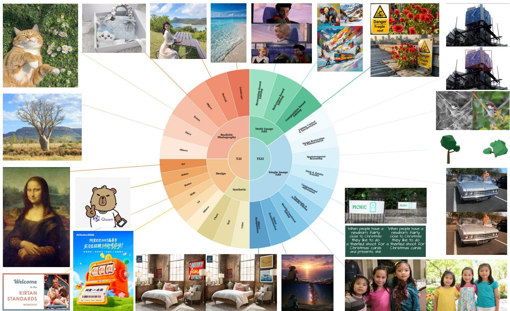 |
| Figure 6 | 数据流水线 |  |
| Figure 7 | 数据飞轮系统 | 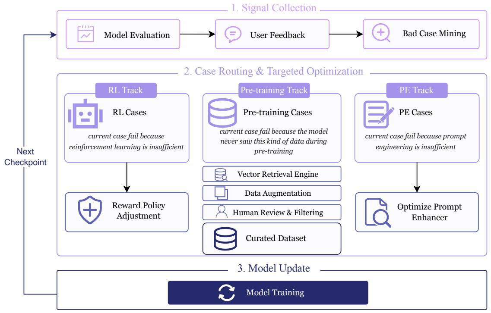 |
| Figure 8 | 架构概览 |  |
| Figure 9 | Prompt Enhancer 效果 |  |
| Figure 10 | RLHF 前后对比 |  |
| Figure 11 | 蒸馏对比 |  |
| Figure 12 | LMArena 排名 |  |
| Figure 13 | 文本渲染对比 |  |
| Figure 16 | 编辑文本渲染 |  |
| Figure 17 | 身份保持编辑 |  |
| Figure 18 | 多语言渲染 |  |

## 十、参考资源

- **论文**: https://arxiv.org/abs/2605.10730v1
- **PDF**: https://arxiv.org/pdf/2605.10730v1
- **LMArena**: https://arena.ai/leaderboard
- **Qwen3-VL**: https://arxiv.org/abs/2511.21631
