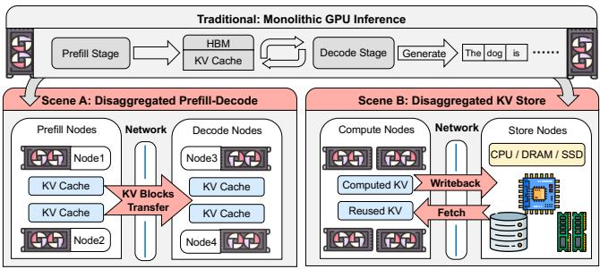
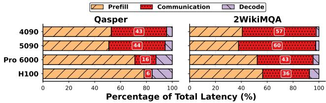
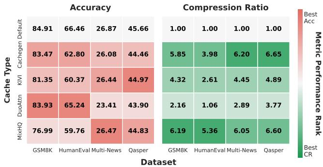
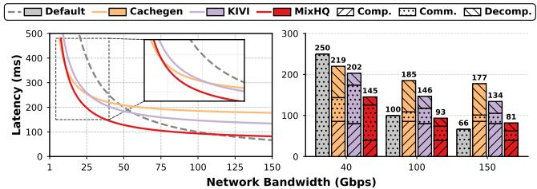
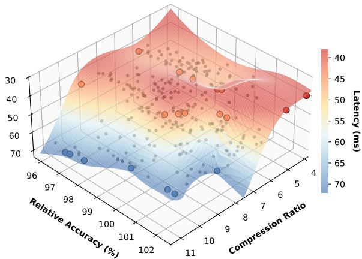

# KVServe: Service-Aware KV Cache Compression for Communication-Efficient Disaggregated LLM Serving

## 一、论文概述

| 项目 | 内容 |
|------|------|
| **标题** | KVServe: Service-Aware KV Cache Compression for Communication-Efficient Disaggregated LLM Serving |
| **作者** | Zedong Liu, Xinyang Ma, Dejun Luo, Hairui Zhao, Bing Lu, Wenjing Huang, Yida Gu, Xingchen Liu, Zheng Wei, Jinyang Liu, Dingwen Tao, Guangming Tan |
| **机构** | UCAS, ICT/CAS, Shanghai Jiao Tong University |
| **论文** | [arXiv:2605.13734](https://arxiv.org/abs/2605.13734) |
| **代码** | - |
| **发布** | 2025年5月 |
| **许可** | - |

## 二、核心思想

### 问题定义

大语言模型（LLM）在生产中被广泛采用，推动推理系统达到极限。分离式LLM服务（如PD分离和KV状态分离）提高了可扩展性和成本效率，但也使KV成为跨越网络和存储边界的显式负载，成为**端到端的主导瓶颈**。

**关键问题**：
1. **通信瓶颈**：KV通信时间占作业完成时间的60%
2. **静态配置**：现有KV压缩是静态运行时配置，无法适应动态服务上下文
3. **次优选择**：固定选择可能次优甚至增加延迟

### 解决方案概述

本文提出KVServe，第一个面向分离式LLM服务的服务感知和自适应KV通信压缩框架：

1. **统一策略空间**：将KV压缩统一为模块化策略空间，支持新组件和跨方法重组
2. **贝叶斯分析引擎**：高效搜索策略空间，提炼3D Pareto候选集，减少50倍离线搜索开销
3. **服务感知在线控制器**：结合分析延迟模型和轻量级bandit，在约束下选择配置文件

**核心优势**：
- PD分离服务中最高9.13倍JCT加速
- KV分离服务中最高32.8倍TTFT减少
- 跨数据集、模型、GPU和网络的广泛评估

## 三、技术架构

### 整体框架图

**Figure 2**: 分离式服务系统架构。

### 核心公式

#### KV延迟模型

对于任何压缩策略c，KV延迟由两部分组成：
1. 压缩KV的通信
2. 压缩和解压缩

**关键观察**：最优策略随带宽变化而切换。在图4中，三种方法的交叉点分别为50/55/110 Gbps。

#### 策略空间统一

KVServe将KV压缩抽象为统一模块化流水线，分解代表性方法为可插拔组件：

| 组件类型 | 说明 | 示例 |
|----------|------|------|
| **变换** | 预处理变换 | Hadamard, Affine |
| **量化** | 精度降低 | 4-bit, 2-bit, 混合精度 |
| **编解码** | 无损编码 | Huffman, ANS |

#### 贝叶斯分析引擎

**挑战**：策略空间组合爆炸，穷举分析不实际。

**解决方案**：使用贝叶斯优化大幅减少昂贵的端到端分析运行，将离线搜索开销从1000小时减少到20小时规模。

#### 服务感知在线控制器

**设计**：
- 感知运行时服务上下文
- 从离线候选中快速选择最优配置
- 结合分析延迟模型和轻量级bandit
- 修正离线分析与在线执行之间的不匹配

### 时间分解

**Figure 1**: PD分离服务下的时间分解。KV通信时间占作业完成时间的60%。

### 精度与压缩比

**Figure 3**: 跨工作负载的精度和压缩比。

**关键发现**：
- KIVI在Qasper上精度最佳，但在GSM8K和HumanEval上接近底部
- DuoAttention在GSM8K和HumanEval上最佳，但在Multi-News和Qasper上最差
- CacheGen在Multi-News上压缩比最高（6.20×），但在HumanEval上仅3.98×

### 延迟-带宽关系

**Figure 4**: 跨有效带宽的KV延迟（左）和时间分解（右）。

**关键发现**：
- 最优策略随带宽切换：CacheGen在极低带宽最优，MixHQ在宽范围最优
- 每个配置仅在带宽范围内有益：超过阈值后，压缩节省无法抵消(解)压缩成本

### 3D Pareto前沿

**Figure 10**: 策略空间的3D Pareto前沿。

## 四、核心创新

| 创新点 | 说明 | 理论/实验依据 |
|--------|------|---------------|
| **统一模块化流水线** | 将KV压缩抽象为可组合、可扩展的策略空间 | 跨方法重组 |
| **贝叶斯分析引擎** | 高效搜索策略空间，减少50倍离线开销 | 从1000小时到20小时 |
| **服务感知在线控制器** | 结合延迟模型和bandit的自适应选择 | 修正离线-在线不匹配 |
| **vLLM集成** | 集成到vLLM推理流水线 | 生产级部署 |

## 五、实验结果

### PD分离服务

**评估配置**：
- 模型：Llama-3.1
- 数据集：Qasper, 2WikiMQA等
- GPU：H100, 4090, 5090, Pro 6000
- 网络：10-150 Gbps

**关键结果**：
- 最高9.13倍JCT加速
- 通信占JCT的16%-60%

### KV分离服务

**关键结果**：
- 最高32.8倍TTFT减少
- 跨数据集、模型、GPU和网络的广泛评估

### 工作负载依赖性

**关键发现**：
- 没有跨工作负载的通用最优KV压缩策略
- 实际系统必须推理多个候选策略，而非承诺单一静态配置
- 最优策略依赖于动态服务条件（如可用带宽）

## 六、相关工作

### KV压缩方法

| 方法 | 关键特性 | 本文对比 |
|------|----------|----------|
| **CacheGen** | 4-bit量化+无损编码 | 基准对比 |
| **KIVI** | 混合精度量化 | 基准对比 |
| **KVQuant** | 细粒度量化 | 基准对比 |
| **DuoAttention** | 双注意力压缩 | 基准对比 |
| **MixHQ** | 混合高质量压缩 | 基准对比 |

### 分离式服务

| 方法 | 关键特性 | 本文对比 |
|------|----------|----------|
| **PD分离** | 预填充/解码分离 | 目标架构 |
| **KV状态分离** | KV缓存卸载和跨查询重用 | 目标架构 |
| **Mooncake** | KVCache-centric分离架构 | 相关工作 |

### 服务感知优化

| 方法 | 关键特性 | 本文对比 |
|------|----------|----------|
| **vLLM** | 高效推理引擎 | 集成目标 |
| **SGLang** | 结构化生成语言 | 相关工作 |

## 七、总结

### 核心贡献

1. **统一模块化流水线**：将KV压缩抽象为可组合、可扩展的策略空间，支持新组件和跨方法重组
2. **贝叶斯分析引擎**：高效搜索策略空间，提炼3D Pareto候选集，减少50倍离线搜索开销
3. **服务感知在线控制器**：结合分析延迟模型和轻量级bandit，在约束下选择配置文件，修正离线-在线不匹配
4. **vLLM集成**：集成到vLLM推理流水线，支持生产级部署
5. **显著性能提升**：PD分离服务中最高9.13倍JCT加速，KV分离服务中最高32.8倍TTFT减少

### 技术影响

- **分离式服务**：为分离式LLM服务提供了高效的KV通信压缩方案
- **自适应优化**：展示了服务感知自适应优化的潜力
- **工程实践**：提供了完整的vLLM集成方案
- **系统设计**：为设计服务感知的推理系统提供了新思路

### 局限性

- **策略空间假设**：假设策略空间可以有效枚举和搜索
- **工作负载标签**：依赖工作负载标签作为路由输出
- **模型依赖**：需要为每个模型和配置单独分析
- **在线开销**：在线控制器引入了一定的运行时开销

## 八、参考资源

- **论文**: https://arxiv.org/abs/2605.13734
- **vLLM**: https://github.com/vllm-project/vllm
- **CacheGen**: https://arxiv.org/abs/2401.02366
- **KIVI**: https://arxiv.org/abs/2402.07144
- **KVQuant**: https://arxiv.org/abs/2401.18079
- **Mooncake**: https://arxiv.org/abs/2407.00079
