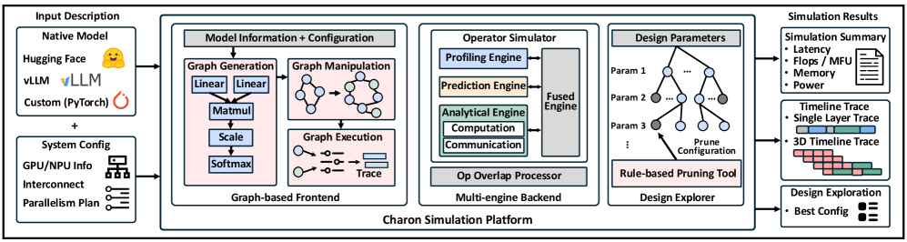
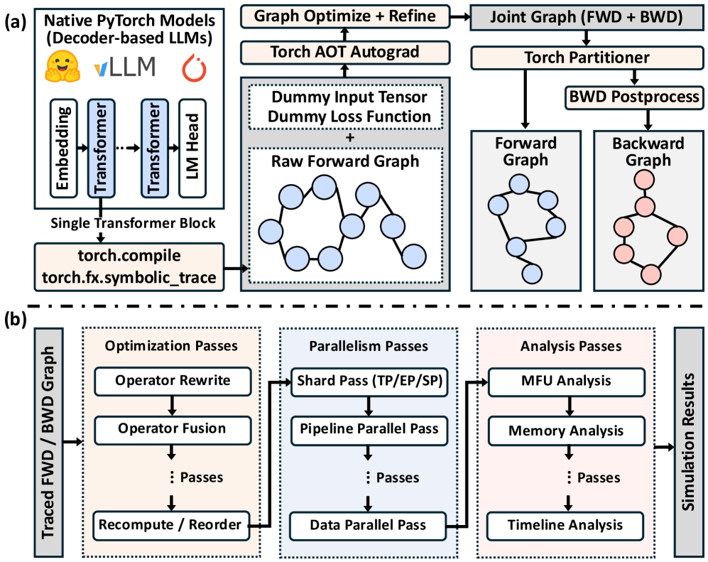
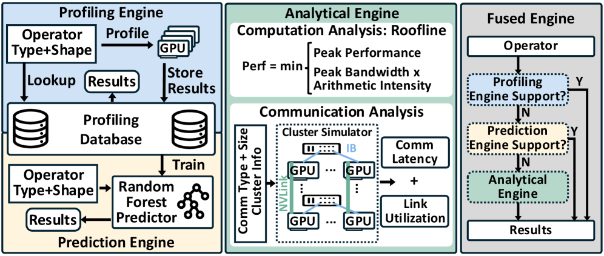
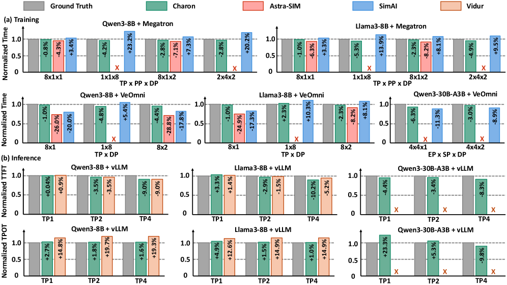
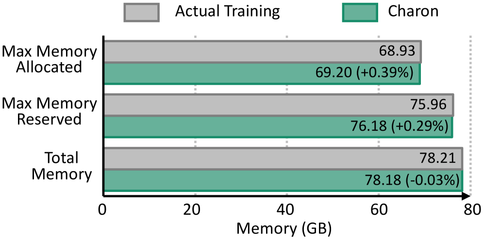
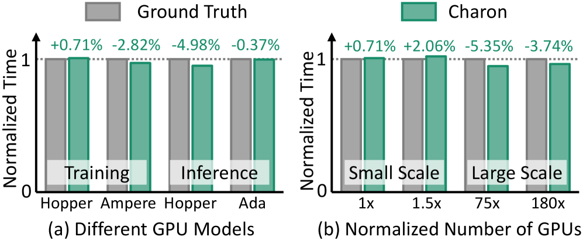
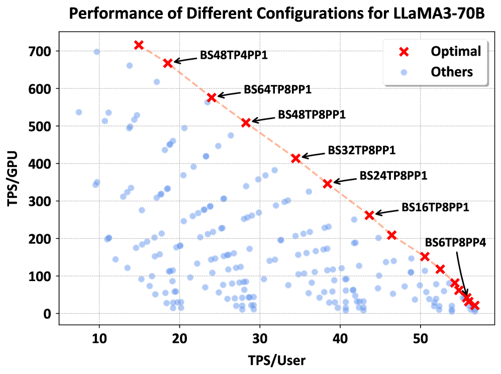

# Charon: 面向大规模 LLM 训练和推理的统一细粒度模拟器

## 一、论文概述

| 项目 | 内容 |
|------|------|
| **标题** | Charon: A Unified and Fine-Grained Simulator for Large-Scale LLM Training and Inference |
| **作者** | Anonymous Authors |
| **机构** | ByteDance Seed |
| **论文** | [arXiv:2605.17164](https://arxiv.org/abs/2605.17164) |
| **代码** | [GitHub: ByteDance-Seed/Charon](https://github.com/ByteDance-Seed/Charon) |
| **发布** | 2026年5月 |
| **许可** | MLSys 2026 Under Review |

## 二、核心思想

### 问题定义

部署大规模 LLM 训练和推理以获得最优性能极具挑战，原因在于并行策略、系统优化和硬件配置的设计空间极其复杂。准确且快速的性能模拟对于指导优化工作和系统研究至关重要。

**现有模拟器的局限**：
- 大多数仅专注于训练或推理，迫使工程师依赖分离的、通常不兼容的工具
- 需要在模拟器内手动构建模型或预处理，而非支持原生模型的直接使用
- 缺乏算子级粒度的计算和通信建模，或缺乏修改算子图的灵活性

### 解决方案概述

Charon 将 LLM 模拟视为**编译器风格的转换过程**，每个阶段逐步细化模型、调度和系统表示：

1. **原生模型接口**：直接接受 HuggingFace、vLLM 或自定义 PyTorch 模型
2. **模块化 Pass 设计**：支持即插即用的分析和优化 Pass
3. **多粒度分析**：生成系统级摘要和细粒度 PyTorch 风格 traces
4. **混合算子模拟**：结合分析、性能分析和预测后端

## 三、技术架构

### 整体框架图

Charon 由三个关键组件构成：

| 组件 | 职责 | 关键特性 |
|------|------|----------|
| **Frontend** | 解析模型图，应用编译器风格 Pass | 图生成、优化、并行、分析 |
| **Backend** | 算子级模拟 | 分析/预测/性能分析三引擎融合 |
| **Design Explorer** | 配置空间搜索 | 引导式剪枝，最优设计识别 |

### Frontend: 基于图的前端

#### 图生成

- **原生 PyTorch 模型支持**：通过 `torch.fx.symbolic_trace` 或 `torch.compile` 自动转换
- **单 Transformer 块模拟**：提取并仅模拟单个 decoder 块，加速模拟同时保持精度
- **训练反向图生成**：利用 `torch._function.aot_autograd` 自动生成反向计算图
- **非对称模型支持**：对不同层跟踪为独立 FX 图，显式调度每个 PP rank

#### 基于图的优化和并行

采用编译器风格设计，优化和并行抽象为图操作 Pass：

**算子级优化**：
- 通过 match-and-replace 框架实现算子重写和融合
- 支持量化 Pass 或直接跟踪量化模型

**多并行策略支持**：

| 并行策略 | 实现方式 |
|----------|----------|
| **TP/SP/EP** | 分片张量，插入 all_reduce/all_gather/reduce_scatter 通信算子 |
| **PP** | 调度模式生成器构建阶段间依赖，插入 send/recv 算子 |
| **DP** | 支持 DDP/FSDP/ZeRO，建模梯度同步和优化器状态分片 |
| **DualPipe** | 支持通信-计算重叠的流水线调度 |

#### 多粒度分析

- **粗粒度**：模型 FLOPs 利用率、并行通信开销、内存占用
- **细粒度**：算子延迟、效率、Profiler 风格 traces
- **峰值内存估计**：通过反向图的活跃性分析精确建模临时张量分配和释放

### Backend: 多引擎驱动后端

#### 三种模拟引擎

| 引擎 | 方法 | 优势 | 适用场景 |
|------|------|------|----------|
| **Profiling** | 在目标硬件上执行和分析 | 最准确 | 已知算子形状 |
| **Prediction** | 随机森林模型预测延迟 | 快速，泛化性好 | 未见输入形状 |
| **Analytical** | Roofline 模型数学建模 | 无需硬件 | 新算子，快速估算 |

**Fused Engine**：集成多引擎，通过优先级回退机制动态选择最佳后端。

#### 精度感知

支持 FP32/BF16/FP16/FP8/INT8 等精度格式，显式建模精度对计算效率、内存使用和通信量的影响。

### 算子重叠建模

**粗粒度比率模型**：
- 对重叠部分应用减速因子（从性能分析数据工程化）
- 计算-通信重叠：分别对计算和通信算子使用独立减速因子
- 通信-通信重叠：共享减速因子

**细粒度带宽感知模型**：
- 基于有效带宽和链路拥塞建模
- 检查每个互连层次的拥塞，根据带宽竞争比计算减速

### 设计空间探索

- 接受目标模型和任务，遍历整个设计空间（GPU 数量、并行大小等）
- 支持规则化剪枝：预定义低效情况，跳过相应子空间模拟
- 多目标优化：平衡系统吞吐量和用户面向延迟约束

### 模型组件

| 组件 | 说明 | 关键参数 |
|------|------|----------|
| **Graph Tracer** | 将原生 PyTorch 模型转换为计算图 | torch.fx / torch.compile |
| **Pass Manager** | 管理优化/并行/分析 Pass | 图操作框架 |
| **Profiling Engine** | 在目标硬件上执行算子 | GPU 集群，缓存数据库 |
| **Prediction Engine** | 随机森林预测算子延迟 | 每种算子类型一个预测器 |
| **Analytical Engine** | Roofline 模型 + 层次链路模型 | 硬件 FLOPs/带宽配置 |
| **Overlap Processor** | 建模通信-计算重叠 | 减速因子，带宽竞争 |

## 四、核心创新

| 创新点 | 说明 | 理论/实验依据 |
|--------|------|---------------|
| **统一训练+推理模拟** | 同一框架支持两种工作负载 | 消除分离工具的不兼容性 |
| **原生模型接口** | 直接接受 HuggingFace/vLLM/PyTorch 模型 | 零额外预处理开销 |
| **编译器风格 Pass 设计** | 优化/并行抽象为图操作 Pass | 灵活组合，易于扩展 |
| **混合多引擎后端** | 分析/预测/性能分析三引擎融合 | 平衡速度和精度 |
| **带宽感知重叠建模** | 细粒度链路级拥塞模拟 | 准确预测重叠减速 |
| **活跃性内存建模** | 基于反向图的张量活跃性分析 | 精确峰值内存预测 |

## 五、实验结果

### 端到端模拟精度

**训练任务**（Qwen3-8B, LLaMA3-8B, Qwen3-30B-A3B）：

| 模拟器 | 精度方法 | 通信建模 | 总体误差 |
|--------|----------|----------|----------|
| **Charon** | 分析/预测/性能分析 | 算子级 | **< 3.74%** |
| Astra-SIM 2.0 | 纯分析 | 分析 | 较高 |
| SimAI | 性能分析 | 层级 | 中等 |

**推理任务**（Qwen3-8B, vLLM）：
- TTFT（首 token 时间）：Charon 和 Vidur 均准确
- TPOT（每 token 时间）：Charon 显著优于 Vidur

### 算子级精度

**训练分解**（Qwen3-8B, TP8）：

| 算子 | 性能分析 (F) | 模拟 (F) | 性能分析 (B) | 模拟 (B) |
|------|-------------|----------|-------------|----------|
| Attention | 1842μs | 1770μs | 30275μs | 30329μs |
| Feed-Forward | 6589μs | 6490μs | 40280μs | 38430μs |
| All-Gather | 13180μs | 12980μs | 13130μs | 12980μs |
| Reduce-Scatter | 13876μs | 12980μs | 14500μs | 12980μs |

### 内存预测精度

**Qwen3-30B-A3B MoE 训练**（FSDP=8, batch_size=2, seqlen=8192）：

| 指标 | 误差 |
|------|------|
| 最大分配内存 | +0.39% |
| 最大保留内存 | +0.29% |
| 总内存占用 | -0.03% |

### 跨 GPU 和集群规模

- **GPU 架构**：H800/A100 (训练) + H20/L20 (推理)，误差 < 4.98%
- **集群规模**：从数百到近万 GPU，误差 < 3.74%
- **总体误差**：所有配置 < 5.35%

### 后端消融

**预测引擎 vs 分析引擎**（未见输入形状）：

| 算子 | 分析引擎 MAE | 预测引擎 MAE |
|------|-------------|-------------|
| Linear | 合理 | 1.44% |
| RMSNorm | 合理 | 1.12% |
| FlashAttention-3 | **31.84%** | **2.22%** |

预测引擎在复杂算子上显著优于分析引擎。

### 案例研究

#### 动态序列并行 (Dynamic SP)

- 在 LLaMA-3 70B 上评估，8× Nvidia Ada Lovelace 推理 GPU
- 相比 zigzag 基线，注意力块延迟平均减少 **15%**
- 对短序列请求禁用 zigzag 分区，避免不必要的 all-gather 开销

#### 推理性能优化

- **Llama 3 70B** 推理部署优化
- Charon 在 2 分钟内完成配置空间探索
- 发现的配置显著优于手动调优基线
- 放松用户 TPS 约束可带来高达 **7×** 系统吞吐量提升

## 六、与现有方法对比

| 特性 | Charon | Astra-Sim | SimAI | Lumos | Echo | Vidur | LLMServingSim |
|------|--------|-----------|-------|-------|------|-------|---------------|
| **训练** | ✓ | ✓ | ✓ | ✓ | ✓ | ✗ | ✗ |
| **推理** | ✓ | ✓ | ✗ | ✗ | ✗ | ✓ | ✓ |
| **设计搜索** | ✓ | ✗ | ✗ | ✗ | ✗ | ✓ | ✗ |
| **Trace 生成** | ✓ (3D) | ✗ | ✗ | ✓ | ✗ | ✓ | ✗ |
| **优化建模** | ✓ | ✗ | ✗ | ✗ | ✓ | ✗ | ✗ |
| **重叠减速** | 集群感知 | N/A | 比率 | N/A | 预测 | N/A | N/A |
| **输入** | 原生 PyTorch | 手工 | Mocked | 性能分析 | Mocked | Mocked | 手工 |
| **并行** | TP/PP/DP/EP/SP/ZeRO/DualPipe | TP/DP/PP | TP/DP/PP/EP | TP/PP/DP | TP/PP/DP | TP/PP | TP/PP |

## 七、相关工作

- **Astra-Sim**：纯分析框架，需手动构建工作负载模型
- **SimAI**：性能分析+分析混合，层级通信建模
- **Lumos**：算子级训练模拟，依赖性能分析或合成 traces
- **Echo**：算子级训练模拟，支持优化建模
- **Vidur**：推理模拟，性能分析+预测，需重建模型
- **LLMServingSim**：扩展 Astra-Sim 支持 NPU/PIM 设备

## 八、总结

### 核心贡献

1. **统一模拟框架**：同一框架支持 LLM 训练和推理的端到端模拟
2. **编译器风格架构**：基于图的前端支持灵活的优化和并行策略组合
3. **混合多引擎后端**：分析/预测/性能分析三引擎融合，平衡速度和精度
4. **高精度验证**：总体误差 < 5.35%，大规模训练误差 < 3.74%
5. **实际部署价值**：在推理案例中发现优于手动调优的配置

### 技术影响

- **成本降低**：相比集群性能分析，模拟成本降低 30000× 以上
- **设计空间探索**：在分钟级时间内完成大规模配置空间搜索
- **工程效率**：原生模型接口消除手工建模开销
- **优化指导**：细粒度算子级 traces 暴露性能瓶颈

### 局限性

- 论文为匿名提交（Under Review），作者信息未公开
- 预测引擎需要从性能分析数据库训练随机森林模型
- 当前未确定性建模微级随机变化（网络抖动、动态拥塞等）

## 九、参考资源

- **论文**: https://arxiv.org/abs/2605.17164
- **代码**: https://github.com/ByteDance-Seed/Charon
- **Megatron**: https://github.com/NVIDIA/Megatron-LM
- **vLLM**: https://github.com/vllm-project/vllm
- **HuggingFace Transformers**: https://github.com/huggingface/transformers
