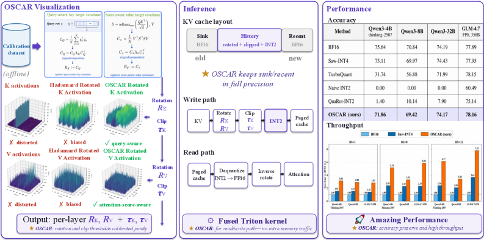

# OSCAR: 面向 2-bit KV 缓存量化的离线谱协方差感知旋转方法

## 一、论文概述

| 项目 | 内容 |
|------|------|
| **标题** | OSCAR: Offline Spectral Covariance-Aware Rotation for 2-bit KV Cache Quantization |
| **作者** | Zhongzhu Zhou, Donglin Zhuang, Jisen Li, Ziyan Chen, Shuaiwen Leon Song, Ben Athiwaratkun, Xiaoxia Wu |
| **机构** | Together AI、悉尼大学、伊利诺伊大学厄巴纳-香槟分校 |
| **论文** | [arXiv:2605.17757](https://arxiv.org/abs/2605.17757) |
| **代码** | [GitHub](https://github.com/OSCAR-KV) |
| **发布** | 2026年5月 |
| **许可** | 开源 |

## 二、核心思想

### 问题定义

INT2 KV 缓存量化对长上下文 LLM 服务极具吸引力，但同时保证准确性和可部署性仍然困难。简单的旋转（如 Hadamard 变换）可以减少异常值，但在 INT2 下仍然退化，因为它们与下游注意力计算不对齐。

### 解决方案概述

OSCAR 提出了一种超低比特 KV 缓存量化方法：
1. **离线估计注意力感知的协方差结构**
2. **使用协方差结构推导固定旋转和裁剪阈值**
3. **将 KV 量化与注意力实际消费的协方差结构对齐**

关键洞察：数据无关的旋转（如 Hadamard）只能平滑激活范围，但不知道哪些方向对注意力重要。在 INT2 下，只有 4 个量化级别可用，误差应该被推到模型读取较少的方向。

## 三、技术架构

### 整体框架图

**离线阶段**：
- 估计注意力感知的 key/value 协方差旋转
- 展示旋转如何使 KV 激活更均匀
- Hadamard 混合平滑原始峰值，OSCAR 旋转分离重要/不重要方向

**在线阶段**：
- 服务路径保持 sink 和 recent token 为 BF16
- 对历史 KV token 应用固定的 rotate–clip–INT2 路径
- 集成到 paged SGLang 缓存中

### 核心公式

**注意力和 KV 缓存**：

$$Q = [q_1; \dots; q_T] \in \mathbb{R}^{T \times d}, \quad K = [k_1; \dots; k_T] \in \mathbb{R}^{T \times d}, \quad V = [v_1; \dots; v_T] \in \mathbb{R}^{T \times d}$$

$$S = \text{softmax}_{\text{row}}(QK^\top / \sqrt{d}) \in \mathbb{R}^{T \times T}, \quad O = SV \in \mathbb{R}^{T \times d}$$

**Key 的下游 logit 失真**：

$$\|QK^\top - Q\hat{K}^\top\|_F^2 = \text{tr}((K - \hat{K})Q^\top Q(K - \hat{K})^\top)$$

由查询协方差 $Q^\top Q$ 控制，而非 $K^\top K$。

**Value 的下游输出失真**：

$$\|SV - S\hat{V}\|_F^2 = \text{tr}((V - \hat{V})^\top S^\top S(V - \hat{V}))$$

由注意力分数如何加权 value 行决定。

**Query 感知的 Key 目标协方差**：

$$C_Q = \frac{1}{N} \sum_{n=1}^N q_n^\top q_n, \quad C_Q = U_Q \Lambda_Q U_Q^\top, \quad R_k := U_Q$$

**Score 感知的 Value 目标协方差**：

$$C_S = \frac{1}{N} V^\top S^\top S V, \quad C_S = U_S \Lambda_S U_S^\top, \quad R_v := U_S$$

**OSCAR 旋转组合**：

$$R_K = U_Q H_{\text{Had}} P_{\text{br}}, \qquad R_V = U_S H_{\text{Had}} P_{\text{br}}$$

其中：
- $U_Q, U_S$：协方差基旋转（注意力感知）
- $H_{\text{Had}}$：Hadamard 变换，重新分配通道能量
- $P_{\text{br}}$：比特反转排列，交错大小方差通道

**定理 1（环境基对角残差下简单谱变体的最优性）**：

在冻结残差协方差在环境基下为对角的假设下，$R_k = U_Q$ 和 $R_v = U_S$ 是 $\tilde{\mathcal{L}}_K(R_k)$ 和 $\tilde{\mathcal{L}}_V(R_v)$ 的最小化器。

### KV 缓存布局

$$\underbrace{[1, S_0]}_{\text{bf16 sink}} \; \| \; \underbrace{[S_0+1, t-W]}_{\text{int2 history}} \; \| \; \underbrace{[t-W+1, t]}_{\text{bf16 recent}}$$

- **Sink tokens**（前 $S_0=64$ 个）：BF16 保存
- **Recent window**（最近 $W=256$ 个）：BF16 保存
- **History tokens**：INT2 量化存储

### 模型组件

| 组件 | 说明 | 关键参数 |
|------|------|----------|
| **离线校准** | 估计注意力感知协方差，推导旋转和裁剪阈值 | 8878 tokens × 层数 |
| **INT2 量化器** | 仿射非对称 INT2 量化，百分位裁剪 | $c_K \approx 0.96, c_V \approx 0.92$ |
| **Triton 解码内核** | 自定义 INT2 注意力内核，兼容 paged KV-cache | 融合量化/反量化 |
| **混合精度缓存** | Sink + Recent 为 BF16，History 为 INT2 | $S_0=64, W=256$ |

### 训练流程

OSCAR 是**训练后量化 (PTQ)** 方法，无需训练：
1. **校准阶段**：运行一次校准 pass，dump 每层 Q,K,V 激活
2. **协方差估计**：从校准激活计算 key/value 旋转和每层裁剪阈值
3. **部署**：将固定参数用于所有基准测试，无需任务特定校准

## 四、核心创新

| 创新点 | 说明 | 理论/实验依据 |
|--------|------|---------------|
| **注意力感知旋转目标** | 使用 $C_Q$ 和 $C_S$ 而非 $K^\top K / V^\top V$ | 定理 1 证明最优性 |
| **旋转组合设计** | $U \cdot H_{\text{Had}} \cdot P_{\text{br}}$ 三因子组合 | 消融实验验证各因子贡献 |
| **可部署 INT2 系统** | 自定义 Triton 内核，兼容 paged KV-cache 和 SGLang/vLLM | 端到端系统性能验证 |
| **混合精度缓存布局** | Sink + Recent 为 BF16，History 为 INT2 | $(S,R)=(64,256)$ 为最优平衡点 |

## 五、实验结果

### 基准测试

**实验配置**：
- 模型：Qwen3-4B-Thinking-2507, Qwen3-8B, Qwen3-32B, GLM-4.7-FP8 (358B)
- 基准：AIME25, GPQA-Diamond, HumanEval, LiveCodeBench v6, MATH500
- 生成长度：32768 tokens
- 硬件：1-8× H100 (80GB)

#### 主要精度结果

| 模型 | 方法 | BPE | GPQA | HumanE | LCB v6 | AIME25 | MATH500 | Mean | Drop |
|------|------|-----|------|--------|--------|--------|---------|------|------|
| **Qwen3-4B** | BF16 | 16.00 | 67.27 | 94.05 | 48.66 | 74.67 | 93.55 | 75.64 | – |
| | QuaRot-INT2 | 2.25 | 0.34 | 0.98 | 0.00 | 0.00 | 5.67 | 1.40 | -74.24 |
| | **OSCAR** | 2.28 | 64.95 | 92.24 | 45.38 | 64.00 | 92.75 | 71.86 | **-3.78** |
| **Qwen3-8B** | BF16 | 16.00 | 56.67 | 85.95 | 49.01 | 70.00 | 92.59 | 70.84 | – |
| | QuaRot-INT2 | 2.25 | 14.98 | 9.80 | 0.58 | 2.22 | 23.13 | 10.14 | -60.70 |
| | **OSCAR** | 2.28 | 55.05 | 87.88 | 46.32 | 66.67 | 92.22 | 69.42 | **-1.42** |
| **Qwen3-32B** | BF16 | 16.00 | 58.49 | 91.19 | 59.06 | 68.67 | 93.55 | 74.19 | – |
| | **OSCAR** | 2.28 | 60.40 | 90.12 | 53.57 | 74.00 | 92.75 | 74.17 | **-0.02** |
| **GLM-4.7** | BF16 | 16.00 | 73.23 | 91.46 | 49.12 | 80.00 | 95.66 | 77.89 | – |
| | **OSCAR** | 2.28 | 73.57 | 91.06 | 52.63 | 78.89 | 94.66 | 78.16 | **+0.27** |

**关键发现**：
- OSCAR 是唯一在 32K 生成评估下保持接近 BF16 精度的近 2-bit 方法
- 在 Qwen3-4B 和 Qwen3-8B 上，OSCAR 将 BF16 差距分别缩小到 3.78 和 1.42 分
- 在 Qwen3-32B 和 GLM-4.7-FP8 上，OSCAR 与 BF16 基本持平

#### 长上下文鲁棒性 (RULER-NIAH)

| 模型 | 方法 | 4k | 8k | 16k | 32k | 64k | 128k |
|------|------|----|----|-----|-----|-----|------|
| **Qwen3-4B** | BF16 | 100.0 | 100.0 | 99.7 | 99.3 | 85.3 | 81.0 |
| | QuaRot-INT2 | 0.0 | 0.8 | 0.0 | 0.0 | 15.6 | 0.0 |
| | **OSCAR** | 99.7 | 100.0 | 97.8 | 87.6 | 61.9 | 39.5 |
| **Qwen3-8B** | BF16 | 100.0 | 99.6 | 98.9 | 97.3 | 79.2 | 78.2 |
| | QuaRot-INT2 | 74.0 | 80.6 | 19.0 | 9.8 | 0.0 | 0.0 |
| | **OSCAR** | 99.5 | 97.8 | 93.9 | 86.3 | 61.9 | 45.0 |

### 系统性能

#### 内核级性能分析 (Qwen3-8B, 1×H100)

| Batch Size | BF16 Total | OSCAR Total | 注意力时间减少 |
|------------|------------|-------------|----------------|
| 1 | 9.9ms | 8.0ms | 3.8ms → 1.3ms |
| 8 | 10.7ms | 9.9ms | 4.4ms → 3.0ms |
| 16 | 15.2ms | 11.6ms | 8.9ms → 4.6ms |
| 32 | 23.4ms | 15.5ms | 17.0ms → 8.5ms |
| 64 | 容量限制 | 23.4ms | 16.2ms |
| 128 | 容量限制 | 39.3ms | 31.9ms |

#### 端到端服务吞吐量 (32 并发请求, 8K 输入, 1K 输出)

| 模型 | 方法 | 用户吞吐量 | GPU 吞吐量 | 精度 |
|------|------|------------|------------|------|
| **Qwen3-4B** | BF16 | 41.1 tok/s | 1187.9 tok/s | 75.64 |
| | **OSCAR** | 63.3 tok/s | 1723.9 tok/s | 71.86 |
| **Qwen3-8B** | BF16 | 35.8 tok/s | 999.9 tok/s | 70.84 |
| | **OSCAR** | 52.5 tok/s | 1374.0 tok/s | 69.42 |

#### 解码吞吐量加速

- **Qwen3-4B**: 1.98× (30k) → 2.52× (60k) → 3.08× (100k) vs BF16
- **GLM-4.7-FP8**: 2.83× (BS=1) → 7.83× (BS=32) vs BF16

#### 极端批次可扩展性

- OSCAR 在单个 H100 上可扩展到 2^8 个并发请求（100k 输入）
- BF16 和 INT4 基线在较小批次大小时就耗尽内存

### 消融实验

#### 旋转分解分析 (Qwen3-8B)

| 配置 | Mean |
|------|------|
| 完整 OSCAR: $U \cdot H_{\text{Had}} \cdot P_{\text{br}}$ | 70.01 |
| w/o $P_{\text{br}}$ | 68.00 |
| w/o $H_{\text{Had}}$ (仅 $U \cdot P_{\text{br}}$) | 51.74 |
| w/o $U$ (QuaRot + $P_{\text{br}}$) | 32.82 |
| 无旋转 (仅 clip + sink + recent) | 4.23 |
| $K^\top K / V^\top V$ PCA 目标 | 31.12 |

**关键发现**：协方差矩阵的选择比是否进行对角化更重要。

#### Sink 和 Recent 窗口大小

| (S, R) | Mean | 额外 BF16 KV |
|--------|------|--------------|
| (0, 0) | 0.00 | 0% |
| (32, 128) | 67.69 | 0.12% |
| **(64, 256)** | **71.86** | **0.24%** |
| (128, 512) | 72.96 | 0.49% |
| (256, 1024) | 73.08 | 0.98% |

$(S,R) = (64, 256)$ 是最优平衡点。

## 六、与现有方法对比

| 特性 | OSCAR | QuaRot-INT2 | Saw-INT4 | KIVI-KV2 | Kitty |
|------|-------|-------------|----------|----------|-------|
| **BPE** | 2.28 | 2.25 | 4.25 | 2.25-2.26 | 2.39 |
| **旋转目标** | 注意力感知 | Hadamard | 块对角 Hadamard | 无 | 无 |
| **可部署性** | ✅ SGLang/vLLM | ✅ | ✅ | 需残差缓冲 | 需通道提升 |
| **精度 (Qwen3-8B)** | 69.42 | 10.14 | 69.97 | 52.33-57.67 | 59.67 |
| **长上下文鲁棒性** | 强 | 弱 | 中 | 中 | 中 |
| **内存减少** | ~8× | ~8× | ~4× | ~8× | ~8× |

## 七、相关工作

- **KIVI**: 通道级 KV 缓存量化，需要残差缓冲
- **Kitty**: 关键通道提升变体
- **QuaRot**: Hadamard 旋转量化
- **Saw-INT4**: 块对角 Hadamard 旋转
- **TurboQuant**: vLLM 实现的量化方法
- **H2O**: Heavy-hitter oracle 缓存压缩
- **MiniKV**: 2-bit 层判别 KV 缓存

## 八、总结

### 核心贡献

1. **识别 INT2 旋转 KV 的缺失目标**：通用旋转主要分散激活异常值，但 INT2 精度取决于注意力分数和层输出中的误差
2. **提出 OSCAR**：注意力感知校准框架，使用轻量校准集获取 key/value 旋转，保留下游注意力计算
3. **开发生产就绪的 INT2 KV 缓存服务系统**：兼容 paged 和 prefix KV 缓存，集成到 SGLang 解码流水线

### 技术影响

- **内存减少**：KV 缓存内存减少约 8×
- **吞吐量提升**：大批次下提升高达 7×，单请求解码加速高达 3×
- **精度保持**：在 4B-358B 参数模型上保持接近 BF16 精度
- **长上下文支持**：在 128K 上下文下保持鲁棒性

### 局限性

- 需要一次离线校准 pass（8878 tokens × 层数）
- INT2 量化在极小模型上精度损失较大（Qwen3-4B: -3.78 分）
- 需要自定义 Triton 内核支持

## 九、参考资源

- **论文**: https://arxiv.org/abs/2605.17757
- **代码**: https://github.com/OSCAR-KV
- **SGLang**: https://github.com/sgl-project/sglang
- **vLLM**: https://github.com/vllm-project/vllm
