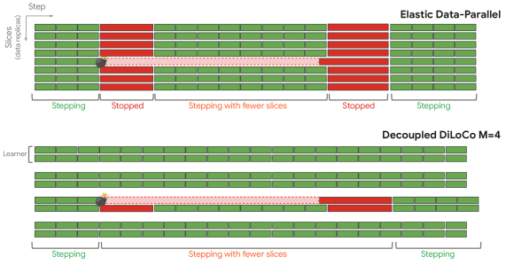
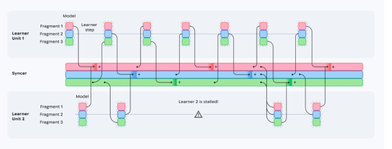
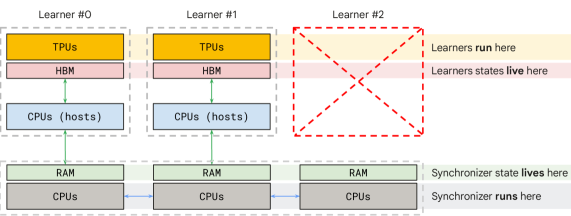
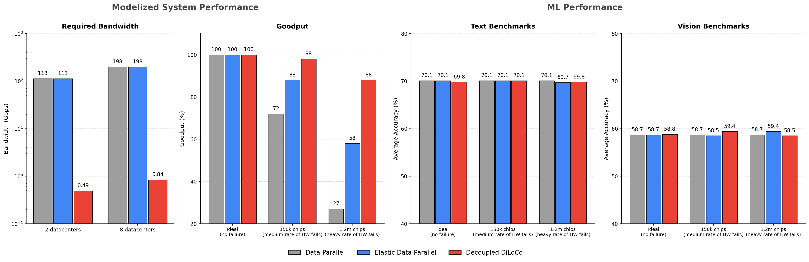
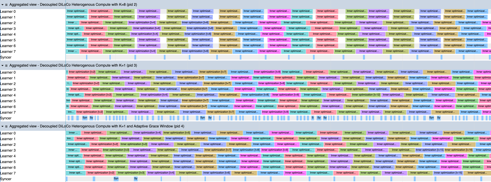
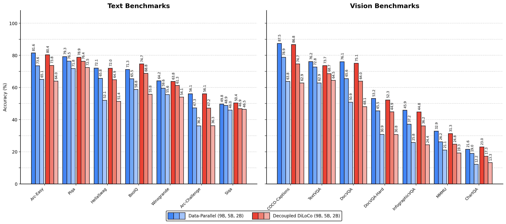

# Decoupled DiLoCo for Resilient Distributed Pre-training

## 一、论文概述

| 项目 | 内容 |
|------|------|
| **标题** | Decoupled DiLoCo for Resilient Distributed Pre-training |
| **作者** | Arthur Douillard, Keith Rush, Yani Donchev, Zachary Charles, Nova Fallen, Ayush Dubey, Ionel Gog, Josef Dean, Blake Woodworth, Zachary Garrett, Nate Keating, Jenny Bishop, Henry Prior, Edouard Yvinec, Arthur Szlam, Marc'Aurelio Ranzato, Jeff Dean |
| **机构** | Google DeepMind, Google Research |
| **论文** | https://arxiv.org/abs/2604.21428v1 |
| **代码** | - |
| **发布** | 2026-04-23 |
| **许可** | - |
| **领域** | cs.LG, cs.DC (Machine Learning, Distributed Computing) |

## 二、核心思想

### 问题定义

现代大规模语言模型预训练严重依赖单程序多数据（SPMD）范式，需要在加速器之间进行紧密耦合。由于这种耦合，瞬时减速、硬件故障和同步开销会阻塞整个计算，在大规模训练时浪费大量计算时间。

随着计算规模的扩大，组件数量的增加将罕见的硬件故障转变为常规事件。这在长时间的预训练过程中被进一步加剧，频繁的中断导致显著的停机时间和计算浪费。

类比 CAP 定理，作者认为现代预训练的主要瓶颈是对参数一致性的严格坚持。

### 解决方案概述

Decoupled DiLoCo 是 DiLoCo 框架的演进版本，旨在打破锁步同步屏障，超越 SPMD 以最大化训练吞吐量（goodput）。

核心设计：
- 将计算划分为多个独立的 **"learners"**，每个 learner 执行本地内优化步骤
- Learners 异步地将参数片段（fragments）通信到中央 **synchronizer（syncer）**
- Syncer 使用**最小法定人数（minimum quorum）**、**自适应宽限窗口（adaptive grace window）**和**动态 token 加权合并**来聚合更新
- 通过跳过失败或滞后的 learners 来实现弹性

灵感来自 **"混沌工程"**，在易出故障的环境中实现显著改进的训练效率，同时保持竞争性的模型性能。

### 核心成果

- 在数百万模拟芯片的故障环境中实现 **严格零全局停机时间**
- 维持 **88% goodput**（对比弹性数据并行的 58%）
- 在文本和视觉任务上保持竞争性模型性能
- 支持 dense 和 mixture-of-expert 架构

## 三、技术架构

### 整体框架图

*Figure 1: Slice-granularity elasticity vs decoupling: the system continues training with fewer "slices" of TPU chips when there is a localized failure.*

### 核心设计

*Figure 2: Decoupled DiLoCo. For illustrative purposes, a simple example with M=2 learners, P=3 fragments, synchronized at every step (H=3), and overlapped over τ=2 steps. The second learner stalls for three steps, but the overall training never stops.*

### 系统架构

*Figure 4: Overview of the Decoupled DiLoCo system architecture. Each learner worker runs an independent data-parallel training loop on a partition of the accelerator mesh.*

### 核心公式

#### DiLoCo 基础框架

在标准 DiLoCo 中，M 个 learners 各自维护模型副本 θ_m。每个 learner 使用内优化器（如 AdamW）在本地数据上训练：

**内优化器更新**：
$$\theta_m^{(t+1)} \leftarrow \text{InnerOpt}(\theta_m^{(t)}, \nabla \mathcal{L}_m^{(t)})$$

每 H 步后，使用外优化器进行全局同步：
$$\Delta_p^{(t)} \leftarrow \text{OuterOpt}\left(\frac{1}{M}\sum_{m=1}^M (\theta_{m,p}^{(t)} - \Theta_p^{(t-H)})\right)$$
$$\Theta_p^{(t)} \leftarrow \Theta_p^{(t-H)} + \Delta_p^{(t)}$$

#### Decoupled DiLoCo 创新

**1. 异步片段通信**

将模型分为 P 个非重叠片段 {θ_{m,p}}，每个片段独立同步：
- Learner 持续执行内优化步骤，不等待 peers
- 异步发送元数据 (t_m, {c_{m,p}^{steps}}, {c_{m,p}^{tokens}}) 到 syncer
- 通信在后台进行，learner 继续优化

**2. 最小法定人数聚合（Minimum Quorum Aggregation）**

Syncer 使用最小法定人数 K 来决定何时聚合：
- 只需 K 个 learners 的更新即可触发聚合
- 跳过失败或滞后的 learners
- 保证训练永不停止

**3. 自适应宽限窗口（Adaptive Grace Window）**

允许等待额外时间以收集更多 learner 的更新：
- 在可用的松弛时间内动态调整
- 平衡更新质量和训练吞吐量

**4. Token 加权合并（Token-Weighted Merging）**

使用 **Radial-Directional Averaging (RDA)**：
- 分别平均外梯度的范数和方向
- 提高外优化器的超参数稳定性
- 在扩展 learner 数量 M 时提升性能

**5. 混沌工程（Chaos Engineering）**

模拟各种故障场景：
- 硬件故障：随机芯片失效
- 异构硬件：不同代际的 TPU
- 资源回收：动态添加/移除计算资源

### 核心组件

| 组件 | 说明 | 关键参数 |
|------|------|----------|
| Learner | 独立的训练单元 | M 个 learners，各自维护模型副本 |
| Syncer | 中央同步器 | CPU-only，M-way sharded |
| Fragment | 模型参数片段 | P=24 个片段，每 H=24 步同步一次 |
| Quorum | 最小法定人数 | K=1（最小配置） |
| Grace Window | 自适应宽限窗口 | 最多延长一个 step |

### 系统设计细节

**Learner Workers**：
- 每个 learner worker 在加速器网格的分区上运行独立的数据并行训练循环
- 通过数据中心网络（DCN）与 syncer 通信
- 发送参数片段，接收外优化更新

**Syncer Worker**：
- 仅 CPU，M-way 分片
- 执行外优化步骤
- Learner 临时缺席时，对应的 syncer 分片持续存在

**状态协调**：
- 每步后，更新的 learner 模型复制到与 learner TPU 共置的主机 CPU 的 RAM 中
- Syncer 选择要通过 DCN 传输的片段

## 四、核心创新

| 创新点 | 说明 | 理论/实验依据 |
|--------|------|---------------|
| 完全解耦的 Learners | Learners 互不等待，异步执行 | 88% goodput vs 58% elastic DP |
| 最小法定人数聚合 | 只需 K 个更新即可触发同步 | K=1 时训练永不停止 |
| 自适应宽限窗口 | 动态等待更多 learners | 平衡更新质量和吞吐量 |
| Radial-Directional Averaging | 分别平均范数和方向 | 提高超参数稳定性 |
| 平衡张量片段化 | 贪心 bin-packing 算法 | 减少峰值带宽，保持模型质量 |
| 混沌工程验证 | 模拟百万级芯片故障 | 严格零全局停机时间 |

## 五、代码实现分析

### 技术栈

- **训练框架**：基于 Pathways（Google 的分布式计算框架）
- **模型架构**：Gemma 4（定制化轻量训练配置）
- **并行策略**：Data Parallelism + Tensor Parallelism
- **通信**：数据中心网络（DCN）+ gRPC
- **硬件**：TPU v5p/v6e

### 关键实现细节

1. **片段化策略**：
   - 使用贪心 bin-packing 算法应用于模型中的各个张量
   - 结果是近似平衡的片段（balanced tensor fragmentation）
   - 与层级片段化相比，显著减少峰值带宽

2. **异步通信**：
   - Learner 发送元数据到 syncer（步骤数、token 计数）
   - Syncer 异步拉取和推送片段
   - 通信与计算重叠

3. **容错机制**：
   - 确定性重放（Event Tapes）
   - 一致的分布式检查点
   - 分布式 learner 恢复

## 六、实验结果

### 实验设置

- **模型**：Gemma 4（定制化轻量训练配置）
- **数据**：文本和视觉数据混合
- **片段数**：P=24
- **同步间隔**：H=24 步
- **重叠步数**：τ=2
- **法定人数**：K=1（默认）

### 硬件故障弹性

*Figure 5: Hardware failures resilience of Decoupled DiLoCo vs elastic data-parallel with a dense 5B model trained on 1T tokens.*

**故障模拟设置**：
- MTBI_chip = 1 year（激进设置）
- 芯片数量：N_chip = 150k (1×) 到 1.2m (8×)
- 后者导致 MTBF_cluster < 1 分钟

**结果**：

| 指标 | Decoupled DiLoCo (M=8) | Elastic Data-Parallel |
|------|------------------------|----------------------|
| Goodput | **88%** | 58% |
| 全局停机时间 | **严格零** | 有 |
| 下游性能 | 竞争性 | 基线 |

**关键发现**：
- Goodput 随芯片数量增加而优雅下降
- 文本和视觉评估保持竞争性
- 对 MoE 模型同样有效

### 资源回收（Scavenging）

| 模型回收 | 文本 (Avg) | 视觉 (Avg) | 训练时间 |
|----------|-----------|-----------|----------|
| DP + 0% | 60.1 | 46.4 | 1.00× |
| DP + 25% | 60.5 | 46.6 | 1.07× |
| DP + 50% | 60.0 | 45.9 | 1.09× |
| DP + 100% | 60.1 | 47.0 | 1.02× |
| DP + 300% | 60.1 | 47.0 | 1.02× |

Decoupled DiLoCo 能够无缝回收机会主义计算资源，整合异构硬件。

### 异构硬件

*Figure 6: XLA operations when learners have varying step times for quorum sizes of K=8, K=1, and K=1 with an adaptive grace window.*

**异构配置**：
- 混合 TPUv6e 和 TPUv5p
- 不同带宽和硬件异构性

**结果**：
- 尽管带宽和硬件异构性变化，Decoupled DiLoCo 仍能维持性能
- 自适应宽限窗口有效处理速度差异

### 可扩展性

*Figure 15(a): Dense 2B, 5B, and 9B parameters models using 26B, 72B, and 141B tokens.*

**扩展实验**：
- Dense 模型：2B, 5B, 9B 参数
- Token 数量：26B, 72B, 141B

Decoupled DiLoCo 在扩展时相对于数据并行训练在模型质量和 goodput 方面都表现更好。

### 与其他方法对比

| 方法 | 带宽使用 | 容错能力 | 停机时间 | 模型质量 |
|------|----------|----------|----------|----------|
| Data-Parallel | 高 | 低 | 高 | 基线 |
| DiLoCo | 中 | 低 | 高 | 竞争性 |
| Streaming DiLoCo | 中 | 中 | 中 | 竞争性 |
| **Decoupled DiLoCo** | **低** | **高** | **零** | **竞争性** |

## 七、相关工作

### 分布式训练

- **SPMD 范式**：数据并行、张量并行、序列并行
- **DiLoCo**：减少通信带宽的分布式训练
- **Streaming DiLoCo**：流式版本的 DiLoCo
- **Pathways**：Google 的分布式计算框架

### 容错训练

- **Elastic Data-Parallel**：支持动态调整副本数量
- **Checkpoint-and-Restore**：传统容错方法
- **Decoupled DiLoCo 的区别**：完全异步，零停机时间

### 混沌工程

- **Chaos Monkey**：Netflix 的混沌工程工具
- **Decoupled DiLoCo 的扩展**：将混沌工程应用于 LLM 训练

## 八、总结

### 核心贡献

1. **完全解耦的异步训练框架**：打破 SPMD 的锁步同步屏障
2. **最小法定人数聚合**：只需 K 个更新即可触发同步，保证训练永不停止
3. **自适应宽限窗口**：动态平衡更新质量和训练吞吐量
4. **Radial-Directional Averaging**：提高外优化器的超参数稳定性
5. **平衡张量片段化**：减少峰值带宽，保持模型质量
6. **混沌工程验证**：在百万级芯片故障环境中验证弹性

### 技术影响

- **大规模预训练**：在故障环境中维持 88% goodput
- **资源效率**：零停机时间，最大化计算利用率
- **异构计算**：支持混合不同代际的硬件
- **地理分布式训练**：为跨地域集群提供可行方案

### 局限性

1. **外优化器开销**：Syncer 需要额外的计算资源
2. **通信延迟**：异步通信可能引入额外延迟
3. **模型一致性**：Learners 之间的模型可能不完全同步
4. **超参数调优**：需要调整法定人数、宽限窗口等参数

### 未来方向

- 扩展到更大的模型规模（>100B 参数）
- 探索更复杂的故障恢复策略
- 优化 syncer 的计算效率
- 与其他分布式训练技术结合

## 九、参考资源

- **论文**: https://arxiv.org/abs/2604.21428v1
- **基础框架**: DiLoCo, Streaming DiLoCo, Pathways
- **模型**: Gemma 4
- **硬件**: TPU v5p, TPU v6e
- **相关工作**: Data-Parallel, Elastic Training, Checkpoint-and-Restore
