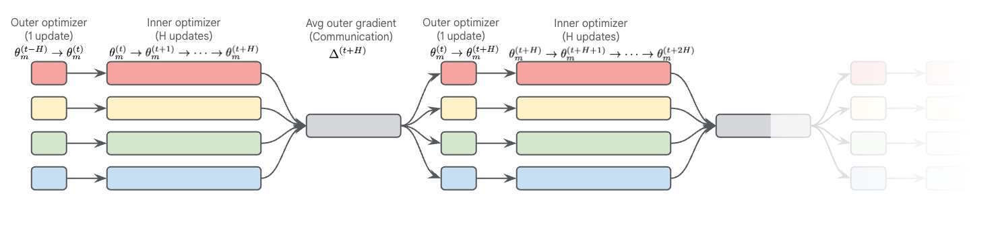
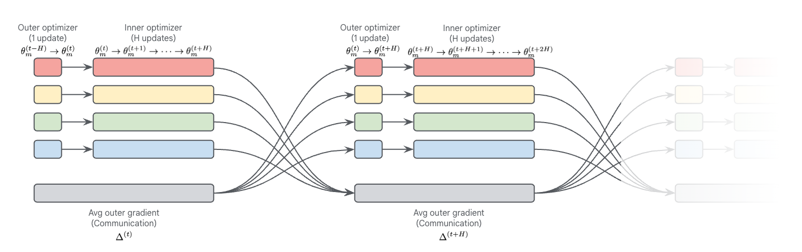
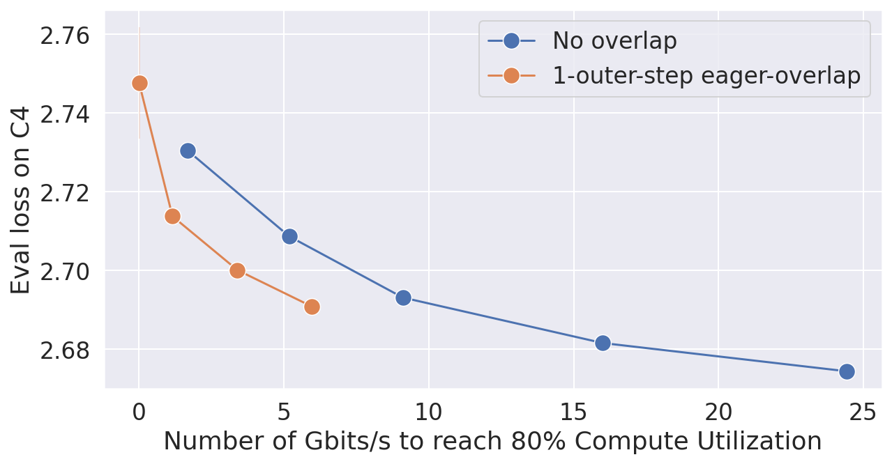
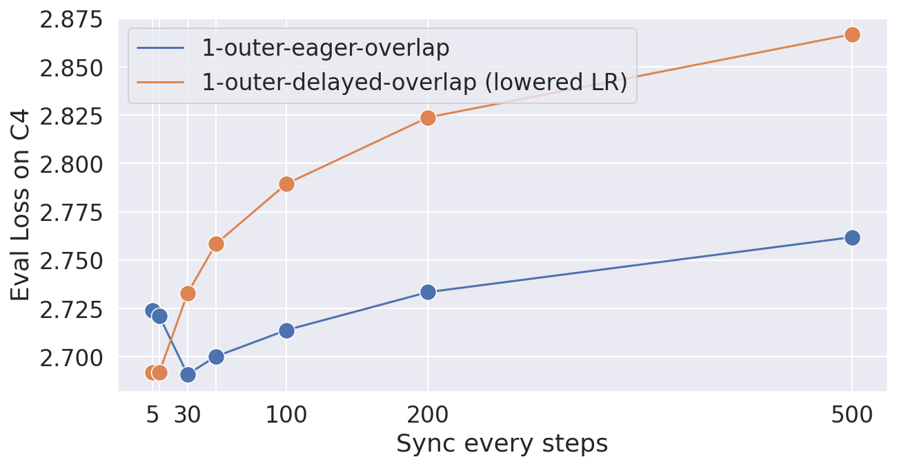
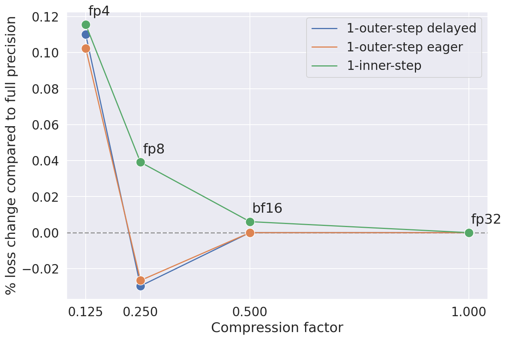

# Eager Updates For Overlapped Communication and Computation in DiLoCo

## 一、论文概述

| 项目 | 内容 |
|------|------|
| **标题** | Eager Updates For Overlapped Communication and Computation in DiLoCo |
| **作者** | Satyen Kale, Arthur Douillard, Yanislav Donchev |
| **机构** | Google DeepMind |
| **论文** | https://arxiv.org/abs/2502.12996v1 |
| **代码** | - |
| **发布** | 2025-02-18 |
| **许可** | - |
| **领域** | cs.CL (Computation and Language) |

## 二、核心思想

### 问题定义

DiLoCo 等分布式优化方法将更新分为两部分：
1. **内优化阶段**：workers 独立执行多个优化步骤
2. **外优化步骤**：同步内更新

虽然这些方法比标准数据并行训练的通信需求低几个数量级，但在 workers 是数据中心的场景中，即使是这些方法的有限通信需求，由于每个外优化步骤都需要阻塞，仍可能导致显著的减速。

### 解决方案概述

本文研究通过重叠通信与计算来缓解此问题的技术，使外优化步骤能够完全与内优化阶段重叠。

核心创新：
- **延迟外梯度（Delayed Outer Gradients）**：允许外梯度通信与下一轮内优化并行执行
- **Eager Updates**：将当前本地外梯度与延迟的全局外梯度混合，避免朴素延迟导致的性能下降

### 核心成果

- 外优化步骤完全与内优化阶段重叠
- 在 100B 参数模型上，带宽需求降低 **1177×**（对比 Data-Parallel）
- 在低带宽环境下达到与标准 DiLoCo 相当的性能
- 在大规模模型和大 token 预算下性能更优

## 三、技术架构

### 整体框架图

*Figure 1: Data flow and operations in standard DiLoCo. Here, 4 workers execute in parallel and alternate sequentially computation (the outer and inner optimization steps) and communication (averaging outer gradients across workers).*

### 延迟外梯度

*Figure 2: Data flow and operations in DiLoCo with delayed outer gradients. Here, 4 workers execute optimization steps in parallel with each other, as well as with the communication required for averaging outer gradients.*

### 核心公式

#### 标准 DiLoCo

**内优化器更新**：
$$\theta_m^{(t)} \leftarrow \text{InnerOpt}(\theta_m^{(t-1)}, \nabla \mathcal{L})$$

**外梯度计算**（每 H 步）：
$$\Delta_m^{(t)} \leftarrow \theta_m^{(t-H)} - \theta_m^{(t)}$$
$$\bar{\Delta}^{(t)} \leftarrow \text{AllReduce}(\{\Delta_m^{(t)}\})$$

**外优化器更新**：
$$\theta^{(t)} \leftarrow \text{OuterOpt}(\theta^{(t-H)}, \bar{\Delta}^{(t)})$$

#### 朴素延迟外梯度（Naïve Delayed）

允许外梯度通信与下一轮内优化并行：
$$\theta^{(t)} \leftarrow \text{OuterOpt}(\theta^{(t-H)}, \bar{\Delta}^{(t-H)})$$

**问题**：使用过时的外梯度，导致性能下降。

#### Eager Updates

混合当前本地外梯度与延迟的全局外梯度：
$$\theta_m^{(t)} \leftarrow \text{OuterOpt}(\theta_m^{(t-H)}, \alpha \cdot \Delta_m^{(t)} + (1-\alpha) \cdot \bar{\Delta}^{(t-H)})$$

其中 α 是混合系数，平衡当前本地梯度与延迟全局梯度。

### 核心组件

| 组件 | 说明 | 关键参数 |
|------|------|----------|
| Workers | 独立的训练单元 | M 个 workers |
| Inner Optimizer | 本地优化器 | AdamW |
| Outer Optimizer | 全局同步优化器 | Nesterov Momentum |
| Inner Steps | 内步数 | H=30（默认） |
| Delay | 延迟步数 | 1 outer step |
| Mixing Coefficient | 混合系数 | α（可调） |

### 重叠策略对比

| 策略 | 重叠粒度 | 带宽降低 | 性能影响 |
|------|----------|----------|----------|
| 标准 DiLoCo | 无重叠 | 基线 | 基线 |
| Streaming DiLoCo | 1 inner step | 336× | 最小 |
| **Eager Updates** | **1 outer step** | **1177×** | **最小** |

## 四、核心创新

| 创新点 | 说明 | 理论/实验依据 |
|--------|------|---------------|
| 延迟外梯度 | 外梯度通信与内优化重叠 | 消除阻塞等待 |
| Eager Updates | 混合当前与延迟梯度 | 避免性能下降 |
| 1-outer-step 重叠 | 整个外步骤重叠 | 1177× 带宽降低 |
| Streaming DiLoCo 集成 | 与流式更新兼容 | 进一步优化 |

## 五、代码实现分析

### 技术栈

- **训练框架**：JAX/DrJax
- **模型架构**：Chinchilla-style Transformer
- **并行策略**：FSDP + DiLoCo Replicas
- **通信**：All-Reduce
- **硬件**：TPU

### 关键实现细节

1. **模型配置**：
   - 35M 到 1B 参数
   - Chinchilla-optimal token budget
   - QKNorm + Z-loss 稳定训练

2. **训练设置**：
   - 2 DiLoCo replicas
   - 每个 replica 内部使用 FSDP
   - 内优化器：AdamW
   - 外优化器：Nesterov Momentum

3. **外学习率**：
   - 在小规模调优为 0.4
   - 固定用于所有规模

## 六、实验结果

### 计算利用率模拟

*Figure 6: Varying the number of inner steps, which affects both the loss and the bandwidth required to reach a certain level of compute utilization.*

**模拟设置**：
- 模型规模：1B, 10B, 100B 参数
- 带宽范围：10^-1 到 10^3 Gbits/s

**结果**：

| 方法 | 100B 带宽需求 | 相对 Data-Parallel |
|------|---------------|-------------------|
| Data-Parallel | 471.5 Gbits/s | 1× |
| Streaming DiLoCo (1 inner step) | 1.4 Gbits/s | 336× |
| **Eager Updates (1 outer step)** | **0.4 Gbits/s** | **1177×** |

### 扩展实验

**模型规模**：35M 到 1B 参数

**结果**：
- Eager Updates (H=30) 在 1B 规模达到与 Data-Parallel 相同性能
- 大规模模型下分布式方法更重要

### Eager vs Stale 对比

*Figure 5: Comparison of overlapping communication over an outer step, using the naïve delayed version and the eager version when varying the number of inner steps H.*

**关键发现**：
- 朴素延迟（Stale）在 H 较小时性能下降明显
- Eager Updates 在所有 H 值下都表现更好
- H=30 是最佳平衡点

### 量化通信

*Figure 7: Quantized communication across three overlapping communication schemes.*

**结果**：
- 量化通信与重叠策略兼容
- Eager Updates 在量化设置下仍表现最好

### 与其他方法对比

| 方法 | 重叠粒度 | 带宽降低 | 模型质量 |
|------|----------|----------|----------|
| Data-Parallel | 无 | 1× | 基线 |
| DiLoCo | 无 | ~500× | 竞争性 |
| Streaming DiLoCo | 1 inner step | 336× | 竞争性 |
| **Eager Updates** | **1 outer step** | **1177×** | **竞争性** |

## 七、相关工作

### DiLoCo 系列

- **DiLoCo**：开创性工作，500× 通信减少
- **Streaming DiLoCo**：流式更新 + 重叠通信
- **Decoupled DiLoCo**：完全解耦异步训练
- **Eager Updates**：本文工作，1-outer-step 重叠

### 通信优化

- **梯度压缩**：减少传输数据量
- **异步 SGD**：异步梯度更新
- **重叠通信**：隐藏通信延迟

### 联邦学习

- **FedAvg**：联邦平均算法
- **FedOpt**：联邦优化算法

## 八、总结

### 核心贡献

1. **延迟外梯度**：允许外梯度通信与内优化并行执行
2. **Eager Updates**：混合当前本地梯度与延迟全局梯度，避免性能下降
3. **1-outer-step 重叠**：整个外步骤重叠，带宽需求降低 1177×
4. **与 Streaming DiLoCo 兼容**：可与流式更新结合使用

### 技术影响

- **跨数据中心训练**：在极低带宽环境下实现高效训练
- **成本效益**：大幅降低网络成本
- **可扩展性**：支持更大规模的模型训练
- **DiLoCo 系列演进**：进一步优化分布式训练效率

### 局限性

1. **混合系数调优**：α 需要调优
2. **延迟敏感性**：某些设置下可能有性能影响
3. **实现复杂度**：需要额外的状态管理
4. **理论分析**：缺乏收敛性理论证明

### 未来方向

- 开发收敛性理论
- 探索更细粒度的重叠策略
- 与其他分布式技术结合
- 扩展到更大模型规模

## 九、参考资源

- **论文**: https://arxiv.org/abs/2502.12996v1
- **基础框架**: DiLoCo, Streaming DiLoCo
- **后续工作**: Decoupled DiLoCo (arxiv 2604.21428)
- **相关技术**: Federated Learning, FedOpt, All-Reduce
- **模型架构**: Chinchilla-style Transformer
- **训练框架**: JAX, DrJax, FSDP
