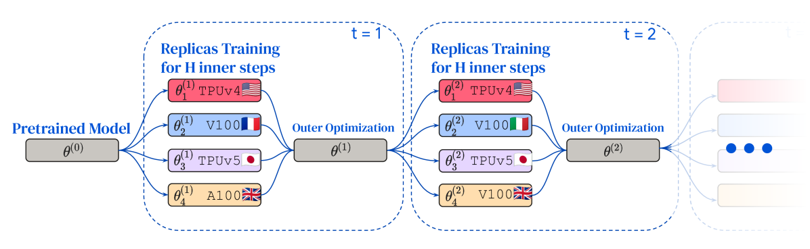
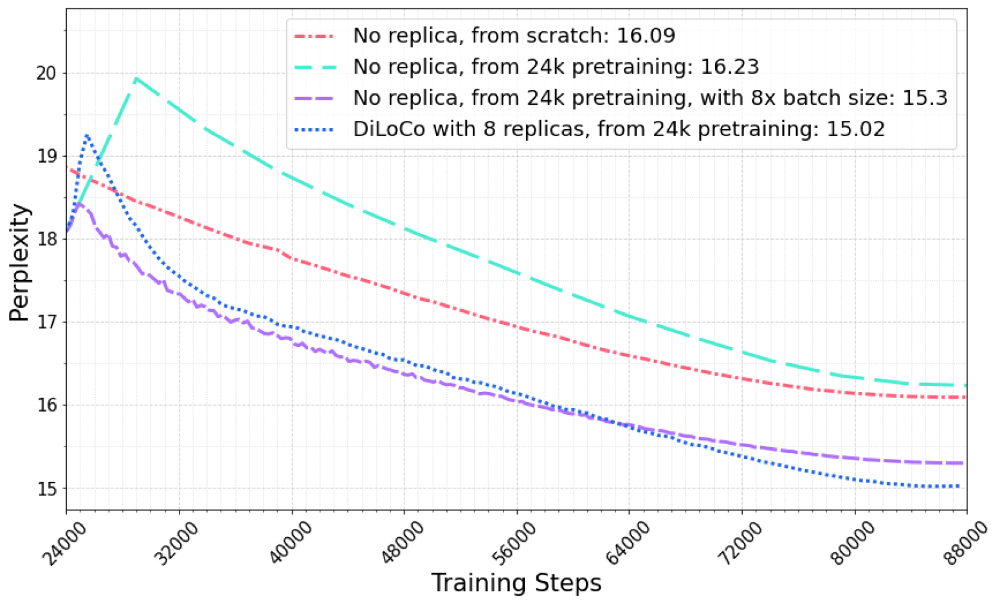
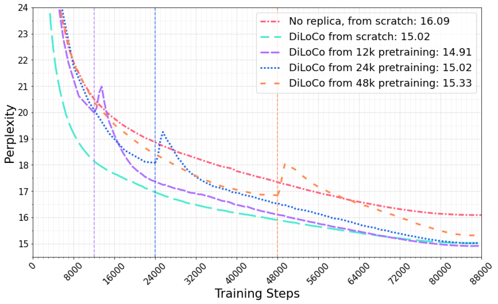
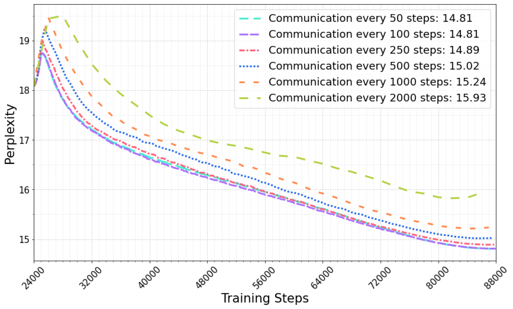
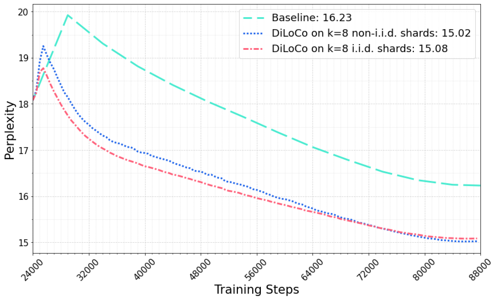
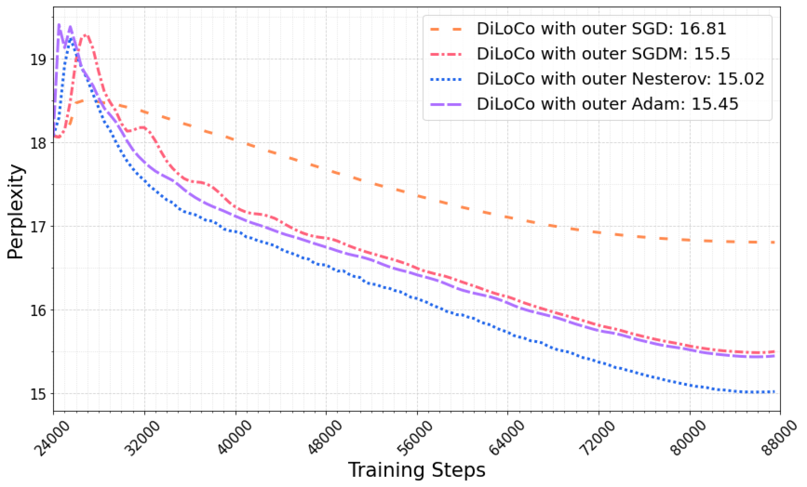
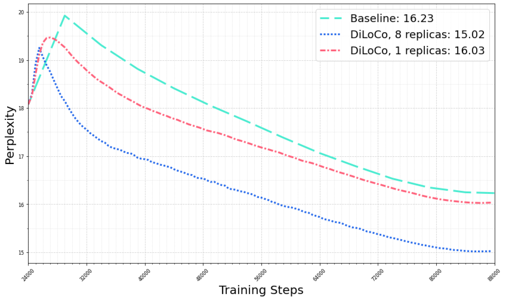
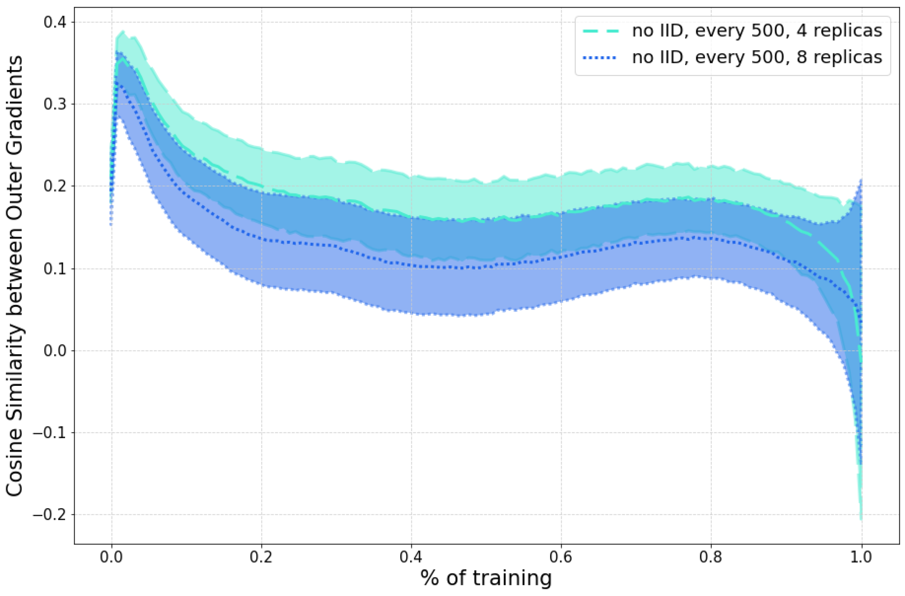

# DiLoCo: Distributed Low-Communication Training of Language Models

## 一、论文概述

| 项目 | 内容 |
|------|------|
| **标题** | DiLoCo: Distributed Low-Communication Training of Language Models |
| **作者** | Arthur Douillard, Qixuan Feng, Andrei A. Rusu, Rachita Chhaparia, Yani Donchev, Adhiguna Kuncoro, Marc'Aurelio Ranzato, Arthur Szlam, Jiajun Shen |
| **机构** | Google DeepMind |
| **论文** | https://arxiv.org/abs/2311.08105v3 |
| **代码** | - |
| **发布** | 2023-11-14 |
| **许可** | - |
| **领域** | cs.LG (Machine Learning) |

## 二、核心思想

### 问题定义

大型语言模型（LLM）已成为机器学习许多应用中的关键组件。然而，标准的 LLM 训练方法需要大量紧密互连的加速器，设备在每个优化步骤中交换梯度和其他中间状态。

虽然难以构建和维护一个托管大量加速器的单一计算集群，但找到多个各托管较少设备的计算集群可能更容易。

### 解决方案概述

DiLoCo（Distributed Low-Communication）是一种分布式优化算法，能够在连接不良的设备"岛屿"上训练语言模型。

核心设计：
- **联邦平均变体**：借鉴 Federated Learning 的思想
- **大量内步数**：H ≫ 1（默认 H=500）
- **内优化器**：AdamW（LLM 训练事实标准）
- **外优化器**：Nesterov Momentum

### 核心成果

- 在 C4 数据集上，8 workers 的 DiLoCo 与完全同步优化性能相当
- **通信量减少 500 倍**
- 对数据分布具有强鲁棒性
- 支持动态资源变化（资源可用/不可用）

## 三、技术架构

### 整体框架图

*Figure 1: DiLoCo: First, a pretrained model θ(0) is replicated k times (in this illustration k=4) and each worker θ_i(1) trains a model replica on its own shard of data for H steps independently and in parallel.*

### 核心公式

DiLoCo 训练过程如下（Algorithm 1）：

**1. 初始化**：
- 从预训练模型或随机初始化开始：θ(0)
- k 个 workers，每个有数据分片 D_i

**2. 外优化（Outer Optimization）**：
每个外步骤 t：
- 收集所有 workers 的外梯度
- 平均外梯度
- 使用外优化器更新共享参数

**3. 内优化（Inner Optimization）**：
每个 worker 独立并行执行 H 步：
$$\theta_i^{(t)} \leftarrow \text{InnerOpt}(\theta_i^{(t-1)}, \nabla \mathcal{L}_i)$$

**4. 外梯度计算**：
$$\Delta_i^{(t)} \leftarrow \theta_i^{(t-H)} - \theta_i^{(t)}$$
$$\bar{\Delta}^{(t)} \leftarrow \frac{1}{k} \sum_{i=1}^k \Delta_i^{(t)}$$
$$\theta^{(t)} \leftarrow \text{OuterOpt}(\theta^{(t-H)}, \bar{\Delta}^{(t)})$$

### 核心组件

| 组件 | 说明 | 关键参数 |
|------|------|----------|
| Workers | 独立的训练单元 | k 个 workers，各自维护模型副本 |
| Inner Optimizer | 本地优化器 | AdamW（默认） |
| Outer Optimizer | 全局同步优化器 | Nesterov Momentum |
| Inner Steps | 内步数 | H=500（默认） |
| Outer Steps | 外步数 | T = N/H |

### 与标准方法对比

| 方法 | 通信频率 | 通信量 | 训练时间 | 模型质量 |
|------|----------|--------|----------|----------|
| Data-Parallel | 每步 | N × 参数量 | 1× | 基线 |
| Microbatching | 每步 | 0 | 8× | 基线 |
| **DiLoCo** | **每 H 步** | **N/H × 参数量** | **1×** | **更好** |

**关键优势**：DiLoCo 在相同时间内，通信量减少 500 倍，同时达到更好的泛化性能。

## 四、核心创新

| 创新点 | 说明 | 理论/实验依据 |
|--------|------|---------------|
| 大量内步数 | H=500 步内优化 | 通信量减少 500 倍 |
| 双层优化 | 内优化 AdamW + 外优化 Nesterov | 优于其他外优化器 |
| 数据分布鲁棒 | 支持 i.i.d. 和 non-i.i.d. | 泛化性能相当 |
| 动态资源适应 | 支持资源可用性变化 | 无缝扩展/收缩 |
| 预训练初始化 | 可从预训练模型开始 | 加速收敛 |

## 五、代码实现分析

### 技术栈

- **训练框架**：JAX/Flax
- **模型架构**：Transformer (Chinchilla-style)
- **优化器**：AdamW (inner) + Nesterov Momentum (outer)
- **数据集**：C4 (Common Crawl)
- **硬件**：TPU

### 关键实现细节

1. **模型配置**：
   - 60M: 3 layers, 896 hidden dim, 16 heads
   - 150M: 12 layers, 896 hidden dim, 16 heads
   - 400M: 12 layers, 1536 hidden dim, 12 heads

2. **训练设置**：
   - 总步数：88,000
   - 内步数：H=500（默认）
   - Workers：k=8（默认）
   - 数据分片：每个 worker 独立数据

3. **外优化器选择**：
   - 比较了 SGD、Adam、Nesterov Momentum
   - Nesterov Momentum 表现最佳

## 六、实验结果

### 主要结果

*Figure 2: Main result: After pretraining a 150M baseline for 24,000 steps on C4, we compare networks finetuned for an additional 64,000 steps.*

**150M 模型结果**：

| 方法 | 通信 | 时间 | 计算 & 数据 | Perplexity |
|------|------|------|------------|------------|
| Baseline | 0 | 1× | 1× | 16.23 |
| Baseline, 8× batch (DP) | 8×N | 1× | 8× | 15.30 |
| Baseline, 8× batch (microbatch) | 0 | 8× | 8× | 15.30 |
| Baseline, 8× updates | 0 | 8× | 8× | 14.72 |
| **DiLoCo** | **8×N/H** | **1×** | **8×** | **15.02** |

**关键发现**：
- DiLoCo 在相同时间（1×）和计算（8×）下，通信量仅为 Data-Parallel 的 1/H
- DiLoCo 达到 15.02 perplexity，优于 Data-Parallel 的 15.30
- DiLoCo 比 baseline 快 8 倍（wall-clock time）

### 预训练步数影响

*Figure 3: Impact of number of pretraining steps in a non-i.i.d. setting.*

**观察**：
- 更多预训练步数 → 更好的初始化 → 更快收敛
- 即使从随机初始化开始，DiLoCo 也能收敛
- 预训练初始化显著加速训练

### 通信频率影响

*Figure 4: Varying the communication frequency every H={50,100,250,500,1000,2000} steps.*

**结果**：
- H=500 是最佳平衡点
- H 过小：通信频繁，失去 DiLoCo 优势
- H 过大：收敛变慢，模型质量下降
- H=2000 仍能达到可接受性能

### i.i.d. vs non-i.i.d.

*Figure 5: i.i.d. vs non-i.i.d. data regimes: DiLoCo converges faster in the i.i.d. setting but towards the end both data regimes attain similar generalization.*

**关键发现**：
- i.i.d. 收敛更快
- 最终泛化性能相当
- DiLoCo 对数据分布具有强鲁棒性

### 外优化器比较

*Figure 6: Outer Optimizers: Comparison of different outer optimizers.*

**结果**：
- Nesterov Momentum 表现最佳
- Adam 次之
- SGD 最差

### 单 Worker 加速

*Figure 9: Accelerating a single worker: DiLoCo applied to a single replica k=1 provides both faster and better generalization.*

**意外发现**：
- 即使 k=1（单 worker），DiLoCo 也能加速训练
- 双层优化结构本身带来正则化效果
- 泛化性能优于标准训练

### 梯度相似度分析

*Figure 11: Outer Gradients similarity versus number of replicas.*

**观察**：
- 增加 workers 数量 → 梯度差异增大
- non-i.i.d. 设置下差异更明显
- 但最终泛化性能仍然相当

## 七、相关工作

### 联邦学习

- **FedAvg**：联邦平均算法
- **FedOpt**：联邦优化算法
- **DiLoCo 区别**：大量内步数（H=500）+ 特定优化器选择

### 线性模式连通性

- **Linear Mode Connectivity**：损失景观中的线性路径
- **DiLoCo 观察**：外梯度相似度随 workers 数量变化

### 分布式训练

- **Data-Parallel**：标准数据并行
- **Model-Parallel**：模型并行
- **Pipeline-Parallel**：流水线并行
- **DiLoCo 定位**：减少通信的分布式训练

## 八、总结

### 核心贡献

1. **DiLoCo 算法**：分布式低通信训练语言模型
2. **500× 通信减少**：通过大量内步数实现
3. **双层优化**：AdamW (inner) + Nesterov Momentum (outer)
4. **数据分布鲁棒**：支持 i.i.d. 和 non-i.i.d.
5. **动态资源适应**：支持资源可用性变化

### 技术影响

- **分布式训练**：在低带宽环境下实现高效训练
- **地理分布式训练**：支持跨地域集群训练
- **成本效益**：降低硬件和网络成本
- **后续工作**：启发 Streaming DiLoCo 和 Decoupled DiLoCo

### 局限性

1. **模型规模**：实验限于 60M-400M 参数
2. **数据集**：主要在 C4 上验证
3. **架构**：仅验证 Transformer
4. **外优化器开销**：需要额外计算资源

### 未来方向

- 扩展到更大模型规模（>1B 参数）
- 验证其他数据集和架构
- 优化外优化器选择
- 与其他分布式技术结合

## 九、参考资源

- **论文**: https://arxiv.org/abs/2311.08105v3
- **后续工作**: Streaming DiLoCo (arxiv 2501.18512), Decoupled DiLoCo (arxiv 2604.21428)
- **基础框架**: Federated Learning, FedAvg, FedOpt
- **优化器**: AdamW, Nesterov Momentum
- **数据集**: C4 (Common Crawl)
- **模型架构**: Transformer (Chinchilla-style)
