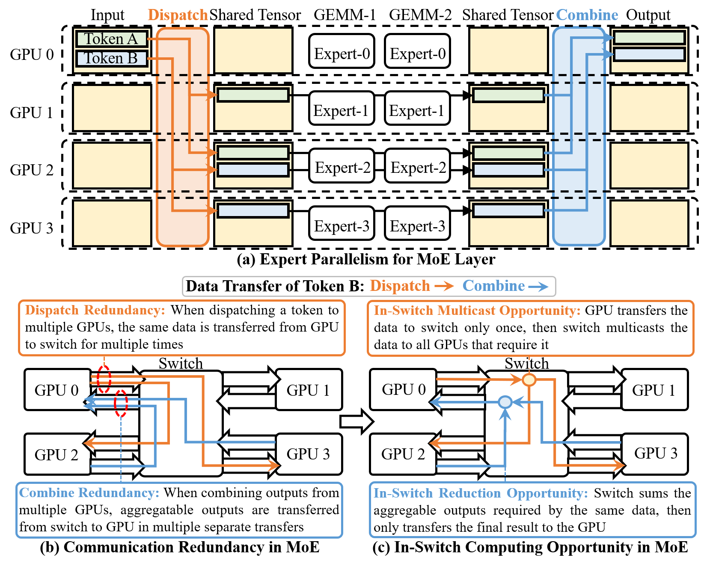
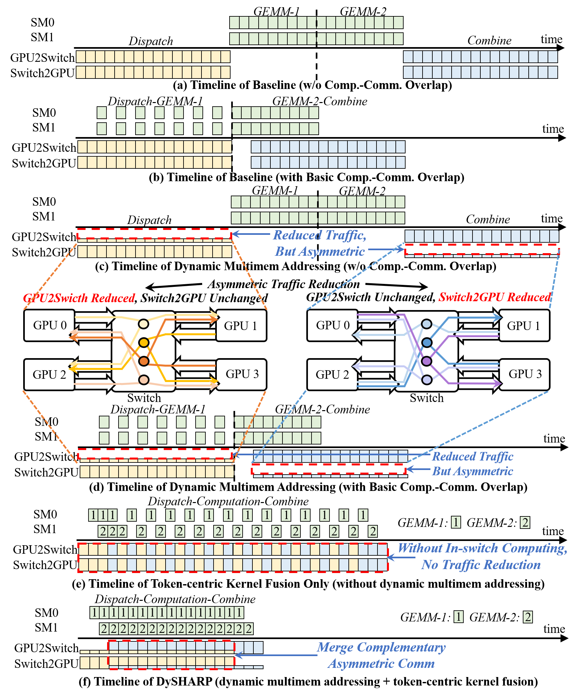
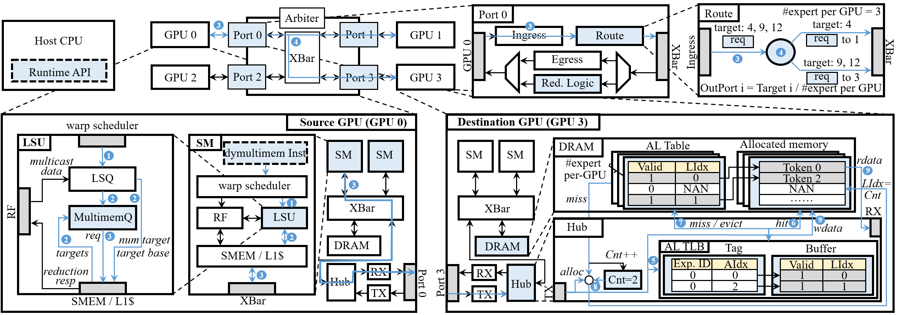
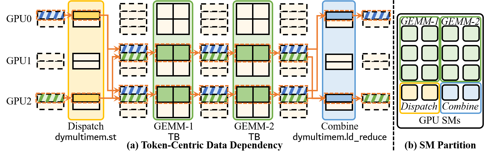
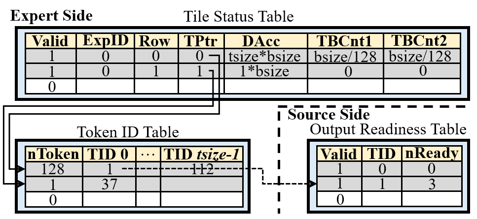
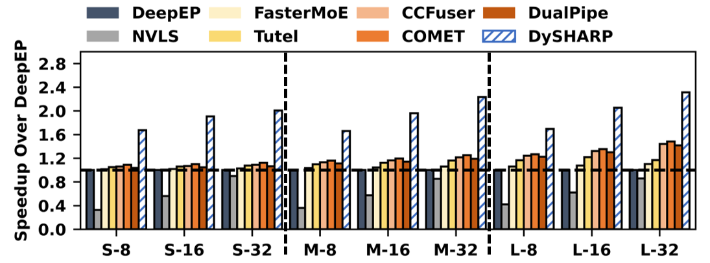
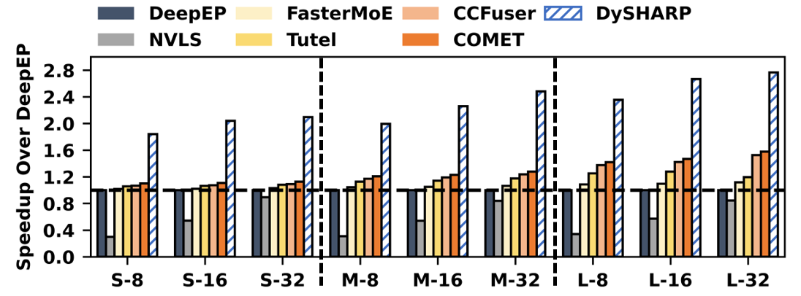
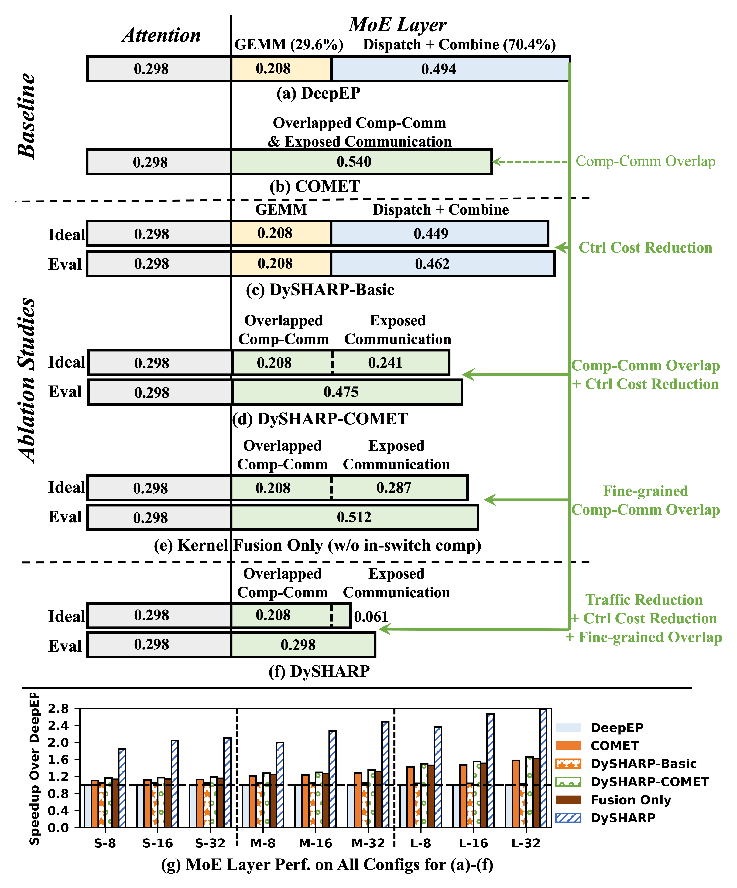
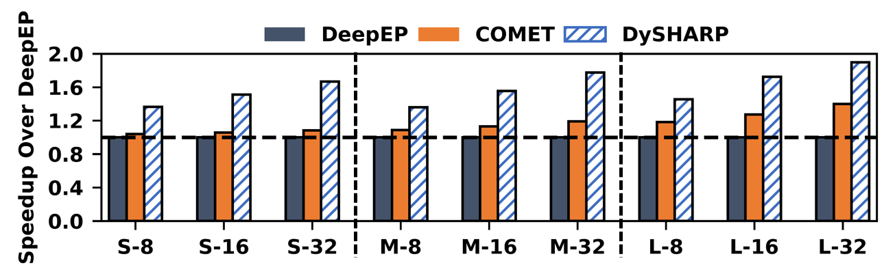

# DySHARP: Accelerating MoE with Dynamic In-Switch Computing on Multi-GPUs

## 一、论文概述

| 项目 | 内容 |
|------|------|
| **标题** | Accelerating MoE with Dynamic In-Switch Computing on Multi-GPUs |
| **作者** | Qijun Zhang, Chen Zhang, Zhuoshan Zhou, Haibo Wang, Zhe Zhou, Zhipeng Tu, Guangyu Sun, Zhiyao Xie, Yijia Diao, Zhigang Ji, Jingwen Leng, Guanghui He, Minyi Guo |
| **机构** | - |
| **论文** | https://arxiv.org/abs/2605.05607 |
| **代码** | - |
| **发布** | 2026-05-07 |
| **会议** | ISCA 2026 |
| **领域** | cs.AR (Hardware Architecture), cs.DC (Distributed Computing) |

## 二、核心思想

### 问题定义

Mixture-of-Experts (MoE) 已被 DeepSeek、GPT、Llama、Qwen 等主流大模型采用，以降低计算开销。然而，MoE 中的 **Expert Parallelism (EP)** 需要频繁的 GPU 间通信（Dispatch 和 Combine），这成为性能瓶颈——通信消耗 MoE 层执行时间的 **50-80%**。

关键观察：MoE 通信中存在大量的 **冗余数据传输**：
1. **Dispatch 冗余**：同一个 token 需要发送到多个 GPU 时，相同数据从源 GPU 到 switch 被传输多次
2. **Combine 冗余**：多个 GPU 的可聚合输出被单独传回源 GPU

在模拟的 GH200 NVL32 上，DeepSeek-V3 的通信冗余占总流量的近 **50%**。

### 解决方案概述

DySHARP 提出了一个完整的 **动态 in-switch computing 解决方案**，包含两个核心技术：

1. **Dynamic Multimem Addressing**：扩展 NVLink SHARP (NVLS) 支持动态通信，通过 ISA、架构和运行时的协同设计，减少冗余流量

2. **Token-Centric Kernel Fusion**：深度融合 Dispatch-Computation-Combine 流水线，解决流量减少的非对称性问题，将流量减少转化为实际加速

## 三、技术架构

### 整体框架图



*Figure 1: In-switch computing opportunity in MoE. MoE has significant redundant transfer that can be potentially addressed with in-switch computing.*



*Figure 4: How the two techniques work as an integral solution. Dynamic multimem addressing reduces traffic but inherently asymmetric between two directions. Token-centric kernel fusion merges complementary asymmetric communication patterns.*

### 核心技术 1：Dynamic Multimem Addressing

#### Key Idea



*Figure 9: Detailed architectural design and workflow of the dynamic multimem addressing framework.*

**问题**：现有 NVLS 只支持静态集合通信（如 AllGather、Reduce-Scatter），无法支持 MoE 中的动态不规则通信。

**核心洞察**：Dispatch 和 Combine 是 AllGather 和 Reduce-Scatter 的动态变体，具有两个关键性质：
1. **代数索引跨 GPU 一致**：每个 token 在结果张量中的索引位置在所有 GPU 上相同
2. **内存布局 per-GPU 管理且非对称**：只有部分 GPU 接收给定 token

**方案对比**：

| 方案 | Payload 效率 | 软件开销 |
|------|-------------|----------|
| Explicit Addressing | 低（69% vs 理想 80%） | 高（10-20% GPU 计算资源） |
| Dynamic Multimem Addressing | 高（接近理想） | 无 |

**设计要点**：
- **Packet Format Extension**：扩展现有 NVLink 数据链路层包格式
- **ISA Extension**：新增 `dymultimem.st`（动态 multicast）和 `dymultimem.ld_reduce`（动态 reduction）指令
- **Microarchitecture Extension**：包括 Address Lookup TLB (AL-TLB)、Reduction Buffer 等硬件组件
- **Runtime Extension**：扩展 CUDA Runtime API 支持动态 multimem 操作

#### Packet Format

扩展 NVLink 包格式，支持动态目标标识：
- 新增 dynamic multimem 请求类型
- 支持 algebraic index 到物理地址的动态映射

#### ISA Extension

```assembly
dymultimem.st [addr], data    // 动态 multicast store
dymultimem.ld_reduce [addr]   // 动态 load with reduction
```

基于现有 multimem 指令扩展，保持指令格式兼容性。

#### Microarchitecture

关键硬件组件：
1. **Source GPU**：处理动态 multimem 请求的发起
2. **NVSwitch**：执行 in-switch multicast 和 reduction
3. **AL-TLB (Address Lookup TLB)**：将 algebraic index 映射到物理地址
4. **Reduction Buffer**：在 switch 中缓存待聚合数据
5. **Hardware Memory Manager**：管理 Dispatch 和 Combine 的内存操作

#### Runtime

扩展 CUDA Runtime API：
```cuda
// 动态 multimem store
cudaDymultimemStore(addr, data, size, target_mask);
// 动态 multimem load with reduction
cudaDymultimemLoadReduce(addr, result, size, op);
```

### 核心技术 2：Token-Centric Kernel Fusion



*Figure 12: (a) Token-centric data dependency chain across Dispatch, GEMM-1, GEMM-2, and Combine. (b) SM partition for pipelined execution.*

#### Key Idea

**问题**：Dynamic multimem addressing 减少了流量，但流量减少在两个方向上是**非对称的**（GPU→switch 减少 vs switch→GPU 减少），不能直接转化为加速。

**解决方案**：将 MoE 层视为 **token-paced pipeline**，而非四个隔离的算子：
- 以 token/tile 粒度确定就绪状态
- 在 token 级依赖可用时立即执行操作，无需等待算子级完成
- 同时执行 Dispatch 和 Combine，合并互补的非对称通信模式

#### Token Tracker



*Figure 13: Architecture design of token tracker.*

Token Tracker 用于检测 **就绪边界**：
- 引入 **Tile Status Table** 跟踪 Dispatch→GEMM 的 token 级依赖
- 当一个 tile 的 token 从 Dispatch 就绪时，立即触发 GEMM 计算
- 细粒度跟踪实现 Dispatch 和 Combine 的并行执行

#### Token-Centric Scheduler

- **SM 分区**：将 GPU SM 分为两组，一组执行 Dispatch 相关计算，另一组执行 Combine 相关计算
- **流水线执行**：整个 Dispatch-Computation-Combine 流程以 tile 为单位流水线化
- **同步粒度**：选择 128 tokens 作为同步 tile size，匹配 GEMM tile size

### 核心公式

#### 通信冗余量化

在 DeepSeek-V3 上，激活 expert 数 ≥ 8 时，冗余数据传输占总流量的近 **50%**。

#### 性能提升

DySHARP 相比 SOTA 方案实现高达 **1.79×** 加速。

### 模型组件

| 组件 | 说明 | 关键参数 |
|------|------|----------|
| Dynamic Multimem Addressing | 扩展 NVLS 支持动态通信 | ISA + 架构 + 运行时 |
| AL-TLB | 地址查找 TLB，映射 algebraic index 到物理地址 | 可配置大小 |
| Reduction Buffer | Switch 中的聚合缓冲区 | 可配置大小 |
| Token Tracker | 跟踪 token 级依赖 | Tile Status Table |
| Token-Centric Scheduler | 细粒度调度器 | SM 分区 + 流水线 |

### 训练流程

DySHARP 本身不是训练算法，而是 MoE 执行的硬件/系统优化。它加速 MoE 的 Dispatch-Computation-Combine 流水线，适用于训练和推理场景。

## 四、核心创新

| 创新点 | 说明 | 理论/实验依据 |
|--------|------|---------------|
| Dynamic Multimem Addressing | 首次支持动态 in-switch computing，扩展 NVLS | 比 explicit addressing payload 效率更高，无软件开销 |
| Token-Centric Kernel Fusion | 细粒度融合 Dispatch-Computation-Combine | 解决流量减少的非对称性问题 |
| 完整软硬件协同设计 | ISA + 架构 + 运行时 + 调度的全栈方案 | 两个技术缺一不可，单独使用效果有限 |
| 互补非对称通信合并 | 同时执行 Dispatch 和 Combine，合并互补模式 | 将流量减少转化为实际加速 |

## 五、代码实现分析

论文未公开代码，但详细描述了硬件和软件设计：
- ISA 扩展：新增 `dymultimem.st` 和 `dymultimem.ld_reduce` 指令
- 微架构：AL-TLB、Reduction Buffer、Hardware Memory Manager
- 运行时：扩展 CUDA Runtime API

## 六、实验结果

### End-to-End 训练加速



*Figure 14: End-to-end model training speedup across different configurations.*

| 基线 | 最大加速 | 几何平均加速 |
|------|---------|-------------|
| DeepEP | 2.31× | 1.93× |
| NVLS | 5.12× | 3.38× |
| FasterMoE | 2.11× | 1.84× |
| Tutel | 1.98× | 1.72× |
| CCFuser | 1.85× | 1.63× |
| COMET | 1.79× | 1.59× |
| DualPipe | 1.88× | 1.66× |

### MoE 层加速



*Figure 15: MoE layer speedup across different model configurations.*

| 基线 | 最大加速 | 几何平均加速 |
|------|---------|-------------|
| DeepEP | 2.77× | 2.26× |
| NVLS | 6.93× | 4.25× |
| FasterMoE | 2.48× | 2.14× |
| Tutel | 2.32× | 1.96× |
| CCFuser | 2.01× | 1.84× |
| COMET | 1.94× | 1.78× |

### 消融实验



*Figure 16: Quantitative time breakdown (normalized to DeepEP) and ablation studies on official DeepSeek-V3 configuration (L-8), validating Fig. 4 (a)-(f).*

**关键发现**：
- **DySHARP-Basic**（仅 dynamic multimem addressing）：减少流量但不能转化为加速
- **DySHARP-COMET**（dynamic multimem addressing + 基本 overlap）：效果有限
- **DySHARP**（两个技术结合）：将流量减少转化为实际加速
- Token-centric kernel fusion 单独使用（无 in-switch computing）不能超越 SOTA 基线

### 推理加速



*Figure 27: End-to-end speedup for inference.*

DySHARP 在推理场景（prefill + decode）同样有效：
- Prefill：通信密集型，受益于流量减少
- Decode：内存密集型，但延迟敏感，受益于细粒度同步和减少的软件控制开销

### 敏感性分析

- **GPU 数量**：随 GPU 数量增加，DySHARP 优势更明显
- **序列长度**：在不同序列长度下均有效
- **Token 分布**：对不同 token 分布具有鲁棒性
- **Tile Size**：128 tokens 是最优同步粒度（匹配 GEMM tile size）

### 硬件开销

- AL-TLB 和 Reduction Buffer 的面积和功耗开销较小
- 设计空间探索表明可配置参数有较宽的有效范围

## 七、相关工作

### In-Switch Computing
- **NVLS (NVLink SHARP)**：现有方案，仅支持静态集合通信
- **CAIS**：针对 chip-to-chip 互连，仅支持静态集合
- **TRACI**：针对 DLRM，不支持 MoE 动态通信
- **DySHARP**：首次支持动态 in-switch computing

### MoE 通信优化
- **优化库**：DeepEP、Tutel 等
- **层次通信**：分层 AllToAll 优化
- **计算-通信重叠**：FasterMoE、COMET、CCFuser、DualPipe
- **DySHARP 的区别**：从根源消除冗余传输，而非仅重叠或优化

## 八、总结

### 核心贡献

1. **首次实现动态 in-switch computing**：扩展 NVLS 支持 MoE 中的不规则动态通信
2. **Dynamic Multimem Addressing**：ISA + 架构 + 运行时的协同设计，实现高效动态 multicast/reduction
3. **Token-Centric Kernel Fusion**：细粒度融合 Dispatch-Computation-Combine，解决流量减少的非对称性
4. **完整软硬件协同方案**：两个技术缺一不可，共同实现高达 1.79× 加速

### 技术影响

- **MoE 训练加速**：直接加速 DeepSeek、GPT、Llama、Qwen 等主流 MoE 模型
- **硬件设计启示**：为下一代 GPU/NVSwitch 的 in-switch computing 提供设计参考
- **系统-硬件协同**：展示了 ISA、架构、运行时协同优化的重要性

### 局限性

1. **硬件依赖**：需要 NVSwitch 硬件支持，当前 GPU 无法直接使用
2. **扩展性**：多节点扩展需要 InfiniBand Switch 的配合
3. **模型适用性**：主要针对 MoE 架构，对 Dense 模型无直接收益

## 九、参考资源

- **论文**: https://arxiv.org/abs/2605.05607
- **会议**: ISCA 2026
- **相关工作**: NVLink SHARP (NVLS), DeepEP, COMET, FasterMoE, Tutel, CCFuser, DualPipe
