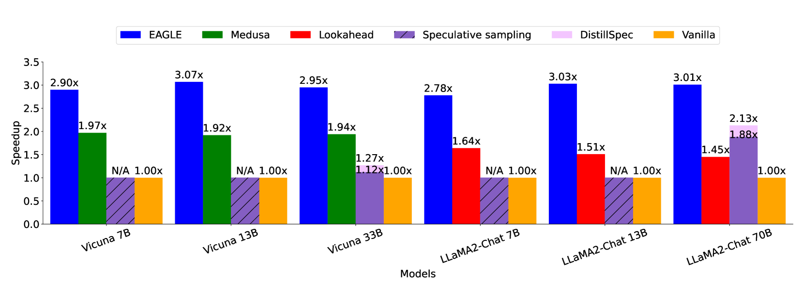
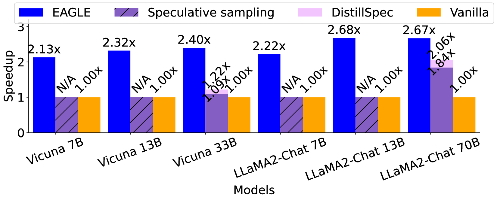
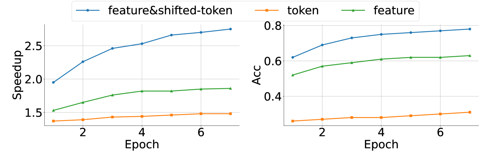
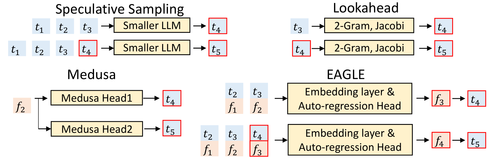
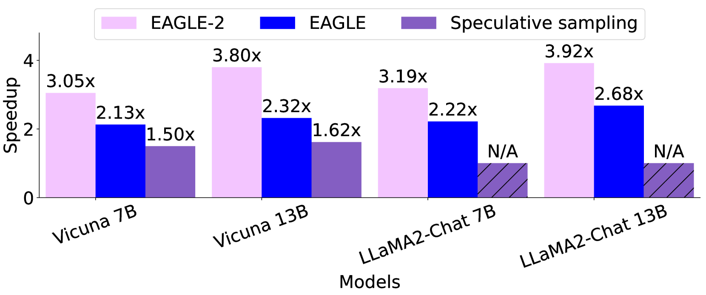
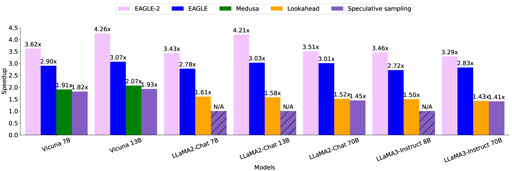
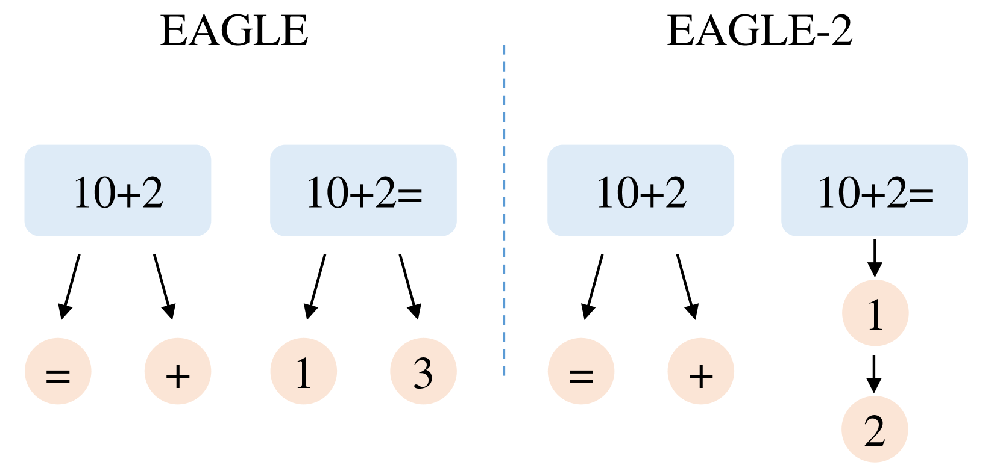
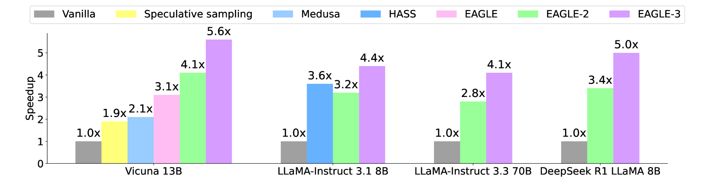
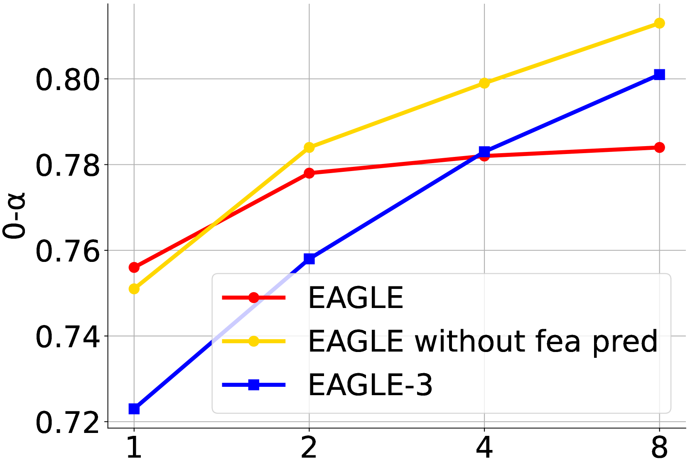

# EAGLE 系列：大语言模型投机解码加速

## 系列概述

EAGLE 系列是针对大语言模型（LLM）推理加速的投机解码（Speculative Decoding）方法，由 Yuhui Li 等人提出。该系列从特征级自回归、动态草稿树到训练时测试，逐步提升了投机解码的速度和效率。

| 版本 | 论文 | 发布时间 | 核心创新 | 加速比 |
|------|------|----------|----------|--------|
| EAGLE | 2401.15077 | 2024-01 | 特征级自回归 + 位移token | 2.7-3.5× |
| EAGLE-2 | 2406.16858 | 2024-06 | 上下文感知动态草稿树 | 3.05-4.26× |
| EAGLE-3 | 2503.01840 | 2025-03 | 训练时测试 + 多层特征融合 | 最高 6.5× |

---

## 一、EAGLE: Speculative Sampling Requires Rethinking Feature Uncertainty

### 论文信息

| 项目 | 内容 |
|------|------|
| **标题** | EAGLE: Speculative Sampling Requires Rethinking Feature Uncertainty |
| **作者** | Yuhui Li, Fangyun Wei, Chao Zhang, Hongyang Zhang |
| **机构** | Microsoft Research, Peking University |
| **论文** | https://arxiv.org/abs/2401.15077 |
| **代码** | https://github.com/SafeAILab/EAGLE |
| **发布** | 2024-01-26 |

### 核心思想

#### 问题定义

投机解码（Speculative Decoding）通过使用小型草稿模型生成候选token，然后由目标模型并行验证，从而加速LLM推理。然而，传统方法面临两个关键问题：

1. **token级自回归的局限性**：草稿模型在token级别进行自回归预测，难以准确捕捉LLM内部的不确定性分布
2. **独立同分布假设的失效**：候选token之间的相关性被忽略，导致草稿质量下降

#### 解决方案

**EAGLE** 提出了一种新的投机解码范式：**特征级自回归**。

**核心创新**：
1. **特征级预测**：在LLM的特征空间（而非token空间）进行自回归建模
2. **位移token机制**：使用前一位置的token embedding作为当前特征预测的条件
3. **轻量级草稿头**：仅需一个简单的线性层即可实现高质量草稿生成

**关键洞察**：
- LLM的特征空间比token空间更能反映模型的不确定性
- 特征级预测可以更好地捕捉token间的依赖关系
- 位移token提供了必要的位置信息

### 技术架构

#### 特征级自回归

传统投机解码在token级别工作：
$$P(x_t | x_{<t}) = \text{softmax}(h_t)$$

EAGLE在特征级别工作：
$$h_{t+1} = \text{DraftHead}(h_t, \text{embed}(x_t))$$

其中：
- $h_t$ 是位置 $t$ 的LLM特征向量
- $\text{embed}(x_t)$ 是token $x_t$ 的embedding
- DraftHead 是轻量级草稿头（通常是线性层）

#### 位移token机制

**关键设计**：使用前一位置的token embedding来补充特征信息

```
位置 t 的草稿输入 = [h_t, embed(x_{t-1})]
```

这种设计的原因：
- 特征向量 $h_t$ 包含了位置 $t$ 的语义信息
- token embedding $\text{embed}(x_{t-1})$ 提供了位置信息
- 两者结合可以准确预测下一个token的分布

#### 草稿生成流程

1. 从LLM获取最后一个位置的特征 $h_L$
2. 使用草稿头迭代生成 $K$ 个候选token
3. 每次迭代：
   - 输入：当前特征 + 前一token的embedding
   - 输出：下一位置的特征预测
   - 采样：从特征预测的分布中采样token
4. 将 $K$ 个候选token发送给目标模型验证

### 核心公式

#### 草稿头预测

$$\hat{h}_{t+1} = W_h h_t + W_e \text{embed}(x_t) + b$$

$$P_{\text{draft}}(x_{t+1}) = \text{softmax}(W_{\text{out}} \hat{h}_{t+1})$$

#### 验证过程

目标模型并行处理所有候选token：
$$P_{\text{target}}(x_{t+1} | x_{\leq t}) = \text{softmax}(\text{LLM}(x_{\leq t+1}))$$

接受准则（保持分布一致）：
$$\text{accept } x_{t+1} \text{ if } r \leq \min\left(1, \frac{P_{\text{target}}(x_{t+1})}{P_{\text{draft}}(x_{t+1})}\right)$$

### 实验结果

#### 加速性能

| 模型 | 任务 | 贪婪解码 | 非贪婪解码 |
|------|------|----------|------------|
| Vicuna-7B | MT-Bench | 2.7× | 2.5× |
| Vicuna-13B | MT-Bench | 3.1× | 2.8× |
| LLaMA2-Chat-70B | MT-Bench | 3.5× | 3.1× |





#### 准确性保持

**关键优势**：EAGLE保证输出分布与目标模型完全一致（无损加速）



#### 与其他方法对比

| 方法 | 加速比 | 输出一致性 | 训练开销 |
|------|--------|------------|----------|
| Medusa | 2.2× | 有损 | 高 |
| Lookahead | 1.8× | 无损 | 无 |
| EAGLE | 2.7-3.5× | 无损 | 低 |



### 核心创新总结

| 创新点 | 说明 | 优势 |
|--------|------|------|
| 特征级自回归 | 在特征空间而非token空间建模 | 更好捕捉不确定性 |
| 位移token机制 | 前一token embedding作为条件 | 补充位置信息 |
| 轻量级草稿头 | 单层线性网络 | 低训练开销 |
| 无损加速 | 保持输出分布一致 | 质量保证 |

---

## 二、EAGLE-2: Faster Inference of Language Models with Dynamic Draft Trees

### 论文信息

| 项目 | 内容 |
|------|------|
| **标题** | EAGLE-2: Faster Inference of Language Models with Dynamic Draft Trees |
| **作者** | Yuhui Li, Fangyun Wei, Chao Zhang, Hongyang Zhang |
| **机构** | Microsoft Research, Peking University |
| **论文** | https://arxiv.org/abs/2406.16858 |
| **代码** | https://github.com/SafeAILab/EAGLE |
| **发布** | 2024-06-24 |

### 核心思想

#### 问题定义

EAGLE 使用固定的草稿树结构，但不同上下文的不确定性分布差异很大：
- 低不确定性位置：可以扩展更多分支
- 高不确定性位置：应该减少分支，避免浪费计算

#### 解决方案

**EAGLE-2** 引入**上下文感知动态草稿树**：

**核心创新**：
1. **置信度评分**：利用EAGLE草稿头的校准置信度
2. **动态树结构**：根据置信度动态调整树的形状
3. **上下文感知**：不同位置使用不同的扩展策略

**关键洞察**：
- EAGLE草稿头的置信度分数是well-calibrated的
- 置信度可以直接用于指导树的构建
- 动态树比固定树更高效

### 技术架构

#### 置信度评分

EAGLE草稿头输出的softmax概率可以作为置信度：

$$c_t = \max P_{\text{draft}}(x_{t+1} | x_{\leq t})$$

**校准性验证**：
- 高置信度 → 高接受率
- 低置信度 → 低接受率
- 线性相关关系

#### 动态草稿树构建

**算法流程**：

1. 从根节点开始（当前位置）
2. 对每个节点：
   - 计算置信度 $c$
   - 如果 $c > \tau_{\text{high}}$：扩展2个子节点
   - 如果 $c > \tau_{\text{low}}$：扩展1个子节点
   - 否则：停止扩展
3. 递归构建直到达到最大深度

**树结构示例**：

```
固定树（EAGLE）:        动态树（EAGLE-2）:
      root                    root
     / | \                    / \
    A  B  C                  A   B
   /|  |  |\                /|
  D E  F  G H              D
```

#### 上下文感知策略

不同任务使用不同的树结构：
- **翻译任务**：低不确定性，树可以更宽
- **创意写作**：高不确定性，树应该更深但更窄
- **代码生成**：中等不确定性，平衡宽深

### 核心公式

#### 置信度计算

$$c_t = \max_{x} P_{\text{draft}}(x | h_t, \text{embed}(x_{t-1}))$$

#### 动态扩展决策

$$\text{children}(t) = \begin{cases}
2 & \text{if } c_t > \tau_{\text{high}} \\
1 & \text{if } c_t > \tau_{\text{low}} \\
0 & \text{otherwise}
\end{cases}$$

#### 期望接受长度

$$\mathbb{E}[\text{accepted tokens}] = \sum_{t=1}^{T} \prod_{i=1}^{t} P(\text{accept } x_i | x_{<i})$$

### 实验结果

#### 加速性能

| 模型 | 温度 | EAGLE | EAGLE-2 | 提升 |
|------|------|-------|---------|------|
| Vicuna-7B | 0 | 2.9× | 3.8× | +31% |
| Vicuna-7B | 1 | 2.5× | 3.1× | +24% |
| LLaMA2-Chat-70B | 0 | 3.5× | 4.3× | +23% |





#### 动态树效果



**观察**：
- 高置信度位置：树更宽，充分利用并行性
- 低置信度位置：树更窄，避免无效计算
- 整体效率提升显著

### 核心创新总结

| 创新点 | 说明 | 优势 |
|--------|------|------|
| 置信度评分 | 利用草稿头的校准置信度 | 无需额外计算 |
| 动态树结构 | 根据置信度调整树形状 | 适应不同上下文 |
| 上下文感知 | 不同任务不同策略 | 最大化效率 |

---

## 三、EAGLE-3: Scaling up Inference Acceleration of Large Language Models via Training-Time Test

### 论文信息

| 项目 | 内容 |
|------|------|
| **标题** | EAGLE-3: Scaling up Inference Acceleration of Large Language Models via Training-Time Test |
| **作者** | Yuhui Li, Fangyun Wei, Chao Zhang, Hongyang Zhang |
| **机构** | Microsoft Research, Peking University |
| **论文** | https://arxiv.org/abs/2503.01840 |
| **代码** | https://github.com/SafeAILab/EAGLE |
| **发布** | 2025-03-03 |

### 核心思想

#### 问题定义

EAGLE 和 EAGLE-2 的局限性：
1. **单层特征**：只使用LLM最后一层的特征
2. **线性草稿头**：表达能力有限
3. **缩放性不足**：随着模型增大，加速收益递减

#### 解决方案

**EAGLE-3** 提出**训练时测试（Training-Time Test）**范式：

**核心创新**：
1. **多层特征融合**：利用LLM多层特征的互补信息
2. **MLP草稿头**：更强的表达能力
3. **训练时测试**：在训练阶段模拟推理时的投机解码过程

**关键洞察**：
- LLM不同层的特征捕获不同层次的语义信息
- 融合多层特征可以提高草稿质量
- 训练时测试可以让草稿头学习如何在投机解码场景下工作

### 技术架构

#### 多层特征融合

传统方法只使用最后一层：
$$h = h_L$$

EAGLE-3 融合多层特征：
$$h_{\text{fused}} = \text{Fusion}(h_{l_1}, h_{l_2}, ..., h_{l_k})$$

其中 $l_1, l_2, ..., l_k$ 是选择的层索引。

**融合方式**：
- 拼接后投影：$h_{\text{fused}} = W[h_{l_1}; h_{l_2}; ...; h_{l_k}]$
- 加权求和：$h_{\text{fused}} = \sum_i \alpha_i h_{l_i}$
- 注意力融合：$h_{\text{fused}} = \text{Attention}(h_{l_1}, h_{l_2}, ..., h_{l_k})$

#### MLP 草稿头

EAGLE-3 使用 MLP 替代线性层：

$$\text{DraftHead}(h) = W_2 \cdot \text{GELU}(W_1 h + b_1) + b_2$$

**优势**：
- 更强的非线性表达能力
- 可以学习更复杂的特征变换
- 参数量仍然很小

#### 训练时测试

**核心思想**：在训练阶段模拟推理时的投机解码过程

**训练流程**：

1. **前向传播**：
   - 获取LLM多层特征
   - 草稿头生成候选token序列
   - 目标模型验证候选token

2. **损失计算**：
   - 不仅计算token预测损失
   - 还计算投机解码的接受率损失
   - 优化整体加速效果

3. **反向传播**：
   - 梯度通过验证过程回传
   - 草稿头学习如何提高接受率

**损失函数**：
$$\mathcal{L} = \mathcal{L}_{\text{CE}} + \lambda \cdot \mathcal{L}_{\text{accept}}$$

其中：
- $\mathcal{L}_{\text{CE}}$：标准交叉熵损失
- $\mathcal{L}_{\text{accept}}$：接受率相关损失
- $\lambda$：平衡系数

### 核心公式

#### 多层特征融合

$$h_{\text{fused}} = W_{\text{proj}} \cdot \text{LayerNorm}([h_{l_1}; h_{l_2}; ...; h_{l_k}])$$

#### MLP 草稿头

$$\hat{h}_{t+1} = \text{MLP}([h_{\text{fused},t}; \text{embed}(x_t)])$$

$$P_{\text{draft}}(x_{t+1}) = \text{softmax}(W_{\text{out}} \hat{h}_{t+1})$$

#### 训练时测试损失

$$\mathcal{L}_{\text{accept}} = -\mathbb{E}\left[\sum_{t=1}^{T} \mathbb{1}[\text{accept } x_t] \cdot \log P_{\text{draft}}(x_t)\right]$$

### 实验结果

#### 加速性能

| 模型 | 任务 | EAGLE | EAGLE-2 | EAGLE-3 | 提升 |
|------|------|-------|---------|---------|------|
| LLaMA3-Instruct-8B | HumanEval | 3.1× | 3.8× | 4.5× | +48% |
| LLaMA3-Instruct-8B | GSM8K | 2.8× | 3.5× | 4.2× | +50% |
| LLaMA3-Instruct-70B | MT-Bench | 3.5× | 4.3× | 5.8× | +65% |
| LLaMA3-Instruct-70B | HumanEval | 3.3× | 4.1× | 6.5× | +97% |



#### 训练时测试效果


**观察**：
- 训练时测试显著提高草稿质量
- 接受率提升 15-25%
- 草稿头学会预测更准确的token

#### 缩放性



**关键发现**：
- EAGLE-3 的加速比随模型规模增大而提升
- 70B 模型上达到最高 6.5× 加速
- 解决了传统方法的缩放性问题

### 核心创新总结

| 创新点 | 说明 | 优势 |
|--------|------|------|
| 多层特征融合 | 利用LLM多层特征 | 更丰富的语义信息 |
| MLP 草稿头 | 非线性变换 | 更强的表达能力 |
| 训练时测试 | 模拟推理过程训练 | 直接优化加速效果 |
| 缩放性提升 | 随模型增大效果更好 | 适用于大模型 |

---

## 四、系列演进总结

### 技术路线图

```
EAGLE (2024-01)
├── 特征级自回归
├── 位移token机制
└── 2.7-3.5× 加速
    │
    ▼
EAGLE-2 (2024-06)
├── 置信度评分
├── 动态草稿树
└── 3.05-4.26× 加速
    │
    ▼
EAGLE-3 (2025-03)
├── 多层特征融合
├── MLP 草稿头
├── 训练时测试
└── 最高 6.5× 加速
```

### 核心创新对比

| 版本 | 建模层次 | 草稿结构 | 草稿头 | 训练策略 | 加速比 |
|------|----------|----------|--------|----------|--------|
| EAGLE | 特征级 | 固定树 | 线性 | 标准训练 | 2.7-3.5× |
| EAGLE-2 | 特征级 | 动态树 | 线性 | 标准训练 | 3.05-4.26× |
| EAGLE-3 | 多层特征 | 动态树 | MLP | 训练时测试 | 最高 6.5× |

### 关键洞察

1. **特征空间优于token空间**：LLM的内部特征比token分布更能反映不确定性
2. **上下文感知很重要**：不同位置需要不同的草稿策略
3. **多层信息互补**：不同层的特征捕获不同层次的语义
4. **训练与推理对齐**：训练时模拟推理可以提高实际效果

### 应用场景

| 场景 | 推荐版本 | 原因 |
|------|----------|------|
| 快速部署 | EAGLE | 实现简单，效果稳定 |
| 高吞吐服务 | EAGLE-2 | 动态树适应不同请求 |
| 极致性能 | EAGLE-3 | 最高加速比 |
| 大模型推理 | EAGLE-3 | 缩放性最好 |

---

## 五、参考资源

### 论文

- **EAGLE**: https://arxiv.org/abs/2401.15077
- **EAGLE-2**: https://arxiv.org/abs/2406.16858
- **EAGLE-3**: https://arxiv.org/abs/2503.01840

### 代码

- **GitHub**: https://github.com/SafeAILab/EAGLE

### 相关工作

- **Speculative Decoding**: Leviathan et al., 2023
- **Medusa**: Cai et al., 2024
- **Lookahead Decoding**: Fu et al., 2024

### 应用框架

- **vLLM**: 支持 EAGLE 系列
- **TensorRT-LLM**: NVIDIA 推理框架
- **SGLang**: 高效 LLM 服务框架
