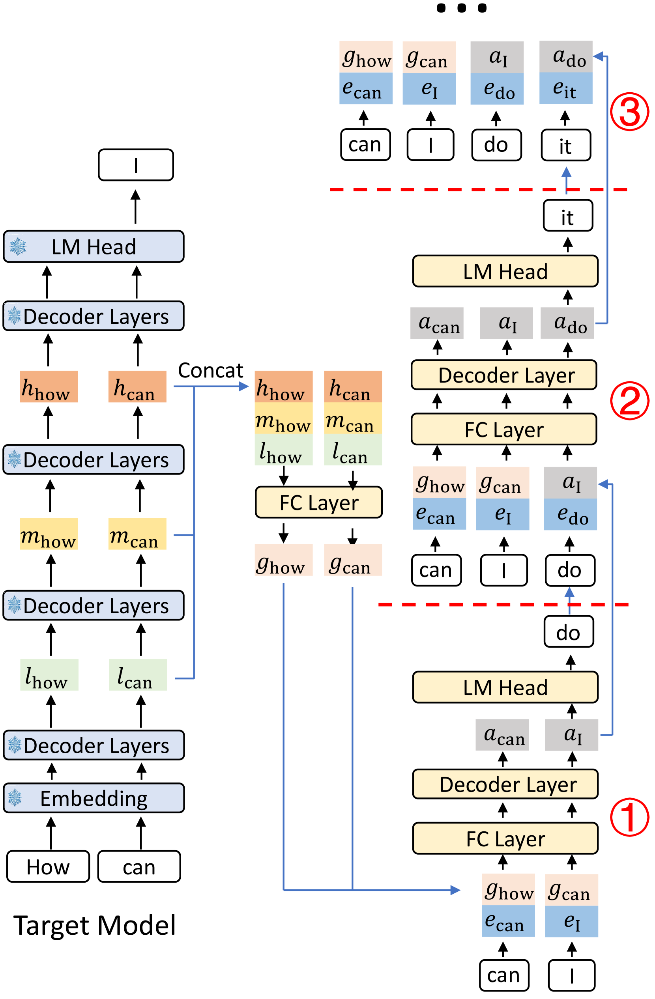
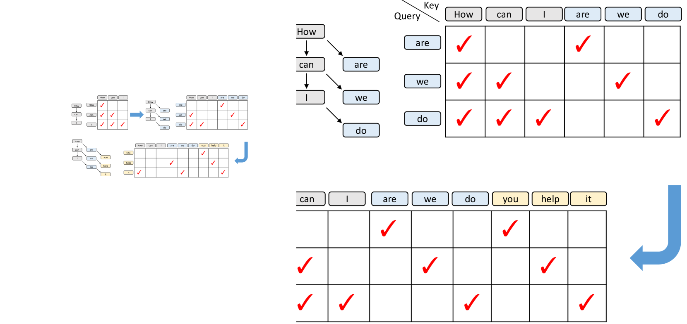
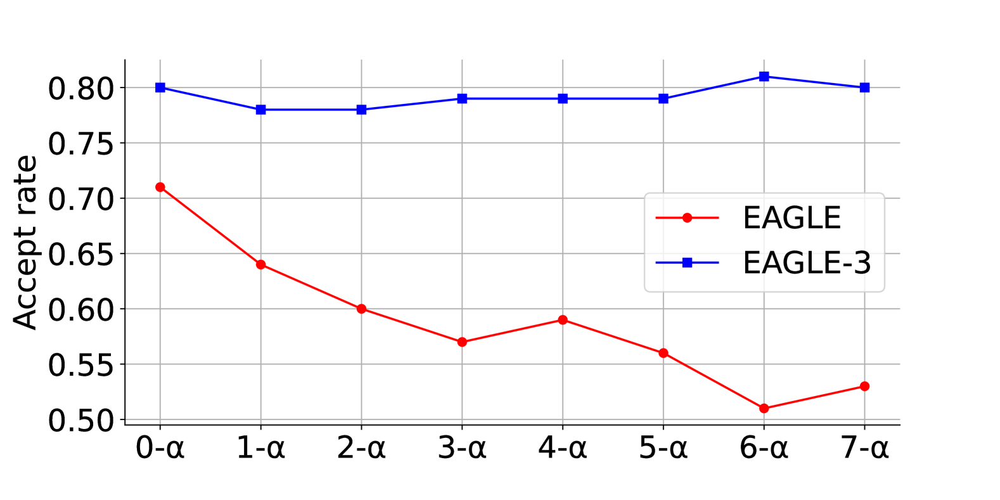

# EAGLE-3: Scaling up Inference Acceleration of Large Language Models via Training-Time Test

## 一、论文概述

| 项目 | 内容 |
|------|------|
| **标题** | EAGLE-3: Scaling up Inference Acceleration of Large Language Models via Training-Time Test |
| **作者** | Yuhui Li, Fangyun Wei, Chao Zhang, Hongyang Zhang |
| **机构** | Microsoft Research, Peking University |
| **论文** | https://arxiv.org/abs/2503.01840v3 |
| **代码** | https://github.com/SafeAILab/EAGLE |
| **发布** | 2025-03-03 |
| **版本** | v3 (最新版本) |

## 二、核心思想

### 问题定义

现代大语言模型（LLM）的自回归生成特性使其推理速度慢且成本高昂。投机解码（Speculative Sampling）已被证明是解决此问题的有效方案。EAGLE 系列方法通过在特征级进行自回归，复用目标模型的顶层特征，取得了比传统投机解码更好的效果。

然而，EAGLE 和 EAGLE-2 存在两个关键局限：

1. **特征预测约束**：草稿模型需要拟合目标模型的顶层特征，导致误差累积
2. **单层特征限制**：只使用目标模型最后一层的特征，忽略了其他层的丰富语义信息

### 解决方案概述

**EAGLE-3** 提出了两个核心创新：

1. **训练时测试（Training-Time Test）**：移除特征预测约束，让草稿模型直接预测token，而不是拟合目标模型的特征
2. **多层特征融合**：融合目标模型的低、中、高层特征，提供更丰富的语义信息

**关键洞察**：
- 特征预测约束限制了草稿模型的表达能力
- 不同层的特征捕获不同层次的语义信息
- 训练时模拟推理过程可以让草稿模型学习如何在投机解码场景下工作

## 三、技术架构

### 推理流程

EAGLE-3 的推理流程与 EAGLE 类似，交替进行草稿生成和验证阶段。区别在于草稿生成阶段：

**示例**：假设前缀为 "How can"

1. **预填充阶段**：目标模型执行前向传播生成下一个token "I"，同时记录低、中、高层特征序列 l, m, h
2. **特征融合**：将 k 维的 l, m, h 拼接成 3k 维向量，通过全连接层降维到 k，得到融合特征 g
3. **草稿生成**：
   - Step 1：输入 g_how 和 g_can，草稿模型生成输出 a_I
   - Step 2：输入 a_I 和 e_do（采样token的embedding），生成 a_do
   - Step 3：输入 a_do 和 e_it，生成 a_it
   - 后续步骤类似

### 草稿模型架构

**核心组件**：
- **特征融合层**：全连接层，将 3k 维特征降维到 k 维
- **单层 Transformer 解码器**：核心草稿模型
- **LM Head**：输出层，生成token分布

**输入格式**：
- 第一步：使用目标模型的融合特征 g
- 后续步骤：使用草稿模型自身的输出 a + token embedding e

### 训练时测试（Training-Time Test）

**核心思想**：在训练阶段模拟推理时的投机解码过程

**训练流程**：

1. **原始训练步**：标准的自回归训练，注意力掩码为下三角矩阵
2. **模拟测试步**：
   - 草稿模型生成预测 token
   - 将预测 token 反馈给草稿模型作为输入
   - 调整注意力掩码以反映树状上下文关系

**注意力掩码调整**：
- 所有注意力掩码都是对角的，除了当原始训练数据作为 key 时
- 使用向量点积计算注意力分数，避免矩阵乘法的计算浪费

### 与 EAGLE 和 HASS 的区别

| 特性 | EAGLE | HASS | EAGLE-3 |
|------|-------|------|---------|
| **输入** | 顶层特征 f | 顶层特征 f | 多层融合特征 g |
| **输出约束** | 拟合顶层特征 | 拟合顶层特征 | 直接预测 token |
| **损失函数** | 特征预测损失 | 特征预测损失 | 仅 token 预测损失 |
| **误差累积** | 存在 | 缓解但未消除 | 消除 |
| **表达能力** | 受限 | 受限 | 更强 |

**关键区别**：
- EAGLE-3 不再要求草稿模型的输出拟合目标模型的顶层特征
- 移除特征预测损失，避免误差累积
- 输入完全自由，可以使用多层特征融合

## 四、核心公式

### 特征融合

$$g = \text{FC}([l; m; h])$$

其中：
- $l$：低层特征（k 维）
- $m$：中层特征（k 维）
- $h$：高层特征（k 维）
- $[l; m; h]$：拼接后的 3k 维向量
- $\text{FC}$：全连接层，将 3k 维降维到 k 维

### 草稿模型预测

**第一步**：
$$a_I = \text{DraftModel}([g_{\text{how}}; g_{\text{can}}])$$

**后续步骤**：
$$a_{t+1} = \text{DraftModel}([a_t; e_t])$$

其中：
- $a_t$：草稿模型在位置 t 的输出
- $e_t$：采样 token 的 embedding

### 损失函数

**EAGLE-3 的损失函数**：
$$\mathcal{L}_{\text{EAGLE-3}} = \mathcal{L}_{\text{CE}}$$

仅使用标准交叉熵损失，**不包含特征预测损失**。

**对比 EAGLE 的损失函数**：
$$\mathcal{L}_{\text{EAGLE}} = \mathcal{L}_{\text{CE}} + \lambda \cdot \mathcal{L}_{\text{fea}}$$

其中 $\mathcal{L}_{\text{fea}}$ 是特征预测损失。

### 接受率

**n-α 接受率**：当输入包含 n 个自预测值 a 时的接受率

$$\text{Acceptance Rate} = P(\text{accept } x_{t+1} | g_1, ..., g_i, a_{i+1}, ..., a_{i+n})$$

其中：
- $g$：目标模型的融合特征
- $a$：草稿模型的自预测值

## 五、实验结果

### 实验设置

**模型**：
- Vicuna 13B
- LLaMA-Instruct 3.1 8B
- LLaMA-Instruct 3.3 70B
- DeepSeek-R1-Distill-LLaMA 8B

**任务**：
- MT-bench（多轮对话）
- HumanEval（代码生成）
- GSM8K（数学推理）
- Alpaca（指令跟随）
- CNN/Daily Mail（摘要生成）

**训练数据**：
- ShareGPT（约 68K 条）
- UltraChat-200K（约 464K 条）
- OpenThoughts-114k-math（用于 DeepSeek-R1-Distill-LLaMA 8B）

**优化器**：AdamW，β₁=0.9, β₂=0.95，学习率 5e-5，梯度裁剪 0.5

### 主要结果

**温度=0（贪婪解码）**：

| 模型 | 方法 | MT-bench | HumanEval | GSM8K | Alpaca | CNN/DM | 平均 |
|------|------|----------|-----------|-------|--------|--------|------|
| Vicuna 13B | EAGLE | 3.07× | 3.58× | 3.08× | 3.03× | 2.49× | 3.05× |
| Vicuna 13B | EAGLE-2 | 4.26× | 4.96× | 4.22× | 4.25× | 3.40× | 4.22× |
| Vicuna 13B | **EAGLE-3** | **5.58×** | **6.47×** | **5.32×** | **5.16×** | **5.01×** | **5.51×** |
| LLaMA 3.1 8B | EAGLE-2 | 3.16× | 3.66× | 3.39× | 3.28× | 2.65× | 3.23× |
| LLaMA 3.1 8B | **EAGLE-3** | **4.40×** | **4.85×** | **4.48×** | **4.82×** | **3.65×** | **4.44×** |
| LLaMA 3.3 70B | EAGLE-2 | 2.83× | 3.12× | 2.83× | 3.03× | 2.44× | 2.85× |
| LLaMA 3.3 70B | **EAGLE-3** | **4.11×** | **4.79×** | **4.34×** | **4.30×** | **3.27×** | **4.12×** |
| DeepSeek-R1 8B | EAGLE-2 | 2.92× | 3.42× | 3.40× | 3.01× | 3.53× | 3.26× |
| DeepSeek-R1 8B | **EAGLE-3** | **4.05×** | **4.59×** | **5.01×** | **3.65×** | **3.52×** | **4.16×** |

**关键发现**：
- EAGLE-3 在所有任务和模型上都取得了最高的加速比
- 相比 EAGLE-2，EAGLE-3 提升 20%-40%
- 在 HumanEval（代码生成）任务上表现最好，最高达到 6.5× 加速
- 平均接受长度达到 6-7.5

### 接受率分析

**观察**：
- EAGLE-3 的接受率显著高于 EAGLE
- 随着草稿模型自预测输入的增加，EAGLE 的接受率显著下降
- EAGLE-3 的接受率几乎保持不变，证明了训练时测试的有效性

### 消融实验

| 方法 | MT-bench | GSM8K |
|------|----------|-------|
| EAGLE-2 | 3.16× (τ=4.05) | 3.39× (τ=4.24) |
| + 移除特征约束 | 3.82× (τ=5.37) | 3.77× (τ=5.22) |
| + 多层特征融合（EAGLE-3） | **4.40× (τ=6.13)** | **4.48× (τ=6.23)** |

**消融结论**：
- 移除特征预测约束：提升 0.66×（MT-bench）
- 多层特征融合：再提升 0.58×（MT-bench）
- 两者结合：总提升 1.24×（MT-bench）

### 生产环境性能

**SGLang 框架（H100 GPU，LLaMA 3.1 8B）**：

| 批大小 | EAGLE | EAGLE-3 |
|--------|-------|---------|
| 2 | 1.40× | 1.81× |
| 4 | 1.38× | 1.82× |
| 8 | 1.23× | 1.62× |
| 16 | 1.02× | 1.48× |
| 24 | 0.93× | 1.39× |
| 32 | 0.94× | 1.32× |
| 48 | 0.88× | 1.38× |
| 56 | 0.99× | 1.34× |
| 64 | 0.99× | 1.38× |

**关键发现**：
- EAGLE 在批大小 24 时开始降低吞吐量
- EAGLE-3 在批大小 64 时仍能提升 38% 吞吐量
- EAGLE-3 的大批次性能显著优于 EAGLE

**vLLM 框架（A100 GPU，LLaMA 3.1 8B）**：

| 批大小 | EAGLE | EAGLE-3 |
|--------|-------|---------|
| 2 | 1.30× | 1.75× |
| 4 | 1.25× | 1.68× |
| 8 | 1.21× | 1.58× |
| 16 | 1.10× | 1.49× |
| 24 | 1.03× | 1.42× |
| 32 | 0.93× | 1.36× |
| 48 | 0.82× | 1.21× |
| 56 | 0.71× | 1.01× |

**单卡吞吐量（H100，批大小=1）**：

| 方法 | 吞吐量 |
|------|--------|
| SGLang（无投机） | 158.34 tokens/s |
| SGLang + EAGLE-2 | 244.10 tokens/s |
| SGLang + EAGLE-3 | 373.25 tokens/s |

EAGLE-3 相比 EAGLE-2 提升 53% 吞吐量。

## 六、核心创新总结

| 创新点 | 说明 | 优势 |
|--------|------|------|
| **训练时测试** | 训练阶段模拟推理过程 | 草稿模型学习适应投机解码场景 |
| **移除特征预测** | 不再拟合目标模型特征 | 消除误差累积，增强表达能力 |
| **多层特征融合** | 融合低、中、高层特征 | 更丰富的语义信息 |
| **无特征预测损失** | 仅使用交叉熵损失 | 发现新的缩放定律 |

## 七、技术影响

### 缩放性提升

EAGLE-3 解决了 EAGLE 系列的缩放性问题：
- 70B 模型上达到 4.12× 加速（vs EAGLE-2 的 2.85×）
- 随模型规模增大，加速比提升更显著

### 生产环境适用性

EAGLE-3 在大批次场景下仍能保持显著加速：
- SGLang：批大小 64 时仍提升 38%
- vLLM：批大小 56 时仍提升 1%
- EAGLE 在大批次时反而降低性能

### 推理成本降低

对于推理密集型模型（如 DeepSeek-R1）：
- GSM8K 任务上达到 5.01× 加速
- 显著降低推理成本

## 八、局限性

1. **GPU 限制**：由于 GPU 资源限制，未能在 405B 和 671B 模型上测试
2. **训练开销**：训练时测试需要额外的训练计算
3. **内存占用**：多层特征融合增加了内存使用

## 九、参考资源

### 论文

- **EAGLE-3**: https://arxiv.org/abs/2503.01840v3
- **EAGLE**: https://arxiv.org/abs/2401.15077
- **EAGLE-2**: https://arxiv.org/abs/2406.16858

### 代码

- **GitHub**: https://github.com/SafeAILab/EAGLE

### 相关工作

- **Speculative Decoding**: Leviathan et al., 2023
- **Medusa**: Cai et al., 2024
- **Lookahead Decoding**: Fu et al., 2024
- **HASS**: Zhang et al., 2024

### 应用框架

- **SGLang**: https://github.com/sgl-project/sglang
- **vLLM**: https://github.com/vllm-project/vllm
