# Event Tensor: A Unified Abstraction for Compiling Dynamic Megakernel

## 一、论文概述

| 项目 | 内容 |
|------|------|
| **标题** | Event Tensor: A Unified Abstraction for Compiling Dynamic Megakernel |
| **作者** | Hongyi Jin, Bohan Hou, Guanjie Wang, Ruihang Lai, Jinqi Chen, Zihao Ye, Yaxing Cai, Yixin Dong, Xinhao Cheng, Zhihao Zhang, et al. (21 authors) |
| **机构** | - |
| **论文** | https://arxiv.org/abs/2604.13327 |
| **代码** | - |
| **发布** | 2026-04-14 |
| **许可** | - |
| **领域** | cs.DC (Distributed, Parallel, and Cluster Computing) |

## 二、核心思想

### 问题定义

现代 GPU 工作负载，特别是大语言模型（LLM）推理，受到内核启动开销和粗粒度同步的限制，阻碍了内核间并行性。

现有系统的两个主要瓶颈：
1. **内核启动开销**：每个内核启动引入 5-10μs 延迟，最快内核仅需 2μs
2. **内核边界同步**：连续内核之间的隐式同步阻止了细粒度并行

虽然近期的 megakernel 技术将多个算子融合为单个持久内核以消除启动间隙，但在处理动态形状和数据依赖计算时遇到困难。

### 解决方案概述

**Event Tensor** 是一种统一的编译器抽象，用于动态 megakernels：
- 编码平铺任务之间的依赖关系
- 为形状和数据依赖的动态性提供一等支持
- 支持静态和动态调度变换

**Event Tensor Compiler (ETC)** 基于此抽象生成高性能持久内核。

### 核心成果

- 达到 SOTA LLM 服务延迟
- 显著减少系统预热开销
- 支持动态形状（无需重编译）
- 支持数据依赖动态性（MoE 等）

## 三、技术架构

### GPU 调度模型对比

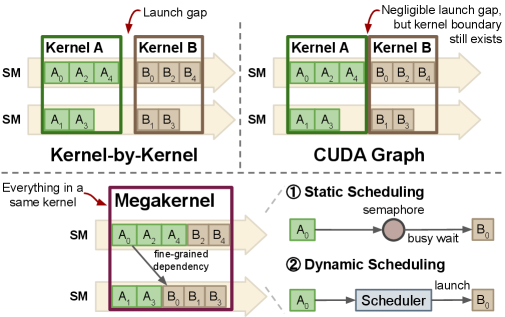

*Figure 1: Different GPU scheduling models. Kernel-by-kernel and CUDA Graph scheduling models enforce a coarse-grained sequential execution. Megakernels break operations into smaller tasks, achieving inter-kernel parallelism.*

### Event Tensor 抽象概览

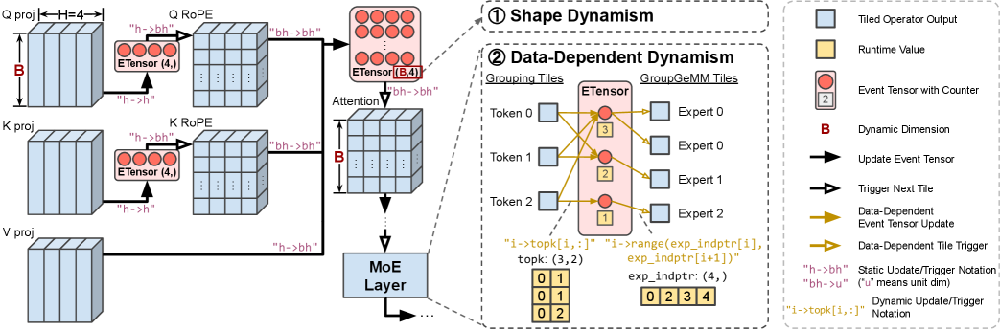

*Figure 2: Event Tensor abstraction overview. A computation graph is partitioned into tiled operators (tasks), and the Event Tensor captures fine-grained dependencies between tasks.*

### 核心公式

#### Event Tensor 操作

**Event Tensor** 是一个多维结构，元素代表事件（任务集完成）：

- `E[i].notify()`：信号任务完成
- `E[i].wait()`：阻塞直到事件触发
- 动态调度中，事件还可以触发依赖任务

**初始等待计数**：记录依赖任务数量

#### 程序结构

**Device Function**：定义在 GPU 上并行启动的任务网格
- 每个启动由多维坐标参数化
- 每个坐标标识在流式多处理器（SM）上执行的任务 tile

**Graph Function**：表示计算图
- 包含 call_device 调用
- 显式启动设备函数
- 包含数据张量和 Event Tensor

**依赖关系**：Producer Task → Event → Consumer Task

### 形状动态性

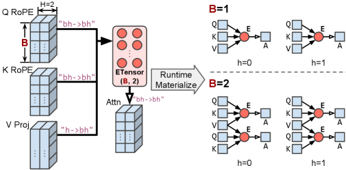

*Figure 4: Event Tensor handles shape dynamism with symbolic-shape tensors that define a template for dependency graphs.*

**关键特性**：
- 符号形状张量定义依赖图模板
- 运行时用具体形状值实例化
- 无需重编译或重复图捕获
- 支持不同批大小（如 1×2 或 2×2 图）

### 数据依赖动态性

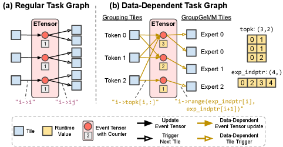

*Figure 5: Event Tensor handles data-dependent dynamism by allowing runtime tensors to define irregular task graphs.*

**MoE 示例**：
- `topk` 和 `exp_indptr` 运行时张量定义不规则任务图
- 数据依赖的事件更新和任务触发
- 支持动态专家路由

### 核心组件

| 组件 | 说明 | 关键参数 |
|------|------|----------|
| Event Tensor | 依赖编码 | 多维事件结构 |
| Device Function | 任务定义 | SM 网格并行 |
| Graph Function | 计算图 | 数据+事件张量 |
| Static Scheduler | 预计算调度 | SM 任务队列 |
| Dynamic Scheduler | 运行时调度 | Push-Pop 机制 |

### 静态调度变换

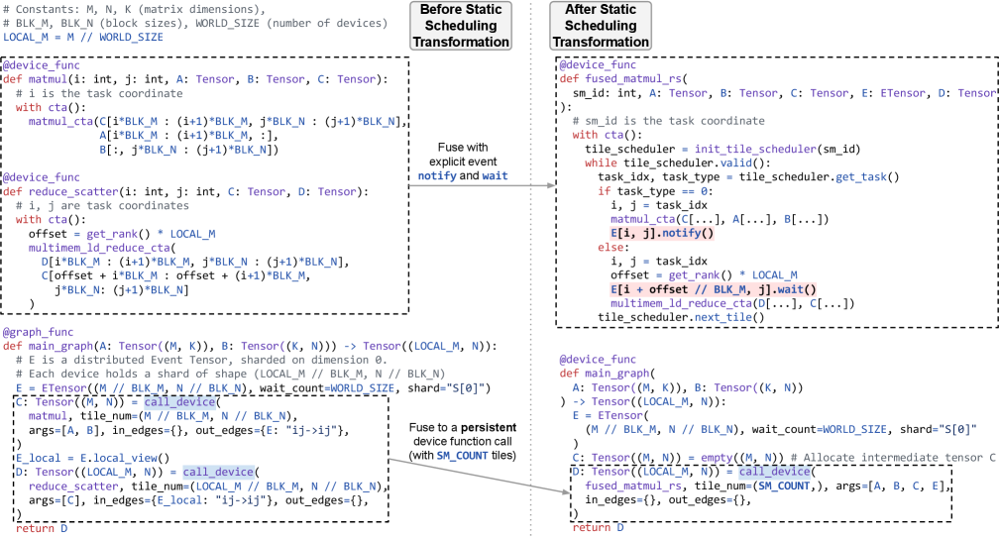

*Figure 6: GEMM + Reduce-Scatter before and after static scheduling transformation.*

**静态调度三步**：
1. 在主机上构建每 SM 执行队列
2. 生成持久主循环
3. 将 Event Tensor 依赖降低为 notify() 和 wait() 调用

### Notify-and-Wait 机制

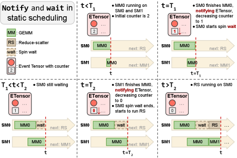

*Figure 7: Notify-and-wait mechanism for static scheduling.*

**示例**：GEMM (MM) + Reduce-Scatter (RS)
- 每个 RS 任务依赖两个 MM 任务
- 初始计数器为 2
- MM 完成时 notify，减少计数器
- 计数器为 0 时，RS 从自旋等待中释放

### 动态调度变换

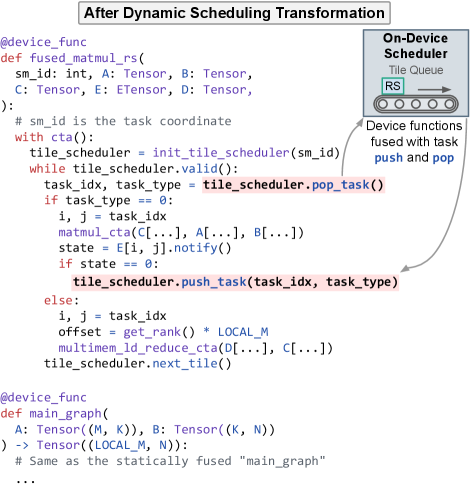

*Figure 8: GEMM + Reduce-Scatter after dynamic scheduling transformation.*

### Push-and-Pop 机制

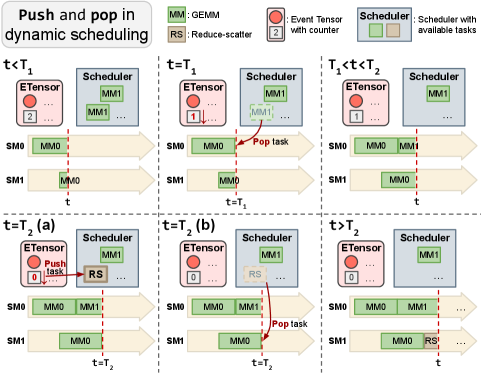

*Figure 9: Push-and-pop mechanism for dynamic scheduling.*

**动态调度**：
- 事件触发时，原子地将消费者任务推入调度器
- 可用 SM 原子地弹出就绪任务并执行
- 适合执行时间不可预测的工作负载

### 运行时架构对比

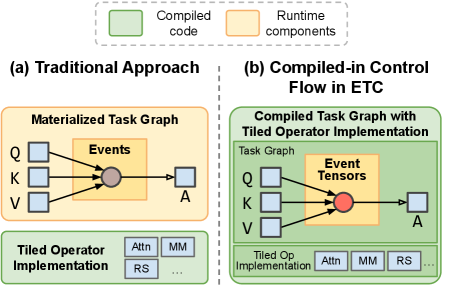

*Figure 10: Comparison of runtime architectures.*

**关键区别**：
- 传统运行时：任务图在内存中物化
- ETC：将调度逻辑编译为 megakernels，无需运行时任务图物化

## 四、核心创新

| 创新点 | 说明 | 理论/实验依据 |
|--------|------|---------------|
| Event Tensor 抽象 | 统一的依赖编码 | 支持形状和数据依赖动态性 |
| 符号形状 | 无需重编译 | 运行时实例化不同形状 |
| 静态调度 | 预计算 SM 队列 | 最小同步开销 |
| 动态调度 | Push-Pop 机制 | 负载均衡不可预测工作负载 |
| 编译器驱动 | ETC 编译器 | 系统性生成持久内核 |
| 最小运行时 | 无任务图物化 | 减少运行时开销 |

## 五、代码实现分析

### 技术栈

- **编译器框架**：Apache TVM
- **GPU**：NVIDIA B200 (8 GPUs)
- **CUDA**：CUDA 13.0
- **编程模型**：PTX, CUDA
- **基线**：cuBLAS, NCCL, Triton Distributed, cuBLASMp

### 关键实现细节

1. **Event Tensor 实现**：
   - 多维事件结构
   - 计数器-based 依赖
   - 原子操作支持

2. **静态调度**：
   - 预计算执行队列
   - 持久主循环
   - Notify-Wait 同步

3. **动态调度**：
   - On-GPU 任务调度器
   - Push-Pop 原子操作
   - 负载均衡

4. **编译流程**：
   - TVM 编译器 pass
   - 图变换
   - 代码生成

## 六、实验结果

### GEMM + Reduce-Scatter 性能

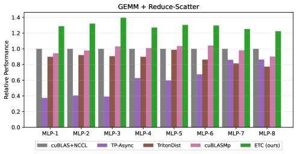

*Figure 11: Performance results of GEMM + Reduce-Scatter on 8 B200s with dynamic scheduler.*

**实验设置**：
- 8 NVIDIA B200 GPUs
- NVLink 连接
- TP size = 8, tokens = 8192

**结果**：
- 比 cuBLAS+NCCL 基线快 **1.40×**
- 动态调度器处理网络竞争和波动
- 在大模型配置下改进更明显

### All-Gather + GEMM 性能

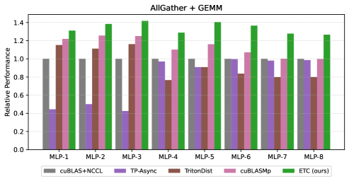

*Figure 12: Performance results of All-Gather + GEMM on 8 B200s with static scheduler.*

**结果**：
- 静态调度器用于 DMA-based All-Gather
- 预计算调度有效重叠通信和计算
- 比 cuBLAS+NCCL 快 **1.40×**

### MoE 层性能

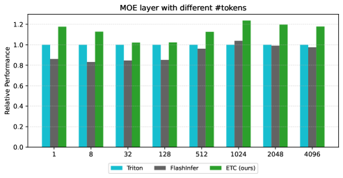

*Figure 13: Performance results of MoE layer on a single B200.*

**结果**：
- 支持数据依赖动态性
- 不规则任务图高效执行
- 优于现有 megakernel 框架

### 端到端服务性能

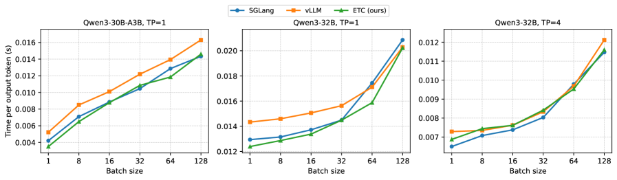

*Figure 14: End-to-end performance of model serving on Qwen3-30B-A3B and Qwen3-32B.*

**实验设置**：
- 模型：Qwen3-30B-A3B (MoE), Qwen3-32B (Dense)
- 低批大小服务场景

**结果**：
- 达到 SOTA 服务延迟
- 显著减少预热开销
- 在动态场景下表现优异

### 编译流程

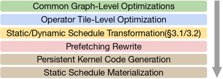

*Figure 15: End-to-end compilation pipeline in ETC.*

### 原始内核性能

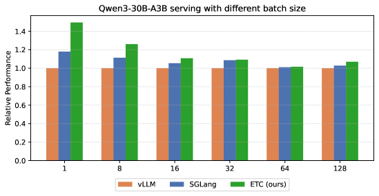

*Figure 16: Raw kernel relative performance results of Qwen-30B-A3B on a single B200.*

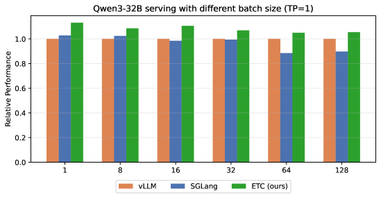

*Figure 17: Raw kernel relative performance results of Qwen-32B on a single B200.*

### 与其他方法对比

| 方法 | 动态形状 | 数据依赖 | 内核融合 | 预热开销 |
|------|----------|----------|----------|----------|
| PyTorch | 不支持 | 不支持 | 无 | 无 |
| CUDA Graph | 有限 | 不支持 | 无 | 高 |
| Triton Distributed | 有限 | 有限 | 有 | 中 |
| **ETC** | **一等支持** | **一等支持** | **有** | **低** |

## 七、相关工作

### GPU 调度优化

- **CUDA Graph**：捕获和重放内核序列
- **Megakernel**：融合多个算子为单个持久内核
- **Persistent Kernel**：SM 持续执行任务

### 编译器框架

- **Apache TVM**：深度学习编译器
- **Triton**：GPU 编程语言
- **MLIR**：多级中间表示

### LLM 推理优化

- **vLLM**：高效推理系统
- **SGLang**：结构化生成
- **TensorRT-LLM**：NVIDIA 推理优化

### 分布式推理

- **Tensor Parallelism**：张量并行
- **Pipeline Parallelism**：流水线并行
- **Expert Parallelism**：专家并行

## 八、总结

### 核心贡献

1. **Event Tensor 抽象**：统一的依赖编码，支持形状和数据依赖动态性
2. **静态调度变换**：预计算 SM 队列，最小同步开销
3. **动态调度变换**：Push-Pop 机制，负载均衡不可预测工作负载
4. **ETC 编译器**：系统性生成高性能持久内核
5. **最小运行时**：无任务图物化，减少运行时开销

### 技术影响

- **LLM 服务延迟**：达到 SOTA
- **预热开销**：显著减少
- **动态性支持**：形状和数据依赖
- **编译器驱动**：系统性优化

### 局限性

1. **编译复杂度**：需要编译器支持
2. **调试难度**：megakernel 调试困难
3. **硬件依赖**：主要在 B200 上验证
4. **适用范围**：主要针对 LLM 推理

### 未来方向

- 自动生成 Event Tensor 任务图
- 支持更多硬件架构
- 扩展到其他工作负载
- 更高级的编译器优化

## 九、参考资源

- **论文**: https://arxiv.org/abs/2604.13327
- **编译器框架**: Apache TVM
- **GPU**: NVIDIA B200
- **基线**: cuBLAS, NCCL, Triton Distributed, cuBLASMp
- **模型**: Qwen3-30B-A3B, Qwen3-32B
- **应用场景**: LLM 推理, MoE, Tensor Parallelism
