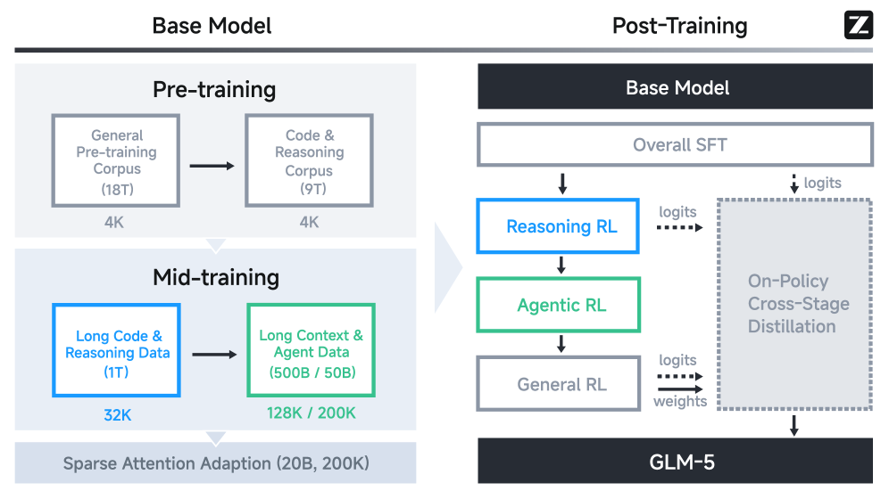
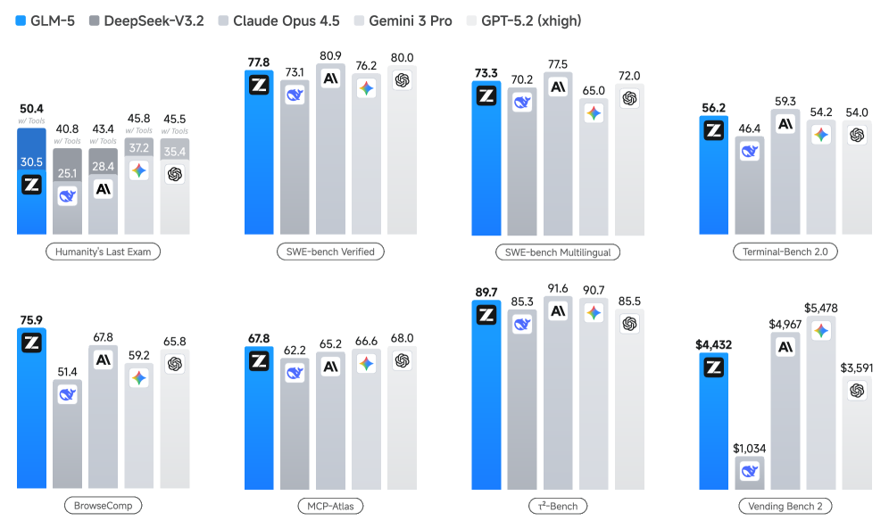
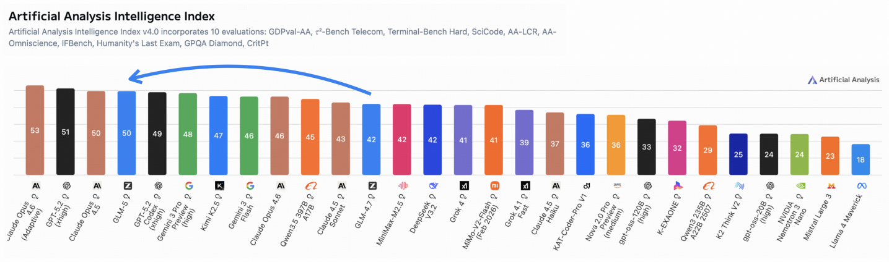
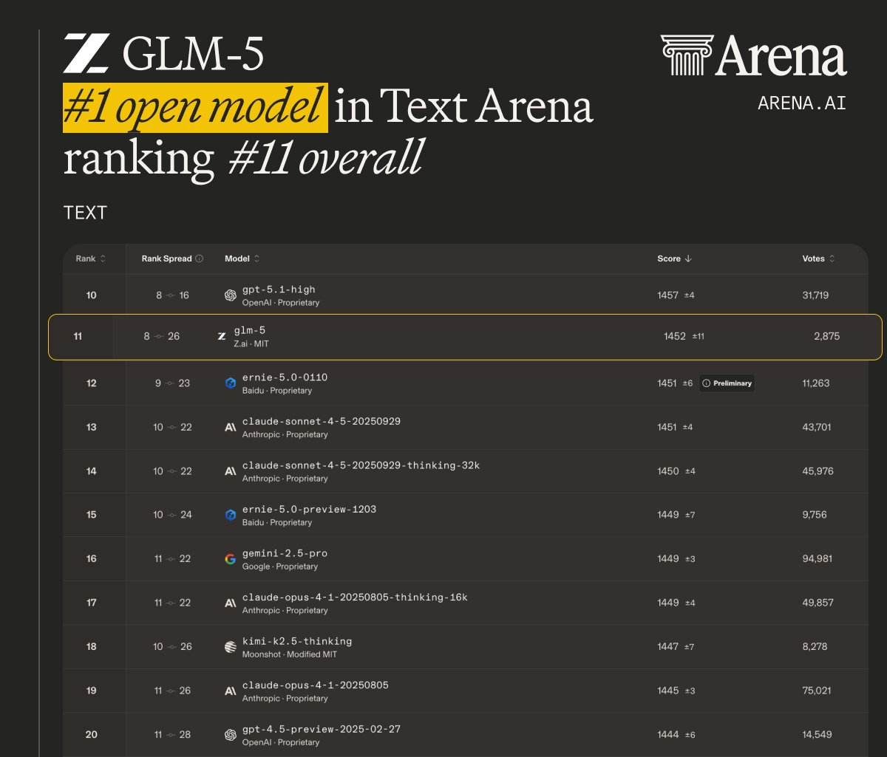
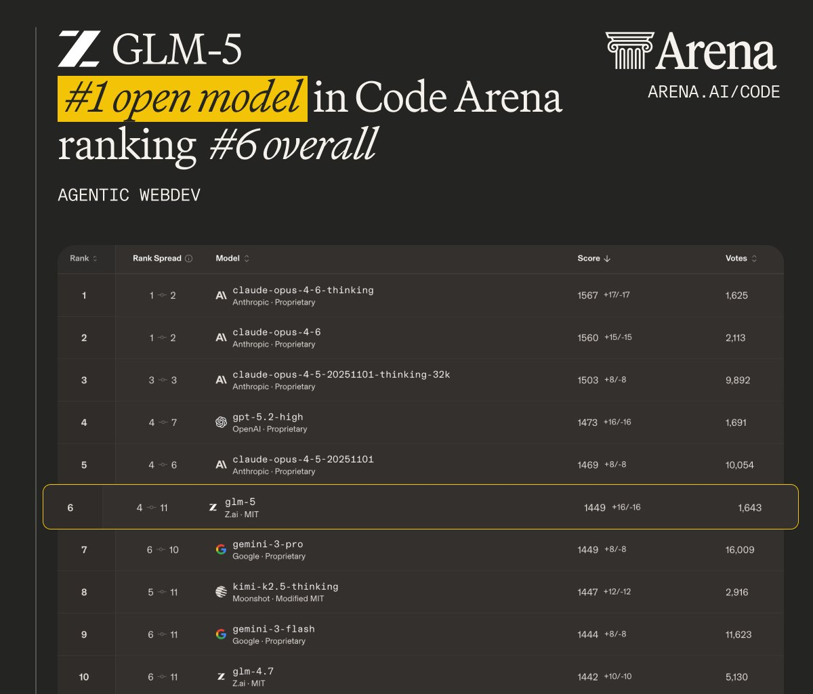
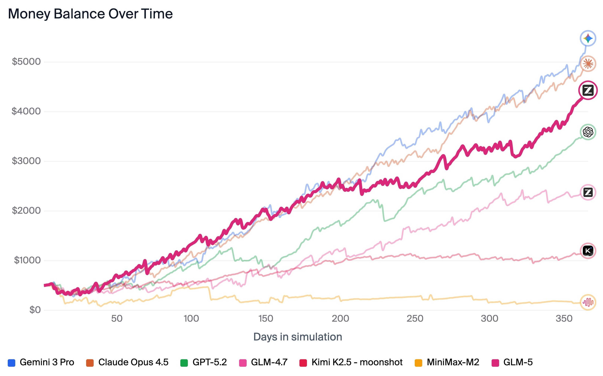
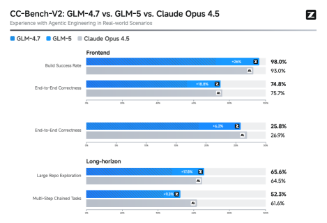
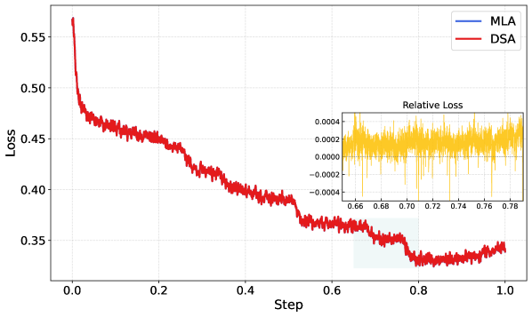

# GLM-5: 从Vibe Coding到Agentic Engineering

## 一、论文概述

| 项目 | 内容 |
|------|------|
| **标题** | GLM-5: from Vibe Coding to Agentic Engineering |
| **作者** | GLM-5 Team (Zhipu AI & Tsinghua University) |
| **机构** | 智谱AI & 清华大学 |
| **论文** | https://arxiv.org/abs/2602.15763v2 |
| **代码** | https://github.com/zai-org/GLM-5 |
| **发布** | 2026年2月24日 |
| **许可** | CC BY 4.0 |

## 二、核心思想

GLM-5是智谱AI发布的下一代基础模型，旨在将"vibe coding"（人类提示AI写代码）的范式转变为"agentic engineering"（AI代理自主完成软件工程任务）。该模型在前代GLM-4.5的ARC（Agentic, Reasoning, Coding）能力基础上，通过多项技术创新实现了性能和效率的双重突破。

### 问题定义

随着大语言模型从被动的知识库转变为主动的问题解决者，计算成本和现实世界适应性——特别是在复杂软件工程场景中——成为主要瓶颈。GLM-5旨在解决这些挑战，实现真正的端到端软件工程自动化。

### 解决方案概述

GLM-5采用四大核心技术：
1. **DSA（DeepSeek Sparse Attention）**：动态分配注意力资源，降低计算开销
2. **异步强化学习基础设施**：解耦生成与训练，最大化GPU利用率
3. **异步Agent RL算法**：从复杂的长时程交互中持续学习
4. **中国芯片全栈适配**：支持7大主流国产芯片平台

## 三、技术架构

### 整体框架图

GLM-5的训练流程分为以下阶段：
- **基础模型训练**：27万亿token语料库，优先处理代码和推理数据
- **中期训练**：逐步扩展上下文长度从4K到200K
- **后训练**：Reasoning RL → Agentic RL → General RL的序列强化学习
- **跨阶段蒸馏**：防止灾难性遗忘，保持推理能力

### 核心公式

#### 推理RL损失函数

GLM-5的推理RL基于GRPO算法，融入IcePop技术解决训练-推理分布不匹配问题：

$$
\mathcal{L}(\theta) = -\mathbb{E}_{x \sim \mathcal{D}, \{y_i\}_{i=1}^G \sim \pi^{\text{infer}}_{\theta_{\text{old}}}(\cdot|x)} \left[ \frac{1}{G} \sum_{i=1}^G \frac{1}{|y_i|} \sum_{t=1}^{|y_i|} \text{pop}(\rho_{i,t}, 1/\beta, \beta) \cdot \min(r_{i,t} \hat{A}_{i,t}, \text{clip}(r_{i,t}, 1-\epsilon_{\text{low}}, 1+\epsilon_{\text{high}}) \hat{A}_{i,t}) \right]
$$

其中训练-推理不匹配比率为：
$$\rho_{i,t} = \frac{\pi_{\theta_{\text{old}}}^{\text{train}}(y_{i,t}|x, y_{i,<t})}{\pi_{\theta_{\text{old}}}^{\text{infer}}(y_{i,t}|x, y_{i,<t})}$$

#### 异步RL的直接双侧重要性采样

对于异步RL训练，采用token级裁剪机制：

$$r_t(\theta) = \exp(\log \pi_\theta(a_t|s_t) - \log \pi_{\text{rollout}}(a_t|s_t))$$

校准函数：
$$f(x; \epsilon_l, \epsilon_h) = \begin{cases} x, & \text{if } 1-\epsilon_l < x < 1+\epsilon_h \\ 0, & \text{otherwise} \end{cases}$$

#### 跨阶段蒸馏

为防止多阶段RL导致的能力退化，采用在线策略蒸馏：

$$\hat{A}_{i,t} = \text{sg}\left[\log \frac{\pi_{\theta_{\text{teacher}}}^{\text{infer}}(y_{i,t}|x, y_{i,<t})}{\pi_\theta^{\text{train}}(y_{i,t}|x, y_{i,<t})}\right]$$

### 模型组件

| 组件 | 说明 | 关键参数 |
|------|------|----------|
| **总参数量** | 744B参数 | 256个专家，80层 |
| **激活参数** | 40B | MoE架构 |
| **上下文长度** | 202,752 tokens | 支持超长文档和代码库 |
| **训练数据** | 28.5万亿tokens | 包含代码、推理、代理数据 |
| **注意力机制** | MLA-256 + DSA | 混合稀疏注意力 |
| **多token预测** | 3层MTP共享参数 | 提升推测解码接受率 |

### 训练流程

#### 预训练阶段

1. **基础预训练**：27万亿tokens，优先代码和推理
2. **中期训练**：
   - 32K上下文：1万亿tokens
   - 128K上下文：5000亿tokens
   - 200K上下文：500亿tokens
3. **DSA训练**：从密集模型继续训练，1000步warmup + 20B tokens稀疏适应

#### 后训练阶段

1. **SFT（监督微调）**：
   - 三大类别：通用对话、推理、编码&代理
   - 支持三种思维模式：交错思维、保留思维、轮级思维

2. **Reasoning RL**：
   - 基于GRPO + IcePop
   - 混合领域训练：数学、科学、代码、工具集成推理
   - 超参数：β=2, ε_low=0.2, ε_high=0.28

3. **Agentic RL**：
   - 完全异步解耦RL框架
   - Token-in-Token-out（TITO）网关
   - 直接双侧重要性采样
   - 支持10,000+可验证训练环境

4. **General RL**：
   - 三维度优化：基础正确性、情感智能、任务特定质量
   - 混合奖励系统：规则奖励、结果奖励模型、生成奖励模型
   - 人类在环风格对齐

5. **跨阶段蒸馏**：
   - 使用前序阶段的最终检查点作为教师模型
   - 防止能力退化，保持推理优势

## 四、核心创新

| 创新点 | 说明 | 理论/实验依据 |
|--------|------|---------------|
| **DSA稀疏注意力** | 动态分配注意力资源，降低1.5-2×计算成本 | RULER基准测试：128K上下文仅下降0.35分 |
| **MLA-256改进** | 增加注意力头维度，减少解码计算 | 保持训练性能，解码速度提升 |
| **MTP参数共享** | 3层MTP共享参数，提升接受率 | 接受长度2.76 vs DeepSeek-V3.2的2.55 |
| **异步RL基础设施** | 解耦训练与推理引擎 | 支持1000+并发rollout |
| **TITO网关** | Token-in-Token-out避免重分词不匹配 | 保持动作级精确对应 |
| **DP感知路由** | 最大化KV缓存重用 | 长上下文推理效率提升 |
| **层次化上下文管理** | Keep-recent-k + Discard-all混合策略 | BrowseComp准确率：55.3% → 75.9% |

## 五、代码实现分析

### 训练基础设施：slime框架

GLM-5使用slime作为统一后训练基础设施，主要特性：

1. **高度可定制rollout**：支持多轮交互、工具调用、环境反馈
2. **基于服务器的rollout执行**：通过HTTP API解耦rollout逻辑
3. **尾延迟优化**：
   - 无队列服务：多节点推理 + DP注意力
   - FP8 rollout + MTP减少尾延迟
   - Prefill-Decode解耦防止干扰
4. **心跳驱动容错**：自动故障检测和恢复

### 推理优化

- **INT4量化训练**：SFT阶段应用INT4 QAT
- **混合精度W4A8量化**：Attention和MLP用W8A8，MoE专家用W4A8
- **高性能融合核**：Lightning Indexer、Sparse Flash Attention、MLAPO
- **异步调度**：D2H采样拷贝与下一步准备重叠

## 六、实验结果

### 基准测试

#### 推理与通用能力

| 基准测试 | GLM-5 | GLM-4.7 | DeepSeek-V3.2 | Claude Opus 4.5 | Gemini 3 Pro | GPT-5.2 |
|---------|-------|---------|---------------|-----------------|--------------|---------|
| HLE | 30.5 | 24.8 | 25.1 | 28.4 | 37.2 | 35.4 |
| HLE (w/ Tools) | **50.4** | 42.8 | 40.8 | 43.4 | 45.8 | 45.5 |
| AIME 2026 I | 92.7 | 92.9 | 92.7 | 93.3 | 90.6 | - |
| HMMT Feb. 2025 | **97.9** | 97.1 | 92.5 | 92.9 | 97.3 | 99.4 |
| GPQA-Diamond | 86.0 | 85.7 | 82.4 | 87.0 | 91.9 | 92.4 |
| LongBench v2 | **64.5** | 59.1 | 59.8 | 64.4 | 68.2 | 59.8 |

#### 编码能力

| 基准测试 | GLM-5 | GLM-4.7 | DeepSeek-V3.2 | Claude Opus 4.5 | Gemini 3 Pro | GPT-5.2 |
|---------|-------|---------|---------------|-----------------|--------------|---------|
| SWE-bench Verified | 77.8 | 73.8 | 73.1 | 80.9 | 76.2 | 80.0 |
| SWE-bench Multilingual | 73.3 | 66.7 | 70.2 | 77.5 | 65.0 | 72.0 |
| Terminal-Bench 2.0 | 60.7† | 41.0 | 39.3 | 59.3 | 54.2 | 54.0 |

#### 代理能力

| 基准测试 | GLM-5 | GLM-4.7 | DeepSeek-V3.2 | Claude Opus 4.5 | Gemini 3 Pro | GPT-5.2 |
|---------|-------|---------|---------------|-----------------|--------------|---------|
| BrowseComp | 62.0 | 52.0 | 51.4 | 37.0 | 37.8 | - |
| BrowseComp (w/ CM) | **75.9** | 67.5 | 67.6 | 57.8 | 59.2 | 65.8 |
| τ²-Bench | 89.7 | 87.4 | 85.3 | 91.6 | 90.7 | 85.5 |
| MCP-Atlas | 67.8 | 52.0 | 62.2 | 65.2 | 66.6 | 68.0 |
| Vending-Bench 2 | $4,432 | $2,377 | $1,034 | $4,967 | $5,478 | $3,591 |

### 与LMArena排名

GLM-5在LMArena Text Arena和Code Arena均排名第一开源模型，与Claude Opus 4.5和Gemini 3 Pro表现相当。

### 长时程任务

- **Vending-Bench 2**：GLM-5以$4,432的最终账户余额排名第一开源模型
- **CC-Bench-V2**：GLM-5在前端、后端和长时程任务上显著优于GLM-4.7

### 消融实验

#### DSA vs MLA

| 模型 | MQ-NIAH-128k | MV-NIAH-128k | SQuAD-128k | HotpotQA-128k |
|------|--------------|--------------|------------|---------------|
| MLA | 100.0 | 95.5 | 79.7 | 66.3 |
| DSA | 100.0 | 97.0 | 86.0 | 63.0 |

#### 注意力机制对比

| 方法 | RULER@64K | RULER@128K | MRCR@64K | MRCR@128K |
|------|-----------|------------|----------|-----------|
| 全注意力基线 | 85.35 | 75.28 | 36.53 | 35.39 |
| SWA Interleave | ↓19.41 | ↓30.35 | ↓6.50 | ↓6.56 |
| SWA Pattern | ↓1.63 | ↓5.69 | ↓1.51 | ↓1.81 |
| GDN | ↓8.59 | ↓11.28 | ↓4.81 | ↓5.17 |
| SimpleGDN | ↓3.59 | ↓8.25 | ↓3.50 | ↓4.12 |

## 七、相关工作

GLM-5与以下模型进行了对比：
- **DeepSeek-V3.2**：采用DSA稀疏注意力的MoE模型
- **Claude Opus 4.5**：Anthropic的闭源旗舰模型
- **Gemini 3 Pro**：Google的闭源模型
- **GPT-5.2 (xhigh)**：OpenAI的闭源模型
- **Kimi-K2.5**：月之暗面的开源模型

## 八、总结

### 核心贡献

1. **DSA稀疏注意力**：显著降低训练和推理成本，同时保持长上下文性能
2. **异步RL基础设施**：解耦生成与训练，大幅提升后训练效率
3. **异步Agent RL算法**：提升自主决策质量，从复杂长时程交互中学习
4. **中国芯片全栈适配**：支持7大主流国产芯片平台
5. **层次化上下文管理**：有效解决长上下文性能退化问题

### 技术影响

GLM-5标志着从"vibe coding"到"agentic engineering"的范式转变。它不仅是一个更强大的模型，更是下一代AI代理的高效、实用基础。通过开源发布，GLM-5将进一步推动高效、代理式通用智能的发展前沿。

### 局限性

1. **推理能力**：在某些数学竞赛（如AIME）上与前代模型相当，未显著超越
2. **上下文长度**：虽然支持200K，但在极端长上下文场景下仍有优化空间
3. **多模态能力**：论文主要关注文本和代码，多模态能力未详细讨论
4. **部署成本**：744B参数模型需要大量计算资源

## 九、参考资源

- **论文**: https://arxiv.org/abs/2602.15763v2
- **代码**: https://github.com/zai-org/GLM-5
- **HuggingFace**: https://huggingface.co/zai-org
- **LMArena**: https://lmarena.ai
- **Artificial Analysis**: https://artificialanalysis.ai

## 关键图片索引

| 图片 | 说明 | 文件名 |
|------|------|--------|
| Figure 1 | ARC基准测试结果对比 | `arc-benchmarks.png` |
| Figure 2 | Artificial Analysis智能指数 | `intelligence-index.png` |
| Figure 3 | LMArena Text Arena排名 | `text-arena.jpeg` |
| Figure 3 | LMArena Code Arena排名 | `code-arena.jpeg` |
| Figure 4 | 长时程任务结果 | `vending-bench.jpeg`, `cc-bench-v2.png` |
| Figure 5 | 训练流程总览 | `architecture-overview.png` |
| Figure 6 | DSA训练曲线对比 | `dsa-training.png` |
| Figure 7 | 思维模式示意图 | `thinking-modes.png` |
| Figure 8 | 上下文管理策略对比 | `context-management.png` |
| Figure 9 | 奖励hack示例 | `reward-hacking.png` |
| Figure 10 | Agent-as-a-Judge评估流程 | `agent-judge.png` |
| Figure 11 | 通用能力对比 | `general-ability.png` |
