# Llumnix: Dynamic Scheduling for Large Language Model Serving

## 一、论文概述

| 项目 | 内容 |
|------|------|
| **标题** | Llumnix: Dynamic Scheduling for Large Language Model Serving |
| **作者** | Biao Sun, Ziming Huang, Hanyu Zhao, Wencong Xiao, Xinyi Zhang, Yong Li, Wei Lin |
| **机构** | Alibaba |
| **论文** | https://arxiv.org/abs/2406.03243 |
| **代码** | https://github.com/AlibabaPAI/llumnix |
| **发布** | 2024-06-05 |
| **许可** | - |
| **领域** | cs.AR (Hardware Architecture) |

## 二、核心思想

### 问题定义

LLM 推理服务是释放其潜力的关键。然而，高效的 LLM 服务仍然具有挑战性，因为请求在资源和延迟需求方面本质上是异构和不可预测的，这是由于多样化的应用和 LLM 的动态执行特性所致。

现有系统在处理这些特性方面存在根本性限制，导致以下问题：
1. **严重的排队延迟**：请求在队列中等待过长
2. **尾部延迟差**：P99 延迟远高于 P50
3. **SLO 违规**：无法满足服务水平目标

### 解决方案概述

Llumnix 是一个 LLM 服务系统，通过跨多个模型实例的运行时重新调度来应对异构和不可预测的请求。

核心思想：
- 类似于现代操作系统中跨 CPU 核心的上下文切换
- 重新调度请求以改善负载均衡和隔离
- 缓解资源碎片化
- 区分请求优先级和 SLO

### 核心成果

- 尾部延迟改善 **一个数量级**
- 高优先级请求加速 **最多 1.5×**
- 成本节省 **最多 36%**（同时保持相似尾部延迟）
- 近零停机时间的请求迁移

## 三、技术架构

### 重新调度场景

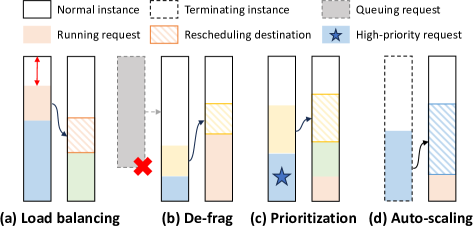

*Figure 1: Example rescheduling scenarios in Llumnix.*

### 排队与抢占

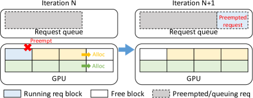

*Figure 2: Request queuing and preemption using continuous batching and dynamic memory allocation.*

### LLaMA-7B 中的请求抢占

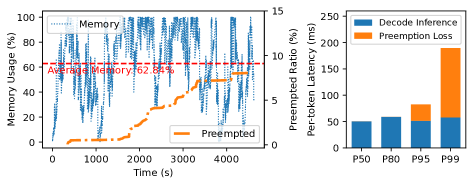

*Figure 3: Request preemptions in LLaMA-7B serving.*

**观察**：
- 8% 的请求被抢占
- P99 每 token 解码延迟比 P50 差 3.8×
- P99 请求的抢占损失占 70%
- P99 请求经历 50 秒的总抢占损失（被抢占两次）

### 解码延迟

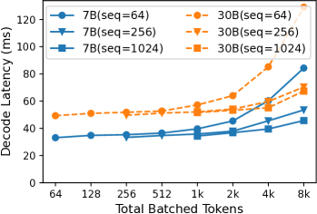

*Figure 4: Latencies of one decode step of LLaMA-7B and LLaMA-30B with different sequence lengths and batch sizes.*

**观察**：
- 解码速度随请求数量增加而下降
- 相同序列长度的差距高达 2.6×
- 请求之间存在性能干扰

### 内存碎片化

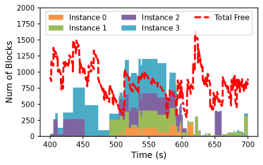

*Figure 5: Total free memory vs. demands of the head-of-line queuing requests across four LLaMA-7B instances.*

**问题**：
- 负载均衡导致内存碎片化
- 碎片化导致长输入的排队延迟
- prefill 阶段的外部碎片问题严重

### 核心设计

#### 1. 实时迁移机制

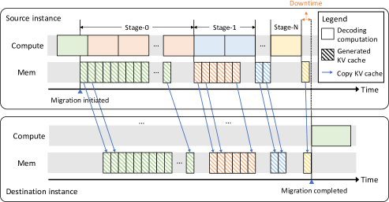

*Figure 6: Llumnix adopts multi-stage migration to overlap the computation and KV cache copying for minimal downtime.*

**关键洞察**：KV cache 是 append-only 的

**多阶段迁移**：
- 流水线化 KV cache 复制与解码计算
- 计算与通信重叠
- 近零停机时间

#### 2. 握手机制

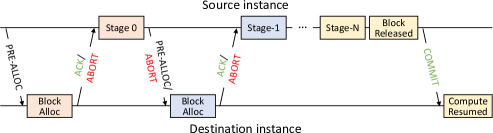

*Figure 7: Handshake during migration.*

**迁移协议**：
1. 源实例发送迁移请求
2. 目标实例确认
3. 开始多阶段迁移
4. 完成迁移

#### 3. 系统架构

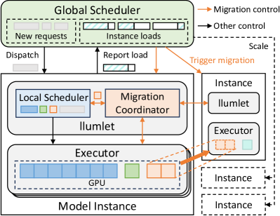

*Figure 8: Llumnix architecture.*

**组件**：
- **Global Scheduler**：全局调度决策
- **Local Scheduler**：本地调度执行
- **Migration Manager**：管理迁移过程
- **Inference Engine**：vLLM 推理引擎

#### 4. 虚拟使用量调度

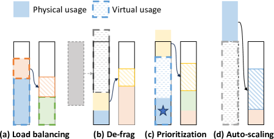

*Figure 9: Llumnix combines virtual usages with a load-balancing policy to unify multiple scheduling goals.*

**虚拟使用量**：
- 抽象不同调度目标
- 统一负载均衡、碎片整理、优先级区分
- 高效启发式调度策略

### 核心公式

#### 调度目标

**负载均衡**：最小化实例间负载差异
$$\min \sum_i (L_i - \bar{L})^2$$

**碎片整理**：最大化可用连续内存
$$\max \sum_i \text{ContiguousMemory}_i$$

**优先级区分**：最小化高优先级请求延迟
$$\min \sum_{r \in \text{HighPriority}} \text{Latency}(r)$$

#### 虚拟使用量

$$\text{VirtualUsage}_i = \alpha \cdot \text{MemoryUsage}_i + \beta \cdot \text{ComputeUsage}_i$$

统一不同调度目标的抽象。

### 核心组件

| 组件 | 说明 | 关键参数 |
|------|------|----------|
| Global Scheduler | 全局调度决策 | 集中式/分布式 |
| Local Scheduler | 本地调度执行 | 每实例 |
| Migration Manager | 管理迁移过程 | 多阶段迁移 |
| Inference Engine | vLLM 推理引擎 | 连续批处理 |
| Virtual Usage | 调度抽象 | 统一多目标 |

## 四、核心创新

| 创新点 | 说明 | 理论/实验依据 |
|--------|------|---------------|
| 请求实时迁移 | 跨实例迁移请求及 KV cache | 近零停机时间 |
| 多阶段迁移 | 流水线化复制与计算 | 消除迁移开销 |
| 虚拟使用量抽象 | 统一多调度目标 | 优雅整合多种场景 |
| 全局+本地调度 | 可扩展架构 | 支持大规模部署 |
| 动态调度策略 | 运行时重新调度 | 应对不可预测负载 |

## 五、代码实现分析

### 技术栈

- **推理框架**：vLLM
- **模型**：LLaMA-7B, LLaMA-30B
- **GPU**：NVIDIA A10 (24GB)
- **集群**：16-GPU Alibaba Cloud
- **并行**：Tensor Parallelism (4-GPU for 30B)

### 关键实现细节

1. **实时迁移**：
   - 利用 KV cache append-only 特性
   - 多阶段流水线
   - 计算与复制重叠

2. **调度架构**：
   - Global Scheduler：全局视图
   - Local Scheduler：本地执行
   - 去中心化决策

3. **调度策略**：
   - 虚拟使用量抽象
   - 启发式算法
   - 统一多目标

4. **Auto-scaling**：
   - 基于负载的扩缩容
   - 请求排空机制
   - 新实例快速饱和

## 六、实验结果

### 迁移效率

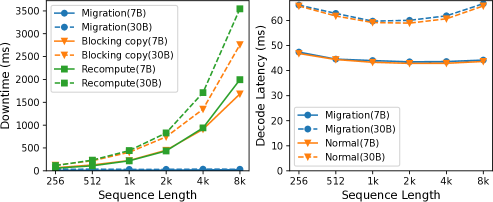

*Figure 10: Downtime and overhead of migration.*

**结果**：
- 迁移停机时间近零
- 对其他运行请求的开销近零
- 多阶段迁移有效隐藏延迟

### 服务性能

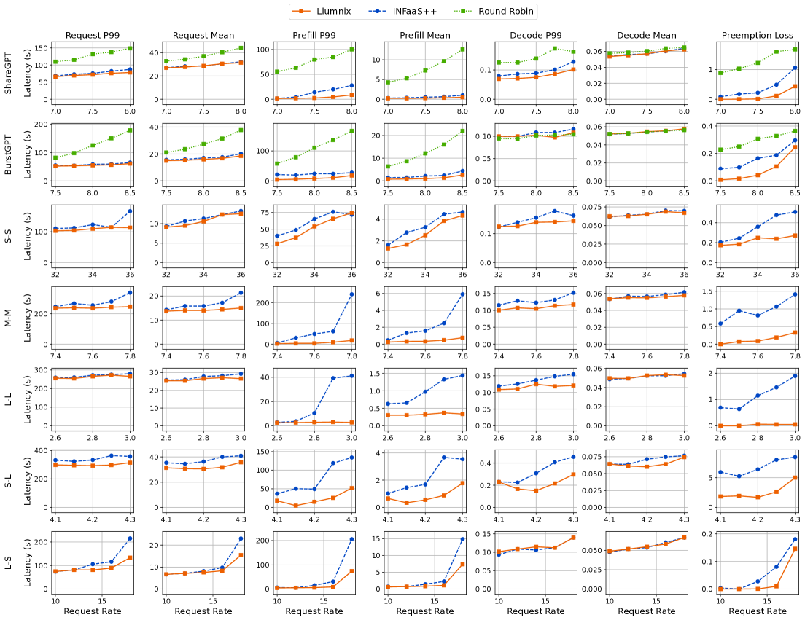

*Figure 11: Request end-to-end, prefill, and decode latencies and preemption loss of serving 16 LLaMA-7B instances.*

**结果**：
- Prefill 延迟改善最多 **15×/7.7×**（P99/mean）
- P99 解码延迟改善最多 **2×**
- 显著减少抢占损失

### 内存碎片化

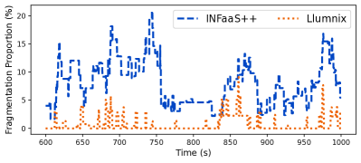

*Figure 12: Memory fragmentation over time.*

**结果**：
- Llumnix 有效减少内存碎片
- 碎片整理改善资源利用率
- 更多连续可用内存

### 优先级支持

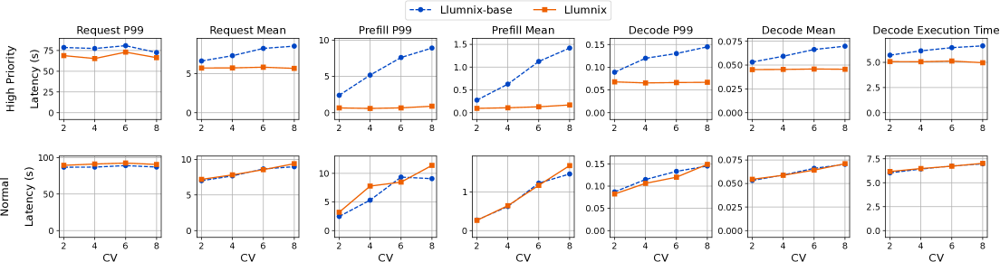

*Figure 13: Performance of high-priority and normal requests.*

**结果**：
- 高优先级请求延迟改善最多 **1.5×**
- 普通请求性能保持相似
- 动态资源分配，无需静态预留

### Auto-scaling

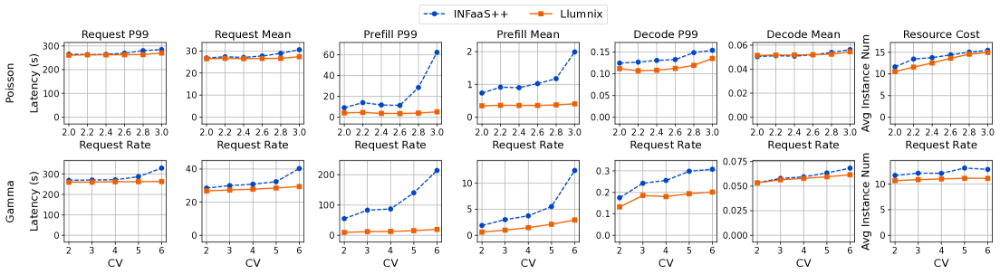

*Figure 14: Auto-scaling of LLaMA-7B instances with Poisson and Gamma distributions.*

**结果**：
- 成本节省最多 **36%**
- 保持相似 P99 延迟
- 有效应对负载波动

### 调度可扩展性

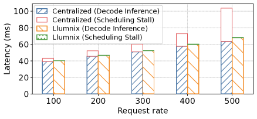

*Figure 16: Per-token latencies and scheduling stalls under increasing request rates using 64 LLaMA-7B instances.*

**结果**：
- 支持 64 个 LLaMA-7B 实例
- 调度开销可接受
- 可扩展到更大规模

### 与其他方法对比

| 方法 | 负载均衡 | 碎片整理 | 优先级 | Auto-scaling | 尾部延迟 |
|------|----------|----------|--------|--------------|----------|
| vLLM | 有限 | 无 | 无 | 无 | 基线 |
| INFaaS | 有 | 无 | 无 | 有限 | 中等 |
| **Llumnix** | **有** | **有** | **有** | **有** | **-10×** |

## 七、相关工作

### LLM 推理引擎

- **vLLM**：高效 LLM 推理系统
- **TensorRT-LLM**：NVIDIA 推理优化
- **Orca**：连续批处理
- **Sarathi**：调度优化

### LLM 服务系统

- **INFaaS**：实例级调度
- **AlpaServe**：模型并行服务
- **Clockwork**：确定性调度

### 操作系统启发

- **上下文切换**：CPU 核心间切换
- **虚拟内存**：内存抽象
- **进程调度**：优先级和公平性

## 八、总结

### 核心贡献

1. **请求实时迁移**：跨实例迁移请求及 KV cache，近零停机时间
2. **多阶段迁移机制**：流水线化复制与计算，消除迁移开销
3. **虚拟使用量抽象**：统一负载均衡、碎片整理、优先级区分
4. **全局+本地调度架构**：可扩展的分布式调度
5. **动态调度策略**：运行时重新调度，应对不可预测负载

### 技术影响

- **LLM 服务优化**：尾部延迟改善一个数量级
- **成本效率**：最多 36% 成本节省
- **优先级支持**：高优先级请求加速 1.5×
- **可扩展性**：支持大规模部署

### 局限性

1. **迁移开销**：仍有一定迁移成本
2. **调度复杂度**：全局调度需要协调
3. **模型限制**：主要验证 LLaMA 系列
4. **硬件依赖**：需要特定 GPU 集群

### 未来方向

- 扩展到更多模型架构
- 优化调度算法
- 支持更长上下文
- 与其他优化技术结合

## 九、参考资源

- **论文**: https://arxiv.org/abs/2406.03243
- **代码**: https://github.com/AlibabaPAI/llumnix
- **基础框架**: vLLM
- **模型**: LLaMA-7B, LLaMA-30B
- **硬件**: NVIDIA A10 (24GB), Alibaba Cloud
- **相关工作**: INFaaS, AlpaServe, Orca
