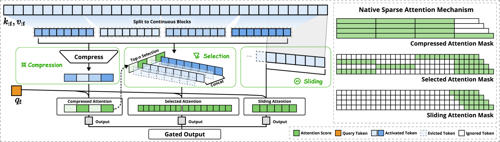

# 大语言模型长上下文推理优化

## 一、概述

随着大语言模型（LLM）应用场景的不断扩展，长上下文处理能力已成为模型的核心竞争力之一。从深度推理、代码仓库理解到多轮对话，长上下文建模能力直接决定了模型在复杂任务中的表现。然而，标准注意力机制的 O(N²) 计算复杂度和 O(N) 内存访问模式在长序列场景下成为主要瓶颈。

### 长上下文应用场景

| 场景 | 典型长度 | 挑战 |
|------|---------|------|
| **深度推理** | 8k-64k tokens | 需要长程依赖建模 |
| **代码仓库理解** | 32k-128k tokens | 多文件上下文关联 |
| **多轮对话** | 16k-64k tokens | 历史信息保持 |
| **文档摘要** | 64k-200k tokens | 全局信息提取 |
| **检索增强生成** | 32k-128k tokens | 多文档融合 |

### 核心挑战

1. **计算复杂度**：标准注意力的 O(N²) 复杂度在长序列下计算量巨大
2. **内存瓶颈**：KV 缓存随序列长度线性增长，64k 序列可能占用数十GB显存
3. **延迟问题**：自回归解码的串行特性限制了吞吐量
4. **数值稳定性**：长序列中的 softmax 计算容易出现数值溢出

## 二、注意力机制优化

### 2.1 FlashAttention

FlashAttention 是一种 IO 感知的注意力算法，通过利用 GPU 内存层次结构（SRAM vs HBM）实现高效计算。

#### 核心原理

- **分块计算**：将注意力矩阵分成小块，在 SRAM 中完成计算
- **重计算策略**：前向传播不保存注意力矩阵，反向传播时重新计算
- **在线 softmax**：使用在线算法计算 softmax，避免存储完整注意力矩阵

#### 性能提升

| 指标 | 标准注意力 | FlashAttention | 提升 |
|------|-----------|---------------|------|
| 内存复杂度 | O(N²) | O(N) | 数量级降低 |
| 训练速度 | 基准 | 2-4x | 显著提升 |
| 支持序列长度 | 受限 | 大幅扩展 | - |

#### 使用示例

```python
from flash_attn import flash_attn_func

# 标准用法
out = flash_attn_func(q, k, v, causal=True)

# 滑动窗口注意力（Mistral风格）
out = flash_attn_func(q, k, v, window_size=(256, 256))

# 变长序列
from flash_attn import flash_attn_varlen_func
out = flash_attn_varlen_func(q, k, v, cu_seqlens_q, cu_seqlens_k, max_seqlen_q, max_seqlen_k)
```

### 2.2 稀疏注意力

稀疏注意力通过选择性计算关键的 query-key 对来减少计算量。

#### Native Sparse Attention (NSA)

NSA 是 DeepSeek 提出的原生可训练稀疏注意力机制，采用分层稀疏策略：



**三个并行分支**：
1. **压缩分支**：粗粒度全局上下文（块长度32，步长16）
2. **选择分支**：细粒度重要token块（块大小64，选择16个块）
3. **滑动窗口**：局部上下文信息（窗口大小512）

**性能表现**：
- 64k 上下文前向加速：9.0×
- 64k 上下文反向加速：6.0×
- 64k 上下文解码加速：11.6×

```python
# NSA 概念性实现
def nsa_attention(q, k, v, compression_blocks, selected_blocks, window_size):
    # 1. 压缩注意力
    k_compressed = compress_keys(k, compression_blocks)
    v_compressed = compress_values(v, compression_blocks)
    attn_compressed = compute_attention(q, k_compressed, v_compressed)

    # 2. 选择注意力
    importance_scores = compute_importance(q, k_compressed)
    top_blocks = select_top_blocks(importance_scores, selected_blocks)
    k_selected = gather_blocks(k, top_blocks)
    v_selected = gather_blocks(v, top_blocks)
    attn_selected = compute_attention(q, k_selected, v_selected)

    # 3. 滑动窗口注意力
    k_window = k[:, -window_size:]
    v_window = v[:, -window_size:]
    attn_window = compute_attention(q, k_window, v_window)

    # 4. 门控融合
    gate = sigmoid(mlp(q))
    output = gate[0] * attn_compressed + gate[1] * attn_selected + gate[2] * attn_window

    return output
```

#### 其他稀疏注意力方法

| 方法 | 类型 | 特点 | 局限性 |
|------|------|------|--------|
| **Sliding Window** | 固定模式 | 简单高效 | 无法捕获长程依赖 |
| **StreamingLLM** | 固定模式 | 注意力sink + 局部窗口 | 信息丢失 |
| **Longformer** | 固定模式 | 局部窗口 + 全局token | 模式固定 |
| **H2O** | 动态剪枝 | 自适应KV缓存驱逐 | 仅推理阶段 |
| **Quest** | 查询感知 | 块级重要性估计 | 训练效率低 |
| **HashAttention** | 查询感知 | 哈希空间映射 | 内存访问不连续 |

### 2.3 分组查询注意力 (GQA)

GQA 通过在多个查询头之间共享 KV 缓存来减少内存访问。

#### 架构对比

| 注意力类型 | KV头数 | 内存占用 | 解码速度 |
|-----------|--------|---------|---------|
| **MHA** | num_heads | 最高 | 最慢 |
| **MQA** | 1 | 最低 | 最快 |
| **GQA** | num_kv_heads | 平衡 | 平衡 |

#### 实现示例

```python
import torch
import torch.nn as nn

class GroupedQueryAttention(nn.Module):
    def __init__(self, d_model, num_heads, num_kv_heads):
        super().__init__()
        self.num_heads = num_heads
        self.num_kv_heads = num_kv_heads
        self.head_dim = d_model // num_heads
        self.num_heads_per_group = num_heads // num_kv_heads

        self.q_proj = nn.Linear(d_model, num_heads * self.head_dim)
        self.k_proj = nn.Linear(d_model, num_kv_heads * self.head_dim)
        self.v_proj = nn.Linear(d_model, num_kv_heads * self.head_dim)
        self.out_proj = nn.Linear(d_model, d_model)

    def forward(self, x, kv_cache=None):
        batch_size, seq_len, _ = x.shape

        q = self.q_proj(x).view(batch_size, seq_len, self.num_heads, self.head_dim)
        k = self.k_proj(x).view(batch_size, seq_len, self.num_kv_heads, self.head_dim)
        v = self.v_proj(x).view(batch_size, seq_len, self.num_kv_heads, self.head_dim)

        # 扩展 KV 以匹配查询头数
        k = k.repeat_interleave(self.num_heads_per_group, dim=2)
        v = v.repeat_interleave(self.num_heads_per_group, dim=2)

        # 计算注意力
        attn = torch.matmul(q, k.transpose(-2, -1)) / (self.head_dim ** 0.5)
        attn = torch.softmax(attn, dim=-1)
        out = torch.matmul(attn, v)

        out = out.reshape(batch_size, seq_len, -1)
        return self.out_proj(out)
```

### 2.4 多查询注意力 (MQA)

MQA 是 GQA 的极端情况，所有查询头共享同一组 KV。

```python
class MultiQueryAttention(nn.Module):
    def __init__(self, d_model, num_heads):
        super().__init__()
        self.num_heads = num_heads
        self.head_dim = d_model // num_heads

        self.q_proj = nn.Linear(d_model, num_heads * self.head_dim)
        self.k_proj = nn.Linear(d_model, self.head_dim)  # 单个KV头
        self.v_proj = nn.Linear(d_model, self.head_dim)  # 单个KV头
        self.out_proj = nn.Linear(d_model, d_model)

    def forward(self, x):
        batch_size, seq_len, _ = x.shape

        q = self.q_proj(x).view(batch_size, seq_len, self.num_heads, self.head_dim)
        k = self.k_proj(x).view(batch_size, seq_len, 1, self.head_dim)
        v = self.v_proj(x).view(batch_size, seq_len, 1, self.head_dim)

        # 扩展 KV 以匹配查询头数
        k = k.expand(-1, -1, self.num_heads, -1)
        v = v.expand(-1, -1, self.num_heads, -1)

        # 计算注意力
        attn = torch.matmul(q, k.transpose(-2, -1)) / (self.head_dim ** 0.5)
        attn = torch.softmax(attn, dim=-1)
        out = torch.matmul(attn, v)

        out = out.reshape(batch_size, seq_len, -1)
        return self.out_proj(out)
```

## 三、KV 缓存优化

### 3.1 KV 缓存基础

在自回归生成中，KV 缓存避免了重复计算历史 token 的键值对。

#### 内存占用计算

```
KV缓存大小 = 2 × num_layers × num_kv_heads × head_dim × seq_len × dtype_size

示例（LLaMA-2-70B，64k序列，FP16）：
= 2 × 80 × 8 × 128 × 65536 × 2 bytes
= 2 × 80 × 8 × 128 × 65536 × 2
= 17,179,869,184 bytes ≈ 16 GB
```

### 3.2 KV 缓存量化

将 KV 缓存从 FP16 量化到 INT8 或 INT4 可显著减少内存占用。

```python
import torch

class KVCacheQuantization:
    def __init__(self, bits=8):
        self.bits = bits
        self.scale = None
        self.zero_point = None

    def quantize(self, kv_cache):
        """量化KV缓存"""
        if self.bits == 8:
            return self._quantize_int8(kv_cache)
        elif self.bits == 4:
            return self._quantize_int4(kv_cache)
        return kv_cache

    def _quantize_int8(self, x):
        """INT8量化"""
        min_val = x.min()
        max_val = x.max()
        self.scale = (max_val - min_val) / 255
        self.zero_point = min_val
        quantized = ((x - self.zero_point) / self.scale).round().clamp(0, 255).to(torch.uint8)
        return quantized

    def dequantize(self, quantized):
        """反量化"""
        return quantized.float() * self.scale + self.zero_point

# 使用示例
quantizer = KVCacheQuantization(bits=8)
kv_cache_quantized = quantizer.quantize(kv_cache)
kv_cache_dequantized = quantizer.dequantize(kv_cache_quantized)
```

### 3.3 KV 缓存压缩

#### 动态稀疏化

根据注意力分数动态驱逐不重要的 KV 缓存条目。

```python
class DynamicKVCacheCompression:
    def __init__(self, max_cache_size, eviction_policy='attention_score'):
        self.max_cache_size = max_cache_size
        self.eviction_policy = eviction_policy

    def compress(self, kv_cache, attention_scores):
        """根据注意力分数压缩KV缓存"""
        if kv_cache.size(1) <= self.max_cache_size:
            return kv_cache

        if self.eviction_policy == 'attention_score':
            # 计算每个token的平均注意力分数
            avg_scores = attention_scores.mean(dim=(0, 1, 2))  # [seq_len]

            # 保留top-k个最重要的token
            _, indices = torch.topk(avg_scores, self.max_cache_size)
            indices = indices.sort().values

            return kv_cache[:, indices]
        elif self.eviction_policy == 'h2o':
            # H2O: Heavy Hitter Oracle
            return self._h2o_eviction(kv_cache, attention_scores)

    def _h2o_eviction(self, kv_cache, attention_scores):
        """H2O驱逐策略"""
        # 计算累积注意力分数
        cumulative_scores = attention_scores.cumsum(dim=-1)

        # 保留最近的token和注意力sink
        recent_size = self.max_cache_size // 2
        sink_size = self.max_cache_size - recent_size

        # 保留前sink_size个token（注意力sink）
        sink_indices = torch.arange(sink_size, device=kv_cache.device)

        # 保留最近的recent_size个token
        recent_indices = torch.arange(kv_cache.size(1) - recent_size, kv_cache.size(1), device=kv_cache.device)

        # 合并索引
        indices = torch.cat([sink_indices, recent_indices]).sort().values

        return kv_cache[:, indices]
```

### 3.4 KV 缓存分页

借鉴操作系统虚拟内存的概念，将 KV 缓存分页管理。

```python
class PagedKVCache:
    def __init__(self, page_size=16, max_pages=1000):
        self.page_size = page_size
        self.max_pages = max_pages
        self.pages = {}  # page_id -> tensor
        self.page_table = {}  # (batch, seq_idx) -> page_id
        self.free_pages = list(range(max_pages))

    def allocate_page(self):
        """分配一个新页"""
        if not self.free_pages:
            raise RuntimeError("No free pages available")
        return self.free_pages.pop()

    def free_page(self, page_id):
        """释放一个页"""
        self.free_pages.append(page_id)
        del self.pages[page_id]

    def store(self, batch_idx, seq_idx, kv_data):
        """存储KV数据"""
        page_id = seq_idx // self.page_size

        if page_id not in self.pages:
            new_page_id = self.allocate_page()
            self.pages[new_page_id] = torch.zeros(
                self.page_size, *kv_data.shape[1:],
                device=kv_data.device, dtype=kv_data.dtype
            )
            self.page_table[(batch_idx, page_id)] = new_page_id

        local_idx = seq_idx % self.page_size
        actual_page_id = self.page_table[(batch_idx, page_id)]
        self.pages[actual_page_id][local_idx] = kv_data

    def retrieve(self, batch_idx, start_idx, end_idx):
        """检索KV数据"""
        results = []
        for seq_idx in range(start_idx, end_idx):
            page_id = seq_idx // self.page_size
            local_idx = seq_idx % self.page_size
            actual_page_id = self.page_table[(batch_idx, page_id)]
            results.append(self.pages[actual_page_id][local_idx])

        return torch.stack(results)
```

## 四、位置编码优化

### 4.1 旋转位置编码 (RoPE)

RoPE 是目前最流行的位置编码方式，支持长度外推。

#### 基础 RoPE

```python
import torch

def apply_rope(q, k, position_ids, theta=10000.0):
    """应用旋转位置编码"""
    batch_size, seq_len, num_heads, head_dim = q.shape

    # 计算频率
    freqs = 1.0 / (theta ** (torch.arange(0, head_dim, 2, device=q.device).float() / head_dim))

    # 计算位置编码
    t = position_ids.float().unsqueeze(-1)  # [batch, seq_len, 1]
    freqs = t * freqs.unsqueeze(0)  # [batch, seq_len, head_dim//2]

    # 应用旋转
    cos = freqs.cos()
    sin = freqs.sin()

    # 旋转q和k
    q_rot = apply_rotary_emb(q, cos, sin)
    k_rot = apply_rotary_emb(k, cos, sin)

    return q_rot, k_rot

def apply_rotary_emb(x, cos, sin):
    """应用旋转嵌入"""
    # x: [batch, seq_len, num_heads, head_dim]
    # cos, sin: [batch, seq_len, head_dim//2]

    x1 = x[..., :x.shape[-1]//2]
    x2 = x[..., x.shape[-1]//2:]

    # 扩展cos和sin以匹配头数
    cos = cos.unsqueeze(2).expand_as(x1)
    sin = sin.unsqueeze(2).expand_as(x1)

    # 旋转
    out1 = x1 * cos - x2 * sin
    out2 = x2 * cos + x1 * sin

    return torch.cat([out1, out2], dim=-1)
```

#### RoPE 长度外推

| 方法 | 原理 | 支持长度 | 性能影响 |
|------|------|---------|---------|
| **线性插值** | 缩放位置索引 | 2-4x | 轻微下降 |
| **NTK-aware** | 调整频率基数 | 4-8x | 轻微下降 |
| **YaRN** | 动态调整温度 | 8-16x | 几乎无影响 |
| **Code LLaMA** | 微调 + 长序列 | 16x+ | 需要微调 |

```python
class NTKAwareRoPE:
    def __init__(self, dim, base=10000, scale=1.0):
        self.dim = dim
        self.base = base
        self.scale = scale

        # NTK-aware调整
        self.base = base * (scale ** (dim / (dim - 2)))

    def apply(self, q, k, position_ids):
        freqs = 1.0 / (self.base ** (torch.arange(0, self.dim, 2, device=q.device).float() / self.dim))

        t = position_ids.float().unsqueeze(-1)
        freqs = t * freqs.unsqueeze(0)

        cos = freqs.cos()
        sin = freqs.sin()

        return apply_rotary_emb(q, cos, sin), apply_rotary_emb(k, cos, sin)
```

### 4.2 ALiBi 位置编码

ALiBi 通过线性偏置实现位置编码，天然支持长度外推。

```python
def get_alibi_slopes(num_heads):
    """计算ALiBi斜率"""
    def get_slopes_power_of_2(n):
        start = (2 ** (-2 ** -(torch.math.log2(n) - 3)))
        ratio = start
        return [start * ratio ** i for i in range(n)]

    if torch.math.log2(num_heads).is_integer():
        slopes = get_slopes_power_of_2(num_heads)
    else:
        closest_power_of_2 = 2 ** torch.floor(torch.math.log2(num_heads))
        slopes = get_slopes_power_of_2(closest_power_of_2)
        extra_slopes = get_slopes_power_of_2(2 * closest_power_of_2)
        slopes.extend(extra_slopes[0::2][:num_heads - closest_power_of_2])

    return torch.tensor(slopes, device='cuda', dtype=torch.float32)

def apply_alibi(attention_scores, alibi_slopes):
    """应用ALiBi偏置"""
    # attention_scores: [batch, num_heads, seq_len, seq_len]
    seq_len = attention_scores.size(-1)

    # 创建位置偏置
    positions = torch.arange(seq_len, device=attention_scores.device)
    relative_positions = positions.unsqueeze(0) - positions.unsqueeze(1)  # [seq_len, seq_len]

    # 应用斜率
    alibi_bias = alibi_slopes.view(1, -1, 1, 1) * relative_positions.unsqueeze(0).unsqueeze(0)

    return attention_scores + alibi_bias
```

## 五、解码优化

### 5.1 推测解码 (Speculative Decoding)

推测解码通过并行生成多个候选 token 来加速自回归解码。

#### 基本原理

1. 使用小型草稿模型快速生成 N 个候选 token
2. 使用目标模型并行验证所有候选 token
3. 接受第一个不匹配的 token 或所有 token

```python
class SpeculativeDecoder:
    def __init__(self, target_model, draft_model, num_speculative_tokens=5):
        self.target_model = target_model
        self.draft_model = draft_model
        self.num_speculative_tokens = num_speculative_tokens

    def generate(self, input_ids, max_new_tokens):
        """推测解码生成"""
        generated = input_ids.clone()

        for _ in range(max_new_tokens // self.num_speculative_tokens):
            # 1. 草稿模型快速生成多个token
            draft_tokens = []
            draft_probs = []
            draft_input = generated.clone()

            for _ in range(self.num_speculative_tokens):
                with torch.no_grad():
                    draft_output = self.draft_model(draft_input)
                    draft_prob = torch.softmax(draft_output[:, -1], dim=-1)
                    draft_token = torch.multinomial(draft_prob, 1)
                    draft_tokens.append(draft_token)
                    draft_probs.append(draft_prob)
                    draft_input = torch.cat([draft_input, draft_token], dim=-1)

            draft_tokens = torch.cat(draft_tokens, dim=-1)

            # 2. 目标模型并行验证
            with torch.no_grad():
                target_output = self.target_model(torch.cat([generated, draft_tokens], dim=-1))
                target_probs = torch.softmax(target_output[:, -self.num_speculative_tokens-1:-1], dim=-1)

            # 3. 接受/拒绝采样
            accepted = 0
            for i in range(self.num_speculative_tokens):
                draft_prob = draft_probs[i][0, draft_tokens[0, i]]
                target_prob = target_probs[0, i, draft_tokens[0, i]]

                # 接受概率
                accept_prob = min(1, target_prob / draft_prob)

                if torch.rand(1) < accept_prob:
                    accepted += 1
                    generated = torch.cat([generated, draft_tokens[:, i:i+1]], dim=-1)
                else:
                    # 从目标分布中采样
                    adjusted_prob = torch.clamp(target_probs[0, i] - draft_probs[i][0], min=0)
                    adjusted_prob = adjusted_prob / adjusted_prob.sum()
                    new_token = torch.multinomial(adjusted_prob, 1).unsqueeze(0)
                    generated = torch.cat([generated, new_token], dim=-1)
                    break

        return generated
```

#### 多头推测解码

```python
class MultiHeadSpeculativeDecoder:
    def __init__(self, target_model, draft_model, num_heads=4, num_speculative_tokens=5):
        self.target_model = target_model
        self.draft_model = draft_model
        self.num_heads = num_heads
        self.num_speculative_tokens = num_speculative_tokens

    def generate(self, input_ids, max_new_tokens):
        """多头推测解码"""
        generated = input_ids.clone()

        for _ in range(max_new_tokens // (self.num_speculative_tokens * self.num_heads)):
            # 并行生成多个候选序列
            candidates = []
            for head in range(self.num_heads):
                candidate = self._generate_candidate(generated, head)
                candidates.append(candidate)

            # 选择最佳候选
            best_candidate = self._select_best_candidate(generated, candidates)
            generated = best_candidate

        return generated

    def _generate_candidate(self, input_ids, head_id):
        """生成单个候选序列"""
        # 使用不同的采样策略
        candidate = input_ids.clone()
        draft_input = input_ids.clone()

        for _ in range(self.num_speculative_tokens):
            with torch.no_grad():
                output = self.draft_model(draft_input)
                prob = torch.softmax(output[:, -1], dim=-1)

                # 不同头使用不同的采样策略
                if head_id == 0:
                    token = torch.argmax(prob, dim=-1, keepdim=True)
                elif head_id == 1:
                    token = torch.multinomial(prob, 1)
                else:
                    # Top-k采样
                    top_k_prob, top_k_idx = torch.topk(prob, 50)
                    token_idx = torch.multinomial(top_k_prob, 1)
                    token = top_k_idx.gather(-1, token_idx)

                candidate = torch.cat([candidate, token], dim=-1)
                draft_input = torch.cat([draft_input, token], dim=-1)

        return candidate

    def _select_best_candidate(self, input_ids, candidates):
        """选择最佳候选序列"""
        # 使用目标模型验证所有候选
        best_candidate = None
        best_score = float('-inf')

        for candidate in candidates:
            with torch.no_grad():
                output = self.target_model(candidate)
                score = output[:, -1].max().item()

                if score > best_score:
                    best_score = score
                    best_candidate = candidate

        return best_candidate
```

### 5.2 连续批处理 (Continuous Batching)

连续批处理允许在生成过程中动态添加和移除请求，提高 GPU 利用率。

```python
class ContinuousBatchScheduler:
    def __init__(self, max_batch_size, max_seq_len):
        self.max_batch_size = max_batch_size
        self.max_seq_len = max_seq_len
        self.active_requests = {}
        self.waiting_queue = []

    def add_request(self, request_id, input_ids):
        """添加新请求"""
        if len(self.active_requests) < self.max_batch_size:
            self.active_requests[request_id] = {
                'input_ids': input_ids,
                'generated': [],
                'finished': False
            }
        else:
            self.waiting_queue.append((request_id, input_ids))

    def step(self, model):
        """执行一步生成"""
        if not self.active_requests:
            return {}

        # 准备批次输入
        batch_inputs = []
        request_ids = []

        for req_id, req_data in self.active_requests.items():
            if not req_data['finished']:
                batch_inputs.append(req_data['input_ids'])
                request_ids.append(req_id)

        if not batch_inputs:
            return {}

        # 填充到相同长度
        max_len = max(inp.size(0) for inp in batch_inputs)
        padded_inputs = torch.zeros(len(batch_inputs), max_len, dtype=torch.long, device='cuda')

        for i, inp in enumerate(batch_inputs):
            padded_inputs[i, -inp.size(0):] = inp

        # 生成
        with torch.no_grad():
            outputs = model(padded_inputs)
            next_tokens = torch.argmax(outputs[:, -1], dim=-1)

        # 更新状态
        results = {}
        for i, req_id in enumerate(request_ids):
            new_token = next_tokens[i].item()
            self.active_requests[req_id]['generated'].append(new_token)
            self.active_requests[req_id]['input_ids'] = torch.cat([
                self.active_requests[req_id]['input_ids'],
                torch.tensor([new_token], device='cuda')
            ])

            # 检查是否完成
            if new_token == model.eos_token_id or len(self.active_requests[req_id]['generated']) >= self.max_seq_len:
                self.active_requests[req_id]['finished'] = True
                results[req_id] = self.active_requests[req_id]['generated']

        # 移除完成的请求，添加等待的请求
        finished_ids = [req_id for req_id, data in self.active_requests.items() if data['finished']]
        for req_id in finished_ids:
            del self.active_requests[req_id]

        while self.waiting_queue and len(self.active_requests) < self.max_batch_size:
            req_id, input_ids = self.waiting_queue.pop(0)
            self.add_request(req_id, input_ids)

        return results
```

### 5.3 Prefill-Decode 分离

将预填充（prefill）和解码（decode）阶段分离到不同的计算资源上。

```python
class PrefillDecodeDisaggregation:
    def __init__(self, prefill_engine, decode_engine):
        self.prefill_engine = prefill_engine
        self.decode_engine = decode_engine
        self.kv_cache_transfer_queue = []

    def prefill(self, request_id, input_ids):
        """执行预填充"""
        # 在prefill引擎上计算KV缓存
        with torch.no_grad():
            kv_cache = self.prefill_engine.compute_kv_cache(input_ids)

        # 传输KV缓存到decode引擎
        self.kv_cache_transfer_queue.append({
            'request_id': request_id,
            'kv_cache': kv_cache,
            'input_ids': input_ids
        })

        return kv_cache

    def decode(self, request_id):
        """执行解码"""
        # 从队列获取KV缓存
        kv_cache_data = None
        for i, data in enumerate(self.kv_cache_transfer_queue):
            if data['request_id'] == request_id:
                kv_cache_data = self.kv_cache_transfer_queue.pop(i)
                break

        if kv_cache_data is None:
            raise ValueError(f"Request {request_id} not found")

        # 在decode引擎上执行解码
        with torch.no_grad():
            output = self.decode_engine.generate_with_cache(
                kv_cache_data['input_ids'],
                kv_cache_data['kv_cache']
            )

        return output
```

## 六、内存优化

### 6.1 激活检查点 (Activation Checkpointing)

通过牺牲计算时间来减少内存占用。

```python
import torch
from torch.utils.checkpoint import checkpoint

class TransformerLayerWithCheckpointing(torch.nn.Module):
    def __init__(self, d_model, num_heads):
        super().__init__()
        self.attention = torch.nn.MultiheadAttention(d_model, num_heads)
        self.feed_forward = torch.nn.Sequential(
            torch.nn.Linear(d_model, d_model * 4),
            torch.nn.GELU(),
            torch.nn.Linear(d_model * 4, d_model)
        )
        self.norm1 = torch.nn.LayerNorm(d_model)
        self.norm2 = torch.nn.LayerNorm(d_model)

    def forward(self, x, use_checkpoint=True):
        if use_checkpoint:
            # 使用激活检查点
            attn_output = checkpoint(self._attention_forward, x)
            ff_output = checkpoint(self._ff_forward, attn_output)
        else:
            attn_output = self._attention_forward(x)
            ff_output = self._ff_forward(attn_output)

        return ff_output

    def _attention_forward(self, x):
        normed = self.norm1(x)
        attn_output, _ = self.attention(normed, normed, normed)
        return x + attn_output

    def _ff_forward(self, x):
        normed = self.norm2(x)
        ff_output = self.feed_forward(normed)
        return x + ff_output
```

### 6.2 梯度累积

```python
class GradientAccumulation:
    def __init__(self, model, optimizer, accumulation_steps=4):
        self.model = model
        self.optimizer = optimizer
        self.accumulation_steps = accumulation_steps
        self.current_step = 0

    def step(self, loss):
        # 缩放损失
        scaled_loss = loss / self.accumulation_steps
        scaled_loss.backward()

        self.current_step += 1

        if self.current_step % self.accumulation_steps == 0:
            self.optimizer.step()
            self.optimizer.zero_grad()
            return True

        return False
```

### 6.3 混合精度训练

```python
from torch.cuda.amp import autocast, GradScaler

class MixedPrecisionTrainer:
    def __init__(self, model, optimizer):
        self.model = model
        self.optimizer = optimizer
        self.scaler = GradScaler()

    def train_step(self, inputs, targets):
        self.optimizer.zero_grad()

        # 前向传播（混合精度）
        with autocast():
            outputs = self.model(inputs)
            loss = torch.nn.functional.cross_entropy(outputs, targets)

        # 反向传播（缩放梯度）
        self.scaler.scale(loss).backward()

        # 更新参数
        self.scaler.step(self.optimizer)
        self.scaler.update()

        return loss.item()
```

## 七、分布式推理

### 7.1 张量并行

将模型参数分布到多个 GPU 上。

```python
import torch
import torch.distributed as dist
from torch.nn.parallel import DistributedDataParallel as DDP

class TensorParallelLinear(torch.nn.Module):
    def __init__(self, in_features, out_features, world_size, rank):
        super().__init__()
        self.world_size = world_size
        self.rank = rank

        # 每个GPU只保存部分权重
        self.local_out_features = out_features // world_size
        self.weight = torch.nn.Parameter(
            torch.randn(in_features, self.local_out_features, device=f'cuda:{rank}')
        )

    def forward(self, x):
        # 本地矩阵乘法
        local_output = torch.matmul(x, self.weight)

        # All-gather收集所有GPU的结果
        output_list = [torch.zeros_like(local_output) for _ in range(self.world_size)]
        dist.all_gather(output_list, local_output)

        # 拼接结果
        output = torch.cat(output_list, dim=-1)

        return output
```

### 7.2 流水线并行

将模型的不同层分布到不同的 GPU 上。

```python
class PipelineParallelModel(torch.nn.Module):
    def __init__(self, layers, num_gpus):
        super().__init__()
        self.num_gpus = num_gpus
        self.layers_per_gpu = len(layers) // num_gpus

        # 将层分配到不同的GPU
        self.gpu_layers = {}
        for i in range(num_gpus):
            start_idx = i * self.layers_per_gpu
            end_idx = start_idx + self.layers_per_gpu
            self.gpu_layers[i] = torch.nn.Sequential(*layers[start_idx:end_idx]).to(f'cuda:{i}')

    def forward(self, x):
        # 流水线执行
        for gpu_id in range(self.num_gpus):
            x = x.to(f'cuda:{gpu_id}')
            x = self.gpu_layers[gpu_id](x)

        return x
```

### 7.3 专家并行 (MoE)

对于混合专家模型，将不同的专家分布到不同的 GPU 上。

```python
class ExpertParallelMoE(torch.nn.Module):
    def __init__(self, num_experts, d_model, world_size, rank):
        super().__init__()
        self.num_experts = num_experts
        self.world_size = world_size
        self.rank = rank

        # 每个GPU只保存部分专家
        self.experts_per_gpu = num_experts // world_size
        self.local_experts = torch.nn.ModuleList([
            torch.nn.Sequential(
                torch.nn.Linear(d_model, d_model * 4),
                torch.nn.GELU(),
                torch.nn.Linear(d_model * 4, d_model)
            ).to(f'cuda:{rank}')
            for _ in range(self.experts_per_gpu)
        ])

        # 路由器
        self.router = torch.nn.Linear(d_model, num_experts).to(f'cuda:{rank}')

    def forward(self, x):
        # 计算路由权重
        router_logits = self.router(x)
        routing_weights = torch.softmax(router_logits, dim=-1)

        # 选择top-k个专家
        top_k_weights, top_k_indices = torch.topk(routing_weights, 2, dim=-1)

        # 分发token到对应的专家
        output = torch.zeros_like(x)

        for expert_idx in range(self.experts_per_gpu):
            global_expert_idx = self.rank * self.experts_per_gpu + expert_idx

            # 找到路由到该专家的token
            mask = (top_k_indices == global_expert_idx).any(dim=-1)

            if mask.any():
                expert_input = x[mask]
                expert_output = self.local_experts[expert_idx](expert_input)

                # 加权求和
                weight = top_k_weights[mask, (top_k_indices[mask] == global_expert_idx).nonzero()[:, 0]]
                output[mask] += weight.unsqueeze(-1) * expert_output

        # All-reduce收集所有GPU的结果
        dist.all_reduce(output)

        return output
```

## 八、量化技术

### 8.1 权重量化

```python
class WeightQuantizer:
    def __init__(self, bits=4):
        self.bits = bits

    def quantize(self, weight):
        """量化权重"""
        if self.bits == 4:
            return self._quantize_int4(weight)
        elif self.bits == 8:
            return self._quantize_int8(weight)
        return weight

    def _quantize_int4(self, weight):
        """INT4量化"""
        # 计算缩放因子和零点
        min_val = weight.min()
        max_val = weight.max()

        scale = (max_val - min_val) / 15
        zero_point = min_val

        # 量化
        quantized = ((weight - zero_point) / scale).round().clamp(0, 15).to(torch.uint8)

        # 打包两个4-bit值到一个字节
        packed = quantized[:, 0::2] | (quantized[:, 1::2] << 4)

        return {
            'packed': packed,
            'scale': scale,
            'zero_point': zero_point,
            'shape': weight.shape
        }

    def dequantize(self, quantized_data):
        """反量化"""
        packed = quantized_data['packed']
        scale = quantized_data['scale']
        zero_point = quantized_data['zero_point']
        shape = quantized_data['shape']

        # 解包
        low = packed & 0x0F
        high = (packed >> 4) & 0x0F
        unpacked = torch.stack([low, high], dim=-1).reshape(shape)

        # 反量化
        return unpacked.float() * scale + zero_point
```

### 8.2 激活量化

```python
class ActivationQuantizer:
    def __init__(self, bits=8):
        self.bits = bits

    def quantize(self, activation):
        """量化激活值"""
        # 动态范围
        min_val = activation.min()
        max_val = activation.max()

        if self.bits == 8:
            scale = (max_val - min_val) / 255
            zero_point = min_val
            quantized = ((activation - zero_point) / scale).round().clamp(0, 255).to(torch.uint8)
        elif self.bits == 4:
            scale = (max_val - min_val) / 15
            zero_point = min_val
            quantized = ((activation - zero_point) / scale).round().clamp(0, 15).to(torch.uint8)

        return {
            'quantized': quantized,
            'scale': scale,
            'zero_point': zero_point
        }

    def dequantize(self, quantized_data):
        """反量化"""
        return quantized_data['quantized'].float() * quantized_data['scale'] + quantized_data['zero_point']
```

### 8.3 GPTQ 量化

```python
class GPTQQuantizer:
    def __init__(self, bits=4, group_size=128):
        self.bits = bits
        self.group_size = group_size

    def quantize_layer(self, weight, hessian):
        """使用GPTQ量化单层"""
        rows, cols = weight.shape
        quantized_weight = torch.zeros_like(weight)
        scales = []
        zeros = []

        # 分组量化
        for i in range(0, cols, self.group_size):
            group_end = min(i + self.group_size, cols)
            group_weight = weight[:, i:group_end]
            group_hessian = hessian[i:group_end, i:group_end]

            # 计算最优量化参数
            scale, zero = self._compute_quantization_params(group_weight)
            scales.append(scale)
            zeros.append(zero)

            # 量化
            quantized_group = self._quantize_group(group_weight, scale, zero)
            quantized_weight[:, i:group_end] = quantized_group

            # 补偿量化误差
            if i + self.group_size < cols:
                error = group_weight - self._dequantize_group(quantized_group, scale, zero)
                compensation = error @ torch.inverse(group_hessian)
                weight[:, group_end:] -= compensation

        return {
            'quantized': quantized_weight,
            'scales': scales,
            'zeros': zeros
        }

    def _compute_quantization_params(self, weight):
        """计算量化参数"""
        min_val = weight.min()
        max_val = weight.max()

        scale = (max_val - min_val) / (2 ** self.bits - 1)
        zero = min_val

        return scale, zero

    def _quantize_group(self, weight, scale, zero):
        """量化一组权重"""
        return ((weight - zero) / scale).round().clamp(0, 2 ** self.bits - 1)

    def _dequantize_group(self, quantized, scale, zero):
        """反量化一组权重"""
        return quantized.float() * scale + zero
```

## 九、最佳实践

### 9.1 模型选择

| 场景 | 推荐模型 | 原因 |
|------|---------|------|
| **长文本理解** | LLaMA-3.1-70B, Qwen-2.5-72B | 原生长上下文支持 |
| **代码生成** | CodeLLaMA-34B, DeepSeek-Coder-33B | 代码特化 |
| **多轮对话** | ChatGLM-4, Qwen-2.5-Chat | 对话优化 |
| **推理任务** | DeepSeek-R1, Qwen-2.5-Math | 推理增强 |

### 9.2 硬件配置

| 序列长度 | 最小显存 | 推荐配置 |
|---------|---------|---------|
| 8k | 16GB | 1x A100 40GB |
| 32k | 32GB | 1x A100 80GB |
| 64k | 64GB | 2x A100 80GB |
| 128k | 128GB | 4x A100 80GB |
| 200k+ | 256GB+ | 8x A100 80GB |

### 9.3 优化组合建议

#### 高吞吐量场景

```python
# 1. 使用FlashAttention
# 2. 启用连续批处理
# 3. 使用INT8量化
# 4. 启用KV缓存压缩
```

#### 低延迟场景

```python
# 1. 使用推测解码
# 2. 启用Prefill-Decode分离
# 3. 使用GQA/MQA
# 4. 优化KV缓存管理
```

#### 长序列场景

```python
# 1. 使用稀疏注意力（如NSA）
# 2. 启用KV缓存量化
# 3. 使用滑动窗口注意力
# 4. 优化位置编码（如YaRN）
```

### 9.4 监控和调试

```python
class InferenceMonitor:
    def __init__(self):
        self.metrics = {
            'latency': [],
            'throughput': [],
            'memory_usage': [],
            'cache_hit_rate': []
        }

    def log_metrics(self, latency, throughput, memory_usage, cache_hit_rate):
        self.metrics['latency'].append(latency)
        self.metrics['throughput'].append(throughput)
        self.metrics['memory_usage'].append(memory_usage)
        self.metrics['cache_hit_rate'].append(cache_hit_rate)

    def print_summary(self):
        print(f"平均延迟: {sum(self.metrics['latency']) / len(self.metrics['latency']):.2f} ms")
        print(f"平均吞吐量: {sum(self.metrics['throughput']) / len(self.metrics['throughput']):.2f} tokens/s")
        print(f"峰值内存: {max(self.metrics['memory_usage']):.2f} GB")
        print(f"缓存命中率: {sum(self.metrics['cache_hit_rate']) / len(self.metrics['cache_hit_rate']):.2%}")
```

## 十、参考资料

### 核心论文

- **FlashAttention**: [FlashAttention: Fast and Memory-Efficient Exact Attention with IO-Awareness](https://arxiv.org/abs/2205.14135)
- **FlashAttention-2**: [FlashAttention-2: Faster Attention with Better Parallelism and Work Partitioning](https://arxiv.org/abs/2307.08691)
- **NSA**: [Native Sparse Attention: Hardware-Aligned and Natively Trainable Sparse Attention](https://arxiv.org/abs/2502.11089)
- **GQA**: [GQA: Training Generalized Multi-Query Transformer Models from Multi-Head Checkpoints](https://arxiv.org/abs/2305.13245)
- **RoPE**: [RoFormer: Enhanced Transformer with Rotary Position Embedding](https://arxiv.org/abs/2104.09864)
- **ALiBi**: [Train Short, Test Long: Attention with Linear Biases Enables Input Length Generalization](https://arxiv.org/abs/2108.12409)

### 开源项目

- **vLLM**: https://github.com/vllm-project/vllm
- **TensorRT-LLM**: https://github.com/NVIDIA/TensorRT-LLM
- **SGLang**: https://github.com/sgl-project/sglang
- **llama.cpp**: https://github.com/ggerganov/llama.cpp
- **FlashAttention**: https://github.com/Dao-AILab/flash-attention

### 工具和库

- **PyTorch**: https://pytorch.org/
- **Transformers**: https://github.com/huggingface/transformers
- **Accelerate**: https://github.com/huggingface/accelerate
- **bitsandbytes**: https://github.com/TimDettmers/bitsandbytes

---

*最后更新: 2025年*
