# LongCat-Video Technical Report

## 论文图表

| 图表 | 文件 | 说明 |
|------|------|------|
| Figure 1 | [fig1.png](figures/longcat-video/fig1.png) | 多任务生成示例：T2V、I2V、VC |
| Figure 2 | [fig14.png](figures/longcat-video/fig14.png) | 数据处理流程概览 |
| Figure 3 | [fig3.png](figures/longcat-video/fig3.png) | 视频标注工作流 |
| Figure 4 | [fig15.png](figures/longcat-video/fig15.png) | 数据聚类分析 |
| Figure 5 | [fig16.png](figures/longcat-video/fig16.png) | 统一架构：多任务 Transformer |
| Figure 6 | [fig6.png](figures/longcat-video/fig6.png) | GRPO 提升视频生成质量 |
| Figure 7a | [fig7.png](figures/longcat-video/fig7.png) | Policy/KL Loss 重加权消融 |
| Figure 7b | [fig8.png](figures/longcat-video/fig8.png) | Max Group Std 消融 |
| Figure 8 | [fig9.png](figures/longcat-video/fig9.png) | 多奖励 GRPO 训练曲线 |
| Figure 9 | [fig10.png](figures/longcat-video/fig10.png) | 单奖励 Reward Hacking |
| Figure 10 | [fig17.png](figures/longcat-video/fig17.png) | Coarse-to-fine 质量对比 |
| Figure 11 | [fig18.png](figures/longcat-video/fig18.png) | Coarse-to-fine 生成流程 |
| Figure 12 | [fig12.png](figures/longcat-video/fig12.png) | 3D Block Sparse Attention |
| Figure 13 | [fig13.png](figures/longcat-video/fig13.png) | 训练流程概览 |
| Figure 14 | [fig2.png](figures/longcat-video/fig2.png) | T2V MOS 评估 |
| Figure 15 | [fig4.png](figures/longcat-video/fig4.png) | T2V GSB 评估 |
| Figure 16 | [fig5.png](figures/longcat-video/fig5.png) | I2V MOS 评估 |

---

## 一、论文概述

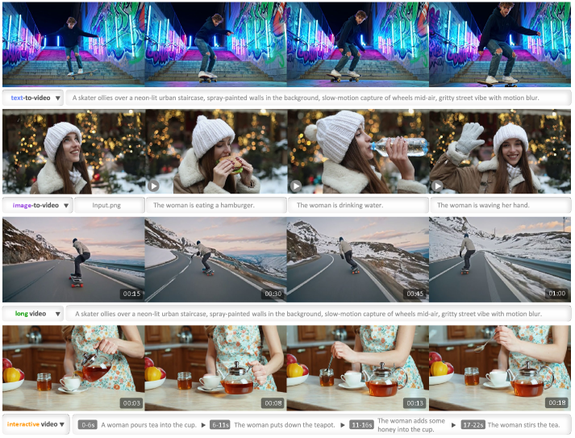

| 项目 | 内容 |
|------|------|
| **标题** | LongCat-Video Technical Report |
| **作者** | Meituan LongCat Team |
| **机构** | 美团 |
| **论文** | https://arxiv.org/abs/2510.22200 |
| **代码** | https://github.com/meituan-longcat/LongCat-Video |
| **发布** | 2025年10月 |

## 二、核心创新

### 2.1 模型概况

**LongCat-Video** 是一个 **136 亿参数**的基础视频生成模型，在多种视频生成任务上表现出色，特别是在**高效、高质量长视频生成**方面。

| 指标 | 数值 |
|------|------|
| **参数量** | 13.6B |
| **架构** | Diffusion Transformer (DiT) |
| **支持任务** | Text-to-Video, Image-to-Video, Video-Continuation |
| **输出分辨率** | 720p, 30fps |
| **推理时间** | 分钟级 |
| **推理加速** | >10× |

### 2.2 四大核心特性

#### 特性一：统一多任务架构

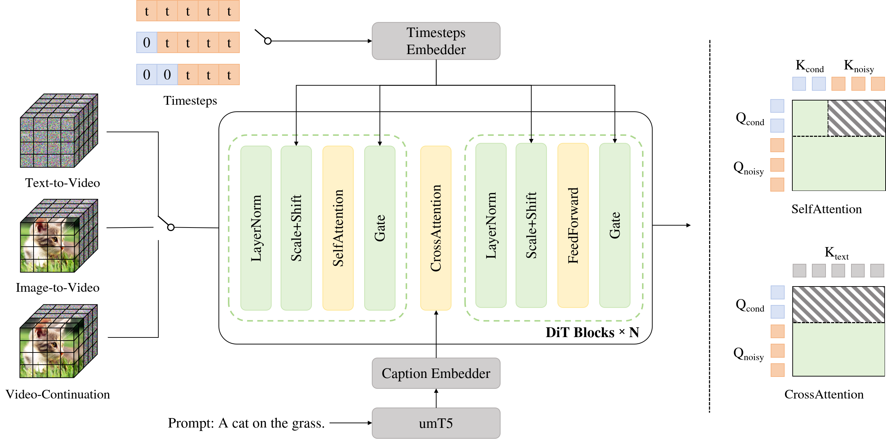

**核心思想**：通过条件帧数量区分任务类型。

```
┌─────────────────────────────────────────────────────────┐
│                统一多任务架构                               │
├─────────────────────────────────────────────────────────┤
│  Text-to-Video:    0 个条件帧（纯文本生成）                  │
│  Image-to-Video:   1 个条件帧（单图驱动）                    │
│  Video-Continuation: 多个条件帧（视频续写）                  │
├─────────────────────────────────────────────────────────┤
│  输入表示：                                                │
│  X = [X_cond, X_noisy]                                   │
│  t = [t_cond=0, t_noisy~[0,1]]                           │
│                                                          │
│  Block Causal Attention:                                 │
│  - 条件帧独立更新，不受噪声帧影响                            │
│  - 噪声帧可关注条件帧和噪声帧                               │
│  - 条件帧 KV 缓存，跨采样步骤复用                           │
└─────────────────────────────────────────────────────────┘
```

**Block Causal Attention**：
- 条件帧：`X_cond = Attention(Q_cond, K_cond, V_cond)`
- 噪声帧：`X_noisy = Attention(Q_noisy, [K_cond, K_noisy], [V_cond, V_noisy])`
- 条件帧不参与 cross-attention 计算
- KV 缓存提升长视频生成效率

#### 特性二：长视频生成

**核心思想**：通过 Video-Continuation 任务预训练，实现分钟级长视频生成。

**优势**：
- 无颜色漂移
- 无质量退化
- 时间一致性保持
- 支持交互式多指令生成

#### 特性三：高效推理


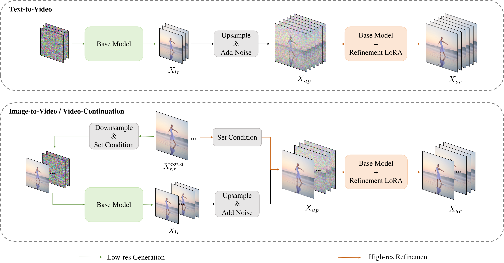

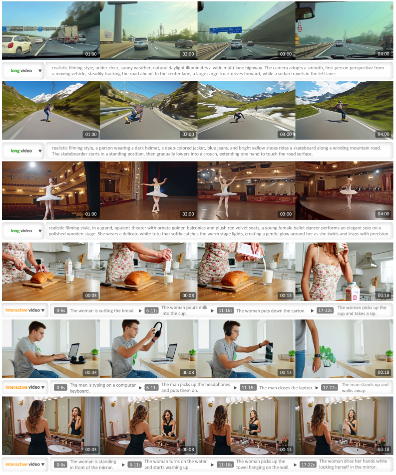

**核心思想**：Coarse-to-fine + Block Sparse Attention。

```
┌─────────────────────────────────────────────────────────┐
│                高效推理策略                                │
├─────────────────────────────────────────────────────────┤
│  1. LCM 蒸馏：50步 → 16步                                │
│  2. Coarse-to-fine：                                     │
│     - Stage 1: 480p, 15fps（粗生成）                      │
│     - Stage 2: 720p, 30fps（精细优化）                     │
│  3. Block Sparse Attention：                             │
│     - 稀疏度 93.75%                                      │
│     - 计算量 <10% 标准注意力                               │
│     - 近无损质量                                          │
└─────────────────────────────────────────────────────────┘
```

**加速效果**：

| 设置 | 采样步数 | 延迟 | 加速比 |
|------|----------|------|--------|
| 720p 原生生成 | 50 | 1429.5s | 1.0× |
| LCM 蒸馏 | 16 | 244.6s | 5.8× |
| LCM + C2F | 16/5 | 135.3s | 10.6× |
| LCM + C2F + BSA | 16/5 | 116.5s | **12.3×** |
| LCM + C2F + BSA (189帧) | 16/5 | 142.0s | 10.1× |

#### 特性四：多奖励 GRPO 训练

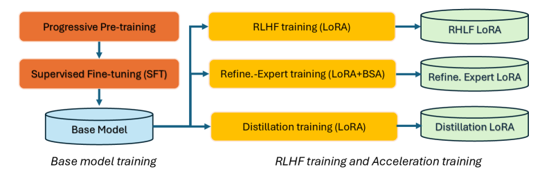

**核心思想**：使用多个奖励模型进行强化学习，避免单一奖励的 reward hacking。

**三个奖励模型**：

| 奖励模型 | 评估维度 | 特点 |
|----------|----------|------|
| **VQ (HPSv3)** | 视觉质量 | HPSv3-general + HPSv3-percentile |
| **MQ (VideoAlign)** | 运动质量 | 灰度视频训练，避免颜色偏好 |
| **TA (VideoAlign)** | 文本-视频对齐 | 保留原始颜色输入 |

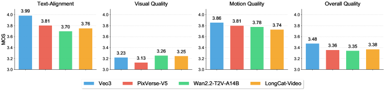

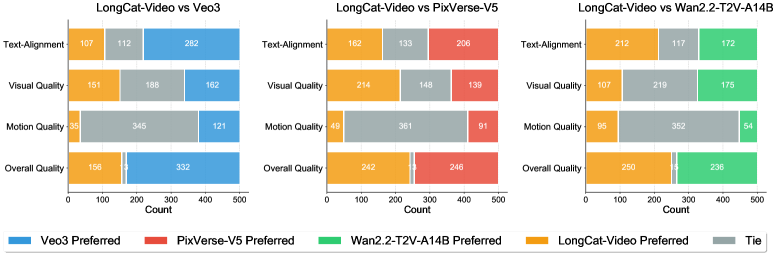

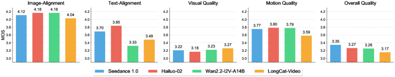

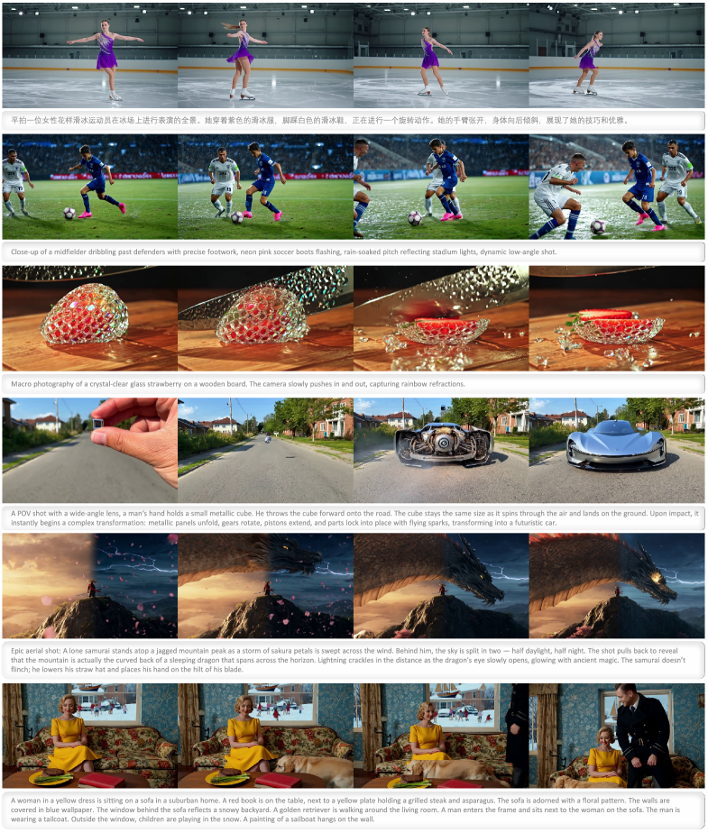

**GRPO 改进技术**：

1. **固定随机时间步**：隔离奖励变化，精确信用分配
2. **截断噪声调度**：阈值 τ=0.45，增强 SDE 采样多样性
3. **Policy/KL Loss 重加权**：消除梯度消失和小时间步问题
4. **Max Group Std**：使用跨组最大标准差，提高训练稳定性

**多奖励效果**：
- 防止单一奖励的 reward hacking
- 运动奖励抵消 HPSv3 引起的静态倾向
- 平衡提升所有维度的质量

---

## 三、模型架构

### 3.1 网络架构

| 组件 | 配置 |
|------|------|
| **架构** | 标准 DiT，单流 Transformer |
| **层数** | 48 |
| **隐藏大小** | 4096 |
| **FFN 隐藏大小** | 16384 |
| **注意力头数** | 32 |
| **AdaLN Embedding** | 512 |
| **VAE** | WAN2.1 VAE（4×8×8 压缩） |
| **Patchify** | 1×2×2 |
| **总压缩比** | 4×16×16 |
| **文本编码器** | umT5（中英双语） |
| **位置编码** | 3D RoPE |

### 3.2 VAE 和文本编码器

**VAE 压缩**：
- 时间维度：4×
- 空间维度：8×8
- Patchify 额外压缩：1×2×2
- 总压缩比：4×16×16

**文本编码器**：
- umT5：多语言文本编码器
- 支持中英文描述

### 3.3 Block Causal Attention

> 详见上方 Figure 5（统一架构图）中的 Block Causal Attention 部分。

**设计原则**：
- 条件帧和噪声帧分离处理
- 条件帧：仅自我关注，不被噪声帧影响
- 噪声帧：可关注条件帧和噪声帧
- 条件帧不参与 cross-attention

**优势**：
- 条件帧 KV 缓存，跨采样步骤复用
- 训练和推理一致性
- 提升长视频生成效率

---

## 四、训练策略

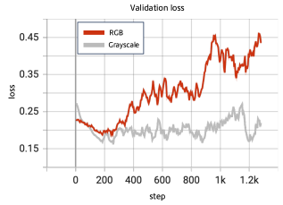

### 4.1 数据处理

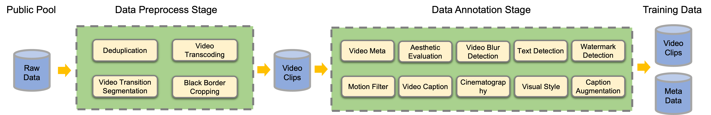

**数据处理流程**：
1. **数据采集**：多源视频数据
2. **去重**：视频 ID 和 MD5 哈希
3. **场景分割**：PySceneDetect + TransNetV2
4. **黑边裁剪**：FFMPEG
5. **标注**：多维度元数据

**数据标注**：
- 基础元数据（时长、分辨率、帧率、比特率）
- 美学评分
- 模糊评分
- 文字覆盖
- 水印检测
- 运动信息（光流）

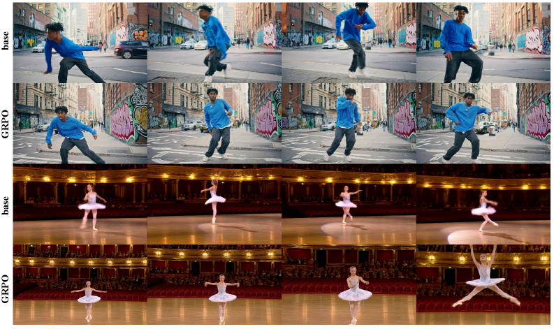

**视频标注工作流**：
1. **基础描述**：LLaVA-Video 微调，提升时间理解
2. **摄影和视觉风格**：Qwen2.5VL 识别镜头运动、画面类型
3. **描述增强**：中英翻译、摘要生成、风格多样化


### 4.2 渐进式预训练

| 阶段 | 训练任务 | 分辨率 | 学习率 | 迭代次数 |
|------|----------|--------|--------|----------|
| 1 | T2I | 256p | 1e-4 | 285k |
| 2 | T2I + T2V | 256p×93帧 | 1e-4 | 140k |
| 3 | T2I + T2V + I2V + VC | 256p×93帧 | 5e-5 | 164k |
| 4 | T2I + T2V + I2V + VC | 480p×93帧 | 5e-5 | 36k |
| 5 | T2I + T2V + I2V + VC | 480p+720p×93帧 | 2e-5 | 53k |

**关键设计**：
- 图像训练 → 视频训练 → 多任务训练
- 低分辨率 → 高分辨率
- VC 任务：条件帧独立噪声扰动，增强颜色漂移鲁棒性
- Bucket 策略：按宽高比分组，最大化计算效率

### 4.3 SFT 训练

| 任务 | 分辨率 | 学习率 | 迭代次数 |
|------|--------|--------|----------|
| T2I + T2V + I2V + VC | 480p+720p×93帧 | 1e-5 | 7.5k |

**数据筛选**：
- 美学评分、视频质量、运动质量等多指标
- 按描述嵌入空间密度反比采样
- 专门数据集增强指令遵循（镜头运动、视觉风格）

### 4.4 RLHF 训练

> GRPO 相关图表详见上方「特性四：多奖励 GRPO 训练」章节。

| 任务 | 分辨率 | 组大小 | 提示数/步 | 采样步数 | SDE步数范围 | 学习率 | 迭代次数 |
|------|--------|--------|-----------|----------|-------------|--------|----------|
| T2V | 480p+720p×93帧 | 4 | 64 | 16 | [0, 6] | 1e-4 | 0.5k |

**关键发现**：
- 仅使用 T2V 任务训练
- 改进泛化到 I2V 和 VC 任务
- 未来工作：任务特定奖励（如 VC 的质量退化惩罚）

### 4.5 加速训练

**CFG 蒸馏**：
- 使用 CFG-Zero 蒸馏通用负提示
- 默认引导强度 4.0
- 蒸馏后 16 步 ≈ 原始 50+ 步质量

**CM 蒸馏**：
- 一致性模型蒸馏
- 进一步减少采样步骤

**Refinement Expert 训练**：
- 全注意力训练 → 稀疏注意力训练
- 稀疏度 93.75%
- 初始噪声强度 t_thresh = 0.5
- GLCM 筛选纹理丰富数据
- 退化操作增强细节恢复能力
- 混合帧率训练，支持空间和时空优化

---

## 五、高效推理技术

### 5.1 Coarse-to-fine 生成

> Coarse-to-fine 相关图表详见上方「特性三：高效推理」章节中的 Figure 10、Figure 11。

**流程**：
1. **Stage 1**：生成 480p, 15fps 视频（基础模型）
2. **Stage 2**：三线性插值上采样 → 720p, 30fps
3. **Refinement Expert**：LoRA 微调，5 步去噪

**Refinement Flow Matching**：
```
x_thresh = (1 - t_thresh) · x_up + t_thresh · ε
v_t' = (x_0 - x_thresh) / t_thresh
```

**关键设计**：
- t_thresh = 0.5：保持低分辨率结构信息
- 仅 5 个采样步骤
- 数值缩放对齐基础模型
- 支持条件帧优化（I2V、VC）

**质量提升**：
- 纹理细节优于原生 720p
- 可纠正局部畸变

### 5.2 Block Sparse Attention (BSA)

> BSA 示意图详见上方「特性三：高效推理」章节中的 Figure 12。

**3D Block Sparse Attention**：
1. 将 query 和 key 分割为 t×h×w 的 3D 块
2. 计算 query 块与每个 key 块的平均相似度
3. 选择 top-r 个最相似的 key 块
4. 仅在选中的 key 块上计算标准注意力

**特点**：
- 开源前向和反向实现
- 支持 Ring Block Sparse Attention（Context Parallelism）
- 可自定义稀疏模式（CDF、2D+1D）
- top-k 模式：训练后近无损

**效果**：
- 稀疏度 93.75%
- 计算量 <10% 标准注意力
- 近无损质量

### 5.3 训练基础设施

**分布式训练**：
- DeepSpeed-Zero2
- Context Parallelism
- Ring Attention
- Activation Checkpointing

**混合分辨率训练**：
- Bucket 策略：相似分辨率分组
- 缓存机制：消除 VAE 操作的计算气泡

**MFU**：33% - 38%

---

## 六、评估结果

### 6.1 内部基准评估

**评估维度**：

| 维度 | 描述 |
|------|------|
| **Text-Alignment** | 文本语义理解准确性 |
| **Visual Quality** | 可信度 + 真实感 |
| **Motion Quality** | 运动轨迹连贯性、动作平滑性 |
| **Overall Quality** | 综合质量评分 |
| **Image-Alignment** | I2V 任务：保持参考图属性 |

**评估方法**：
- **MOS (Mean Opinion Score)**：5 分制绝对评分
- **GSB (Good-Same-Bad)**：成对相对评估
- **自动评估**：训练视觉语言评判模型（与人工相关性 >0.92）

**评估协议**：
- 1,628 个样本（1,228 T2V + 400 I2V）
- 3 名标注员独立标注
- 差异大时额外 2 名标注员
- 人工+自动加权平均（2:1）

#### Text-to-Video 评估

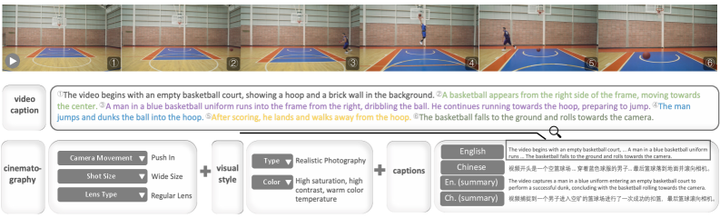

**MOS 评估**（vs Veo3, PixVerse-V5, Wan 2.2-T2V-A14B）：

| 维度 | LongCat-Video | Veo3 | PixVerse-V5 | Wan 2.2 |
|------|---------------|------|-------------|---------|
| Visual Quality | 高 | 高 | 低 | 高 |
| Overall Quality | **最高之一** | 最高 | 中 | 中 |
| Text-Alignment | 强 | 最强 | - | - |

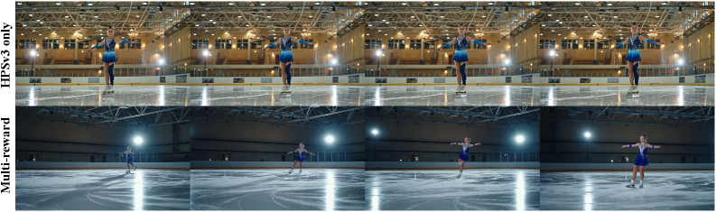

**GSB 评估**：
- vs PixVerse-V5：几乎持平（242 vs 246），视觉质量优势
- vs Wan 2.2-T2V-A14B：**明显优于**，文本对齐和运动质量领先

#### Image-to-Video 评估

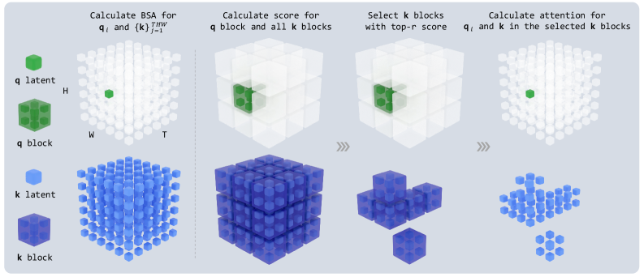

**MOS 评估**（vs Seedance 1.0, Hailuo-2, Wan 2.2-I2V-A14B）：

| 维度 | LongCat-Video | Seedance 1.0 | Hailuo-2 | Wan 2.2 |
|------|---------------|--------------|----------|---------|
| Visual Quality | **3.27（最高）** | - | - | - |
| Image-Alignment | 4.04 | - | **4.18** | 4.18 |
| Motion Quality | 3.59 | - | **3.80** | - |
| Overall Quality | 3.17 | **3.35** | - | - |

**分析**：视觉质量领先，但图像对齐和运动质量有提升空间。

### 6.2 公开基准评估

**VBench 2.0 评估**：

| 模型 | 开源 | 创造性 | 常识 | 可控性 | 人类保真度 | 物理 | 总分 |
|------|------|--------|------|--------|------------|------|------|
| HunyuanVideo | ✓ | 41.84% | 63.44% | 28.60% | 82.41% | 60.20% | 55.30% |
| Wan 2.1 | ✓ | 55.25% | 63.98% | 37.32% | 81.60% | 62.84% | 60.20% |
| Sora-480p | ✗ | 60.57% | 64.32% | 22.09% | 87.72% | 57.18% | 58.38% |
| Kling 1.6 | ✗ | 48.58% | 65.45% | 33.05% | 83.56% | 64.35% | 59.00% |
| Vidu Q1 | ✗ | 56.54% | 65.98% | 38.13% | 81.24% | 71.63% | **62.70%** |
| Seedance 1.0 Pro | ✗ | 53.04% | 64.31% | 39.84% | 77.06% | 64.81% | 59.81% |
| Veo3 | ✗ | 60.85% | 69.48% | **47.04%** | 86.88% | **69.35%** | **66.72%** |
| **LongCat-Video** | ✓ | 54.73% | **70.94%** | 44.79% | 80.20% | 59.92% | **62.11%** |

**关键发现**：
- **总分 62.11%**：开源模型最高，仅次于 Veo3 和 Vidu Q1
- **常识 70.94%**：**所有模型最高**，运动合理性和物理规律领先
- **可控性 44.79%**：开源模型最高
- 开源模型中表现最强

---

## 七、总结

### 核心贡献

1. **统一多任务架构**：
   - 单模型支持 T2V、I2V、VC
   - Block Causal Attention + KV 缓存
   - 条件帧数量区分任务类型

2. **长视频生成**：
   - Video-Continuation 任务预训练
   - 分钟级视频生成
   - 无颜色漂移和质量退化

3. **高效推理**：
   - Coarse-to-fine：480p → 720p
   - Block Sparse Attention：93.75% 稀疏度
   - LCM 蒸馏：50步 → 16步
   - 总加速 >10×

4. **多奖励 GRPO**：
   - VQ + MQ + TA 三奖励
   - 固定随机时间步 + 截断噪声调度
   - Policy/KL Loss 重加权
   - Max Group Std
   - 防止 reward hacking

5. **强大性能**：
   - VBench 2.0 开源最高（62.11%）
   - 常识维度所有模型最高（70.94%）
   - 与闭源模型竞争力

### 关键数据

| 指标 | 数值 |
|------|------|
| **参数量** | 13.6B |
| **输出分辨率** | 720p, 30fps |
| **推理加速** | >10× |
| **BSA 稀疏度** | 93.75% |
| **VBench 2.0 总分** | 62.11% |
| **VBench 常识** | 70.94%（最高） |
| **MFU** | 33%-38% |
| **GRPO 组大小** | 4 |
| **SDE 步数范围** | [0, 6] |

### 技术影响

LongCat-Video 证明了：
- **统一多任务架构**是视频生成的有效范式
- **Video-Continuation 预训练**是长视频生成的关键
- **Block Sparse Attention**可高效处理高分辨率视频
- **多奖励 GRPO**可有效提升视频质量并防止 reward hacking
- **Coarse-to-fine 策略**不仅提升效率，还可改善质量

### 与同类模型比较

| 模型 | 参数量 | 开源 | 特点 |
|------|--------|------|------|
| **Wan 2.1/2.2** | 14B | ✓ | 当前开源 SOTA |
| **HunyuanVideo** | - | ✓ | 腾讯开源 |
| **CogVideoX** | - | ✓ | 智谱开源 |
| **Sora** | - | ✗ | OpenAI |
| **Veo3** | - | ✗ | Google |
| **Seedance 1.0** | - | ✗ | 字节跳动 |
| **LongCat-Video** | 13.6B | ✓ | 统一多任务 + 长视频 + BSA |

LongCat-Video 在开源模型中表现最强，特别是在常识理解和可控性方面。

### 未来方向

1. **物理知识建模**：更好的物理规律理解
2. **多模态记忆集成**：视频生成中的多模态记忆
3. **LLM/MLLM 知识融合**：利用语言模型知识
4. **任务特定奖励**：VC 任务的质量退化惩罚

---

## 八、参考资源

- **论文**: https://arxiv.org/abs/2510.22200
- **代码**: https://github.com/meituan-longcat/LongCat-Video

### 相关论文

- DiT: https://arxiv.org/abs/2212.09748
- Flow Matching: https://arxiv.org/abs/2210.02747
- GRPO: https://arxiv.org/abs/2402.03300
- WAN 2.1: https://arxiv.org/abs/2503.20314
- HunyuanVideo: https://arxiv.org/abs/2412.03603
- Seedance: https://arxiv.org/abs/2506.09113
- VBench: https://arxiv.org/abs/2311.17982
- FlashAttention3: https://arxiv.org/abs/2407.08691
- Block Sparse Attention: https://arxiv.org/abs/2502.11089
