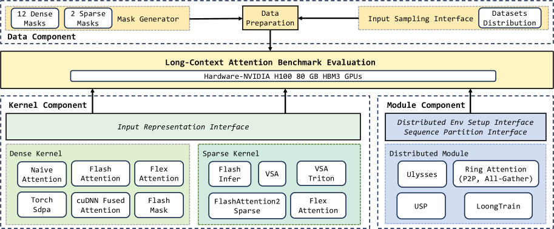
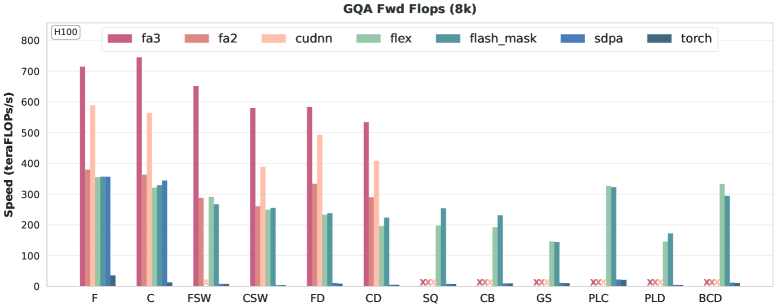
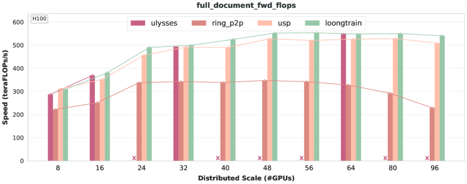

# LongCA-bench: 长上下文注意力基准测试

## 一、论文概述

| 项目 | 内容 |
|------|------|
| **标题** | Long-Context Attention Benchmark: From Kernel Efficiency to Distributed Context Parallelism |
| **作者** | Tao Bu, Qiangang Wang, Bowen Zeng, Hanwen Sun, Yunpeng Huang, Chun Cao, Jingwei Xu |
| **机构** | NJU (南京大学) 等 |
| **论文** | https://arxiv.org/abs/2510.17896 |
| **发布** | 2025-10-19 |
| **代码** | https://github.com/NJUDeepEngine/LongCA-bench |

## 二、核心思想

### 问题定义

Transformer 注意力机制的二次复杂度在长上下文训练中成为主要瓶颈。当前研究沿两个方向推进：
1. **内核级优化**：加速密集和稀疏注意力算子
2. **模块级策略**：分布式注意力/上下文并行训练

然而，**系统性评估仍然不足**：
- 算子级比较不完整
- 上下文并行策略通常与特定框架绑定
- 跨上下文的性能分析不清晰

### 解决方案概述

**LongCA-bench** 是一个统一基准，集成代表性注意力内核和上下文并行机制，提供模块化和可扩展的评估接口。

**核心组件**：
1. **统一数据准备接口**：标准化预处理
2. **统一输入表示接口**：支持 7 种密集和 5 种稀疏注意力内核
3. **优化的上下文并行框架**：包含 5 种分布式注意力机制

**评估维度**：
- **注意力掩码模式**：影响效率、可扩展性和可用性
- **序列长度和分布式规模**：决定极端长上下文训练下的性能

**实验规模**：最多 **96 GPU** 集群

## 三、技术架构

### 整体框架

**LongCA-bench 架构**：
1. **数据准备**：统一接口处理不同掩码模式和序列长度
2. **注意力内核**：7 种密集 + 5 种稀疏内核
3. **分布式注意力**：5 种上下文并行机制

### 注意力掩码模式

**14 种掩码模式**（2 大类）：

#### 静态掩码（12 种）

**规则掩码（6 种）**：
| 掩码 | 说明 | 典型应用 |
|------|------|----------|
| FULL | 完全注意力 | 预训练 |
| CAUSAL | 因果注意力 | 自回归生成 |
| FULL DOCUMENT | 完全文档注意力 | 序列打包 |
| CAUSAL DOCUMENT | 因果文档注意力 | 批处理 |
| FULL SLIDING WINDOW | 全滑动窗口 | 稀疏注意力 |
| CAUSAL SLIDING WINDOW | 因果滑动窗口 | 稀疏注意力 |

**异构掩码（6 种）**：
| 掩码 | 说明 | 典型应用 |
|------|------|----------|
| SHARED QUESTION | 共享问题掩码 | 奖励模型 |
| GLOBAL SLIDING | 全局滑动 | 全局+局部 |
| CAUSAL BLOCKWISE | 因果块级 | 上下文学习 |
| PREFIX LM CAUSAL | 前缀语言模型 | T5 风格 |
| PREFIX LM DOCUMENT | 前缀文档 | 文档级 |
| BLOCK CAUSAL DOCUMENT | 块因果文档 | 多模态 |

#### 动态掩码（2 种）

| 掩码 | 说明 |
|------|------|
| Uniform Block | 固定块大小（如 64×64） |
| Variable Block | 可变块大小 |

### 密集注意力内核

**集成的 7 种密集内核**：

| 内核 | 类型 | 特点 |
|------|------|------|
| Naive-Torch | 基线 | 支持任意掩码，二次复杂度 |
| SDPA | 基线 | PyTorch 融合实现 |
| FA | 硬件优化 | FlashAttention v1 |
| FA2 | 硬件优化 | FlashAttention v2 |
| FA3 | 硬件优化 | FlashAttention v3（Hopper 优化） |
| cuDNN-Fused | 硬件优化 | NVIDIA cuDNN 融合内核 |
| FlexAttention | 灵活 | 基于布尔函数的通用融合算子 |
| FlashMask | 灵活 | 列式掩码表示优化 |

**掩码支持**：

| 内核 | 规则掩码 | 异构掩码 |
|------|----------|----------|
| FA 系列 | ✓ | ✗ |
| cuDNN-Fused | ✓ | ✗ |
| FlexAttention | ✓ | ✓ |
| FlashMask | ✓ | ✓ |

### 稀疏注意力内核

**集成的 5 种稀疏内核**：

| 内核 | 块大小 | MHA/GQA | 前向/后向 | 性能 |
|------|--------|---------|-----------|------|
| VSA | 64 only | MHA only | Both | High |
| Triton VSA | 64 only | MHA only | Both | Medium |
| FA2 Sparse | 128 only | GQA ✓ | Forward only | Medium |
| FlexAttention | Arbitrary | GQA ✓ | Both | Low |
| FlashInfer | Arbitrary | GQA ✓ | Forward only | Medium |

### 分布式注意力机制

**集成的 5 种分布式注意力机制**：

| 机制 | 设计类型 | 通信模式 | 特点 |
|------|----------|----------|------|
| **Ulysses** | All-to-All | 集体通信 | 简单通用，受 head 数限制 |
| **Ring P2P** | Ring | 点对点 | 强扩展性，计算-通信重叠 |
| **Ring All-Gather** | Ring | 全收集 | 单次 KV 收集 |
| **USP** | 混合 | All-to-All + Ring | 二维方案 |
| **LoongTrain** | 混合 | All-to-All + DoubleRing | 双级滑动窗口 |

**三种架构设计**：

1. **All-to-All 设计**（Ulysses）：
   - 分区序列和 head 维度
   - 使用 All-to-All 通信切换并行维度
   - 简单但受 head 数限制

2. **Ring P2P 设计**：
   - 多轮环形点对点通信
   - 自然重叠计算和通信
   - 可能存在数值误差累积

3. **混合设计**（USP, LoongTrain）：
   - 内层：Ulysses（节点内带宽）
   - 外层：Ring（可扩展性）
   - LoongTrain 引入 DoubleRing Attention

## 四、实验结果

### 实验设置

**硬件**：
- NVIDIA H100 GPU（80GB HBM3）
- 单 GPU 内核评估
- 8-96 GPU 集群分布式评估

**配置**：
- BFloat16 精度
- 隐藏维度：128
- GQA (64:8) 和 MHA (64:64)
- 序列长度：1K-512K

### 密集内核性能

**关键发现**（8K 序列长度，GQA 64:8）：

| 内核 | 规则掩码性能 | 异构掩码支持 |
|------|-------------|--------------|
| Naive-Torch | 低（二次复杂度） | ✓ |
| SDPA | 中等 | ✓ |
| FA2 | 高 | ✗ |
| FA3 | **最高**（Hopper 优化） | ✗ |
| cuDNN-Fused | 高 | ✗ |
| FlexAttention | 中等 | ✓ |
| FlashMask | 中等（异构优化） | ✓ |

**关键洞察**：
- FA 系列和 cuDNN 不支持异构掩码
- FlexAttention 支持任意掩码但性能较低
- FlashMask 通过列式表示优化异构计算

### 稀疏内核性能

**功能对比**：

| 问题 | 涉及内核 |
|------|----------|
| 不支持块大小 64 | FA2 Sparse |
| 不支持块大小 128 | VSA |
| 不支持 GQA | VSA |
| 无后向计算 | FlashInfer |
| OOM 问题 | FlexAttention（长序列）、FlashInfer（小块） |

**性能对比**（50% 稀疏度）：
- VSA > Triton VSA > FlashInfer（块大小 64）
- FlashInfer > FA2 Sparse（块大小 128）
- 前向 pass 性能 > 后向 pass
- GQA 内存效率 > MHA

**关键发现**：
- 后向计算仍是主要瓶颈
- 需要更灵活、全面的内核
- 块大小 128 通常比 64 性能更好

### 分布式注意力性能

**评估配置**：
- 掩码：FULL, CAUSAL, FULL DOCUMENT, CAUSAL DOCUMENT
- 每设备序列长度：8K
- GPU 规模：8-96（12 服务器）
- 总上下文：64K-512K

**关键发现**：

| 机制 | 优势 | 局限 |
|------|------|------|
| **Ulysses** | 负载均衡好，通信开销低 | 受 head 数限制 |
| **Ring P2P** | FULL 场景最优 | DOCUMENT 场景波动 |
| **USP** | 性能最优 | - |
| **LoongTrain** | 前向略优 | 后向因同步开销无增益 |

**性能分析**：
- 节点间通信是主要瓶颈
- 混合架构（USP, LoongTrain）性能最优
- 变长输入（varlen）引入同步开销
- Ulysses 在 GQA 下需复制 KV head

## 五、核心发现总结

### 密集内核

| 发现 | 说明 |
|------|------|
| **FA3 最优** | Hopper 架构优化，规则掩码性能最高 |
| **异构掩码挑战** | FA 系列不支持，需 FlexAttention/FlashMask |
| **性能与通用性权衡** | 硬件优化内核性能高但掩码支持有限 |

### 稀疏内核

| 发现 | 说明 |
|------|------|
| **后向计算瓶颈** | 大多数稀疏内核仅支持前向 |
| **块大小影响** | 128 通常优于 64 |
| **内存挑战** | 小块和长序列易 OOM |
| **专业化优势** | 针对特定参数优化的内核性能更好 |

### 分布式注意力

| 发现 | 说明 |
|------|------|
| **混合架构最优** | USP 和 LoongTrain 性能最好 |
| **节点间瓶颈** | 通信是主要限制因素 |
| **变长开销** | varlen 输入引入显著同步开销 |
| **Ulysses 限制** | 受 head 数约束，GQA 需额外处理 |

## 六、技术影响

### 对长上下文训练的指导

- **内核选择**：根据掩码模式和硬件选择合适内核
- **分布式策略**：根据规模和通信拓扑选择上下文并行
- **掩码设计**：考虑内核支持限制

### 实际应用价值

- **公平比较**：统一分面评估不同方法
- **性能参考**：为实际部署提供基准数据
- **研究方向**：识别瓶颈和优化机会

### 开源贡献

- 统一评估框架
- 多种内核和分布式机制集成
- 可复现的实验结果

## 七、局限性

1. **内核覆盖**：未包含所有可能的注意力内核
2. **分布式规模**：最大 96 GPU，更大规模需要验证
3. **掩码支持**：分布式注意力仅支持 4 种掩码
4. **硬件依赖**：主要在 H100 上评估
5. **数值精度**：仅评估 BFloat16

## 八、相关工作

### 注意力内核

- **FlashAttention 系列**：Dao et al., 2022; Dao, 2023; Shah et al., 2024
- **FlexAttention**：Dong et al., 2024
- **FlashMask**：Wang et al., 2025a
- **VSA**：Zhang et al., 2025d
- **FlashInfer**：Ye et al., 2025

### 上下文并行

- **Ulysses**：Jacobs et al., 2023
- **Ring Attention**：Liu et al., 2023
- **USP**：Fang & Zhao, 2024
- **LoongTrain**：Gu et al., 2024

### 长上下文模型

- **GPT-4**：128K context
- **Gemini**：1M-10M context
- **DeepSeek**：Liu et al., 2024

## 九、参考资源

### 论文与代码

- **论文**: https://arxiv.org/abs/2510.17896
- **代码**: https://github.com/NJUDeepEngine/LongCA-bench

### 相关工作

- **FlashAttention**: Dao et al., 2022
- **FlashAttention-2**: Dao, 2023
- **FlashAttention-3**: Shah et al., 2024
- **FlexAttention**: Dong et al., 2024
- **Ulysses**: Jacobs et al., 2023
- **LoongTrain**: Gu et al., 2024

### 基准数据集

- **Pile**: Gao et al., 2020
- **ProLong**: Gao et al., 2024
- **SlimPajama**: Yaofu, 2024
