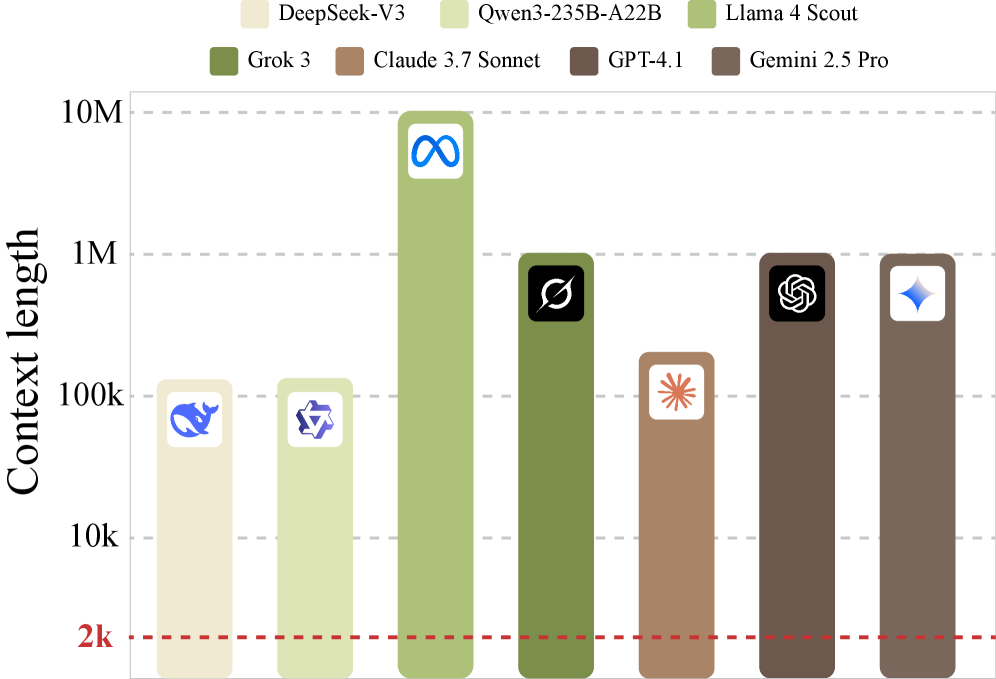
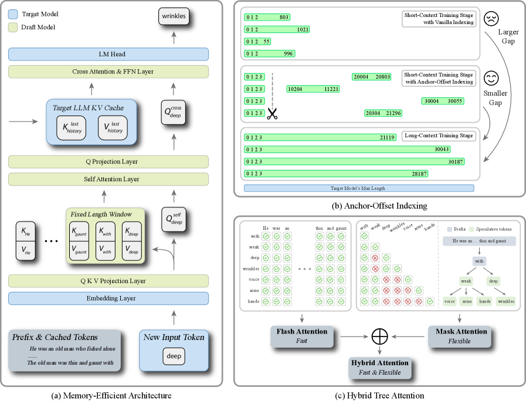
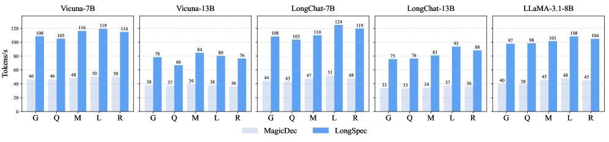
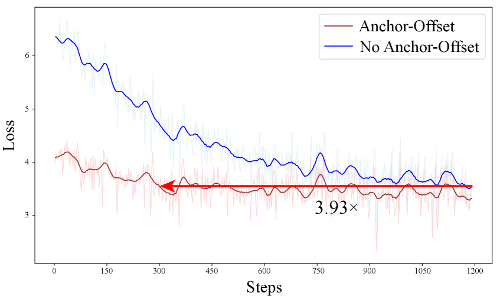
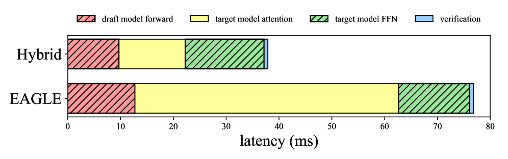
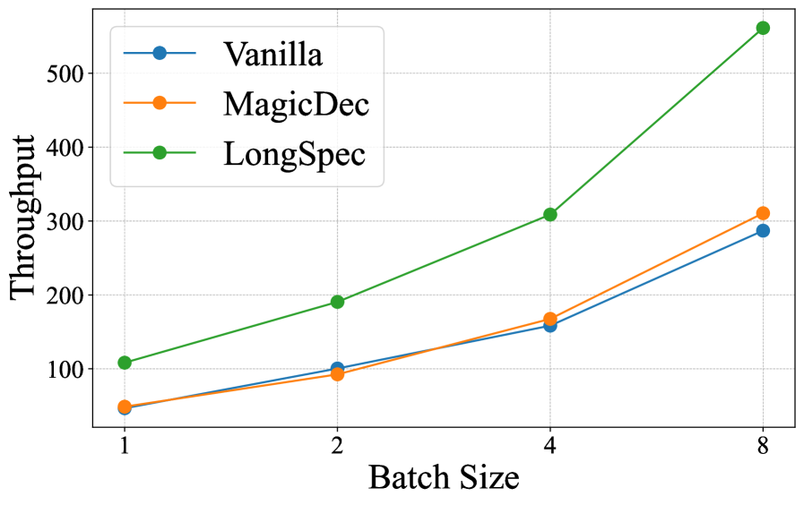

# LongSpec: Long-Context Lossless Speculative Decoding

## 一、论文概述

| 项目 | 内容 |
|------|------|
| **标题** | LongSpec: Long-Context Lossless Speculative Decoding with Efficient Drafting and Verification |
| **作者** | Penghui Yang, Cunxiao Du, Fengzhuo Zhang, Haonan Wang, Tianyu Pang |
| **机构** | Not specified in metadata |
| **论文** | https://arxiv.org/abs/2502.17421 |
| **发布** | 2025-02-24 |
| **许可** | Not specified |

## 二、核心思想

### 问题定义

大语言模型（LLM）处理长上下文的能力对 LLM agents 和长推理任务等新兴应用至关重要，这些应用现在可以处理扩展到数百万 token 的上下文窗口。在这些高要求的长上下文场景中，标准自回归解码的高推理延迟成为一个显著的瓶颈。

然而，**现有的 SOTA 投机解码方法主要针对短上下文设计和评估**（通常短于 4k token），存在三个关键挑战：

1. **内存开销过大**：自回归草稿模型需要维护自己的 KV cache，在长上下文推理时带来额外开销
2. **训练-推理不匹配**：使用 vanilla position indices 时，较小的位置索引比较大的位置索引出现频率更高，导致大位置索引训练不足
3. **树注意力效率低下**：现有树投机解码方法无法与 Flash Attention 兼容，在长上下文场景中效率低下

### 解决方案概述

**LongSpec** 是一个专为长上下文场景设计的无损投机解码框架，通过三个核心创新解决上述挑战：

1. **内存高效架构**：设计具有恒定内存开销的草稿模型，使用滑动窗口自注意力和无缓存交叉注意力
2. **Anchor-Offset Indices**：提出新的位置索引策略，确保大位置索引在短上下文数据上也能充分训练
3. **Hybrid Tree Attention**：高效整合树投机解码与 Flash Attention

**关键优势**：
- 无损加速（输出分布与目标模型完全一致）
- 恒定内存开销（独立于上下文长度）
- 兼容 Flash Attention
- 在长上下文理解和长推理任务上均有效

## 三、技术架构

### 整体框架

**LongSpec 框架包含三个核心组件**：

1. **Memory-Efficient Draft Model**（图 2a）
   - 滑动窗口自注意力层：捕获局部上下文信息
   - 交叉注意力层：从目标模型 KV cache 获取长上下文信息
   - 共享 Embedding Layer 和 LM Head

2. **Anchor-Offset Indices**（图 2b）
   - 保留前 4 个位置 [0,1,2,3] 作为 attention sink tokens
   - 后续 token 分配到从随机偏移开始的大连续索引
   - 例如：[0,1,2,3,8192,8193,8194,...]

3. **Hybrid Tree Attention**（图 2c）
   - 结合 Flash Attention 和 Triton 实现的自定义注意力
   - 高效处理树结构的投机和验证

### 核心算法

#### 内存高效架构

**设计动机**：
- EAGLE 的成功依赖于：(1) 目标模型提供的隐藏状态，(2) 自回归结构
- 但自回归草稿模型需要维护 KV cache，在长上下文时开销巨大

**架构设计**：

$$\text{Draft Model} = \text{CrossAttention}(\text{SlidingWindowSelfAttention}(\cdot), \text{TargetKV})$$

**关键特性**：
- **滑动窗口自注意力**：窗口大小设为 512，内存使用恒定
- **交叉注意力**：复用目标模型的 KV cache，无需额外存储
- **权重共享**：Embedding Layer 和 LM Head 与目标模型共享

**优势**：
- 对于 LLaMA-3（词汇量 128,256）和 Qwen-2.5（词汇量 152,064）等大词汇量模型，内存节省显著

#### Anchor-Offset Indices

**问题分析**：
- 使用 vanilla position indices（从 0 开始的连续整数）时，较小的位置索引出现频率更高
- 较大的位置索引训练更新不足，导致训练-推理不匹配
- RoPE base 固定后不能直接使用外推方法

**解决方案**：

$$\text{Position Indices} = [0, 1, 2, 3, \text{offset}, \text{offset}+1, \text{offset}+2, \ldots]$$

其中 offset 是从 [0, 15000] 或 [0, 30000] 范围内随机选择的整数。

**理论基础**：
- 利用 attention sink 现象：LLM 在处理长文本时，注意力权重主要集中在前 4 个 token 和最近的 token
- Anchor indices 和随机偏移确保每个位置索引都能得到充分训练

**训练策略**：
1. **第一阶段**：在 SlimPajama-6B 预训练数据集上使用 Anchor-Offset Indices 训练
2. **第二阶段**：在 Prolong-64k 长上下文数据子集上训练，获得处理长文本的能力
3. **第三阶段**：在自建的长上下文 SFT 数据集上微调
4. **Flash Noisy Training**：在所有三个阶段应用，缓解训练-推理不一致性

#### Hybrid Tree Attention

**问题**：
- 现有树投机解码方法无法与 Flash Attention 兼容
- 在长上下文场景中，注意力实现对性能影响巨大

**解决方案**：
- 结合 Flash Attention 和 Triton 实现的 `fused_mask_attn` 内核
- 目标模型的注意力层延迟从 49.92ms 降低到 12.54ms（约 75% 改进）

## 四、核心公式

### 接受长度

$$\tau = \text{平均每次目标模型前向传播接受的 token 数}$$

### 加速比

$$\text{Speedup} = \frac{\text{Tokens/s (LongSpec)}}{\text{Tokens/s (Vanilla FA)}}$$

### 内存开销

$$\text{Memory} = O(w \cdot d) \quad \text{(恒定，独立于上下文长度)}$$

其中 $w$ 是滑动窗口大小，$d$ 是隐藏维度。

## 五、实验结果

### 实验设置

**目标模型**：
- Vicuna-7B, Vicuna-13B
- LongChat-7B, LongChat-13B
- LLaMA-3.1-8B-Instruct
- QwQ-32B

**测试基准**：
- **长上下文理解**：GovReport, QMSum, Multi-News, LCC, RepoBench-P
- **数学推理**：AIME24, AMC, MATH500, Minerva Math

**基线方法**：
- Vanilla HF (HuggingFace attention)
- Vanilla FA (Flash Attention)
- PLD (Prompt Lookup Decoding)
- MagicDec

### 长上下文理解任务结果

**主要结果（T=0）**：

| 模型 | 数据集 | τ | Tokens/s | 加速比 |
|------|--------|---|----------|--------|
| Vicuna-7B | GovReport | 3.57 | 102.23 | 2.23× |
| Vicuna-7B | QMSum | 3.14 | 88.87 | 2.04× |
| Vicuna-7B | LCC | 3.73 | 107.30 | 1.99× |
| Vicuna-7B | RepoBench-P | 3.86 | 110.76 | 2.38× |
| Vicuna-13B | GovReport | 3.31 | 71.08 | 2.49× |
| Vicuna-13B | RepoBench-P | 3.59 | 77.22 | 2.65× |
| LongChat-7B | GovReport | 3.59 | 101.43 | 2.41× |
| LongChat-7B | RepoBench-P | 4.03 | 115.27 | 2.70× |
| LongChat-13B | RepoBench-P | 4.46 | 96.96 | 3.26× |
| LLaMA-3.1-8B | RepoBench-P | 3.39 | 91.28 | 1.69× |

**关键发现**：
- 平均接受长度约 3.5-4.0
- 最高加速比达 3.26×（LongChat-13B on RepoBench-P）
- 在 T=1 时仍保持约 2.5× 加速

### 消融实验

#### Anchor-Offset Indices

| 配置 | Multi-News τ | Multi-News Tokens/s | RepoBench-P τ | RepoBench-P Tokens/s |
|------|--------------|---------------------|---------------|---------------------|
| w/o Anchor-Offset | 3.20 | 85.98 | 3.26 | 85.21 |
| w/ Anchor-Offset | 3.36 | 91.11 | 3.39 | 91.28 |

**关键发现**：
- 使用 Anchor-Offset Indices 训练的模型初始损失和最终损失都更低
- 达到相同损失水平的速度快 3.93×

#### Hybrid Tree Attention

**关键发现**：
- 目标模型注意力层延迟从 49.92ms 降低到 12.54ms
- 约 75% 的延迟改进
- 草稿模型前向传播和目标模型 FFN 计算时间保持相当

### 长推理任务结果

**QwQ-32B 数学推理结果**：

| 数据集 | τ | Tokens/s | 加速比 |
|--------|---|----------|--------|
| AIME24 | 3.82 | 42.63 | 2.25× |
| AMC | 3.81 | 45.16 | 2.33× |
| Minerva | 3.65 | 44.51 | 2.29× |
| MATH500 | 3.95 | 48.36 | 2.47× |

**关键发现**：
- 平均加速 2.34×，平均接受 3.81 个 token
- QwQ-32B + LongSpec 的延迟甚至低于标准 7B 模型 + Flash Attention
- MagicDec 不适用于长推理任务（初始推理阶段草稿模型退化为目标模型）

### 吞吐量对比

## 六、核心创新总结

| 创新点 | 说明 | 优势 |
|--------|------|------|
| **内存高效架构** | 滑动窗口自注意力 + 无缓存交叉注意力 | 恒定内存开销，独立于上下文长度 |
| **权重共享** | Embedding Layer 和 LM Head 与目标模型共享 | 大幅减少内存消耗 |
| **Anchor-Offset Indices** | 随机偏移 + anchor tokens | 解决训练-推理不匹配问题 |
| **Hybrid Tree Attention** | Flash Attention + Triton 自定义内核 | 75% 注意力延迟改进 |
| **Flash Noisy Training** | 缓解训练-推理不一致性 | 额外开销可忽略 |

## 七、技术影响

### 对投机解码的改进

- **长上下文支持**：首次专门为长上下文场景设计的无损投机解码
- **内存效率**：恒定内存开销，适用于百万 token 上下文
- **兼容性**：与 Flash Attention 完全兼容
- **通用性**：在长上下文理解和长推理任务上均有效

### 与现有方法对比

| 方法 | 优势 | 局限 |
|------|------|------|
| **EAGLE** | 短上下文性能优秀 | 训练上下文长度有限（2048） |
| **MagicDec** | 大批大小有效 | 草稿模型过重，小批大小效率低 |
| **PLD** | 无需额外模型 | 检索不足时可能负加速 |
| **LongSpec** | 长上下文高效，内存恒定 | 需要训练专用草稿模型 |

### 实际应用价值

- **LLM Agents**：处理长上下文交互历史
- **长推理任务**：加速 QwQ-32B 等推理模型
- **代码补全**：大型代码仓库的高效补全
- **文档摘要**：长文档的快速摘要生成

## 八、局限性

1. **需要训练草稿模型**：虽然训练高效，但仍需要额外的训练步骤
2. **滑动窗口限制**：窗口大小为 512，可能限制极长距离依赖的建模
3. **单批大小优化**：主要在批大小为 1 的设置下评估
4. **模型兼容性**：需要与目标模型在参数（如 KV heads）上保持一致

## 九、相关工作

### 投机解码

- **Leviathan et al., 2023**：投机解码开创性工作
- **EAGLE 系列**：特征级自回归草稿模型
- **Medusa** (Cai et al., 2024)：多头预测

### 长上下文方法

- **MagicDec** (Chen et al., 2025b)：使用稀疏 KV cache 的草稿模型
- **TriForce**：MagicDec 的原型
- **PLD** (Saxena, 2023)：基于检索的投机解码

### 注意力优化

- **Flash Attention**：高效注意力实现
- **滑动窗口注意力** (Beltagy et al., 2020)：限制注意力范围

## 十、参考资源

### 论文

- **LongSpec**: https://arxiv.org/abs/2502.17421

### 相关工作

- **EAGLE**: Li et al., 2024c
- **MagicDec**: Chen et al., 2025b
- **PLD**: Saxena, 2023
- **Flash Attention**: Dao et al.

### 数据集

- **LongBench**: Bai et al., 2024
- **SlimPajama-6B**: Soboleva et al., 2023
- **Prolong-64k**: Gao et al., 2024
