# MAGI-1: Autoregressive Video Generation at Scale

## 一、论文概述

| 项目 | 内容 |
|------|------|
| **标题** | MAGI-1: Autoregressive Video Generation at Scale |
| **作者** | Sand. ai, Hansi Teng, Hongyu Jia, Lei Sun, Lingzhi Li, Maolin Li, Mingqiu Tang, Shuai Han, Tianning Zhang, W. Q. Zhang, et al. (39 authors) |
| **机构** | Sand AI |
| **论文** | https://arxiv.org/abs/2505.13211 |
| **代码** | https://github.com/SandAI-org/MAGI-1, https://github.com/SandAI-org/MagiAttention |
| **发布** | 2025-05-19 |
| **许可** | - |
| **领域** | cs.CV (Computer Vision and Pattern Recognition) |

## 二、核心思想

### 问题定义

世界建模和视频生成已成为人工智能的核心挑战，需要合成时间连贯且逼真的序列。然而，大多数大规模视频扩散模型依赖全局条件去噪架构，同时处理整个时间序列，忽略了时间数据固有的因果结构。

现有方法的局限性：
1. **非因果设计**：需要整个序列访问，不适合流式生成
2. **固定计算成本**：推理成本随视频长度增长
3. **任务特定微调**：不同任务需要单独训练

### 解决方案概述

**MAGI-1** 是一个世界模型，通过自回归预测视频块序列来生成视频：
- **Chunk-wise 自回归去噪**：将视频分为固定长度的块（24帧/块）
- **渐进式噪声**：训练时块间噪声单调递增
- **因果时间建模**：严格左到右时间一致性
- **流式生成**：支持实时、内存高效部署

### 核心成果

- 最大变体 **24B 参数**，支持 **4M tokens** 上下文
- 推理峰值资源使用与视频长度无关
- 统一支持文本到视频、图像到视频、视频续写
- VBench-I2V 和 Physics-IQ 基准达到 SOTA

## 三、技术架构

### Chunk-wise 自回归去噪

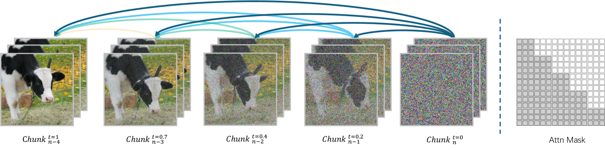

*Figure 1: (Left) MAGI-1 performs chunk-wise autoregressive denoising. The video is generated in chunks of 24 frames, where each chunk attends to all previously denoised chunks. (Right) A block-causal attention mask enforces temporal causality across chunks.*

### 核心公式

#### Chunk-wise 去噪

**块定义**：每个 chunk 包含 24 原始帧（24 FPS 下 1 秒视频）

**去噪过程**：
- 块间噪声单调递增
- 当前块去噪到一定程度后，下一块开始生成
- 条件于所有先前去噪的块

**并行处理**：
- 最多 4 个 chunk 同时推理
- 利用并行性减少延迟
- 支持实时流式生成

#### Block-Causal Attention

**注意力掩码**：
- 块内：双向注意力（空间建模）
- 块间：因果注意力（时间建模）
- 支持流水线和并行生成

#### 统一任务框架

**不同任务通过改变干净块比例实现**：
- T2V：从全噪声开始
- I2V：部分块为干净图像
- 视频续写：前序块为干净视频

### Transformer-based VAE

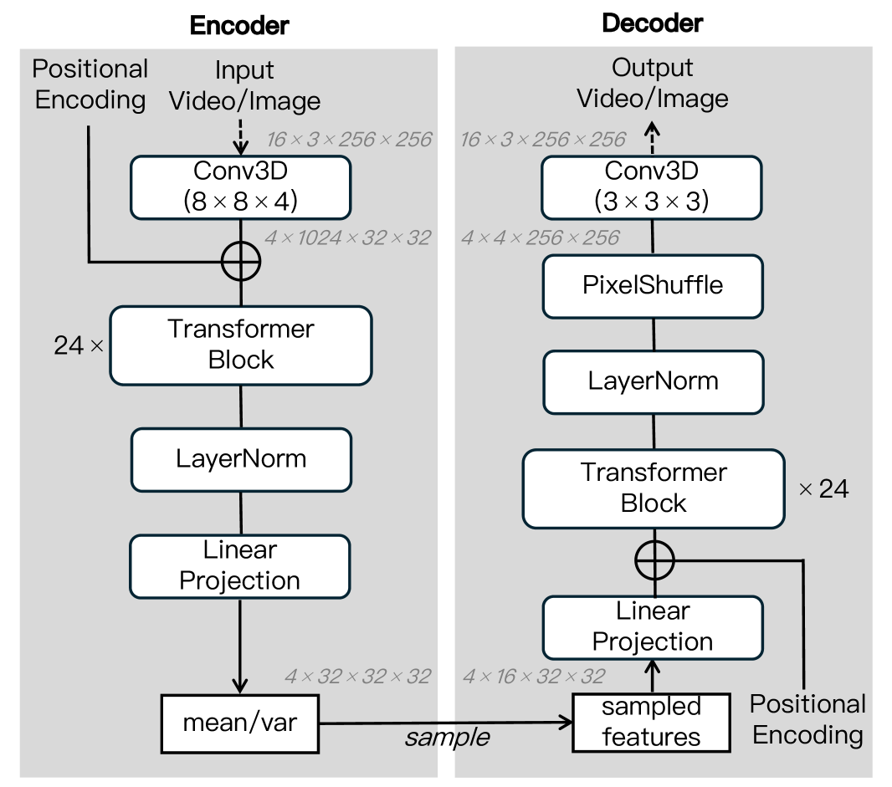

*Figure 2: Model Architecture of Transformer-based VAE.*

**架构特点**：
- 基于 Transformer（非 U-Net）
- 编码器：3D 卷积嵌入 + 24 个 Transformer 块
- 解码器：对称架构 + Pixel Shuffle
- 下采样：空间 8×，时间 4×
- 输出：16 通道均值 + 16 通道对数方差

**性能**：

| VAE | PSNR | 参数 (M) | 编码时间 (ms) | 解码时间 (ms) |
|-----|------|----------|---------------|---------------|
| OpenSoraPlan-1.2 | 28.39 | 239 | 51.08 | 17.48 |
| CogVideoX | 35.99 | 216 | 40.19 | 142.96 |
| HunyuanVideo | 37.27 | 246 | 124.39 | 47.11 |
| Wan2.1 | 35.95 | 127 | 51.91 | 79.43 |
| **MAGI-1** | **36.55** | 614 | 36.68 | **12.28** |

### 自回归去噪模型

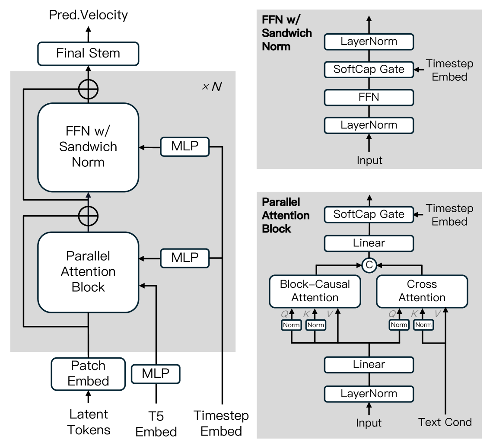

*Figure 3: Model Architecture of Auto-Regressive Denoising Model.*

**架构**：
- Transformer backbone
- Block-causal + 并行注意力模块
- 支持超长上下文的分布式注意力机制
- 高效训练策略

### 统一任务

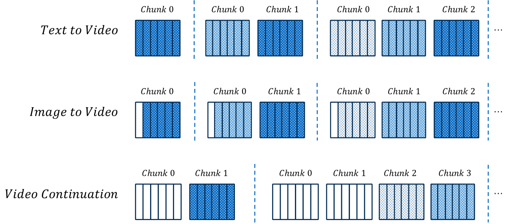

*Figure 4: Different tasks can be unified by varying the proportion of clean chunks.*

**任务统一**：
- 通过改变干净块比例实现不同任务
- 单一预训练过程覆盖所有任务
- 无需任务特定微调

### 时间步采样

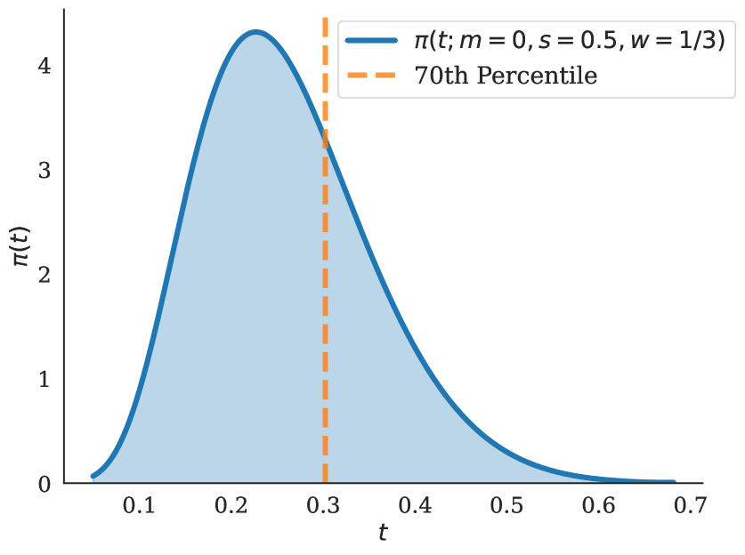

*Figure 5: The probability density of training timestep.*

**策略**：70% 计算分配在 t < 0.3

### Shortcut Distillation

**蒸馏策略**：
- 使用 Shortcut Model 蒸馏
- 显著减少推理扩散步骤数
- 保持时间一致性和样本质量

### 核心组件

| 组件 | 说明 | 关键参数 |
|------|------|----------|
| Transformer VAE | 潜在空间编码 | 614M 参数，8×空间+4×时间下采样 |
| AR Denoising Model | 自回归去噪 | 24B 参数，4M tokens 上下文 |
| MagiAttention | 分布式注意力 | 支持灵活掩码，超长序列 |
| Shortcut Distillation | 推理加速 | 减少扩散步骤 |
| PnP | 分布式训练优化 | 在线批处理，减少 padding |

## 四、核心创新

| 创新点 | 说明 | 理论/实验依据 |
|--------|------|---------------|
| Chunk-wise AR 去噪 | 因果时间建模 | 流式生成，固定计算成本 |
| Block-Causal Attention | 空间双向+时间因果 | 统一多任务框架 |
| Transformer VAE | 非 U-Net 架构 | 最快解码速度（12.28ms） |
| MagiAttention | 分布式灵活注意力 | 支持 4M tokens |
| PnP 训练策略 | 在线 Packing & Padding | 减少 GPU 气泡 |
| Shortcut Distillation | 推理加速 | 减少扩散步骤 |
| 统一任务框架 | 无任务特定微调 | T2V + I2V + 视频续写 |

## 五、代码实现分析

### 技术栈

- **模型框架**：Transformer (PyTorch)
- **VAE**：Transformer-based（非 U-Net）
- **注意力**：MagiAttention（自定义分布式注意力）
- **训练**：DP + CP + TP
- **推理**：W8A8 量化，多节点并行

### 关键实现细节

1. **MagiAttention**：
   - Flex-Flash-Attention (FFA)：支持灵活掩码
   - Dispatch Solver：负载均衡分片
   - Group-Cast/Group-Reduce：零冗余通信
   - 多阶段重叠调度

2. **分布式 Packing & Padding (PnP)**：
   - 在线批处理视频数据
   - 最小化 padding 开销
   - 解决 DP 负载不均衡

3. **推理优化**：
   - W8A8 量化
   - 多节点并行推理
   - Context Shuffle Overlap
   - 常量峰值内存

4. **数据管线**：
   - Actor 过滤
   - 去重
   - MLLM 高级过滤
   - 动态数据调整

### MagiAttention 架构

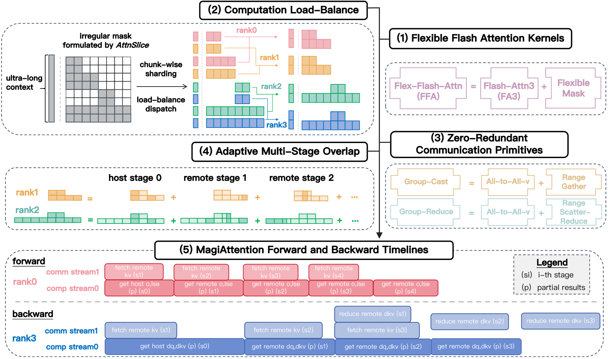

*Figure 14: Overview of MagiAttention: (1) Flex-Flash-Attention (FFA); (2) The dispatch solver; (3) Group-Cast and Group-Reduce primitives.*

### 掩码模式

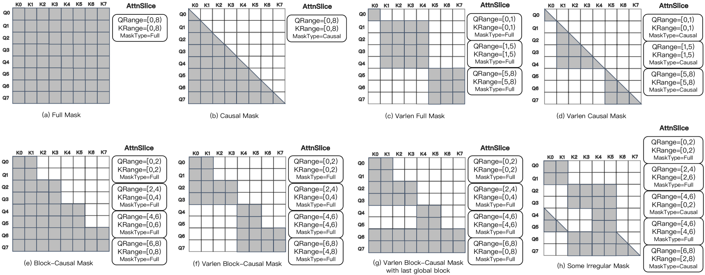

*Figure 15: Examples of mask patterns formulated by AttnSlice.*

**支持的掩码**：
- 标准 FA3 兼容模式
- 不规则掩码（超出 FA3 能力）
- Varlen block-causal 设计

### Slice 并行

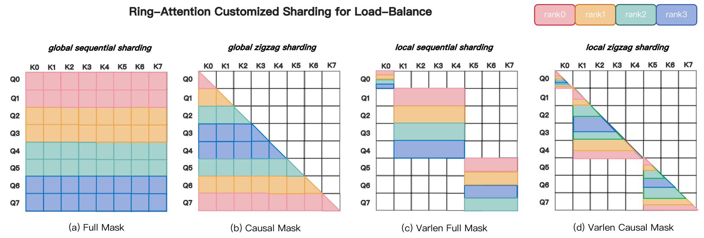

*Figure 21: Illustration of slice-level parallelism in FFA for both forward and backward kernels.*

### Group-Cast/Reduce

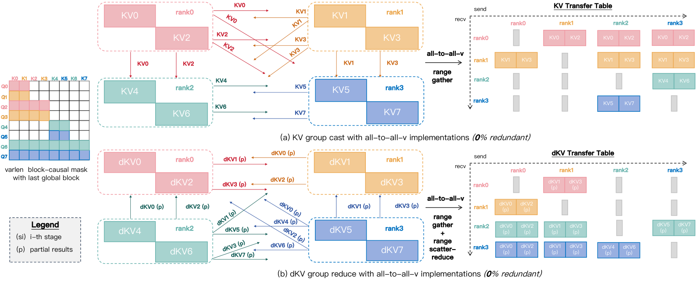

*Figure 24: Illustrination of group-cast/group-reduce primitives for zero redundancy.*

### 重叠调度

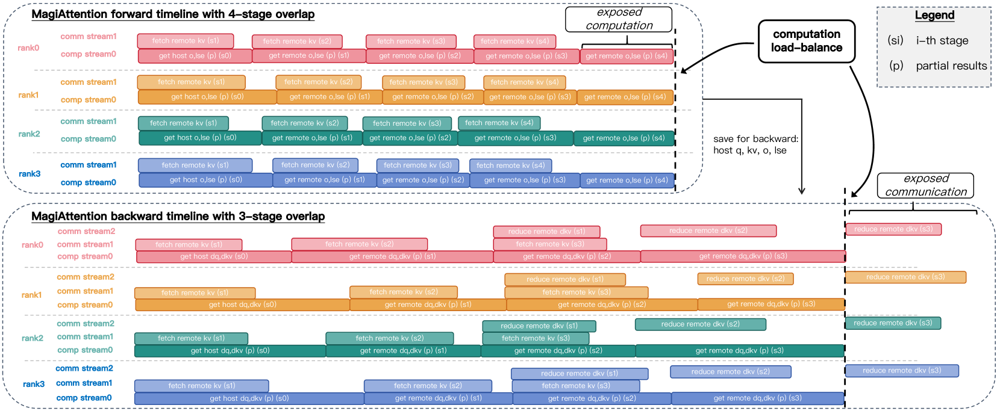

*Figure 25: Schematic of MagiAttention's multi-stage overlap scheduling.*

## 六、实验结果

### 感知评估

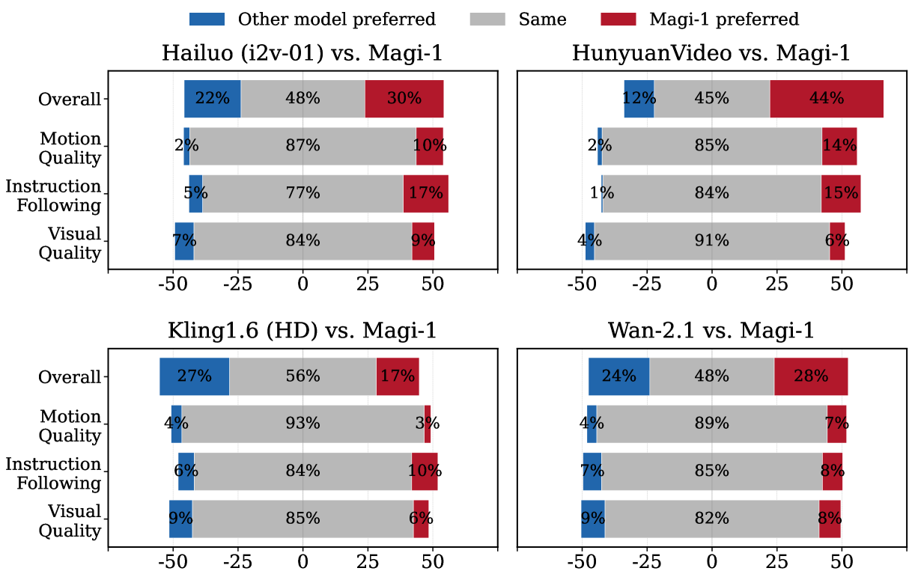

*Figure 16: Comparative evaluation against leading models. Blue indicates where users preferred the competitor.*

**评估维度**：
- Overall（整体）
- Motion Quality（运动质量）
- Instruction Following（指令遵循）
- Visual Quality（视觉质量）

**结果**：MAGI-1 在多个维度优于现有模型

### 物理评估

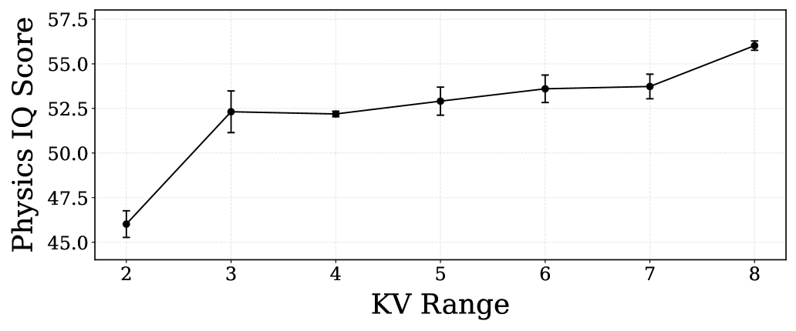

*Figure 18: Physical IQ scores as a function of historical context.*

**Physics-IQ 基准**：
- 评估模型捕捉物理动态的能力
- 预测未来帧
- 与真实序列对比

**结果**：MAGI-1 在物理合理性上表现优异

### 数据处理管线

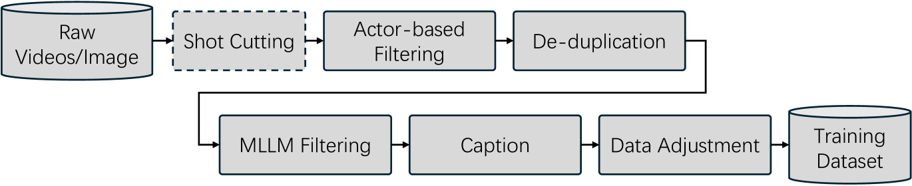

*Figure 13: Overview of our data processing pipeline.*

**管线步骤**：
1. Shot Cutting（仅视频）
2. Actor 过滤
3. 去重
4. MLLM 高级过滤
5. Caption
6. 训练数据调整

### 评估基准总结

| 评估类别 | 基准 | 指标 |
|----------|------|------|
| 感知评估 | In-house Human Evaluation | Overall, Motion Quality, Instruction Following, Visual Quality |
| 感知评估 | VBench-I2V | Automated Quality Metrics |
| 物理评估 | Physics-IQ-Benchmark | Physics-IQ-Score |

### 与其他方法对比

| 方法 | 架构 | 任务统一 | 流式生成 | 计算成本 | 最大参数 |
|------|------|----------|----------|----------|----------|
| Sora | 全局去噪 | 否 | 否 | O(n) | - |
| CogVideoX | 全局去噪 | 否 | 否 | O(n) | - |
| HunyuanVideo | 全局去噪 | 否 | 否 | O(n) | - |
| **MAGI-1** | **Chunk AR** | **是** | **是** | **O(1)** | **24B** |

## 七、相关工作

### 视频生成模型

- **Sora**：OpenAI 全局去噪视频生成
- **CogVideoX**：文本到视频生成
- **HunyuanVideo**：腾讯视频生成
- **Wan2.1**：阿里视频生成

### 扩散模型

- **DDPM**：去噪扩散概率模型
- **Flow Matching**：流匹配框架
- **Stable Diffusion**：图像生成

### 分布式训练

- **Megatron-LM**：大模型训练框架
- **DeepSpeed**：微软训练优化
- **Ring-Attention**：环形注意力

## 八、总结

### 核心贡献

1. **Chunk-wise AR 去噪**：因果时间建模，流式生成
2. **Block-Causal Attention**：空间双向+时间因果
3. **Transformer VAE**：最快解码速度
4. **MagiAttention**：分布式灵活注意力，支持 4M tokens
5. **PnP 训练策略**：在线批处理，减少 GPU 气泡
6. **Shortcut Distillation**：推理加速
7. **统一任务框架**：T2V + I2V + 视频续写

### 技术影响

- **视频生成**：SOTA 性能
- **流式推理**：常量峰值内存
- **统一框架**：无需任务特定微调
- **可扩展性**：24B 参数，4M tokens

### 局限性

1. **模型规模**：24B 参数需要大量计算资源
2. **数据需求**：需要高质量视频数据
3. **评估主观性**：感知评估依赖人工
4. **物理建模**：仍有限制

### 未来方向

- 扩展到更长视频
- 提升物理建模能力
- 优化推理效率
- 支持更多交互模式

## 九、参考资源

- **论文**: https://arxiv.org/abs/2505.13211
- **代码**: https://github.com/SandAI-org/MAGI-1, https://github.com/SandAI-org/MagiAttention
- **产品**: https://sand.ai
- **相关工作**: Sora, CogVideoX, HunyuanVideo, Wan2.1
- **评估基准**: VBench-I2V, Physics-IQ
- **分布式训练**: Megatron-LM, DeepSpeed
