# Mosaic: Unlocking Long-Context Inference for Diffusion LLMs via Global Memory Planning and Dynamic Peak Taming

## 一、论文概述

| 项目 | 内容 |
|------|------|
| **标题** | Mosaic: Unlocking Long-Context Inference for Diffusion LLMs via Global Memory Planning and Dynamic Peak Taming |
| **作者** | Liang Zheng, Bowen Shi, Yitao Hu, Jiawei Zhang, Ruofan Li, Sheng Chen, Wenxin Li, Keqiu Li |
| **机构** | - |
| **论文** | https://arxiv.org/abs/2601.06562 |
| **代码** | - |
| **发布** | 2026-01-10 |
| **许可** | - |
| **领域** | cs.LG (Machine Learning) |

## 二、核心思想

### 问题定义

基于扩散的大型语言模型（dLLMs）是一种有前景的范式，利用同时去噪实现全局规划和迭代细化。虽然这些能力对于长上下文生成特别有利，但部署此类模型面临来自严重系统低效的内存容量障碍。

现有推理系统不适合此范式：
1. **瓶颈转移**：与受累积 KV-cache 约束的自回归模型不同，dLLMs 受每步重新计算的瞬态激活限制
2. **动态内存峰值**：通用内存复用机制缺乏全局可见性，无法适应 dLLMs 在 logits 和 FFN 之间切换的动态内存峰值

### 解决方案概述

Mosaic 是一种内存高效的推理系统，从本地静态管理转向全局动态范式：

1. **Mask-only Logits Kernel**：仅为掩码 token 计算 logits，消除冗余
2. **Lazy Chunking Optimizer**：由在线启发式搜索驱动，自适应缓解动态峰值
3. **Global Memory Manager**：通过虚拟寻址解决碎片化问题

### 核心成果

- 内存峰值与平均比率平均降低 **2.71×**
- 相同硬件上最大推理序列长度增加 **15.89-32.98×**
- 延迟降低 **4.12%-23.26%**
- 不影响精度和速度

## 三、技术架构

### dLLM 推理管线

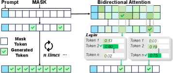

*Figure 1: dLLM inference pipeline.*

### 内存瓶颈分析

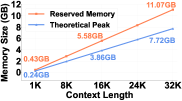

*Figure 4: Reserved memory vs. theoretical peak.*

### 动态内存峰值

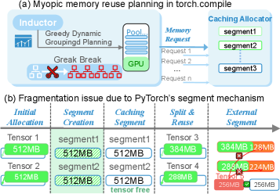

*Figure 6: (a) Myopic planning. (b) Fragment issue.*

### 核心观察

**观察 #1：内存瓶颈从 KV-Cache 转移到瞬态激活**

- 自回归模型：KV-cache 单调增长，成为主导内存消费者
- dLLMs：双向注意力导致 key/value 张量每步变化，缓存无效，瞬态激活主导内存

**观察 #2：Logits 计算在未掩码 token 上浪费内存**

- 现有系统每步为所有 token 计算 logits
- 只有掩码 token 被采样
- **Mask-Only Logits**：仅为掩码 token 计算 logits

**观察 #3：dLLM 推理呈现动态内存峰值**

- 两个主要瞬态内存峰值：logits 和 FFN
- 峰值随掩码比例 r_m 切换
- 高 r_m：logits 主导
- 低 r_m：FFN 主导

**观察 #4：短视的内存规划导致碎片化**

- 现有系统缺乏全局可见性
- 外部碎片化导致预留内存膨胀（21.78%-78.33% 膨胀率）

### 系统概览

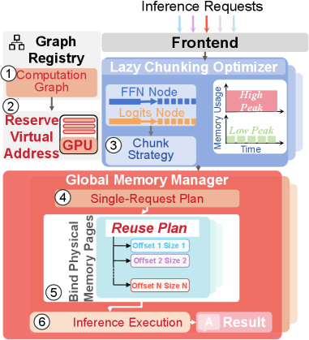

*Figure 7: Mosaic's overview.*

### 核心组件

#### 1. Mask-only Logits Kernel

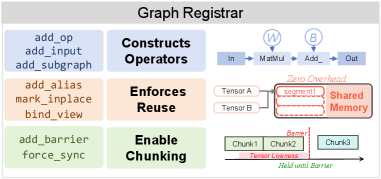

*Figure 8: Mosaic's graph registrar.*

**挑战**：Logits 计算需要内存连续输入，但掩码 token 分散在内存中。

**解决方案**：Gather-GEMM 融合内核
- 接受所有 token 隐藏状态和掩码索引
- 将计算分区为由并行 GPU 计算单元处理的 tiles
- 每个单元使用掩码索引进行间接寻址
- 消除中间缓冲区
- 单次内核启动实现高硬件效率

#### 2. Graph Registrar

- 轻量级图注册系统
- 符号原语定义参数化图模板
- 捕获模型拓扑结构和内存依赖
- 输入相关维度作为符号变量
- 保证整个模型结构的完整视图

#### 3. Lazy Chunking Optimizer

**动态峰值问题**：
- 内存在 logits 和 FFN 之间切换
- 需要自适应分块策略

**解决方案**：
- 在线启发式搜索确定分块配置
- 瓶颈驱动搜索
- 仅在必要时分块内存密集型算子
- 最小化延迟开销

#### 4. Global Memory Manager

**碎片化问题**：
- 外部碎片导致内存浪费
- 预留内存远高于理论峰值

**解决方案**：
- 虚拟寻址统一工作空间
- Graph Registrar 捕获完整计算生命周期
- 全局复用计划
- 物理页面绑定到虚拟工作空间

### 核心公式

#### 内存峰值与平均比率（PAR）

$$\text{PAR} = \frac{\text{Peak Memory}}{\text{Average Memory}}$$

Mosaic 实现平均 2.71× PAR 降低。

#### 最大上下文长度

$$L_{\max} = \frac{\text{Available Memory}}{\text{Per-token Memory}}$$

Mosaic 实现 15.89-32.98× $L_{\max}$ 提升。

## 四、核心创新

| 创新点 | 说明 | 理论/实验依据 |
|--------|------|---------------|
| Mask-only Logits | 仅为掩码 token 计算 logits | 消除未掩码 token 冗余 |
| Gather-GEMM 融合内核 | 直接处理分散输入 | 消除中间缓冲区 |
| Graph Registrar | 参数化图模板 | 保证完整计算图可见性 |
| Lazy Chunking | 在线启发式搜索 | 自适应缓解动态峰值 |
| Global Memory Manager | 虚拟寻址 | 消除外部碎片 |
| 瓶颈驱动搜索 | 最小化分块配置 | 最小化延迟开销 |

## 五、代码实现分析

### 技术栈

- **推理框架**：vLLM
- **模型框架**：PyTorch
- **GPU**：NVIDIA RTX 3090 (24GB), A100 (40GB)
- **优化技术**：Mask-only computation, Virtual memory, Lazy chunking

### 关键实现细节

1. **Mask-only Logits Kernel**：
   - Gather-GEMM 融合内核
   - Tile-based 流水线
   - 间接寻址通过指针算术

2. **Graph Registrar**：
   - 符号原语：add_op() 等
   - 参数化图模板
   - 运行时实例化

3. **Lazy Chunking Optimizer**：
   - 在线启发式搜索
   - 瓶颈驱动策略
   - 最小化分块配置

4. **Global Memory Manager**：
   - 虚拟地址空间预留
   - 物理页面绑定
   - 全局复用计划

## 六、实验结果

### 端到端性能

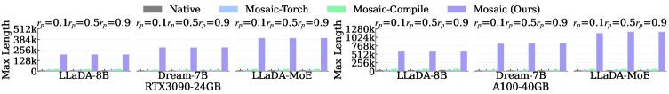

*Figure 10: End-to-end performance evaluation. Comparison of latency and L_max for Mosaic and baselines across varying prompt-to-output ratios.*

**实验设置**：
- 硬件：RTX 3090 (24GB), A100 (40GB)
- 模型：LLaDA-8B, Dream-7B, LLaDA-MoE
- 指标：Per-step latency, Maximum context length (L_max)

**结果**：

| 指标 | vs Native | vs Mosaic-Torch | vs Mosaic-Compile |
|------|-----------|-----------------|-------------------|
| L_max 提升 | 32.98× | 26.74× | 15.89× |
| 延迟降低 | - | 4.12%-23.26% | 4.12%-23.26% |

### 内存峰值与平均比率

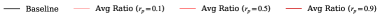

*Figure 12: Comparison of activation memory peak-to-average ratio (PAR) across context lengths.*

**结果**：
- Mosaic 实现平均 2.71× PAR 降低
- 分块启用后比率显著降低
- Mask-only 内核在分块激活前就降低 logits 内存

### 膨胀率

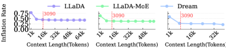

*Figure 13: Inflation rates of baselines.*

**结果**：
- 现有系统膨胀率 21.78%-78.33%
- Mosaic 通过全局规划消除膨胀

### 消融研究

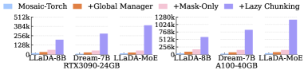

*Figure 14: Impact of the global memory manager, mask-only kernel, and lazy chunking on L_max.*

**组件贡献**：
- Global Memory Manager：主要贡献
- Mask-only Kernel：显著降低 logits 内存
- Lazy Chunking：缓解动态峰值

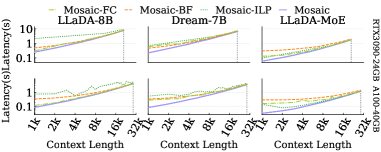

*Figure 15: Ablation study of inference latency comparing planning, search, and chunking strategies.*

### 搜索策略

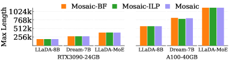

*Figure 16: Comparison of L_max using different search strategies and planning algorithms.*

**策略对比**：
- Brute-force vs Bottleneck-driven
- ILP vs First-fit
- Bottleneck-driven + First-fit：最佳平衡

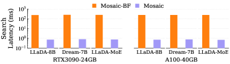

*Figure 17: Comparison of search latency.*

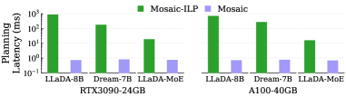

*Figure 18: Comparison of planning latency.*

### 与其他方法对比

| 方法 | 内存管理 | 动态峰值 | 碎片化 | L_max | 延迟 |
|------|----------|----------|--------|-------|------|
| Native | PyTorch 默认 | 未处理 | 严重 | 基线 | 基线 |
| Mosaic-Torch | vLLM 框架 | 未处理 | 中等 | 1.23× | 基线 |
| Mosaic-Compile | torch.compile | 部分处理 | 中等 | 2.08× | 基线 |
| **Mosaic** | **全局动态** | **完全处理** | **消除** | **32.98×** | **-4.12%-23.26%** |

## 七、相关工作

### dLLM 模型

- **LLaDA**：基于扩散的 LLM
- **Dream**：Dream-7B
- **LLaDA-MoE**：MoE 架构的 dLLM

### LLM 推理优化

- **vLLM**：高效 LLM 推理系统
- **FlashAttention**：IO-aware attention
- **PagedAttention**：分页注意力

### 内存管理

- **KV-cache 优化**：针对自回归模型
- **激活检查点**：减少激活内存
- **内存复用**：通用复用机制

## 八、总结

### 核心贡献

1. **dLLM 内存特征分析**：首次全面表征 dLLM 内存使用
2. **Mask-only Logits Kernel**：消除未掩码 token 冗余计算
3. **Graph Registrar**：参数化图模板，保证完整计算图可见性
4. **Lazy Chunking Optimizer**：在线启发式搜索，自适应缓解动态峰值
5. **Global Memory Manager**：虚拟寻址，消除外部碎片

### 技术影响

- **长上下文推理**：支持 15.89-32.98× 更长上下文
- **内存效率**：峰值与平均比率降低 2.71×
- **延迟优化**：4.12%-23.26% 延迟降低
- **dLLM 部署**：使长上下文 dLLM 应用更可行

### 局限性

1. **模型特定**：主要针对 dLLM 架构
2. **硬件限制**：主要在 NVIDIA GPU 上验证
3. **分块开销**：lazy chunking 引入少量延迟
4. **图注册**：需要手动定义图模板

### 未来方向

- 扩展到更多 dLLM 架构
- 优化搜索算法效率
- 与其他推理优化技术结合
- 支持更多硬件平台

## 九、参考资源

- **论文**: https://arxiv.org/abs/2601.06562
- **基础框架**: vLLM, PyTorch
- **相关模型**: LLaDA-8B, Dream-7B, LLaDA-MoE
- **优化技术**: Mask-only computation, Virtual memory, Lazy chunking
- **硬件**: NVIDIA RTX 3090, A100
- **应用场景**: 长上下文生成, 代码生成, 小说生成
