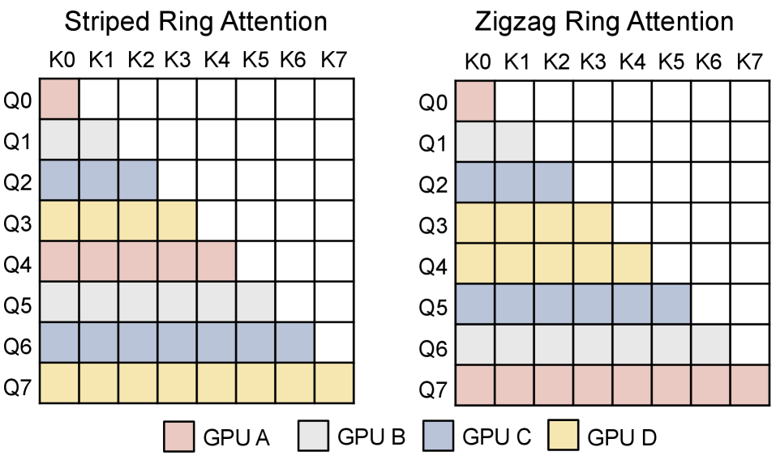
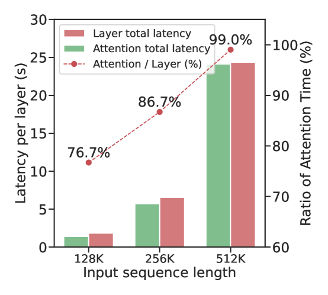
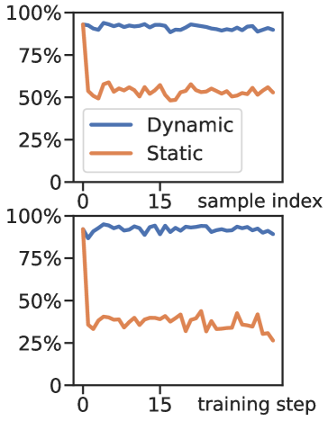
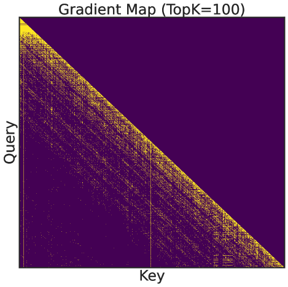
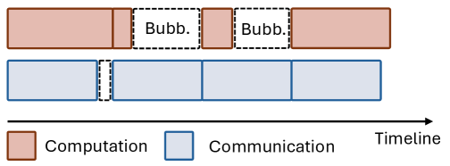
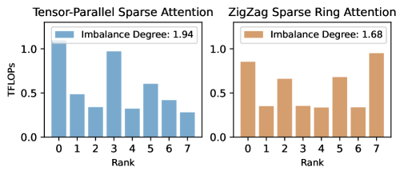
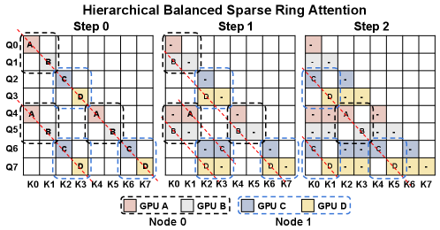
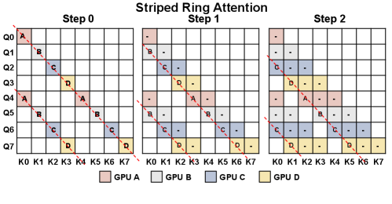

# MTraining: 分布式动态稀疏注意力高效超长上下文训练

## 一、论文概述

| 项目 | 内容 |
|------|------|
| **标题** | MTraining: Distributed Dynamic Sparse Attention for Efficient Ultra-Long Context Training |
| **作者** | Wenxuan Li, Chengruidong Zhang, Huiqiang Jiang, Yucheng Li, Yuqing Yang, Lili Qiu |
| **机构** | Microsoft Research |
| **论文** | https://arxiv.org/abs/2510.18830 |
| **发布** | 2025-10-21 |
| **代码** | https://github.com/microsoft/MTraining |

## 二、核心思想

### 问题定义

长上下文建模能力已成为下一代大语言模型（LLM）的关键能力。许多新兴应用（如长文档理解、仓库级代码分析、自主 Agent 系统、长链推理）需要 LLM 处理跨越数十万到数百万 token 的序列。

然而，**注意力计算的二次复杂度**在序列长度扩展时导致巨大的计算成本：
- 当上下文超过 300K token 时，注意力的前向和后向传播占每层计算时间的 **90% 以上**
- DeepSeek-V3 报告，仅长上下文扩展训练阶段（128K 上下文窗口，20B token）就消耗约 5% 的总预训练 GPU 资源

**动态稀疏注意力**是减少长上下文计算成本的有前途的方法，但在分布式设置中高效训练仍面临两大挑战：

1. **Worker-level 不平衡**：不同 GPU 之间的计算负载不均衡
2. **Step-level 不平衡**：不同训练步骤之间的计算时间差异导致通信无法有效重叠

### 解决方案概述

**MTraining** 是一种利用动态稀疏注意力实现高效超长上下文 LLM 训练的分布式方法，包含三个核心组件：

1. **Distributed Sparse Index Approximating**：分布式在线稀疏索引近似算法
2. **Balanced Sparse Ring Attention**：基于条带布局的平衡稀疏环注意力
3. **Hierarchical Sparse Ring Attention**：分层稀疏环注意力，重叠异构通信

**关键优势**：
- 训练吞吐量提升高达 **6×**
- 保持或提高模型精度
- 近似线性扩展到 32 GPU（4 节点）

## 三、技术架构

### 整体框架

**MTraining 框架的工作流程**：

1. **分布式稀疏索引近似**（§4.1）：通过收集 key 向量来估计活跃注意力区域，构建共享稀疏索引
2. **平衡稀疏环注意力**（§4.2）：使用条带布局平衡工作负载
3. **分层稀疏环注意力**（§4.3）：重叠节点间和节点内通信

### 核心创新

#### 1. Vertical-Slash 稀疏模式

**关键发现**：
- 注意力权重显示结构化稀疏性，遵循 **Vertical-Slash（VS）局部性模式**
- **Slash（斜线）**：对角线带，其中 $n - m = \text{const}$，捕获由 RoPE 引起的局部性偏差
- **Vertical（垂直）**：特定 key 位置 $m$ 从大多数 query 接收高注意力，源于具有异常大 key norms 的 outlier token

**理论基础**：

$$\mathbb{E}[z_{n,m}] = \sum_{i=0}^{d-1} \phi_{n-m}^{(i)} A_i + \sum_{i=0}^{d-1} \psi_{n-m}^{(i)} B_i$$

其中：
- $\phi_{n-m}^{(i)} = \cos((n-m)\theta_{i\%d/2})$
- $\psi_{n-m}^{(i)} = (-1)^{\mathds{1}[i \geq d/2]} \sin((n-m)\theta_{i\%d/2})$
- $\theta_i = 10000^{-2i/d}$ 是 RoPE 频率
- $A_i$, $B_i$ 是与位置无关的常数

**两个关键洞察**：
1. 使用 RoPE 的注意力矩阵表现出 VS 覆盖模式
2. 注意力矩阵倾向于形成带状稀疏激活模式

#### 2. 分布式稀疏索引近似

**算法设计**：

**三个关键组件**：

1. **分布式在线预算近似**：
   - 在 Ring Attention 中，每个设备负责 query、key、value 的一个片段
   - 最后的 `last_q` 个 query 条目广播到所有设备
   - 每个 rank 计算局部注意力统计（沿垂直和斜线方向的累积和）
   - 估计召回目标注意力质量所需的最小活跃垂直线和斜线数量

2. **内核感知近似粒度**：
   - 垂直线：token 级别近似，捕获细粒度激活局部性
   - 斜线：$64 \times 64$ token 块级别聚合，匹配块级矩阵乘法内核的 tiling

3. **带稀疏索引的 Ring Attention**：
   - 同步稀疏索引后，每个 worker 根据活跃垂直线和斜线的索引确定局部注意力子矩阵中的活跃区域
   - 选择性计算非零条目
   - KV 块跨 rank 并发传输，实现计算-通信重叠

**设计空间权衡**：
- 更细粒度索引：更精确但开销更高
- 更粗粒度索引：开销低但包含更多冗余计算
- MTraining 的选择：token 级垂直索引 + $64 \times 64$ 块级斜线索引

#### 3. 平衡稀疏环注意力

**Striped vs ZigZag Ring Attention**：

| 特性 | Striped | ZigZag |
|------|---------|--------|
| 分布方式 | 沿完整对角线 | 沿不完整对角线和反对角线 |
| 负载均衡 | 更好 | 较差（不平衡度 > 2.4） |
| 与 VS 模式对齐 | 更好 | 较差 |

**关键选择**：
- 选择 **Striped** 而非 ZigZag Ring Attention
- Striped 的完整对角线分布与 VS 稀疏模式更好地对齐
- 实现近乎均匀的计算时间，不平衡度接近 1.0

#### 4. 分层稀疏环注意力

**问题**：
- 在 4 节点设置中，节点间通信（InfiniBand）延迟为 0.98ms，远高于节点内（NVLink）的 0.13ms
- 节点间通信主导每个 Ring Attention 步骤的延迟

**解决方案**：
- 将 Ring Attention 分为两个层次：
  - **内环**：节点内 Ring Attention（使用 NVLink）
  - **外环**：节点间 Ring Attention（使用 InfiniBand）
- 重叠节点间 KV 传输与节点内 Ring 计算

**延迟分析**：

$$T_{step}^{hier} \approx \max\{T_{comp}, T_{inner}\} = T_{comp} = 0.51ms$$

对比无分层设计：

$$T_{step} \approx \max\{T_{comp}, T_{intra}, T_{inter}\} = T_{inter} = 0.98ms$$

**效果**：
- 总前向注意力时间：34.10ms → 19.53ms（减少 42.7%）

## 四、核心公式

### 注意力稀疏性

$$\text{Sparsity Ratio} = 1 - \frac{\text{活跃注意力条目}}{\text{总注意力条目}}$$

平均稀疏度：**95%**

### 训练吞吐量

$$\text{Throughput} = \frac{\text{训练 token 数}}{\text{训练时间}}$$

### 加速比

$$\text{Speedup} = \frac{\text{Throughput (MTraining)}}{\text{Throughput (Dense Baseline)}}$$

## 五、实验结果

### 实验设置

**模型**：
- Qwen2.5-3B（主要实验）
- Llama-3.1-8B-Instruct（泛化验证）

**硬件**：
- 32 × NVIDIA A100 40GB（4 × 8 配置）
- InfiniBand + NVLink 互联

**训练配置**：
- 上下文窗口：32K → 512K（使用 Yarn 外推 RoPE，缩放因子 32）
- 数据集：ProLong 数据集
- 训练量：1B token（Qwen2.5-3B），2B token（Llama-3.1-8B）
- Context Parallelism = 32

### 训练效率结果

**主要结果**：

| 方法 | 吞吐量提升 | 说明 |
|------|-----------|------|
| **MTraining** | **6×** | 完整方法 |
| MTraining w/ ZigZag | 2.9× | 使用 ZigZag 环注意力 |
| MTraining w/o Hierarchical | 4.6× | 无分层通信 |
| MTraining w/ XAttn Idx. | - | 使用 XAttention 索引 |

**关键发现**：
- MTraining 实现高达 **6×** 端到端训练加速
- 相比 ZigZag 版本快 **2.1×**（负载均衡优势）
- 相比无分层版本快 **1.3×**（通信重叠优势）
- 实现近似线性的吞吐量扩展

### 工作负载均衡分析

**Worker-level 不平衡度**：

| 方法 | 不平衡度（max/mean） |
|------|---------------------|
| ZigZag Ring Attention | > 2.4 |
| MTraining | ~1.0 |

**Step-level 不平衡度**：
- ZigZag：严重不平衡
- MTraining：近乎均匀

### 计算-通信重叠分析

**前向注意力延迟分解**：

| 组件 | 无分层 | 有分层 |
|------|--------|--------|
| 稀疏索引构建 | 1.13ms | 1.13ms |
| CPU 操作 | 2.08ms | 2.08ms |
| Ring Attention 步骤 | 0.98ms × 31 = 30.38ms | 0.51ms × 32 = 16.32ms |
| 最后注意力计算 | 0.51ms | - |
| **总计** | **34.10ms** | **19.53ms** |

**减少**：42.7%

### 训练损失分析

**关键观察**：
1. 早期阶段：稀疏方法损失下降略慢于密集注意力（预期行为）
2. 后期阶段：MTraining 损失紧密接近密集注意力，证明收敛性
3. MoBA：初始下降快但后期恶化，最终损失显著高于 MTraining

**原因**：
- MoBA 的粗粒度固定块级稀疏索引与动态变化的注意力激活不匹配
- MTraining 的在线 top-p 预算机制持续适应模型的注意力分布

### 下游任务结果

#### RULER 基准

| 训练方法 | 推理方法 | 16K | 32K | 64K | 128K | 256K | 512K | 平均 |
|----------|----------|-----|-----|-----|------|------|------|------|
| Dense | Dense | 72.51 | 67.83 | 58.46 | 52.38 | 55.91 | 54.15 | 60.21 |
| Dense | MInference | 54.58 | 54.97 | 49.85 | 43.93 | 38.83 | 41.10 | 47.21 |
| MoBA | Dense | 64.61 | 55.06 | 45.44 | 38.24 | 35.48 | 34.99 | 45.64 |
| **MTraining** | **Dense** | **76.13** | **70.51** | **60.81** | **58.65** | **58.33** | **54.88** | **63.22** |
| MTraining | MInference | 75.44 | 69.60 | 62.92 | 53.19 | 51.59 | 50.85 | 60.60 |

**关键发现**：
- MTraining 在密集推理下比密集训练 **提高 3%**（63.22 vs 60.21）
- 在 MInference 推理下比密集训练 **提高 13.4%**（60.60 vs 47.21）
- 在 128K 上下文下最高提升 **6.3%**

#### Needle In A Haystack

- MTraining 实现近乎完美的检索性能
- 尽管计算成本大幅降低，仍优于基线

#### PG-19 语言建模

- MTraining 保持与密集基线紧密跟踪的困惑度
- 相对差异保持在较小范围内
- 证明稀疏近似未引入系统性建模错误

#### InfiniteBench

| 方法 | En.Sum | En.QA | En.MC | En.Dia | Code.Debug | 平均 |
|------|--------|-------|-------|--------|------------|------|
| Dense | 18.5 | 8.2 | 63.5 | 6.0 | 26.3 | 24.5 |
| **MTraining** | **19.5** | 6.8 | **65.3** | 3.5 | **34.1** | **25.8** |

- 代码调试能力显著提升（34.1 vs 26.3）
- 摘要能力略有提升

### 模型泛化

**Llama-3.1-8B-Instruct 结果**：
- RULER 精度：68.07（MTraining）vs 69.07（Dense）- 几乎无损
- 稀疏推理鲁棒性：68.58% vs 30.60% - 显著更好

### 稀疏度动态分析

- 全局稀疏率稳定在 $93.7 \pm 3.9\%$
- 层级稀疏率从 87.3% 增加到 99.6%
- 保证一致的高稀疏度用于计算加速

## 六、核心创新总结

| 创新点 | 说明 | 优势 |
|--------|------|------|
| **VS 稀疏模式** | Vertical-Slash 结构化稀疏，由 RoPE 理论支持 | 捕获注意力的固有结构 |
| **分布式在线索引近似** | 在线 top-p 预算，token 级垂直 + 块级斜线 | 适应动态变化，开销 < 6% |
| **平衡稀疏环注意力** | Striped 布局替代 ZigZag | 不平衡度从 > 2.4 降至 ~1.0 |
| **分层稀疏环注意力** | 重叠节点间和节点内通信 | 延迟减少 42.7% |
| **算法-系统协同设计** | 稀疏模式与 GPU 内核 tiling 对齐 | 最大化实际加速 |

## 七、技术影响

### 对长上下文训练的改进

- **效率提升**：6× 训练吞吐量提升
- **精度保持**：RULER 上甚至超过密集训练（63.22 vs 60.21）
- **可扩展性**：近似线性扩展到 32 GPU
- **通用性**：在 Qwen2.5-3B 和 Llama-3.1-8B 上均有效

### 与现有方法对比

| 方法 | 优势 | 局限 |
|------|------|------|
| **Dense Attention** | 精度最高 | 计算成本二次增长 |
| **MoBA** | 块级稀疏，实现简单 | 粗粒度，后期性能恶化 |
| **XAttention** | 推理时高效 | 反斜线模式与 Ring Attention 不匹配 |
| **MTraining** | 细粒度动态稀疏，系统优化 | 需要定制 CUDA 内核 |

### 实际应用价值

- **长文档理解**：处理 512K+ token 的文档
- **代码分析**：仓库级代码理解和补全
- **Agent 系统**：长上下文交互历史处理
- **长链推理**：扩展推理模型的上下文窗口

## 八、局限性

1. **模型规模**：主要在 3B 和 8B 模型上验证，更大规模需要进一步测试
2. **硬件要求**：需要 32 A100 GPU 集群
3. **内核实现**：需要定制 CUDA 内核（基于 FlashAttention、BlockSparse Attention、PIT）
4. **稀疏率固定**：实验中手动固定稀疏率为 95%，实际应用可能需要自适应调整
5. **训练数据**：仅在 ProLong 数据集上验证

## 九、相关工作

### 动态稀疏注意力

- **MInference** (Jiang et al., 2024)：推理时动态稀疏注意力
- **FlexPrefill** (Lai et al., 2025)：灵活的预填充稀疏注意力
- **NSA** (Yuan et al., 2025)：原生稀疏注意力预训练
- **MoBA** (Lu et al., 2025)：混合块注意力

### 上下文并行

- **Ring Attention** (Liu et al., 2024b)：环形注意力并行
- **Context Parallelism**：沿序列维度分区激活

### 长上下文训练

- **ProLong** (Gao et al., 2024)：长上下文训练数据集
- **Yarn** (Peng et al., 2024)：RoPE 外推方法
- **DeepSeek-V3**：长上下文扩展训练

## 十、参考资源

### 论文

- **MTraining**: https://arxiv.org/abs/2510.18830
- **代码**: https://github.com/microsoft/MTraining

### 相关工作

- **MInference**: Jiang et al., 2024
- **MoBA**: Lu et al., 2025
- **NSA**: Yuan et al., 2025
- **FlashAttention**: Dao et al., 2022

### 基准

- **RULER**: Hsieh et al., 2024
- **Needle In A Haystack**: Kamradt, 2023
- **PG-19**: Rae et al., 2019
- **InfiniteBench**: Zhang et al., 2024
