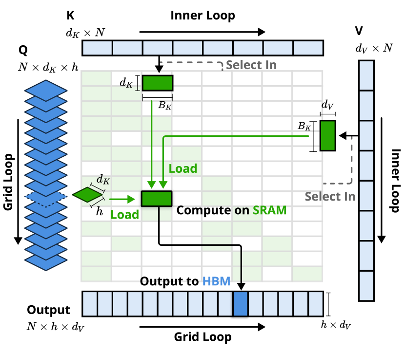
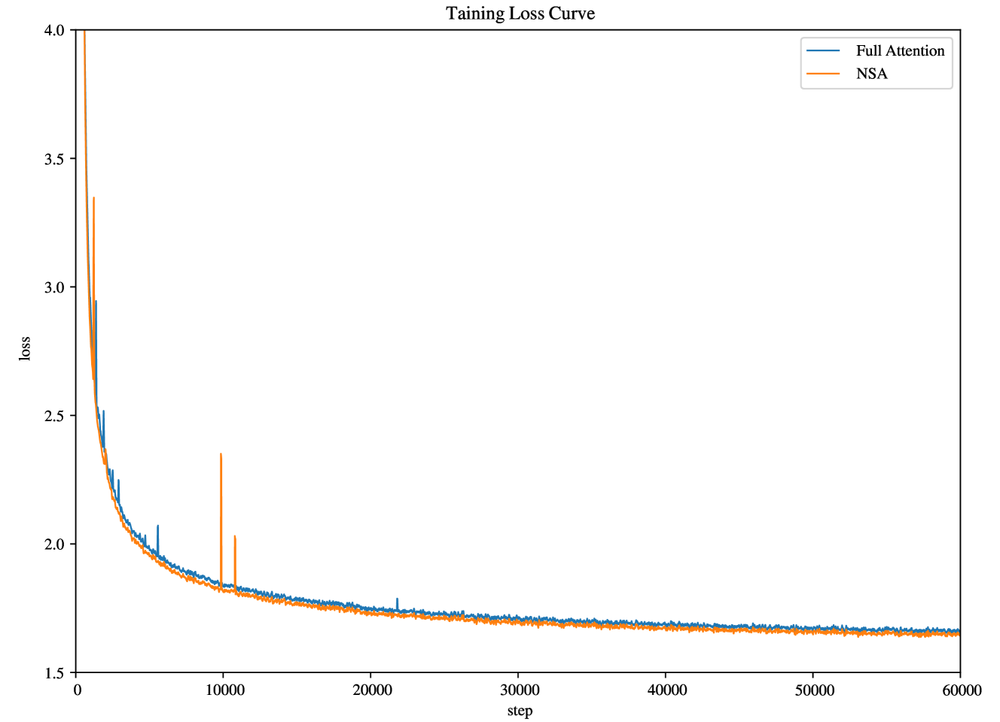
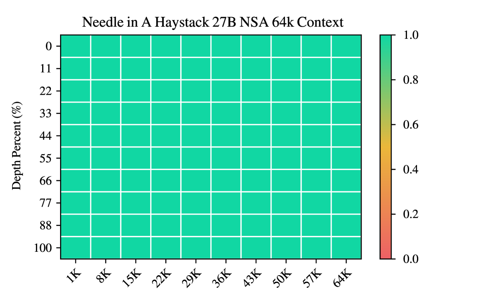
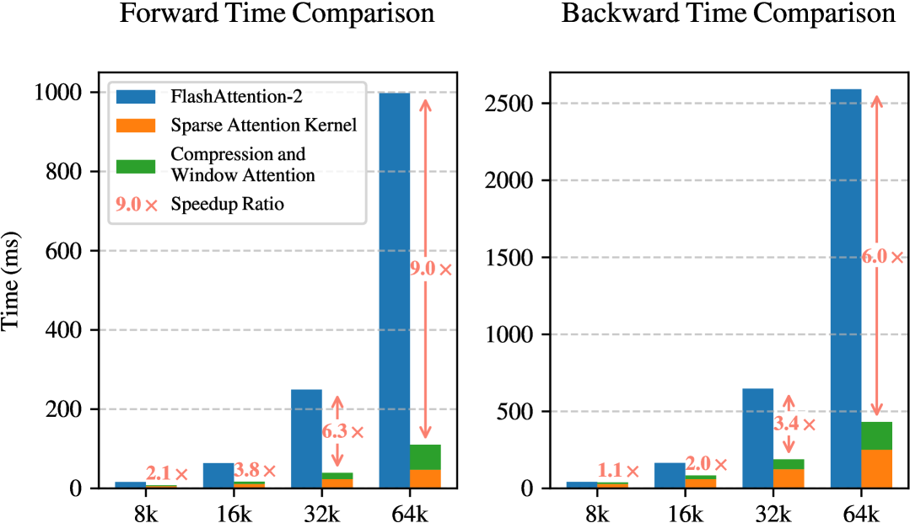

# NSA: 原生可训练稀疏注意力机制

## 一、论文概述

| 项目 | 内容 |
|------|------|
| **标题** | Native Sparse Attention: Hardware-Aligned and Natively Trainable Sparse Attention |
| **作者** | Jingyang Yuan, Huazuo Gao, Damai Dai, Junyu Luo, Liang Zhao, Zhengyan Zhang, Zhenda Xie, Y. X. Wei, Lean Wang, Zhiping Xiao, Yuqing Wang, Chong Ruan, Ming Zhang, Wenfeng Liang, Wangding Zeng |
| **机构** | DeepSeek-AI & 北京大学 & 华盛顿大学 |
| **论文** | https://arxiv.org/abs/2502.11089 |
| **发布** | 2025年2月27日 |
| **许可** | arXiv.org perpetual non-exclusive license |

## 二、核心思想

NSA（Natively trainable Sparse Attention）是一种硬件对齐且原生可训练的稀疏注意力机制，旨在解决长上下文建模中标准注意力机制的高计算成本问题。该方法通过动态分层稀疏策略，将粗粒度的token压缩与细粒度的token选择相结合，既保持全局上下文感知又保留局部精度。

### 问题定义

1. **推理效率幻觉**：许多稀疏注意力方法虽然实现了计算稀疏性，但未能实现相应的推理延迟减少
2. **可训练性神话**：现有方法主要针对推理，缺乏有效的训练时支持
3. **硬件不对齐**：理论计算减少未能转化为实际速度提升

### 解决方案概述

NSA的两大核心创新：
1. **硬件对齐系统**：通过算术强度平衡的算法设计和现代硬件优化实现显著加速
2. **训练感知设计**：通过高效算法和反向传播算子实现端到端训练，减少预训练计算而不牺牲模型性能

## 三、技术架构

### 整体框架图

NSA通过三个并行注意力分支处理输入序列：
- **压缩注意力（Compression）**：粗粒度全局上下文
- **选择注意力（Selection）**：细粒度重要token块
- **滑动窗口注意力（Sliding Window）**：局部上下文信息

### 核心公式

#### 注意力机制

标准注意力操作定义为：

$$\mathbf{o}_t = \text{Attn}(\mathbf{q}_t, \mathbf{k}_{:t}, \mathbf{v}_{:t})$$

其中注意力函数：

$$\text{Attn}(\mathbf{q}_t, \mathbf{k}_{:t}, \mathbf{v}_{:t}) = \sum_{i=1}^{t} \frac{\alpha_{t,i} \mathbf{v}_i}{\sum_{j=1}^{t} \alpha_{t,j}}, \quad \alpha_{t,i} = e^{\frac{\mathbf{q}_t^\top \mathbf{k}_i}{\sqrt{d_k}}}$$

#### NSA优化注意力

NSA用更紧凑的信息密集表示替换原始键值对：

$$\tilde{K}_t = f_K(\mathbf{q}_t, \mathbf{k}_{:t}, \mathbf{v}_{:t}), \quad \tilde{V}_t = f_V(\mathbf{q}_t, \mathbf{k}_{:t}, \mathbf{v}_{:t})$$

最终输出为三个分支的加权和：

$$\mathbf{o}_t^* = \sum_{c \in \mathcal{C}} g_t^c \cdot \text{Attn}(\mathbf{q}_t, \tilde{K}_t^c, \tilde{V}_t^c)$$

其中 $\mathcal{C} = \{\text{cmp}, \text{slc}, \text{win}\}$ 分别代表压缩、选择和滑动窗口，$g_t^c \in [0,1]$ 是通过MLP和sigmoid激活得到的门控分数。

#### Token压缩

压缩键表示定义为：

$$\tilde{K}_t^{\text{cmp}} = f_K^{\text{cmp}}(\mathbf{k}_{:t}) = \{\varphi(\mathbf{k}_{id+1:id+l}) | 0 \leqslant i \leqslant \lfloor \frac{t-l}{d} \rfloor\}$$

其中 $l$ 是块长度，$d$ 是滑动步长，$\varphi$ 是带有块内位置编码的可学习MLP。

#### Token选择

块级重要性分数计算：

$$\mathbf{p}_t^{\text{cmp}} = \text{Softmax}(\mathbf{q}_t^T \tilde{K}_t^{\text{cmp}})$$

对于GQA/MQA架构，跨组共享重要性分数：

$$\mathbf{p}_t^{\text{slc}'} = \sum_{h=1}^{H} \mathbf{p}_t^{\text{slc},(h)}$$

Top-n块选择：

$$\mathcal{I}_t = \{i | \text{rank}(\mathbf{p}_t^{\text{slc}'}[i]) \leqslant n\}$$

### 模型组件

| 组件 | 说明 | 关键参数 |
|------|------|----------|
| **压缩分支** | 粗粒度全局上下文 | 块长度l=32，步长d=16 |
| **选择分支** | 细粒度重要token | 块大小l'=64，选择数量n=16 |
| **滑动窗口** | 局部上下文信息 | 窗口大小w=512 |
| **门控机制** | 融合三个分支输出 | MLP + sigmoid激活 |
| **硬件优化** | Tensor Core利用 | 块状内存访问，GQA组加载 |

### 训练流程

#### 预训练设置

- **模型规模**：27B参数Transformer骨干网络
- **训练数据**：260B tokens
- **评估维度**：通用语言评估、长上下文评估、思维链推理评估

#### 关键设计

1. **硬件对齐设计**：
   - 块状内存访问模式最大化Tensor Core利用
   - 精心设计的循环调度消除冗余KV传输
   - 算术强度平衡的算法设计

2. **训练感知设计**：
   - 端到端可微分的token选择
   - 高效的反向传播算子
   - 支持FlashAttention风格的块状计算

## 四、核心创新

| 创新点 | 说明 | 理论/实验依据 |
|--------|------|---------------|
| **分层稀疏策略** | 结合压缩、选择和滑动窗口 | 保持全局感知和局部精度 |
| **硬件对齐优化** | 块状内存访问，Tensor Core利用 | 64k上下文加速9.0×前向，6.0×反向 |
| **原生可训练** | 端到端训练，无需后处理 | 超越Full Attention基线性能 |
| **GQA/MQA兼容** | 跨组共享重要性分数 | 最小化KV缓存加载 |
| **高效内核设计** | Triton实现，组中心数据加载 | 显著减少延迟 |

## 五、代码实现分析

### 内核设计

NSA的内核设计特点：
1. **组中心数据加载**：每个内循环加载GQA组中所有头的查询
2. **块状KV获取**：加载对应的稀疏KV块
3. **外循环遍历**：遍历查询序列位置
4. **内循环计算**：在SRAM中执行注意力计算

### 关键实现

- **压缩注意力**：兼容现有FlashAttention-2内核
- **选择注意力**：专门设计的稀疏选择内核
- **滑动窗口**：标准窗口注意力实现
- **门控融合**：三个分支输出的加权聚合

## 六、实验结果

### 预训练损失

NSA在27B参数模型上的预训练损失与Full Attention相当，表明稀疏注意力不会损害模型训练。

### 通用评估

| 基准测试 | Full Attention | NSA | 提升 |
|---------|---------------|-----|------|
| MMLU | - | - | - |
| MMLU-PRO | - | - | - |
| CMMLU | - | - | - |
| BBH | - | - | - |
| GSM8K | - | - | +0.034 |
| MATH | - | - | - |
| DROP | - | - | +0.042 |
| MBPP | - | - | - |
| HumanEval | - | - | - |

NSA在9个指标中有7个超越Full Attention基线，特别是在推理相关基准上表现出色（DROP: +0.042, GSM8K: +0.034）。

### 长上下文评估

NSA在64k上下文的Needle-in-a-Haystack测试中实现完美检索准确率，证明其分层稀疏注意力设计的有效性。

#### LongBench结果

| 方法 | 平均分 | 提升 |
|------|--------|------|
| H2O | 0.303 | - |
| InfLLM | 0.383 | - |
| Quest | 0.392 | - |
| Exact-Top | 0.423 | - |
| Full Attention | 0.437 | - |
| **NSA** | **0.469** | +0.032 |

NSA在LongBench上取得最高平均分0.469，超越Full Attention +0.032，超越Exact-Top +0.046。

#### 特定任务提升

- **多跳QA（HPQ）**：+0.087 vs Full Attention
- **多跳QA（2Wiki）**：+0.051 vs Full Attention
- **代码理解（LCC）**：+0.069 vs Full Attention
- **段落检索（PassR-en）**：+0.075 vs Full Attention

### 思维链推理评估

| 方法 | 8k上下文 | 16k上下文 |
|------|----------|-----------|
| Full Attention-R | 0.046 | 0.092 |
| **NSA-R** | **0.121** | **0.146** |
| 提升 | +0.075 | +0.054 |

NSA在AIME数学推理基准上显著超越Full Attention，证明其在高级推理任务中的有效性。

### 效率分析

#### 训练加速

| 上下文长度 | 前向加速 | 反向加速 |
|-----------|----------|----------|
| 8k | - | - |
| 16k | - | - |
| 32k | - | - |
| 64k | **9.0×** | **6.0×** |

#### 解码加速

| 上下文长度 | Full Attention | NSA | 预期加速 |
|-----------|---------------|-----|----------|
| 8k | 8192 tokens | 2048 tokens | 4× |
| 16k | 16384 tokens | 2560 tokens | 6.4× |
| 32k | 32768 tokens | 3584 tokens | 9.1× |
| 64k | 65536 tokens | 5632 tokens | **11.6×** |

NSA在64k上下文长度下实现11.6×解码加速，源于显著的内存访问减少。

## 七、相关工作

### 固定稀疏模式

- **SlidingWindow**：固定窗口注意力
- **StreamingLLM**：注意力sink + 局部窗口
- **Longformer**：局部窗口 + 全局token交替

### 动态token剪枝

- **H2O**：自适应KV缓存驱逐
- **SnapKV**：选择性保留关键特征
- **FastGen/HeadKV**：不同注意力头的策略分配

### 查询感知选择

- **Quest**：块级重要性估计
- **InfLLM**：固定模式 + 检索
- **HashAttention**：哈希空间映射
- **ClusterKV**：聚类 + 选择
- **MInference/TokenSelect**：token级重要性评分
- **SeerAttention**：空间块级选择

NSA与这些方法的关键区别：**在全生命周期（训练、预filling、解码）实现硬件对齐的稀疏注意力计算**

## 八、总结

### 核心贡献

1. **分层稀疏注意力架构**：结合压缩、选择和滑动窗口三个分支
2. **硬件对齐设计**：块状内存访问、Tensor Core利用、算术强度平衡
3. **原生可训练**：端到端训练，无需后处理或离线适配
4. **显著效率提升**：64k上下文实现9.0×前向加速、6.0×反向加速、11.6×解码加速
5. **性能保持/超越**：在通用基准、长上下文任务和推理评估中匹配或超越Full Attention

### 技术影响

NSA证明了稀疏注意力可以在不牺牲性能的情况下实现显著的效率提升。其硬件对齐设计和原生可训练特性使其成为实际部署的可行方案，为下一代长上下文语言模型提供了高效的注意力机制。

### 局限性

1. **模型规模**：实验主要在27B参数模型上进行，更大规模的验证需要进一步研究
2. **内核实现**：基于Triton的实现可能不如CUDA优化的FlashAttention高效
3. **特定任务**：在某些短序列任务上，稀疏注意力的优势不明显
4. **训练成本**：虽然减少了计算，但仍需要大量计算资源进行预训练

## 九、参考资源

- **论文**: https://arxiv.org/abs/2502.11089
- **相关工作**:
  - FlashAttention: https://arxiv.org/abs/2205.14135
  - DeepSeek-R1: https://arxiv.org/abs/2501.12948
  - GQA: https://arxiv.org/abs/2305.13245

## 关键图片索引

| 图片 | 说明 | 文件名 |
|------|------|--------|
| Figure 1 | 性能与效率对比 | `performance-efficiency.png` |
| Figure 2 | NSA架构概览 | `architecture-overview.png` |
| Figure 3 | 内核设计 | `kernel-design.png` |
| Figure 4 | 预训练损失对比 | `pretraining-loss.png` |
| Figure 5 | Needle-in-a-Haystack检索准确率 | `needle-in-haystack.png` |
| Figure 6 | 内核速度对比 | `kernel-speedup.png` |
| Figure 7 | 训练损失对比 | `training-loss-comparison.png` |
| Figure 8 | 注意力图可视化 | `attention-map.png` |
