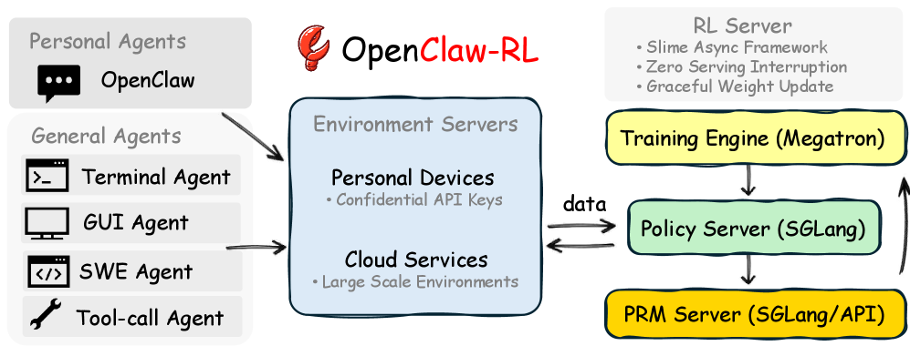
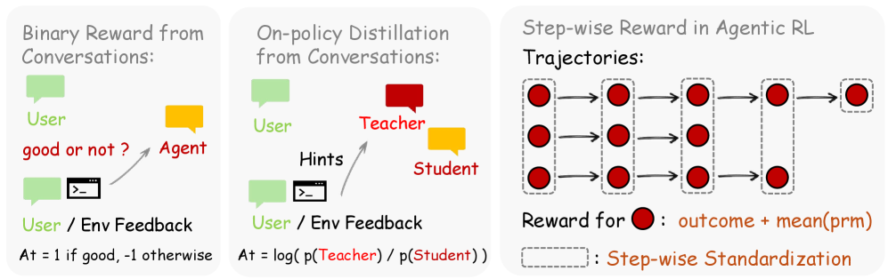
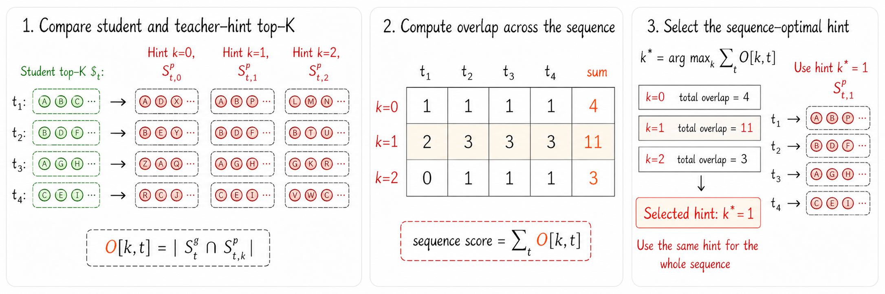
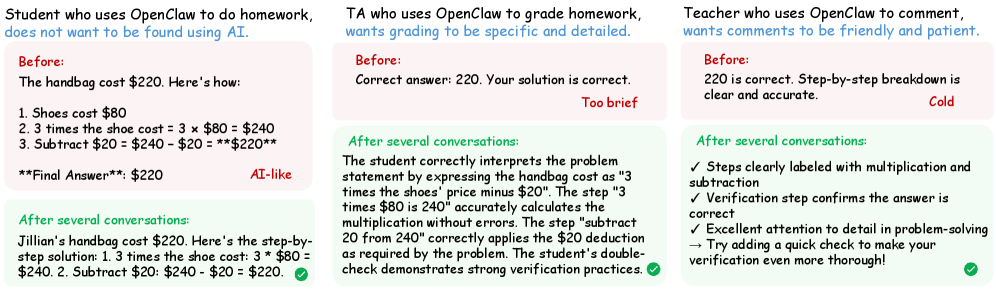
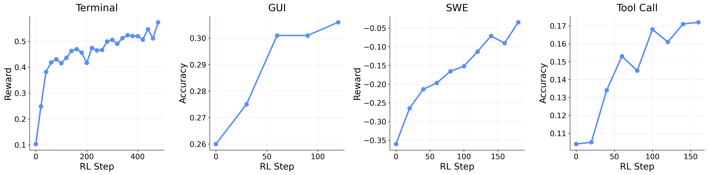
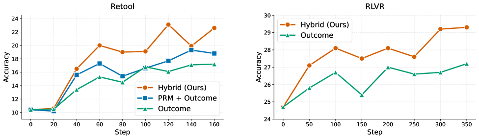
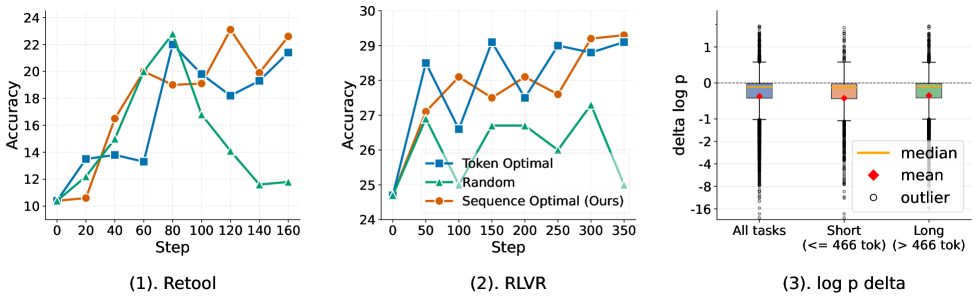

# OpenClaw-RL: Train Any Agent Simply by Talking

## 一、论文概述

| 项目 | 内容 |
|------|------|
| **标题** | OpenClaw-RL: Train Any Agent Simply by Talking |
| **作者** | Yinjie Wang, Xuyang Chen, Xiaolong Jin, Mengdi Wang, Ling Yang |
| **机构** | - |
| **论文** | https://arxiv.org/abs/2603.10165 |
| **代码** | https://github.com/Gen-Verse/OpenClaw-RL |
| **发布** | 2026-03-10 (v1), 2026-05-11 (v2) |
| **许可** | - |
| **领域** | cs.CL, cs.AI, cs.CV, cs.LG |

## 二、核心思想

### 问题定义

现有的 agentic RL 系统都采用离线批处理模式——数据收集和训练分为独立阶段，使用固定数据集。然而，每次 agent 交互都会产生一个 **next-state signal**（用户回复、工具输出、终端/GUI 状态变化），这些信号实时蕴含了丰富的训练信息，但没有任何现有系统将其作为在线学习源加以利用。

### 解决方案概述

OpenClaw-RL 提出了一个结合 **基础设施创新** 和 **方法论创新** 的框架，将 next-state signals 转化为在线训练信号：

1. **基础设施层面**：扩展 RL 系统为 server-client 架构，RL server 通过 inference API 托管策略模型，用户终端通过 HTTP 回传交互数据。通过异步信号提取，确保训练不阻塞推理。

2. **方法论层面**：识别 next-state 信号中的两种互补信号类型——**evaluative（评估性）** 和 **directive（指令性）**——并引入混合 RL 目标统一两者。提出 **overlap-guided hint selection** 和 **log-probability-difference clip** 来稳定蒸馏过程。

OpenClaw-RL 是第一个统一 real-world agent settings（terminal、GUI、SWE、tool-call）的 RL 框架。

## 三、技术架构

### 整体框架图



*Figure 1: OpenClaw-RL infrastructure overview. Interaction streams come from two agent types: Personal Agents (conversational, personalized) and General Agents (terminal, GUI, SWE, tool-call).*

OpenClaw-RL 采用完全解耦的异步架构，包含四个独立组件：

```
┌─────────────────────────────────────────────────────────────────┐
│                    OpenClaw-RL System Architecture              │
├─────────────────────────────────────────────────────────────────┤
│                                                                 │
│  ┌──────────────┐     HTTP      ┌──────────────────┐           │
│  │ User Terminal │ ──────────── → │   RL Server      │           │
│  │ (Agent Framework) │           │  (Policy π_θ)    │           │
│  └──────────────┘               │  Inference API    │           │
│        │                        └────────┬─────────┘           │
│        │ interaction data                 │                     │
│        │ (next-state signals)             │ weight updates      │
│        ▼                                  ▼                     │
│  ┌──────────────────┐          ┌──────────────────┐            │
│  │ Environment       │          │   Trainer         │            │
│  │ (Terminal/GUI/    │          │  (Policy Update)  │            │
│  │  SWE/Tool-call)   │          │                   │            │
│  └──────────────────┘          └──────────────────┘            │
│                                                                 │
│  ┌──────────────────────────────────────────────┐              │
│  │    Async Signal Extraction Server (PRM)        │              │
│  │  ┌─────────────────┐  ┌──────────────────┐   │              │
│  │  │ Evaluative Signal │  │ Directive Signal │   │              │
│  │  │ (Scalar Reward)   │  │ (Token-level     │   │              │
│  │  │ r_t ∈ {+1,-1,0}  │  │  Hint + Teacher) │   │              │
│  │  └─────────────────┘  └──────────────────┘   │              │
│  └──────────────────────────────────────────────┘              │
└─────────────────────────────────────────────────────────────────┘
```

**核心设计原则：完全解耦（Full Decoupling）**
- Policy serving、Environment hosting、Reward judging、Policy training 作为四个完全独立的异步组件运行
- 模型在服务下一个用户请求时，PRM 在判断前一个响应，trainer 在应用梯度更新
- 权重更新在定义好的边界推送到 serving engine

### 方法概览



*Figure 3: Method Overview. For personal agents, we support both binary-reward optimization and on-policy distillation training.*

### 核心公式

#### 1. Evaluative Signal（评估性信号）

给定 $(a_t, s_{t+1})$，PRM 被查询 $m$ 次，每次返回 vote $\in \{+1, -1, 0\}$。取多数投票作为标量奖励：

$$r_t \in \{+1, -1, 0\}$$

评估性信号是 **dense** 的：每个被评分的 turn 都贡献一个样本。

#### 2. Directive Signal（指令性信号）

PRM 同时判断 $s_{t+1}$ 是否包含有意义的修正。如果是，PRM 将 $s_{t+1}$ 蒸馏为简洁的 hint $h$（用 `[HINT_START]...[HINT_END]` 包围）。Hint 被追加到 prompt：

$$s^h_t = s_t \oplus h$$

通过 hint-augmented prompt 获取 teacher distribution $\pi_T(\cdot | s^h_t)$。指令性信号是 **sparse** 的：仅在 next state 携带可提取修正时触发。

#### 3. Hybrid Objective（混合目标）

两种信号统一为单一 per-token loss：

$$\mathcal{L}^{\text{hybrid}}_i = w_{\text{RL}} \mathcal{L}^{\text{GRPO}}_i + w_{\text{OPD}} \mathcal{L}^{\text{OPD}}_i$$

其中：
- $\mathcal{L}^{\text{GRPO}}_i$：标准 PPO clipped surrogate，由标量 advantage 驱动
- $\mathcal{L}^{\text{OPD}}_i$：On-Policy Distillation loss，由 token-level teacher-student 差异驱动

#### 4. Overlap-Guided Hint Selection（重叠引导的 Hint 选择）



*Figure 4: Overlap-guided hint selection method overview.*

定义学生 top-k vocabulary $S^q_i = \text{top-}k\{\pi_{\text{old}}(\cdot | s_t, y_{<i})\}$ 和教师 top-k vocabulary $S^p_{i,h} = \text{top-}k\{\pi_T(\cdot | s^h_t, y_{<i})\}$。

重叠信号：

$$O[h,i] = |S^q_i \cap S^p_{i,h}|$$

选择方案：

$$h^*(i) = \begin{cases} \arg\max_h \sum_i O[h,i], & \text{sequence-level} \\ \arg\max_h O[h,i], & \text{token-level} \end{cases}$$

#### 5. Top-k OPD Loss with Log-Probability-Difference Clip

对于每个 $v \in S_i$，形成 importance-weighted advantage：

$$A_v = \Delta_v \cdot w_v$$

其中：
- $w_v = \text{softmax}_{v \in S_i}(\ell_{\text{old}}(v))$：集中在学生实际可能采样的 token 上
- $\ell_{\text{old}}(v) = \log \pi_{\text{old}}(v | s_t, y_{<i})$
- $\ell_{T,h^*}(v) = \log \pi_T(v | s^{h^*}_t, y_{<i})$
- $\Delta_v = \text{clip}(\ell_{T,h^*}(v) - \ell_{\text{old}}(v), -C, +C)$：限制 per-token log-probability gap

OPD loss（clipped-surrogate 形式）：

$$\mathcal{L}^{\text{OPD}}_i = \sum_{v \in S_i} \max\left(-A_v \rho_v, -A_v \text{clip}(\rho_v, 1-\varepsilon_{\text{lo}}, 1+\varepsilon_{\text{hi}})\right) \tag{1}$$

其中 $\rho_v = \exp(\ell_{\text{cur}}(v) - \ell_{\text{old}}(v))$，$\varepsilon_{\text{lo}} = 0.2$，$\varepsilon_{\text{hi}} = 0.28$。

#### 6. Step-wise Reward for General Agentic RL

集成 outcome reward 和 process reward：

$$r_t = \alpha \cdot r^{\text{outcome}}_t + (1-\alpha) \cdot r^{\text{process}}_t$$

### 模型组件

| 组件 | 说明 | 关键参数 |
|------|------|----------|
| Policy Server | RL server 托管策略模型，提供 inference API | 无状态 completion API |
| User Terminals | 用户端 agent framework，通过 HTTP 查询策略 | 支持任意 agent 架构 |
| Async PRM Server | 异步信号提取服务器，产生 evaluative 和 directive 信号 | 独立于 policy serving |
| Trainer | 策略更新组件 | 学习率 1e-5 ~ 1e-6 |

### 训练流程

1. **Personal Agent 训练**：
   - 使用 Qwen3-4B-Thinking-2507 作为 policy 和 reward model
   - 学习率 1×10⁻⁵，log-probability-difference clipping coefficient C=1
   - 每收集 16 个样本触发一次训练步骤
   - 用户使用 Qwen3-32B 模拟

2. **General Agent 训练**：
   - Terminal: Qwen3-8B，128 并行环境
   - GUI: Qwen3VL-8B-Thinking，64 并行环境
   - SWE: Qwen3-4B，64 并行环境
   - Tool-call: Qwen3-4B-SFT，32 并行环境
   - 学习率 10⁻⁶，KL coefficient 0.01，clip ratios 0.2/0.28
   - 每步采样 8-32 个 tasks，每个 task 8 个 samples

## 四、核心创新

| 创新点 | 说明 | 理论/实验依据 |
|--------|------|---------------|
| Next-State Signal 利用 | 首次将 agent 交互的 next-state 信号作为在线学习源 | 统一 terminal/GUI/SWE/tool-call 环境 |
| 双信号混合 RL 目标 | 统一 evaluative（dense, scalar）和 directive（sparse, token-level）信号 | 比单独使用 GRPO 或 OPD 效率更高 |
| Overlap-Guided Hint Selection | 基于 teacher-student 分布重叠度选择 hint | 稳定性优于 random/length-based 选择 |
| Log-Probability-Difference Clip | 限制 per-token advantage 幅度 | 防止 teacher-student mismatch 导致的梯度爆炸 |
| 完全解耦异步架构 | Policy serving、environment、reward judge、training 完全独立 | 训练不阻塞推理，支持实时在线学习 |

## 五、代码实现分析

**GitHub**: https://github.com/Gen-Verse/OpenClaw-RL

基于 [Slime](https://github.com/PRIME-RL/Slime) RL 框架扩展，采用 server-client 架构：
- RL server 托管策略模型
- 用户终端通过 HTTP API 查询
- 异步 PRM 服务器进行信号提取
- 支持从个人 agent 到大规模 general agent 的无缝扩展

## 六、实验结果

### Personal Agent 实验



*Figure 2: Optimize your OpenClaw simply by using it. Simulation results showing the model's output pattern shifts toward user preferences through conversational interaction.*

| 优化方式 | Student | TA | Teacher | Average |
|----------|---------|-----|---------|---------|
| Hybrid RL (ours) | 14.0 | 9.6 | 13.8 | 12.5 |
| GRPO only | 17.2 | 12.0 | 18.2 | 15.8 |
| OPD only | 34.4 | 29.8 | 25.6 | 29.9 |
| Mem0 | - | - | - | ~20+ |
| Cognee | - | - | - | ~20+ |

- **Hybrid RL** 在约 10 个对话 session 内（联合优化）或 15 个 session（单独优化）达到目标性能
- 比单独 GRPO 或 OPD 效率显著更高
- 比 memory/skill-evolution 方法（Mem0, Cognee）更快达到目标，且无额外推理时 context 开销

### General Agent 统一框架



*Figure 5: We support scalable RL for general agents across terminal, GUI, SWE, and tool-call settings.*

| 环境 | 模型 | 并行环境数 | Process Reward 效果 |
|------|------|------------|---------------------|
| Terminal | Qwen3-8B | 128 | - |
| GUI | Qwen3VL-8B-Thinking | 64 | 0.33 vs 0.31 (outcome-only) |
| SWE | Qwen3-4B | 64 | - |
| Tool-call | Qwen3-4B-SFT | 32 | 0.25 vs 0.19 (outcome-only) |

- Process rewards 在 long-horizon 任务中进一步提升性能
- GUI agent 在 OSWorld-Verified 上评估
- Tool-call agent 在 AIME 2024 上评估

### 消融实验

#### Hint 选择策略对比

| 方法 | 效果 |
|------|------|
| Sequence-optimal (overlap-guided) | 12.5 (最佳，最稳定) |
| Token-optimal (overlap-guided) | 12.4 |
| Random hint selection | 16.1 (最差) |

#### k 值和 Support Set 选择

| k | Average (S_i = S^q_i) | Average (top-k overlap) |
|---|----------------------|------------------------|
| 2 | 20.2 | 21.3 |
| 4 | 10.3 | 13.5 |
| 8 | 10.1 | - |
| 20 | 9.8 | - |

- 较大的 k 值通常改善优化，但 k≥4 后收益递减
- Token-level OPD 使用 student top-k 作为默认 support set

### Hybrid RL 泛化到 Agentic RL



*Figure 6: Hybrid RL in multi-turn agentic RL and RLVR settings. Left: the ReTool multi-turn RL setting; right: RLVR.*



*Figure 7: (1)-(2) Comparison of hint selection methods in multi-turn RL and RLVR. (3) Distribution of the log-probability difference between teacher and student.*

- 在 multi-turn agentic RL（ReTool）和 RLVR（DAPO + AIME）设置下均表现良好
- 超越 outcome-only 和 integrated-reward 基线

## 七、相关工作

### RL for LLMs
- RLHF (Christiano et al., 2017) → DPO (Rafailov et al., 2023) → GRPO (Shao et al., 2024) → DeepSeek-R1 → DAPO
- ReasonFlux：层次化 RL 优化 thought templates
- 这些系统都采用 batch-offline 模式，OpenClaw-RL 首次实现在线连续学习

### Agentic RL and Tool-Use
- ReAct, Toolformer, FireAct：基于 demonstration 而非 online RL
- SWE-agent, ReTool (code/tool-use), DigiRL, WebRL (GUI), ArCHer, LOOP (multi-turn)：各针对单一环境
- DemyAgent, RLAnything, CURE：推进 agentic RL 的数据质量和 reward co-optimization
- **OpenClaw-RL 的区别**：统一所有环境于单一框架

### Process Reward Models
- Math-Shepherd, GenPRM, ReasonFlux-PRM, PRIME
- RLAnything 证明 step-wise PRM 信号对 long-horizon agentic tasks 至关重要
- **OpenClaw-RL 的区别**：从在线 next-state signals 推断 process rewards，而非预收集的 ground truth

### On-Policy Distillation
- 核心挑战：teacher-student distribution mismatch 导致不稳定
- OpenClaw-RL 的 overlap-guided selection + log-prob-difference clip 解决了这个问题

## 八、总结

### 核心贡献

1. **首次利用 next-state signals 进行在线 agent 优化**：将用户回复、工具输出、状态变化转化为实时训练信号
2. **混合 RL 目标**：统一 evaluative（dense, scalar）和 directive（sparse, token-level）两种互补信号
3. **Overlap-Guided Hint Selection**：基于 teacher-student 分布几何选择最优 hint，稳定蒸馏过程
4. **Log-Probability-Difference Clip**：限制 per-token advantage 幅度，防止梯度爆炸
5. **统一框架**：第一个统一 terminal、GUI、SWE、tool-call 环境的 RL 框架
6. **完全解耦异步架构**：训练不阻塞推理，支持实时在线学习

### 技术影响

- **Personal Agent**：agent 仅通过使用就能持续改进，无需额外数据收集
- **General Agent**：统一多种真实世界 agent 环境的训练范式
- **在线 RL**：为 LLM agent 的在线学习提供了可行的基础设施和方法论

### 局限性

1. **对抗性反馈**：负面或对抗性用户反馈（误导性修正、恶意指令）可能毒化模型，需要更强的训练数据过滤
2. **隐私风险**：为个人使用优化的模型可能编码用户特定偏好和私密信息，使其成为攻击目标
3. **资源开销**：托管 PRM 需要额外资源（相比 outcome-only training）

## 九、参考资源

- **论文**: https://arxiv.org/abs/2603.10165
- **代码**: https://github.com/Gen-Verse/OpenClaw-RL
- **基础框架**: [Slime](https://github.com/PRIME-RL/Slime)
