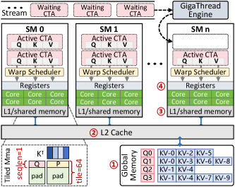
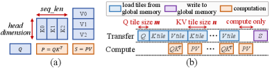
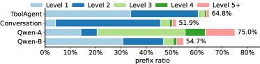
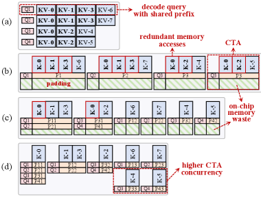
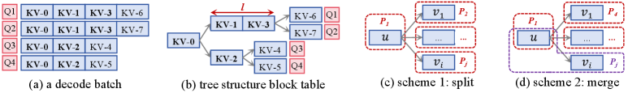
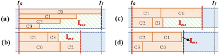
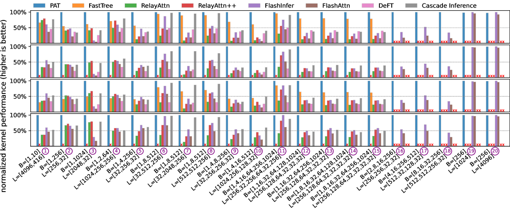
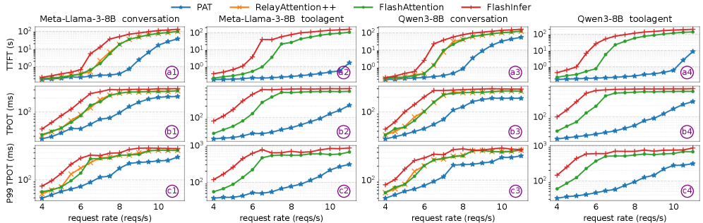
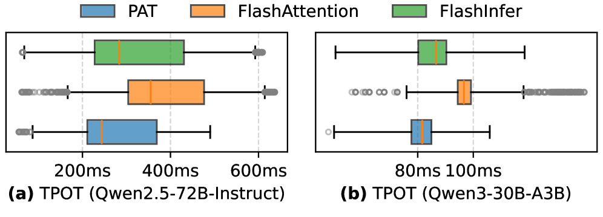
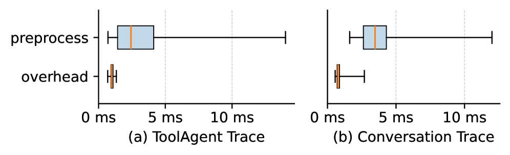

# PAT: Accelerating LLM Decoding via Prefix-Aware Attention with Resource Efficient Multi-Tile Kernel

## 一、论文概述

| 项目 | 内容 |
|------|------|
| **标题** | PAT: Accelerating LLM Decoding via Prefix-Aware Attention with Resource Efficient Multi-Tile Kernel |
| **作者** | Jinjun Yi, Zhixin Zhao, Yitao Hu, Ke Yan, Weiwei Sun, Hao Wang, Laiping Zhao, Yuhao Zhang, Wenxin Li, Keqiu Li |
| **机构** | - |
| **论文** | https://arxiv.org/abs/2511.22333 |
| **代码** | https://github.com/flashserve/PAT |
| **发布** | 2025-11-27 |
| **许可** | - |
| **领域** | cs.DC (Distributed, Parallel, and Cluster Computing) |

## 二、核心思想

### 问题定义

LLM 服务越来越多地被 decode attention 主导，这是一个 memory-bound 操作，因为需要从全局内存加载大量的 KV cache。

与此同时，真实世界的工作负载在请求之间存在大量层次化的共享前缀（如系统提示、工具/模板、RAG）。现有的 attention 实现未能充分利用前缀共享：

1. **One-query-per-CTA 执行**：反复加载共享前缀的 KV cache
2. **One-size-fits-all tiling**：片上资源闲置，不等长 KV 加剧气泡

这些选择放大了内存带宽压力，阻碍了 memory-bound decode attention。

### 解决方案概述

PAT（Prefix-Aware Attention）是一种用于 LLM 解码的前缀感知 attention 内核实现，采用 **pack-forward-merge** 范式组织执行：

1. **Pack**：按共享前缀打包查询，减少重复内存访问
2. **Forward**：运行定制化的多 tile 内核，实现高资源效率
3. **Merge**：执行 online softmax，开销可忽略

### 核心成果

- Attention 延迟平均降低 **53.5%**
- TPOT 降低 **17.0-93.1%**
- 作为 vLLM 的即插即用插件实现
- 在真实世界和合成工作负载上均有效

## 三、技术架构

### 整体框架图

*Figure 2: GPU architecture of typical NVIDIA GPUs.*

### GEMV 与 Tiling 执行

*Figure 3: (a) Two General Matrix-Vector multiplications (GEMV) in attention. (b) Tiling execution pipeline.*

### 共享前缀比例

*Figure 4: Prefix ratio of four traces: ToolAgent, Conversation, Qwen-A, Qwen-B.*

**关键发现**：
- 真实世界工作负载的前缀比例为 51.9-75.0%
- 超过一半的 KV cache tokens 来自跨请求复用的前缀
- 连续批处理下，批内共享前缀覆盖 2.8-82.6% 的 KV caches

### 打包策略对比

*Figure 5: Comparison of packing strategies. (a) A decode batch of 4 queries with shared prefixes. (b) Query-centric packing causes redundant memory access. (c) KV-centric packing causes memory waste. (d) Memory-centric prefix-aware packing avoids redundant memory access.*

### 核心公式

#### Decode Attention 计算

对于查询 Q 和键值对 K, V，标准 attention 计算：
$$\text{Attention}(Q, K, V) = \text{softmax}\left(\frac{QK^T}{\sqrt{d}}\right)V$$

在 decode 阶段，Q 是单个 token，K 和 V 是累积的 KV cache。

#### 问题分析

**冗余内存访问**：
- Query-centric 策略：每个 CTA 独立加载完整 KV cache
- 共享前缀被重复加载，浪费内存带宽

**资源利用不充分**：
- One-size-fits-all tiling 无法适应不等长 KV
- 导致执行气泡和资源闲置

#### Pack-Forward-merge 范式

**1. Pack 阶段**：
- 按共享前缀将查询分组到 CTA
- 使用基于利润模型的启发式打包策略
- 减少冗余全局内存访问

**2. Forward 阶段**：
- 多 tile 内核执行
- 运行时 tile 选择器为每个 CTA 选择高效内核
- 多流执行和长 KV 分割减少执行气泡

**3. Merge 阶段**：
- 基于 online softmax 的轻量级内核
- 合并每个查询跨 CTA 的中间结果
- 开销可忽略

### 核心组件

| 组件 | 说明 | 关键参数 |
|------|------|----------|
| Pack Scheduler | 查询打包调度器 | 基于利润模型的启发式 |
| Multi-tile Kernel | 多 tile 内核 | 运行时选择最优 tile |
| Multi-stream Forward | 多流执行 | 减少执行气泡 |
| KV Splitting | 长 KV 分割 | 适应不等长 KV |
| Online Softmax Merge | 在线 softmax 合并 | 开销可忽略 |

### Pack Scheduler 工作流

*Figure 7: Workflow of the pack scheduler: (a) An input decode batch with 4 queries. (b) Tree structure block table. (c) Packing scheme 1 that splits leaf nodes with the parent node. (d) Packing scheme 2 that merges specific leaf node with the parent.*

### CTA 执行管线

*Figure 10: Execution pipeline of four CTAs under different concurrency.*

**优化策略**：
- 降低并发度减少每 CTA 延迟
- 减少执行气泡 𝕀_exe
- 动态 KV 长度下提高尾部效率

## 四、核心创新

| 创新点 | 说明 | 理论/实验依据 |
|--------|------|---------------|
| Memory-centric 打包 | 按共享前缀分组查询 | 减少冗余内存访问 |
| 多 tile 内核 | 定制化 tile 大小 | 高资源利用率 |
| 运行时 tile 选择 | 动态选择最优内核 | 适应不同工作负载 |
| 多流执行 | 并行执行减少气泡 | 提高计算利用率 |
| KV 分割 | 长 KV 分段处理 | 适应不等长 KV |
| Online Softmax Merge | 轻量级合并 | 开销可忽略 |

## 五、代码实现分析

### 技术栈

- **推理框架**：vLLM 插件
- **GPU 架构**：NVIDIA A100 (80GB)
- **编程模型**：CUDA CTA/Thread Block
- **优化技术**：Prefix-aware tiling, Multi-stream execution

### 关键实现细节

1. **Pack Scheduler**：
   - 树结构 block table 表示前缀层次
   - 基于利润模型的启发式打包
   - 考虑前缀长度和查询数量

2. **Multi-tile Kernel**：
   - 不同 tile 大小的内核实现
   - 运行时根据 KV 长度选择
   - 优化资源利用率

3. **Multi-stream Forward**：
   - 使用 CUDA streams 并行执行
   - 长 KV 分割减少气泡
   - 动态调整并发度

4. **Online Softmax Merge**：
   - 基于 online softmax 算法
   - 轻量级合并内核
   - 开销可忽略

## 六、实验结果

### 内核性能

*Figure 11: Normalized kernel performance of PAT and the baselines for the attention computation across various decode batch configurations on NVIDIA A100 GPU (80GB).*

**实验设置**：
- GPU：NVIDIA A100 (80GB)
- Head 配置：32/32, 16/8, 32/8, 64/8
- 批大小：多种配置

**结果**：
- PAT 在所有配置下都优于基线
- 平均 attention 延迟降低 **53.5%**
- 在不同 head 配置下保持一致优势

### 端到端性能

*Figure 12: End-to-end performance of PAT and the baselines under two models and two traces.*

**实验设置**：
- 模型：Qwen, LLaMA
- Traces：ToolAgent, Conversation

**结果**：
- TPOT 降低 **17.0-93.1%**
- 在不同模型和 traces 下均有效
- RelayAttention++ 不支持多级前缀

### 分布式和 MoE 扩展

*Figure 13: End-to-end performance of PAT and baselines under TP/PP and MoE architectures.*

**结果**：
- PAT 与 TP/PP 和 MoE 架构兼容
- 在分布式设置下仍保持优势
- 支持大规模模型部署

### 开销分析

*Figure 16: Overhead of pack scheduler and pre-attention task latency of serving system.*

**结果**：
- Pack scheduler 开销可忽略
- Pre-attention 任务延迟影响最小
- 整体开销不影响端到端性能

### 与其他方法对比

| 方法 | 冗余内存访问 | 资源利用率 | Attention 延迟 | TPOT |
|------|-------------|-----------|----------------|------|
| FlashAttention | 高 | 中 | 基线 | 基线 |
| RelayAttention | 中 | 中 | 中等 | 中等 |
| FastTree | 中 | 中 | 中等 | 中等 |
| **PAT** | **低** | **高** | **-53.5%** | **-17.0-93.1%** |

## 七、相关工作

### Attention 优化

- **FlashAttention**：IO-aware attention 算法
- **FlashDecoding**：decode 阶段优化
- **RelayAttention**：前缀复用优化
- **FastTree**：树结构前缀优化

### LLM 服务系统

- **vLLM**：高效 LLM 推理系统
- **SGLang**：结构化生成语言
- **TensorRT-LLM**：NVIDIA 推理优化

### 内存优化

- **Prefix KV Cache Reuse**：前缀 KV cache 复用
- **PagedAttention**：分页注意力
- **Quantization**：量化技术

## 八、总结

### 核心贡献

1. **Pack-Forward-merge 范式**：前缀感知的 attention 执行框架
2. **Memory-centric 打包**：按共享前缀分组查询，减少冗余内存访问
3. **多 tile 内核**：定制化 tile 大小，高资源利用率
4. **多流执行和 KV 分割**：减少执行气泡，适应不等长 KV
5. **Online Softmax Merge**：轻量级合并，开销可忽略

### 技术影响

- **LLM 服务优化**：显著降低 decode attention 延迟
- **前缀共享利用**：充分利用真实世界工作负载的前缀模式
- **即插即用**：作为 vLLM 插件，易于部署
- **可扩展性**：支持分布式和 MoE 架构

### 局限性

1. **前缀依赖**：性能提升依赖于共享前缀比例
2. **硬件特定**：主要针对 NVIDIA GPU 优化
3. **调度开销**：pack scheduler 需要额外计算
4. **实现复杂度**：需要定制化 CUDA 内核

### 未来方向

- 扩展到更多 GPU 架构
- 优化 pack scheduler 效率
- 与其他推理优化技术结合
- 支持更多 attention 变体

## 九、参考资源

- **论文**: https://arxiv.org/abs/2511.22333
- **代码**: https://github.com/flashserve/PAT
- **基础框架**: vLLM, FlashAttention
- **相关工作**: RelayAttention, FastTree, FlashDecoding
- **GPU 架构**: NVIDIA A100
- **应用场景**: LLM 服务, RAG, Agent/Tool 工作流
