# PULSE: Understanding and Exploiting Weight Update Sparsity for Communication-Efficient Distributed RL

## 一、论文概述

| 项目 | 内容 |
|------|------|
| **标题** | Understanding and Exploiting Weight Update Sparsity for Communication-Efficient Distributed RL |
| **作者** | Erfan Miahi, Eugene Belilovsky |
| **机构** | - |
| **论文** | https://arxiv.org/abs/2602.03839 |
| **代码** | - |
| **发布** | 2026-02-03 |
| **许可** | - |
| **领域** | cs.LG (Machine Learning) |

## 二、核心思想

### 问题定义

分布式 RL 后训练大语言模型面临两个通信瓶颈：
1. **权重同步**：从 trainer 到 inference worker 的权重广播（7B 模型每次同步需传输 14GB）
2. **梯度同步**：trainer 间的梯度或伪梯度同步

在带宽受限的网络上（如地理分布式训练），这成为主要性能瓶颈。例如，Prime Intellect 报告称在公共互联网上广播 32B checkpoint 需要约 14 分钟。

### 核心发现

**约 99% 的每步权重更新在 BF16 cast 后是"不可见的"**。

原因：在典型的 RL 后训练学习率下，Adam 更新通常低于本地 BF16 舍入阈值。具体来说：
- 梯度几乎完全稠密（~99% 非零）
- BF16 的有限尾数意味着更新必须超过权重相关的阈值才能生效
- 在标准 RL 学习率（~3×10⁻⁶）下，大多数更新被"吸收"

### 解决方案概述

PULSE（Precision-gated Updates for Low-precision Sparse Exchange）基于 **compute-visible sparsification** 原则：只传输会改变下一次前向传播的更新。

包含两个通信算法：
1. **PULSESync**：从 trainer 到 inference worker 发送无损稀疏 BF16 权重补丁
2. **PULSELoCo**：稀疏化 DiLoCo 风格的 FP32 伪梯度同步（带误差反馈）

## 三、技术架构

### 整体框架图

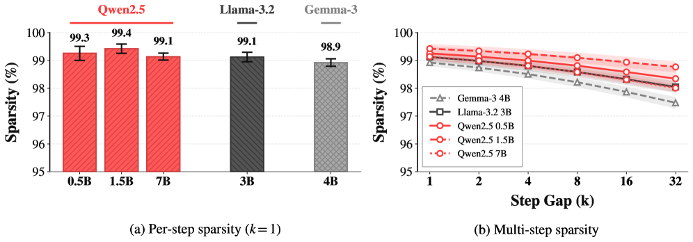

*Figure 1: Weight update sparsity in RL post-training. Approximately 99% of parameters remain unchanged at each optimization step.*

### 核心发现：权重更新稀疏性

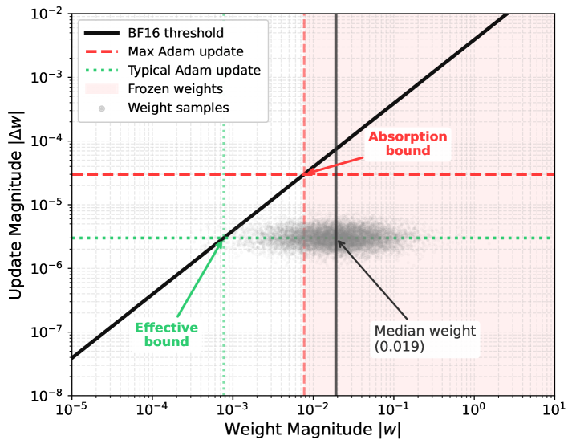

*Figure 2: Training progress with PULSE. Validation pass@1 improves steadily while upload sizes remain stable throughout training.*

**稀疏性的三个条件**：
1. 在整个训练过程中持续高稀疏性
2. 机制上可理解，从业者可以保留它
3. 对实际部署场景鲁棒

**实验设置**：
- 模型：Qwen2.5-Instruct (0.5B, 1.5B, 7B), Llama-3.2-Instruct (3B), Gemma-3-4B-it
- 算法：GRPO（基于 DAPO 超参数）
- 学习率：3×10⁻⁶，clipping ϵ_low=0.2, ϵ_high=0.28
- 数据集：MATH 数据集（数学推理任务）
- 训练时长：400 步

**稀疏性度量**：
$$\text{sparsity} = |\{i : \theta_{t+1}^{(i)} = \theta_t^{(i)}\}| / d$$

其中 $d$ 是总参数数。更高的稀疏性表示更少的参数变化和更大的压缩潜力。

### 核心公式

#### GRPO 算法

对于每个 prompt $x$，GRPO 采样一组 $G$ 个响应 $\{y_i\}_{i=1}^G$，并相对于组均值计算优势：

$$\hat{A}_i = \frac{r(x, y_i) - \bar{r}}{\sigma_r}, \quad \text{where} \quad \bar{r} = \frac{1}{G} \sum_{j=1}^G r(x, y_j)$$

策略使用类似 PPO 的 clipped surrogate 目标更新。

#### BF16 精度与更新吸收

关键机制：BF16 的有限尾数意味着更新必须超过权重相关的阈值才能生效。

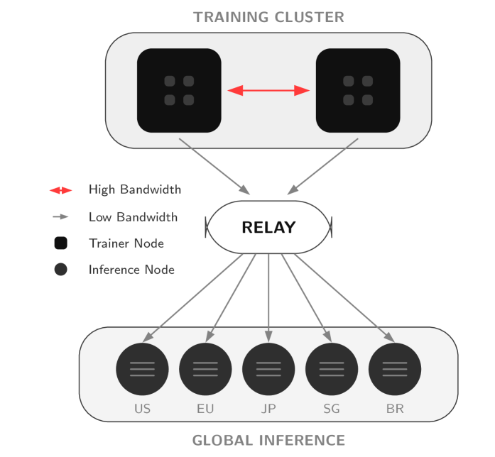

*Figure 3: Effect of learning rate on sparsity. Lower learning rates induce higher sparsity.*

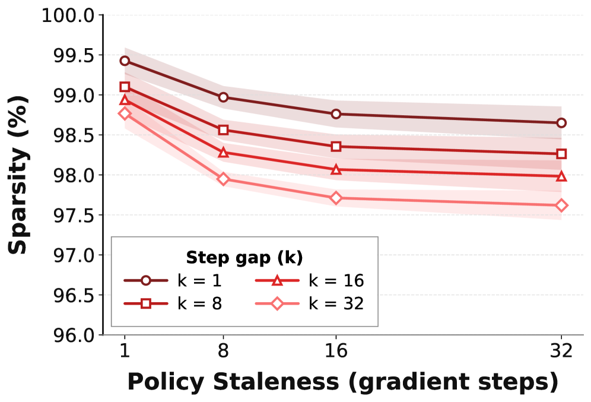

*Figure 4: Sparsity across different model scales (0.5B-7B). Sparsity is consistent across scales.*

### 核心组件：PULSE 算法

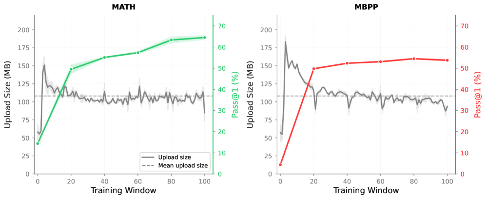

*Figure 5: PULSE algorithm overview. Sparse Value Patching transmits only changed parameters.*

**Algorithm 1: Sparse Value Patching**

**Encoding**:
```
procedure Encode(W_t, W_{t-1}):
    I ← {i: W_t^(i) ≠ W_{t-1}^(i)}    // 位级比较
    V ← W_t[I]                          // 提取新值（非增量）
    I ← Sort(I); I ← DeltaEncode(I)    // 可选：增量编码
    I ← Downcast(I)                     // 可选：窄整数类型
    P ← Compress(I, V)                  // 例如 zstd
    return P
```

**Decoding**:
```
procedure Decode(W_{t-1}, P):
    (I, V) ← Decompress(P)
    I ← Upcast(I)                      // 恢复原始整数类型
    I ← DeltaDecode(I)                  // 恢复绝对索引
    W_t ← W_{t-1}; W_t[I] ← V         // 补丁
    return W_t
```

**关键设计选择**：
- 存储**实际值**而非算术差值，避免浮点漂移
- 增量编码 + 类型下缩放提供约 23% 的额外压缩
- 通用压缩（zstd）进一步减小大小

### 分布式同步架构

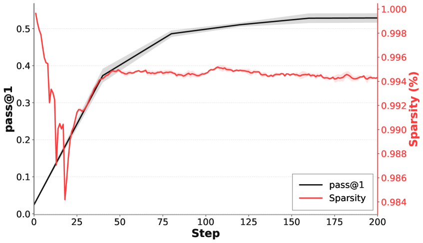

*Figure 6: Distributed synchronization protocol. PULSESync achieves lossless weight synchronization.*

**PULSESync**：
- 从 trainer 到 inference worker 发送无损稀疏 BF16 权重补丁
- 保证 bit-exact 重建
- 带宽减少超过 100×

**PULSELoCo**：
- 稀疏化 DiLoCo 风格的 FP32 伪梯度同步
- 带误差反馈
- 与 DiLoCo 匹配的同时减少 trainer-to-trainer 通信超过 17×

### 压缩算法选择

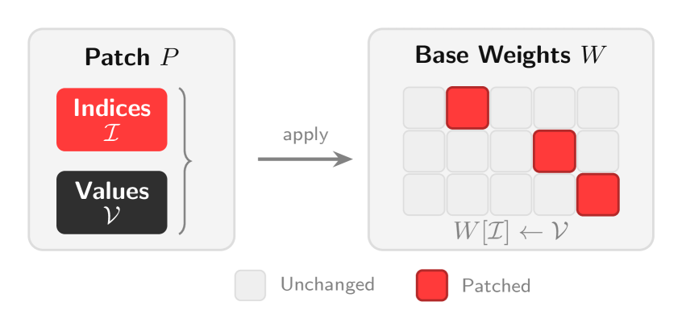

*Figure 7: Comparison of different compression methods.*

| 方法 | 压缩比 | 计算开销 |
|------|--------|----------|
| 熵编码 | 低 | 高 |
| Delta 编码 | 中 | 低 |
| PULSE（增量编码 + zstd） | 高 | 低 |

### 模型组件

| 组件 | 说明 | 关键参数 |
|------|------|----------|
| Sparse Value Patching | 核心压缩算法 | 位级比较 + 增量编码 |
| PULSESync | Trainer→Inference Worker 同步 | 无损 BF16 补丁 |
| PULSELoCo | Trainer 间梯度同步 | FP32 伪梯度 + 误差反馈 |
| Compression Engine | 通用压缩 | zstd |

## 四、核心创新

| 创新点 | 说明 | 理论/实验依据 |
|--------|------|---------------|
| Compute-Visible Sparsification | 只传输会改变下一次前向传播的更新 | BF16 精度 + 学习率导致 99% 更新不可见 |
| 无损重建保证 | 存储实际值而非增量，避免浮点漂移 | SHA-256 验证 bit-exact 重建 |
| 100× 带宽减少 | 7B 模型从 14GB 降至约 108MB | MATH 和 MBPP 任务验证 |
| 领域无关设计 | 适用于数学推理和代码生成 | 跨任务泛化验证 |

## 五、代码实现分析

PULSE 在 **grail** 平台上验证：
- grail 是一个去中心化 RL 训练平台
- 地理分布式节点通过公共互联网通信
- 全异步架构：trainer 持续运行，后台进程处理 checkpoint 上传和 rollout 下载
- 验证器通过隐藏状态指纹确保 rollout 来自正确的 checkpoint

## 六、实验结果

### 带宽减少

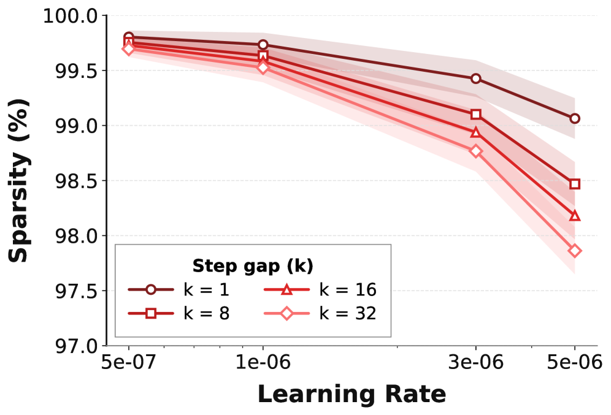

*Figure 8: Bandwidth reduction with PULSE. Upload sizes average 108MB, more than 100× smaller than full 14GB model synchronization.*

| 指标 | 值 |
|------|-----|
| 平均上传大小 | 108 MB (SE: 1.1 MB) |
| 完整同步大小 | 14 GB (7B BF16) |
| 带宽减少 | ~130× |
| 学习率 1×10⁻⁶ 时 | 更高稀疏性，更大压缩 |

### 训练有效性

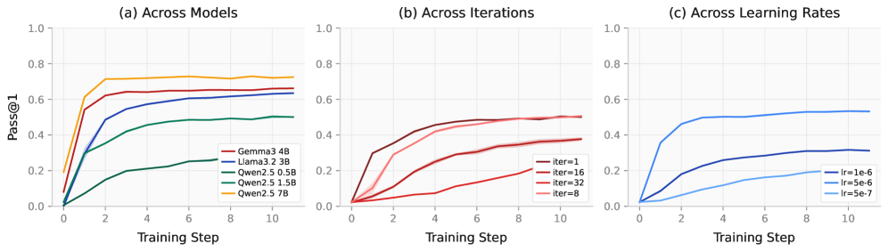

*Figure 9: Training progress on MATH dataset. Validation pass@1 improves steadily.*

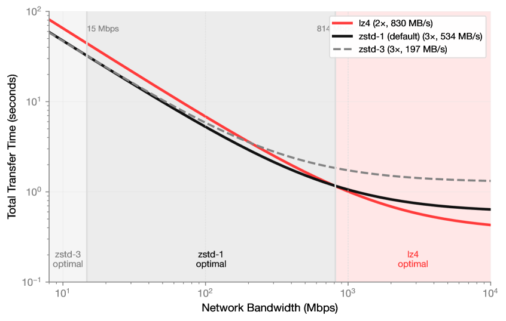

*Figure 10: Training progress on MBPP dataset. PULSE generalizes to code generation.*

| 任务 | 数据集 | 最终改进 |
|------|--------|----------|
| 数学推理 | MATH | +50.1 pass@1 |
| 代码生成 | MBPP | +49.4 pass@1 |

- 标准差跨运行 ≤1.5 百分点
- 所有权重传输通过 SHA-256 验证，确认 bit-exact 重建

### 无损重建

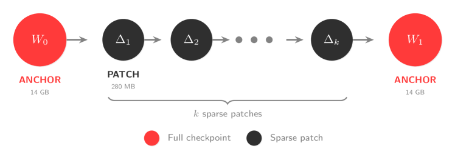

*Figure 11: Upload sizes remain stable throughout training, demonstrating consistent compression.*

- 所有权重传输通过 SHA-256 验证
- 确认 bit-exact 重建
- 无近似误差或误差反馈机制

### 与其他方法对比

| 方法 | 带宽减少 | 重建保证 | 误差反馈 |
|------|----------|----------|----------|
| DDP | 1× | - | - |
| DiLoCo | ~6× | 有损 | 需要 |
| PULSESync | **130×** | **无损** | 不需要 |
| PULSELoCo | **17×** (vs DiLoCo) | 有损 | 需要 |

### 与 DiLoCo 对比

- **PULSELoCo** 在四个模型上匹配 DiLoCo 性能
- 相比 DiLoCo 减少 trainer-to-trainer 通信超过 17×
- 相比 DDP 减少超过 100×

## 七、相关工作

### 分布式训练通信优化
- **梯度压缩**：Top-k、随机稀疏化、量化（通常有损）
- **误差反馈**：缓解有损压缩的累积误差
- **DiLoCo**：分布式训练的伪梯度同步
- **PULSE 的区别**：利用 BF16 精度导致的自然稀疏性，实现无损压缩

### RL 后训练系统
- **RLHF/RLAIF/RLVR**：不同的 RL 后训练范式
- **GRPO**：主流推理模型训练算法
- **PULSE 的贡献**：首次系统性分析 RL 后训练中的权重更新稀疏性

### 去中心化训练
- **Prime Intellect**：地理分布式训练
- **grail**：去中心化 RL 训练平台
- **PULSE 的适用性**：专门针对带宽受限的去中心化场景

## 八、总结

### 核心贡献

1. **首次系统性分析 RL 后训练中的权重更新稀疏性**：约 99% 的参数在每步保持不变
2. **机制解释**：BF16 精度 + 学习率导致 Adam 更新低于舍入阈值
3. **Compute-Visible Sparsification 原则**：只传输会改变下一次前向传播的更新
4. **PULSE 算法**：无损稀疏权重同步，实现 100×+ 带宽减少
5. **实际验证**：在去中心化 RL 训练平台上验证有效性

### 技术影响

- **降低分布式 RL 训练成本**：带宽减少 100×+，使地理分布式训练可行
- **无损保证**：避免有损压缩的累积误差和超参数调优
- **领域无关**：适用于数学推理、代码生成等多种任务
- **实际部署**：已在 grail 平台上验证

### 局限性

1. **算法限制**：主要研究 GRPO，其他算法（PPO、DPO）可能表现不同（尽管先前工作观察到类似稀疏性）
2. **优化器假设**：分析假设 Adam 风格优化器，其他优化器可能表现不同
3. **任务类型**：主要在单轮推理任务上验证，多轮 RL 设置需要进一步研究
4. **超参数敏感性**：学习率以外的超参数（如有效批量大小）可能影响稀疏性

## 九、参考资源

- **论文**: https://arxiv.org/abs/2602.03839
- **基础框架**: grail（去中心化 RL 训练平台）
- **相关工作**: DiLoCo, DDP, Prime Intellect
- **算法**: GRPO, PPO, RLHF, RLAIF, RLVR
