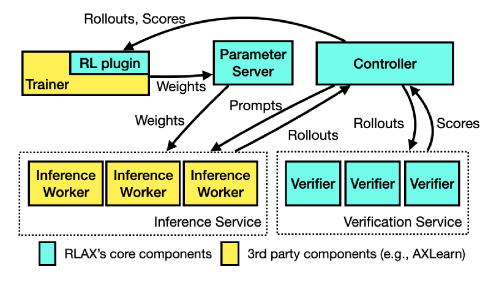
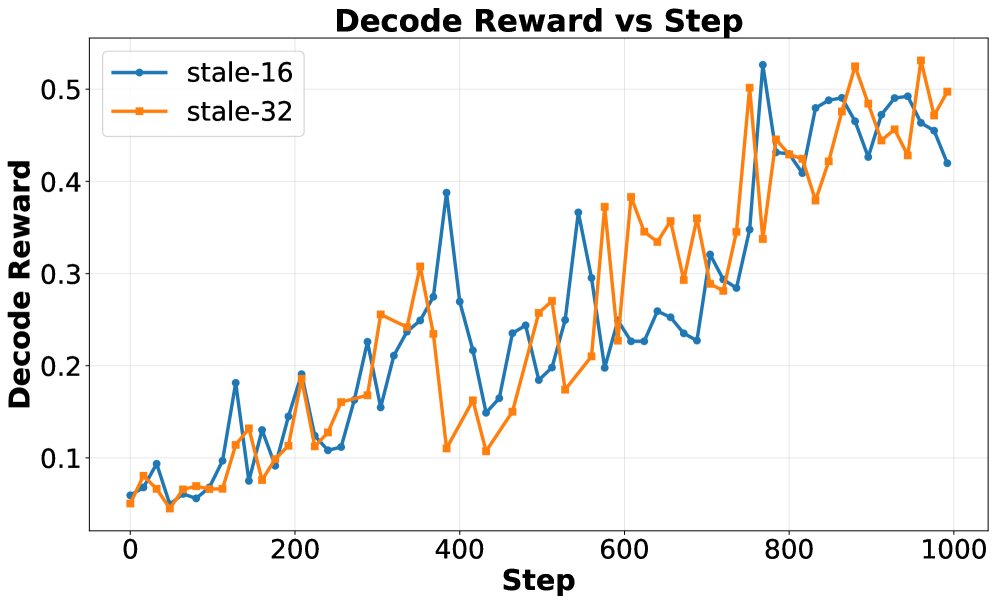
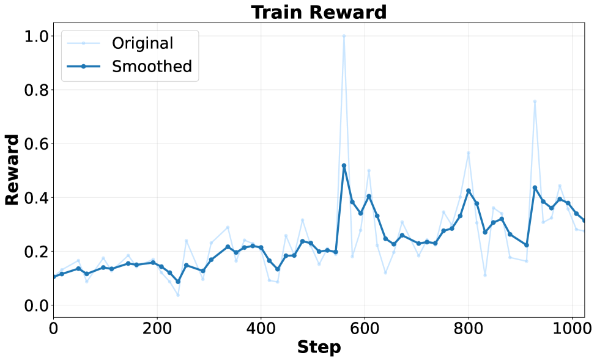
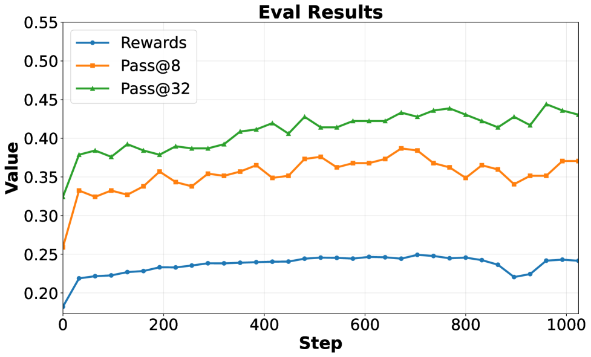
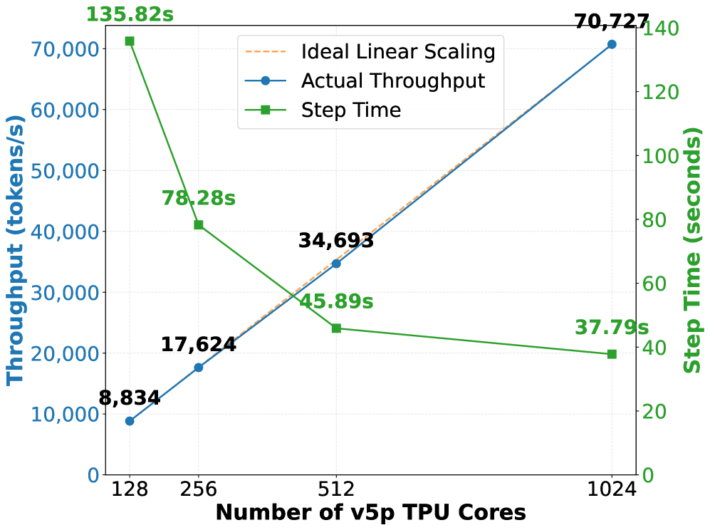
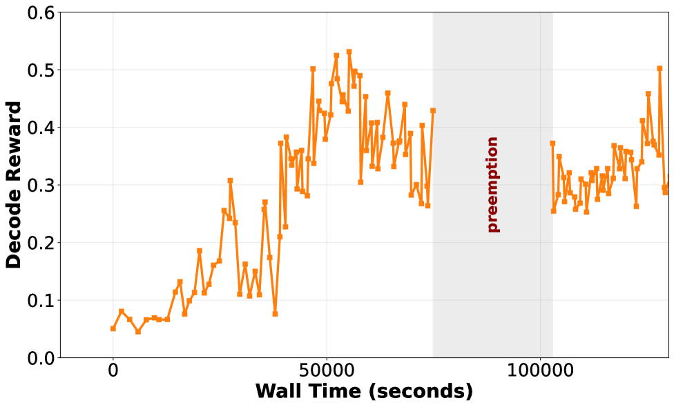
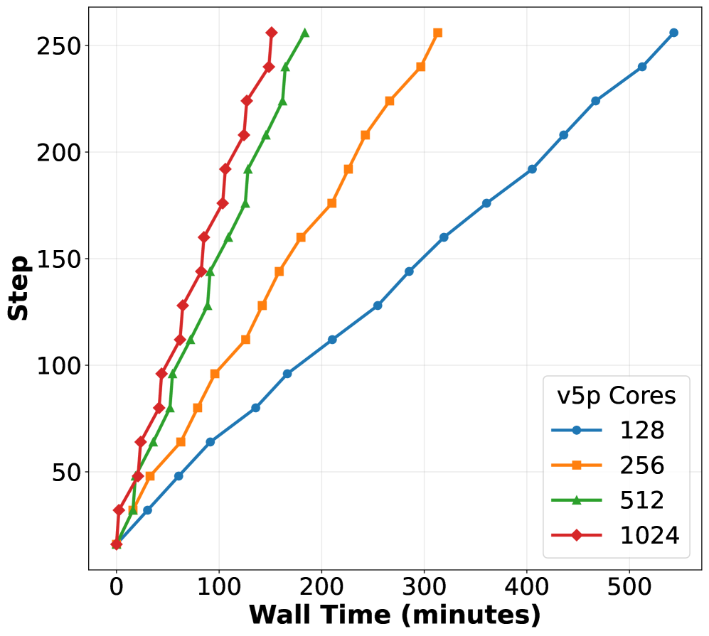

# RLAX: Large-Scale, Distributed Reinforcement Learning for Large Language Models on TPUs

## 一、论文概述

| 项目 | 内容 |
|------|------|
| **标题** | RLAX: Large-Scale, Distributed Reinforcement Learning for Large Language Models on TPUs |
| **作者** | Runlong Zhou, Lefan Zhang, Shang-Chen Wu, Kelvin Zou, Hanzhi Zhou, Ke Ye, Yihao Feng, Dong Yin, Alex Guillen Garcia, Dmytro Babych, Rohit Chatterjee, Matthew Hopkins, Xiang Kong, Chang Lan, Lezhi Li, Yiping Ma, Daniele Molinari, Senyu Tong, Yanchao Sun, Thomas Voice, Jianyu Wang, Chong Wang, Simon Wang, Floris Weers, Yechen Xu, Guolin Yin, Muyang Yu, Yi Zhang, Zheng Zhou, Danyang Zhuo, Ruoming Pang, Cheng Leong |
| **机构** | Apple |
| **论文** | https://arxiv.org/abs/2512.06392v1 |
| **代码** | - |
| **发布** | 2025-12-06 |
| **许可** | - |
| **领域** | cs.LG, cs.AI |

## 二、核心思想

### 问题定义

强化学习 (RL) 已成为提升大语言模型 (LLM) 推理能力的事实范式。然而，构建一个高效、可扩展、可抢占的 RL 训练框架面临四大挑战：

1. **算法多样性**：需要灵活支持各种 RL 算法（REINFORCE、GRPO、DAPO、PPO 等）
2. **训练范式**：需要同时支持 on-policy 和 off-policy RL
3. **规模化与可抢占性**：需要在大规模分布式 TPU 集群上高效运行，并支持无缝抢占
4. **数值对齐**：需要保持 trainer 和 inference worker 之间的数值一致性

### 解决方案概述

RLAX 是一个在 TPU 上运行的可扩展 RL 框架，采用 **parameter-server 架构**：
- Master trainer 定期将更新的模型权重推送到 parameter server
- 一组 inference worker 拉取最新权重并生成 rollouts
- 支持多种 state-of-the-art RL 算法
- 完全可抢占，支持高优先级作业立即回收 TPU 资源

### 核心成果

- 在 1024 个 v5p TPU 上，12 小时 48 分钟内将 QwQ-32B 的 pass@8 准确率提升 **12.8%**
- 在训练过程中多次意外抢占的情况下保持鲁棒性

## 三、技术架构

### 整体框架图

*Figure 1: RLAX system diagram. Blue parts represent RLAX's core software components. Yellow parts represent 3rd party components.*

RLAX 采用 **disaggregated architecture**，包含五个关键组件：

1. **Inference Service**：一组 inference workers，每个由一组 TPU 组成，独立运行模型推理
2. **Controller**：中央控制器，协调 trainer、inference workers 和 verifiers 的运行
3. **Trainer**：基于 AXLearn 的训练器，更新模型权重
4. **Parameter Server**：基于 TensorStore 的参数服务器，支持内存持久化和版本管理
5. **Verification Service**：代码和数学验证器池

### 核心公式

#### 统一 RL 目标函数

RLAX 采用模块化设计，将现代 RL 算法统一为一个通用目标函数：

$$\mathcal{J}_{\mathrm{unify}}(\theta) = \mathbb{E}_{\substack{q \sim \mathcal{D} \\ \{o_i\}_{i=1}^G \sim \pi_{\theta_{\text{old}}}(\cdot|q)}} \left[ \sum_{i=1}^G \sum_{t=1}^{|o_i|} \mathsf{sg}[\mathrm{Agg}_{i,t}^{\mathcal{X}} \cdot \mathrm{IS}_{i,t}^{\mathcal{X}}] \cdot \left( \mathsf{sg}[\mathrm{Adv}_{i,t}^{\mathcal{X}}] \cdot \mathrm{GradTerm1}_{i,t}^{\mathcal{X}} + \mathrm{GradTerm2}_{i,t}^{\mathcal{X}} \right) \right]$$

其中 $\mathsf{sg}[]$ 是 stop-gradient 算子，$\mathcal{X} = (\pi_\theta, \pi_{\theta_{\text{old}}}, q, \{o_i, R_i\}_{i=1}^G)$ 是当前 batch 的完整信息包。

#### 组件说明

**Aggregation Weight (Agg)**：
使目标函数合理有界。常见选择包括：
- 个体轨迹平均：$\frac{1}{G|o_i|}$
- 组级平均：$\frac{1}{\sum_{i=1}^G |o_i|}$
- 最大长度平均：$\frac{1}{GL_{\max}}$

**Importance Sampling Weight (IS)**：
校正当前策略 $\pi_\theta$ 和采样策略 $\pi_{\theta_{\text{old}}}$ 之间的分布偏移：

$$r_{i,t}(\theta) = \frac{\pi_\theta(o_{i,t}|q, o_{i,<t})}{\pi_{\theta_{\text{old}}}(o_{i,t}|q, o_{i,<t})}$$

**Advantage Estimate (Adv)**：
不同算法使用不同的优势估计方法。

**Gradient Terms**：
不同算法的梯度计算方式不同。

#### REINFORCE 目标

$$\mathcal{J}_{\text{REINFORCE}}(\theta) = \mathbb{E}_{q \sim \mathcal{D}, \{o_i\}_{i=1}^G \sim \pi_{\theta_{\text{old}}}(\cdot|q)} \left[ \frac{1}{G} \sum_{i=1}^G \mathsf{sg}[r_i(\theta)] \hat{A}_i \log \pi_\theta(o_i|q) \right]$$

#### GRPO 目标

$$\mathcal{J}_{\text{GRPO}}(\theta) = \mathbb{E} \left[ \frac{1}{G} \sum_{i=1}^G \frac{1}{|o_i|} \sum_{t=1}^{|o_i|} \min\left(r_{i,t}(\theta) \hat{A}_i, \text{clip}(r_{i,t}(\theta), 1-\epsilon, 1+\epsilon) \hat{A}_i \right) \right]$$

### 支持的 RL 算法

| 算法 | 类型 | 说明 |
|------|------|------|
| REINFORCE | On-policy | 经典策略梯度算法 |
| GRPO | On-policy | Group Relative Policy Optimization |
| DAPO | On-policy | Dynamic sampling with clip-higher |
| RLOO | On-policy | Leave-one-out baseline |
| PPO | On-policy | Proximal Policy Optimization |
| DPO | Off-policy | Direct Preference Optimization |
| KTO | Off-policy | Kahneman-Tversky Optimization |

### 训练范式支持

**On-policy RL**：
- 所有 rollouts 使用最新模型权重生成
- 每次 weight 更新后，inference workers 立即拉取新权重

**Off-policy RL**：
- 允许重用旧版本模型生成的 rollouts
- 通过 parameter server 版本管理和 staleness bound 控制

### 核心组件

| 组件 | 说明 | 关键参数 |
|------|------|----------|
| Parameter Server | 基于 TensorStore 的参数服务器 | 支持 N 个 weight snapshots |
| Controller | 中央控制器 | 协调所有组件 |
| Trainer | 基于 AXLearn 的训练器 | 支持多种并行策略 |
| Inference Workers | 推理服务 | paged attention + continuous batching |
| Verification Service | 验证服务 | Oubliette 代码执行服务 |

### 数值对齐机制

*Figure 6: Addressing numerical misalignment between inference workers and trainer.*

**问题来源**：
1. **并行策略差异**：推理使用 TP，训练使用 DP/FSDP/CP，导致浮点运算顺序不同
2. **JAX kernel fusion 差异**：推理和训练触发不同的 kernel fusion 策略

**解决方案**：
- Log-probability 重新计算
- Training-inference graph 对齐
- 维护 old policy 的精确副本

## 四、核心创新

| 创新点 | 说明 | 理论/实验依据 |
|--------|------|---------------|
| 统一 RL 目标函数 | 将多种 RL 算法统一为一个通用框架 | 支持 REINFORCE、GRPO、DAPO、PPO 等 |
| Parameter-Server 架构 | 支持可扩展的分布式训练 | 1024 TPU 线性扩展 |
| 可抢占设计 | 支持高优先级作业立即回收资源 | 多次抢占后训练恢复 |
| 数值对齐机制 | 保持 trainer 和 inference worker 数值一致 | log-prob 重新计算 |
| Oubliette 验证服务 | 可扩展的代码验证服务 | 支持 9096 个 Codeforces 问题 |

## 五、代码实现分析

### 技术栈

- **训练后端**：AXLearn（基于 JAX/XLA）
- **推理引擎**：AXLearn inference mode（paged attention + continuous batching）
- **参数服务器**：TensorStore 扩展
- **代码验证**：Oubliette（基于 AWS Lambda）
- **并行策略**：Data Parallelism, FSDP, Tensor Parallelism, Context Parallelism, Expert Parallelism

### 关键实现细节

1. **Parameter Server 设计**：
   - 基于 TensorStore，支持内存持久化
   - 与模型原生 weight sharding 对齐
   - 支持 gRPC + RDMA 通信

2. **Controller 逻辑**：
   - 确定性控制器逻辑
   - 可重现的 RNG 流
   - 双内存/持久存储

3. **Inference Worker**：
   - AXLearn inference mode
   - paged attention + continuous batching
   - 支持多种并行策略

## 六、实验结果

### 主要结果

*Figure 2: Training reward and test set accuracy over steps when training QwQ-32B on Codeforces dataset.*

**实验设置**：
- 模型：QwQ-32B
- 数据集：Codeforces 2013-2024（训练），2025（评估）
- 验证器：Oubliette（代码执行）
- 硬件：v5p-512 集群（训练 + rollout）

**结果**：
| 指标 | 改进 |
|------|------|
| Reward | +6.7% |
| pass@8 | +12.8% |
| pass@32 | +12.0% |

由于 QwQ-32B 的知识截止日期是 2024 年 11 月 28 日，这些在 Codeforces 2025 上的提升代表了真正的编码能力提升。

### TPU 可扩展性

*Figure 3: TPU Scalability: Rollout throughput and training step time vs core count.*

**扩展性测试**：
- 推理集群：v5p-128, v5p-256, v5p-512, v5p-1024
- 训练集群：v5p-512

**结果**：
- 推理吞吐量随集群规模**近线性扩展**（v5p-128 到 v5p-1024 提升 8.0×）
- 训练步长延迟减少 3.6×
- Controller 引入的开销极小

### 支持抢占

*Figure 4: Supporting preemption during training.*

**抢占测试**：
- 在训练过程中模拟多次意外抢占
- RLAX 能够从抢占中恢复并继续训练
- 训练收敛不受影响

### 消融实验

*Figure 7: Ablation study on staleness bounds and numerical alignment.*

**消融内容**：
1. **Staleness bound**：测试不同 k 值（允许旧 rollout 的最大步数）
2. **Numerical alignment**：比较有无数值对齐的训练效果

**发现**：
- 适度的 staleness（k=1-2）不会显著影响训练质量
- 数值对齐对 off-policy 训练至关重要

### 算法比较

*Figure 5: Comparison of different RL algorithms supported by RLAX.*

**支持的算法**：
- REINFORCE
- GRPO
- DAPO
- RLOO
- PPO
- DPO
- KTO

所有算法在统一框架下实现，支持灵活切换。

## 七、相关工作

### RL 训练系统
- **veRL**：基于 PyTorch 的 RL 训练框架
- **TRL**：Hugging Face 的 RL 训练库
- **OpenRLHF**：开源 RL 训练框架
- **Tunix**：Google 的 TPU RL 微调库（缺少多主机分布式训练）
- **RLAX 的区别**：专为大规模 TPU 集群设计，支持完全可抢占

### Off-policy RL
- **Magistral**：继续生成时重用旧 KV cache
- **LlamaRL**：混合版本 rollout
- **RLAX 的设计**：rollout-level off-policy，支持 bounded staleness

### Checkpoint-and-Restore
- **Gandiva**：分布式训练的检查点
- **Bamboo**：容错训练
- **RLAX 的扩展**：将检查点扩展到 RL 设置，处理 prompt-mixture sampling、verifier outcomes、model-version provenance

## 八、总结

### 核心贡献

1. **统一 RL 框架**：将多种 RL 算法（REINFORCE、GRPO、DAPO、PPO 等）统一在一个灵活的系统架构中
2. **可扩展 Parameter-Server 架构**：支持大规模分布式 TPU 集群，近线性扩展
3. **完全可抢占设计**：支持高优先级作业立即回收 TPU 资源
4. **数值对齐机制**：保持 trainer 和 inference worker 之间的数值一致性
5. **Oubliette 验证服务**：可扩展的代码验证服务，支持 9096 个 Codeforces 问题
6. **数据集整理技术**：加速收敛并提升模型质量

### 技术影响

- **大规模 RL 训练**：在 1024 个 v5p TPU 上实现高效训练
- **实际应用**：QwQ-32B 在 Codeforces 2025 上提升 12.8% pass@8
- **可抢占性**：支持生产环境中的资源复用
- **开源模型改进**：展示了 RL 对开源模型推理能力的显著提升

### 局限性

1. **硬件依赖**：专为 TPU 设计，不直接支持 GPU
2. **代码未开源**：系统实现未公开
3. **算法覆盖**：主要关注推理任务，其他任务（如对话、创意写作）未充分探索
4. **Off-policy 限制**：当前采用 rollout-level off-policy，不支持 mixed-version rollouts

## 九、参考资源

- **论文**: https://arxiv.org/abs/2512.06392v1
- **训练后端**: AXLearn (基于 JAX/XLA)
- **参数服务器**: TensorStore
- **代码验证**: Oubliette (基于 AWS Lambda)
- **相关系统**: veRL, TRL, OpenRLHF, Tunix
