# RLinf: Flexible and Efficient Large-scale Reinforcement Learning via Macro-to-Micro Flow Transformation

## 一、论文概述

| 项目 | 内容 |
|------|------|
| **标题** | RLinf: Flexible and Efficient Large-scale Reinforcement Learning via Macro-to-Micro Flow Transformation |
| **作者** | Chao Yu, Yuanqing Wang, Zhen Guo, Hao Lin, Si Xu, Hongzhi Zang, Quanlu Zhang, Yongji Wu, Chunyang Zhu, Junhao Hu, et al. (29 authors) |
| **机构** | - |
| **论文** | https://arxiv.org/abs/2509.15965 |
| **代码** | - |
| **发布** | 2025-09-19 |
| **许可** | - |
| **领域** | cs.LG (Machine Learning) |

## 二、核心思想

### 问题定义

强化学习（RL）在推进通用人工智能、具身智能和智能体智能方面展现出巨大潜力。然而，RL 工作流固有的异构性和动态性往往导致现有系统上硬件利用率低和训练缓慢。

现有系统的关键问题：
1. **低灵活性**：现有系统无法适应多样化的 RL 工作流
2. **低硬件利用率**：组件间的异构性导致 GPU 空闲
3. **长尾问题**：不同生成长度导致加速器闲置
4. **内存和计算不平衡**：流水线执行引入资源浪费

### 解决方案概述

RLinf 是一个高性能 RL 训练系统，基于一个关键观察：**高效 RL 训练的主要障碍在于系统灵活性**。

核心设计范式：**Macro-to-Micro Flow Transformation (M2Flow)**
- 自动将高级、易于组合的 RL 工作流在时间和空间维度上分解
- 重新组合为优化的执行流
- 解耦可编程代码逻辑与物理执行和调度

### 核心成果

- 端到端训练吞吐量提升 **1.07×-2.43×**
- 支持推理 RL 和具身 RL 任务
- 在 8-1024 GPU 集群上有效
- 达到 SOTA 或更好的模型性能

## 三、技术架构

### 多样化 RL 工作流

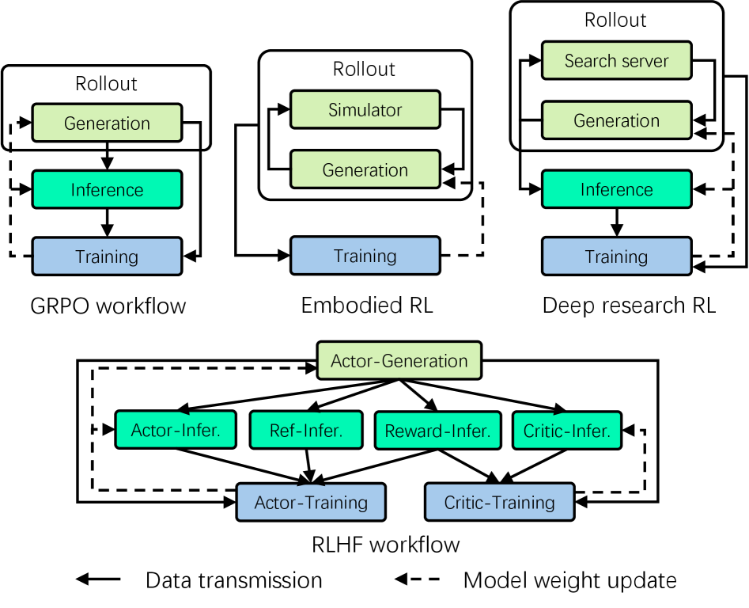

*Figure 1: Diverse RL workflows in various scenarios.*

**典型 RL 工作流**：
- **GRPO**：单 LLM，生成→推理→训练
- **RLHF/PPO**：4 个 LLM（Actor, Reference, Reward, Critic）
- **具身 RL**：LLM + 模拟器
- **Deep Research**：LLM + 搜索服务器

### RLinf 架构

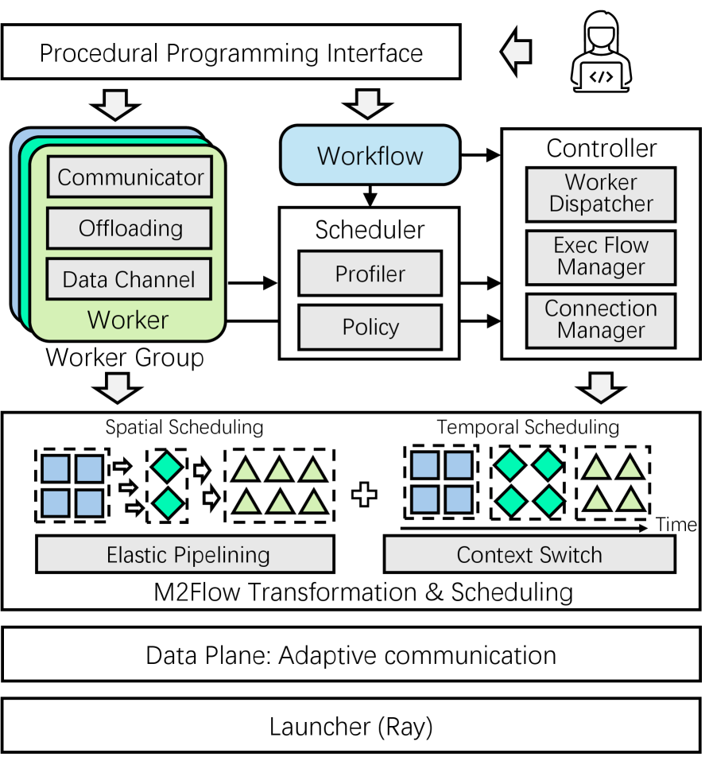

*Figure 4: The architecture of RLinf.*

### M2Flow 执行逻辑

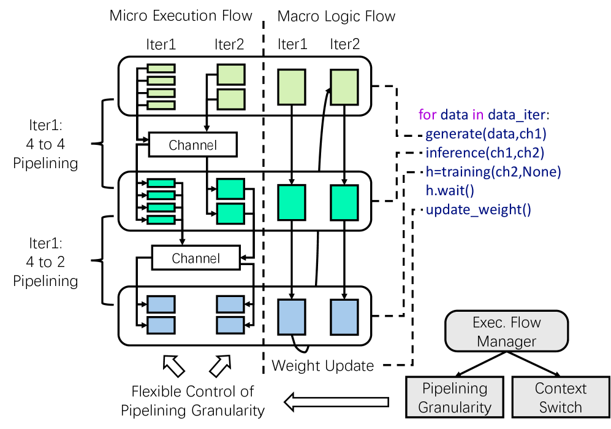

*Figure 6: The M2Flow execution logic.*

### 时空调度

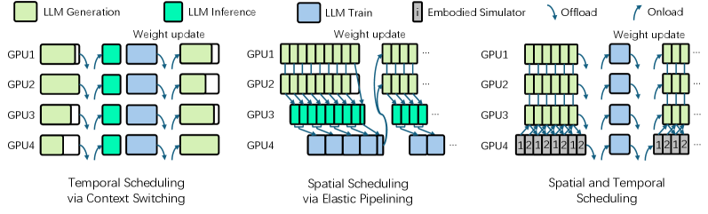

*Figure 7: Spatial and temporal scheduling of workers.*

### 核心公式

#### M2Flow 范式

**Macro Logical Flow**：开发者以粗粒度声明式指定组件间的数据通信流
```
RolloutWorker.generate(data_ch, rollout_ch)
ActorWorker.train(rollout_ch).wait()
```

**Micro Execution Flow**：系统自动转换为细粒度执行流
- 空间调度：将 workers 分配到加速器
- 时间调度：确定执行时间段
- 时空调度：控制流水线执行粒度

#### 调度策略

**Profiling-guided Scheduling**：
$$\text{Schedule} = \arg\min_{S} \text{Latency}(S, W)$$
$$\text{s.t.} \sum_{w \in W} \text{Resource}(w, S) \leq \text{Capacity}$$

其中 $S$ 是调度方案，$W$ 是 workers 集合。

#### 执行模式

**1. 时间模式（Temporal Mode）**：
- 组件顺序执行，共享加速器
- 类似 veRL 设计
- 适合内存受限场景

**2. 空间模式（Spatial Mode）**：
- 组件并行执行，独立加速器
- 消除长尾问题
- 需要更多资源

**3. 混合模式（Hybrid Mode）**：
- 部分组件共享，部分独立
- 平衡效率和资源
- 最灵活的模式

### 核心组件

| 组件 | 说明 | 关键参数 |
|------|------|----------|
| Worker | RL 组件封装 | 自适应通信，资源卸载 |
| Controller | 执行流编排 | 函数调用分发 |
| Scheduler | 调度策略 | Profiling-guided |
| Channel | 数据通道 | 点对点通信 |
| Cluster | 资源管理 | Ray 远程控制 |

### 关键机制

#### 1. Context Switching（上下文切换）

- 类似操作系统中的进程切换
- Worker 可以暂时卸载（offload）和重新加载（onload）
- 实现时间维度的资源复用

#### 2. Elastic Pipelining（弹性流水线）

- 空间维度的组件并行
- 动态调整流水线粒度
- 适应不同工作负载特性

#### 3. Adaptive Communication（自适应通信）

- 点对点通信
- 数据通道抽象
- 支持可扩展的 worker 交互

## 四、核心创新

| 创新点 | 说明 | 理论/实验依据 |
|--------|------|---------------|
| M2Flow 范式 | 宏到微观流转换 | 解耦逻辑与执行 |
| Profiling-guided 调度 | 运行时特征驱动 | 最优执行模式选择 |
| Context Switching | 时间维度资源复用 | 消除长尾问题 |
| Elastic Pipelining | 空间维度弹性并行 | 适应异构工作负载 |
| 过程式编程 | 灵活的工作流表达 | 易于调试和透明 |
| 自适应通信 | 可扩展的 worker 交互 | 支持大规模部署 |

## 五、代码实现分析

### 技术栈

- **分布式框架**：Ray
- **推理引擎**：SGLang
- **训练框架**：Megatron-LM
- **GPU**：NVIDIA H100-80GB
- **网络**：NVLink (intra-node) + RDMA (inter-node)

### 关键实现细节

1. **Worker 抽象**：
   - 封装 RL 组件逻辑
   - 自适应通信接口
   - 资源卸载机制

2. **编程接口**：
   - 过程式编程范式
   - Worker 定义 + Workflow Runner
   - Channel 抽象数据流

3. **调度器**：
   - 运行时 profiling
   - 搜索最优执行模式
   - 控制器分配和编排

4. **资源管理**：
   - Ray 远程启动和控制
   - 动态资源分配
   - 跨节点通信优化

## 六、实验结果

### GRPO 训练吞吐量

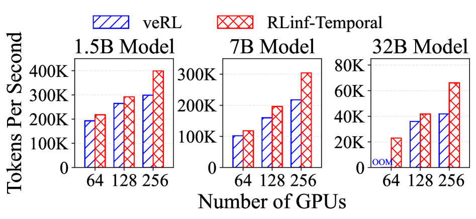

*Figure 8: GRPO training throughput of Qwen2.5 on RLinf and veRL under different cluster scales and model sizes.*

**实验设置**：
- 模型：Qwen2.5 1.5B, 7B, 32B
- GPU：64, 128, 256 NVIDIA H100
- 批大小：512，最大序列长度：28672

**结果**：
- RLinf 时间模式比 veRL 快 **1.10×-1.58×**
- 随 GPU 数量增加，veRL 扩展性差
- 推理成为 veRL 的瓶颈（15.2%→19.9%）

### GRPO 延迟分解

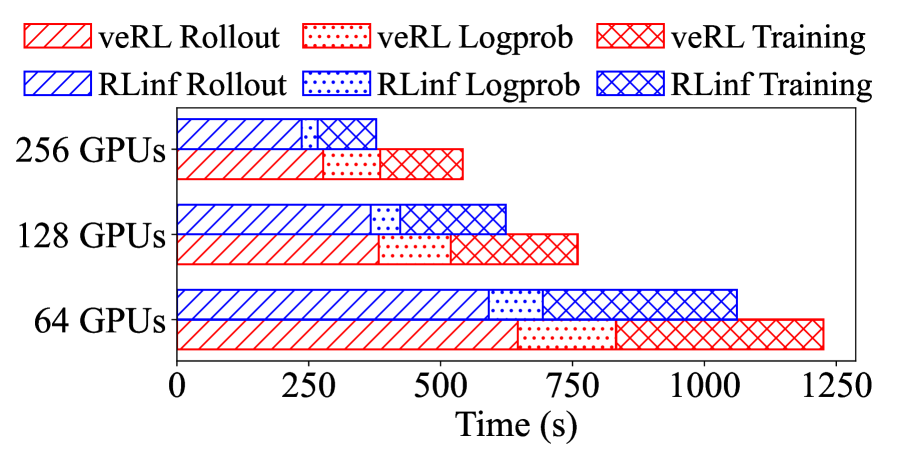

*Figure 9: Latency breakdown of Qwen2.5 7B model training.*

**分析**：
- RLinf 有更大的 KV-cache 分配
- 减少推理阶段的同步开销
- 更好的 GPU 内存管理

### PPO 训练吞吐量

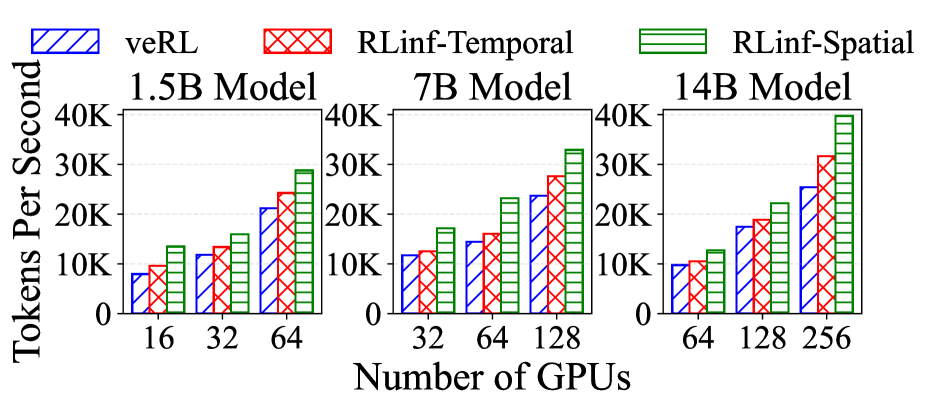

*Figure 10: PPO training throughput of Qwen2.5 on RLinf and veRL under different cluster scales and model sizes.*

**结果**：
- PPO 比 GRPO 更复杂（4 个 LLM）
- RLinf 混合模式表现最佳
- 空间模式在某些配置下优于时间模式

### PPO 延迟分解

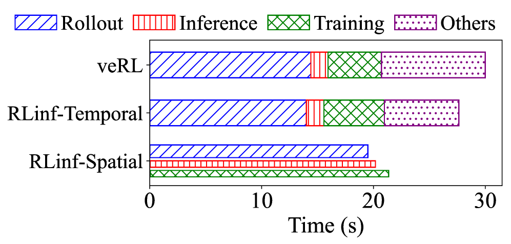

*Figure 11: Latency breakdown of Qwen2.5 7B with PPO on 32 GPUs.*

### MoE 模型训练

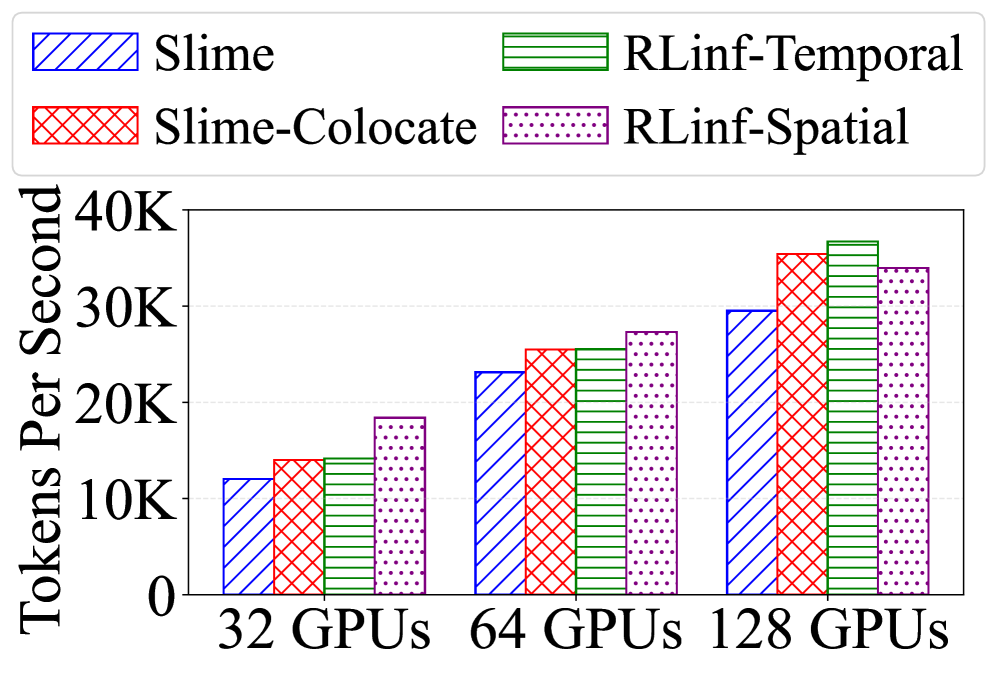

*Figure 12: RL training throughput of Qwen3-30B-A3B on RLinf and Slime under different cluster scales.*

**结果**：
- Qwen3-30B-A3B MoE 模型
- RLinf 比 Slime 快 **1.07×-1.70×**
- 混合模式在大规模下表现最佳

### 具身 RL 训练

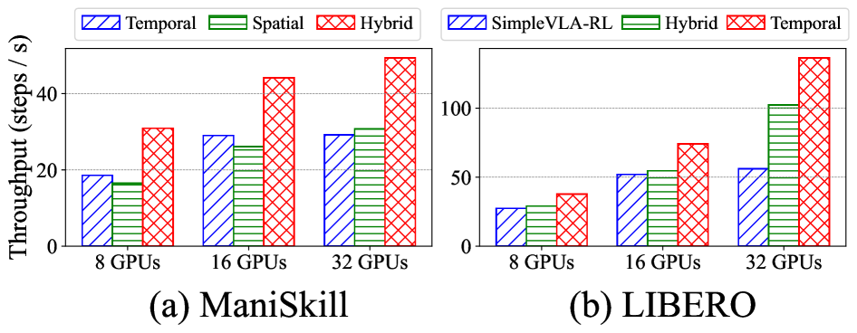

*Figure 14: End-to-end throughput of RLinf and SimpleVLA-RL under different cluster scales.*

**结果**：
- LIBERO 任务：RLinf 比 SimpleVLA-RL 快 **1.05×-2.43×**
- ManiSkill 任务：混合模式比其他策略快 **1.87×**
- 支持 CPU 模拟器和 GPU 渲染

### 搜索策略

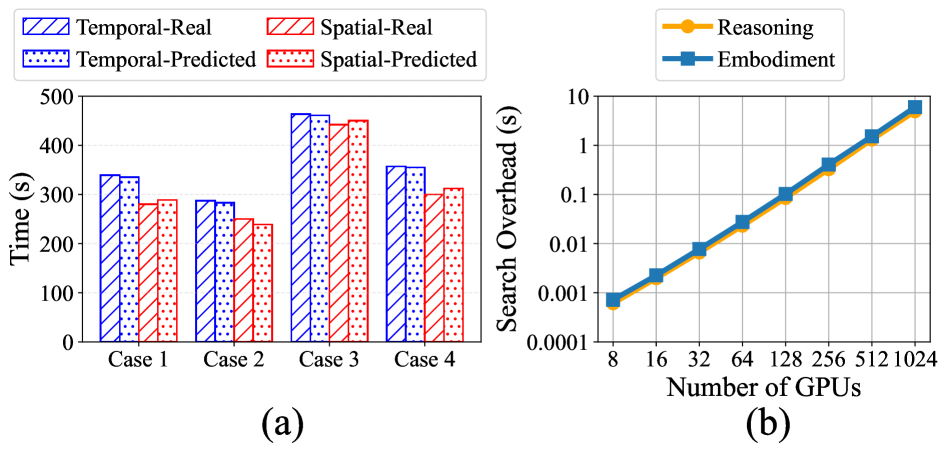

*Figure 16: (a) The real and predicted latency in different cases. (b) The search overhead under different cluster scales.*

**结果**：
- 调度搜索时间：7×10^-4 ~ 5.98 秒
- 在 8-1024 GPU 集群上有效
- 预测延迟与实际延迟高度一致

### 与其他方法对比

| 方法 | 执行模式 | 灵活性 | GRPO 吞吐量 | PPO 吞吐量 | 具身 RL |
|------|----------|--------|-------------|------------|---------|
| veRL | 时间模式 | 低 | 基线 | 基线 | 不支持 |
| Slime | 时间模式 | 低 | 基线 | - | 不支持 |
| SimpleVLA-RL | 空间模式 | 中 | - | - | 基线 |
| **RLinf** | **混合模式** | **高** | **1.10×-1.58×** | **1.07×-1.70×** | **1.05×-2.43×** |

## 七、相关工作

### RL 训练系统

- **veRL**：单节点 RL 训练系统
- **Slime**：RL 训练框架
- **AReaL**：异步 RL 训练
- **SimpleVLA-RL**：具身 RL 训练

### 分布式训练框架

- **Ray**：分布式计算框架
- **Megatron-LM**：大模型训练框架
- **DeepSpeed**：深度学习优化库

### 推理引擎

- **SGLang**：高效 LLM 推理
- **vLLM**：高吞吐量推理
- **TensorRT-LLM**：NVIDIA 推理优化

## 八、总结

### 核心贡献

1. **M2Flow 范式**：宏到微观流转换，解耦逻辑与执行
2. **Profiling-guided 调度**：运行时特征驱动的最优执行模式选择
3. **Context Switching**：时间维度资源复用，消除长尾问题
4. **Elastic Pipelining**：空间维度弹性并行，适应异构工作负载
5. **过程式编程接口**：灵活的工作流表达，易于调试

### 技术影响

- **RL 训练效率**：端到端吞吐量提升 1.07×-2.43×
- **系统灵活性**：支持多样化 RL 工作流
- **可扩展性**：8-1024 GPU 集群有效
- **通用性**：推理 RL 和具身 RL 均有效

### 局限性

1. **调度开销**：profiling-guided 搜索需要时间
2. **实现复杂度**：M2Flow 转换需要精心设计
3. **资源需求**：混合模式需要更多 GPU
4. **模型限制**：主要验证 Qwen 系列

### 未来方向

- 扩展到更多 RL 算法和场景
- 优化调度算法效率
- 支持更大规模集群
- 与其他优化技术结合

## 九、参考资源

- **论文**: https://arxiv.org/abs/2509.15965
- **基础框架**: Ray, Megatron-LM, SGLang
- **相关系统**: veRL, Slime, AReaL, SimpleVLA-RL
- **模型**: Qwen2.5, Qwen3-MoE, OpenVLA
- **硬件**: NVIDIA H100-80GB, NVLink, RDMA
- **应用场景**: 推理 RL, 具身 RL, Deep Research
