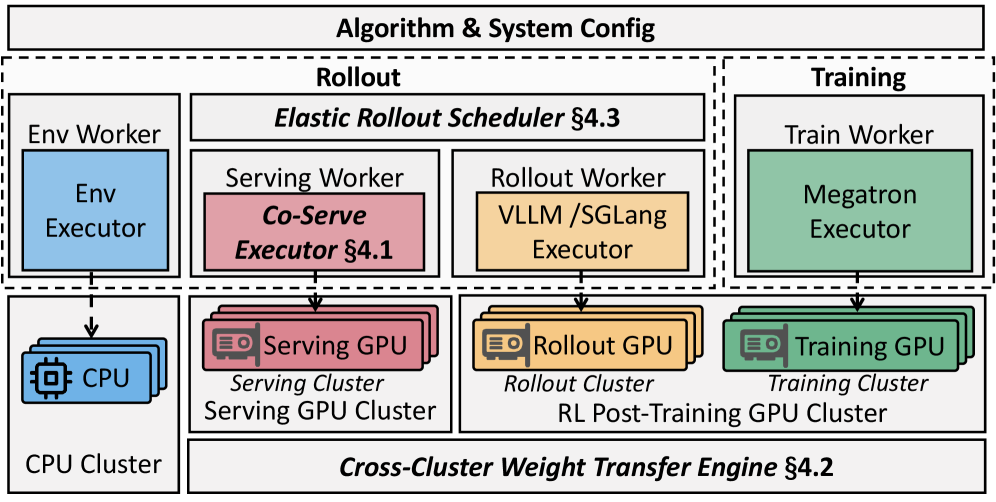
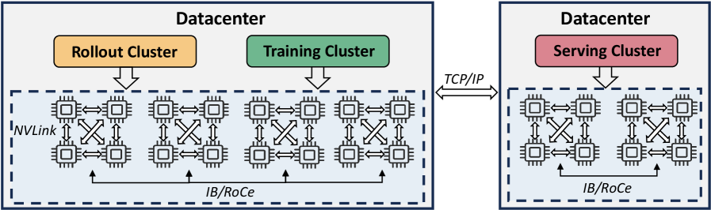
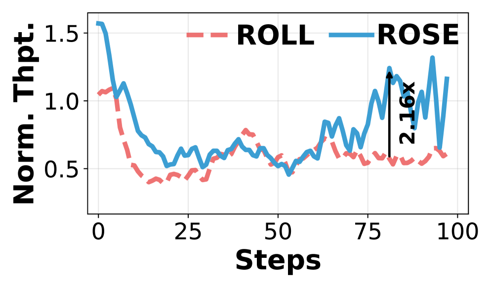
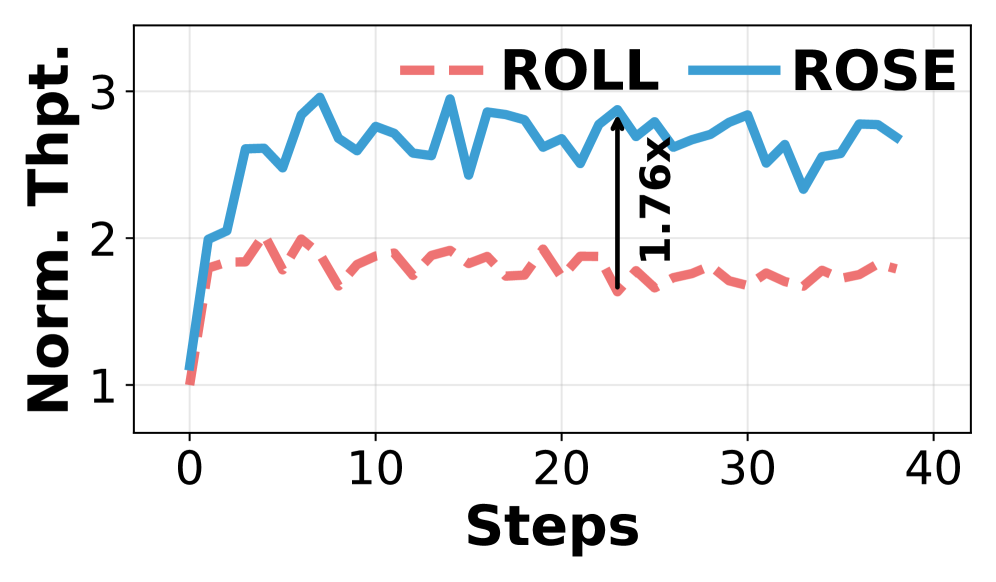
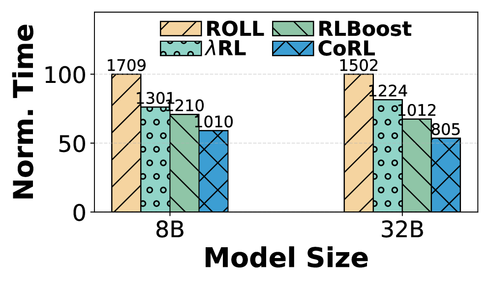
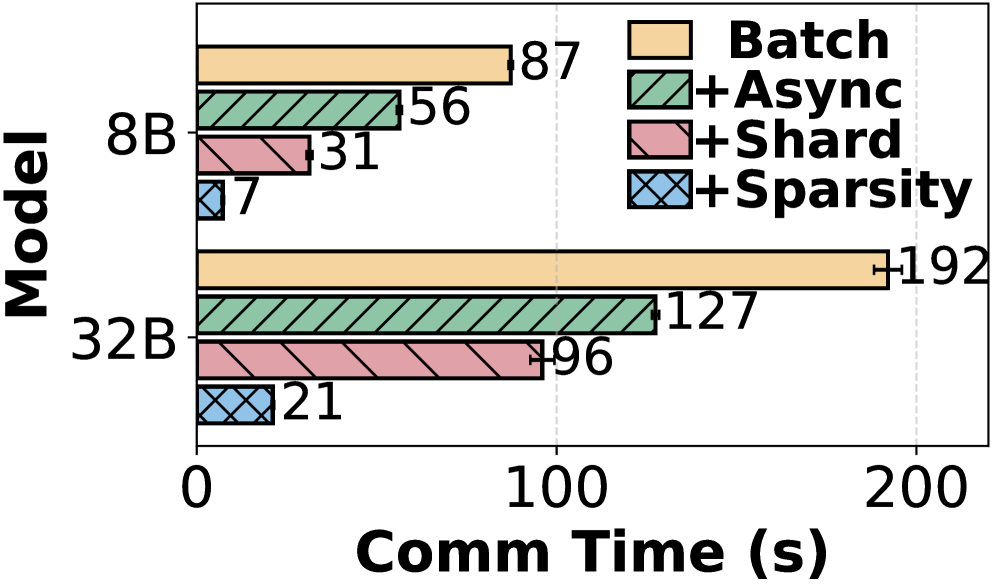
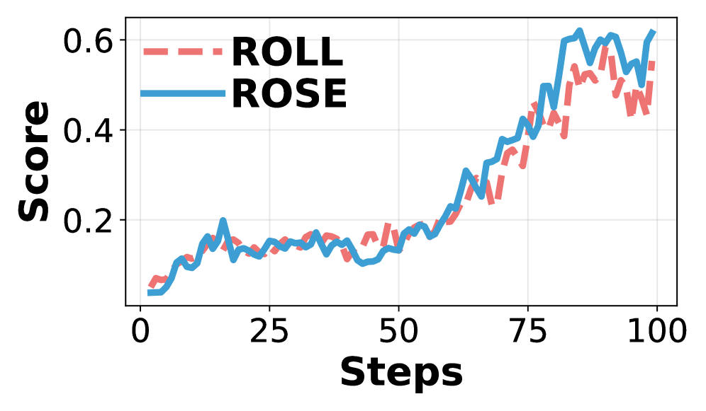

# ROSE: Rollout On Serving GPUs via Cooperative Elasticity for Agentic RL

## 一、论文概述

| 项目 | 内容 |
|------|------|
| **标题** | ROSE: Rollout On Serving GPUs via Cooperative Elasticity for Agentic RL |
| **作者** | Wei Gao, Yuheng Zhao, Dilxat Muhtar, Dakai An, Xuchun Shang, Tianyuan Wu, Lunxi Cao, Shaopan Xiong, Weixun Wang, Ju Huang, Teng Ma, Siran Yang, Jiamang Wang, Lin Qu, Bo Zheng, Wei Wang |
| **论文** | https://arxiv.org/abs/2605.06534 |
| **代码** | - |
| **发布** | 2026-05-07 |
| **领域** | cs.DC (Distributed, Parallel, and Cluster Computing) |

## 二、核心思想

### 问题定义

Agentic RL 正在重塑 LLM 后训练，但端到端训练时间被**计算密集的多轮 rollout** 主导，占总时间的 **70% 以上**。关键挑战：

1. **资源需求波动**：不同训练步骤的 rollout 资源需求差异显著
2. **长尾分布**：rollout 执行时间呈显著长尾分布（P75 最多仅占端到端 rollout 时间的 30%）
3. **资源固定系统无法适应**：overprovisioning 导致 GPU 空闲，underprovisioning 加剧竞争
4. **资源弹性方案开销高**：按需分配外部 GPU 的方案面临高分配开销和有限可用性

### 解决方案概述

ROSE 提出 **cooperative elasticity（协作弹性）**：复用已部署的 **serving GPU** 的空闲资源来运行 rollout 工作负载。

核心观察：serving 集群的 GPU 计算和内存在大部分时间是**空闲的**（生产 LLM serving 工作负载呈波动流量模式，峰值可达平均值的 4.22×）。

### 系统架构

*Figure 5: System Architecture of ROSE.*

ROSE 包含三个核心组件：

1. **SLO-Safe Co-Serving Executor**：在同一 GPU 上共置异构 serving 和 rollout 模型，动态共享内存和计算，同时保证 serving SLO
2. **Cross-Cluster Weight Transfer Engine**：利用 shard-aware routing 和 weight sparsity 进行快速权重同步
3. **Elastic Rollout Scheduler**：动态在专用 rollout GPU 和机会性 serving GPU 之间路由 rollout

## 三、技术架构

### 整体框架图

*Figure 4: Scheme of Datacenter Infrastructure.*

**集群设置**：
- **Training Cluster**：用于模型训练
- **Rollout Cluster**：用于 rollout 执行，与 training cluster 同置，通过高速互连（NVLink/InfiniBand）通信
- **Serving Cluster**：可能位于相同或不同数据中心，通过带宽受限的链路（10-200 Gbps Ethernet）连接

**协作弹性概念**：RL 基础设施团队与 serving 团队合作，在 rollout 需求高峰时复用 serving GPU，无需扩展训练集群。

### 核心组件 1：SLO-Safe Co-Serving Executor

**目标**：在同一 GPU 上共置异构 serving 和 rollout 模型，同时保证 serving SLO（TTFT 和 TPOT）。

**关键设计**：

1. **Dual-SLO Admission Controller**：
   - 监控 serving 负载和 GPU 利用率
   - 动态决定是否允许 rollout 请求
   - 当 serving 负载高时，暂停或延迟 rollout

2. **Memory Sharing**：
   - serving 和 rollout 模型共享 GPU 内存
   - 动态调整 KV cache 分配
   - rollout 模型预部署但不激活（占用 ≤2GB 内存）

3. **Compute Sharing**：
   - serving 和 rollout 交替使用 GPU 计算资源
   - 利用 serving 空闲周期运行 rollout
   - 细粒度调度避免干扰

### 核心组件 2：Cross-Cluster Weight Transfer Engine

**问题**：训练集群更新的权重需要同步到 serving 集群的 rollout 模型，跨集群通信开销大。

**解决方案**：

1. **Shard-Aware Routing**：
   - 根据模型分片策略路由权重传输
   - 避免不必要的数据传输

2. **Weight Sparsity**：
   - 观察到 RL 训练中权重差异是稀疏的
   - 只传输变化的权重部分
   - 显著减少通信量

3. **Relay Worker**：
   - 使用 Mooncake 作为中继
   - ROLL 发布更新的权重，vLLM 拉取

### 核心组件 3：Elastic Rollout Scheduler

**目标**：在专用 rollout GPU 和借用的 serving GPU 之间动态调度 rollout。

**关键设计**：

1. **动态路由**：
   - 根据当前负载和 SLO 状态决定 rollout 路由
   - 优先使用专用 rollout GPU
   - 当负载高时，溢出到 serving GPU

2. **负载均衡**：
   - 选择最近 KVC 使用率最低的 serving GPU
   - 每个 serving GPU 最多分配给一个 RL job

3. **故障处理**：
   - 当 serving 负载导致 rollout 停滞时，重新路由后续 turn

### 模型组件

| 组件 | 说明 | 关键参数 |
|------|------|----------|
| Co-Serving Executor | 共置 serving 和 rollout 模型 | 动态内存/计算共享 |
| Weight Transfer Engine | 跨集群权重同步 | shard-aware + sparsity |
| Rollout Scheduler | 弹性 rollout 调度 | 动态路由 + 负载均衡 |
| Dual-SLO Controller | SLO 保证 | TTFT + TPOT 监控 |
| Relay Worker | 权重中继 | Mooncake Store |

### 系统工作流

1. 用户指定 RL 资源请求 $N_{rl}$ 和可借用 serving GPU 上限 $N_{serving}$
2. RL 集群保留 $N_{rl}$ 个 GPU，serving 集群选择 $N_{serving}$ 个最近 KVC 使用率最低的 GPU
3. 每个 RL step：
   - Rollout 阶段：elastic scheduler 将每个 turn 调度到专用或借用 GPU
   - Co-serving executor 动态共享内存和计算
   - 如果 serving 负载导致 rollout 停滞，scheduler 重新路由
4. 训练阶段：使用收集的轨迹更新权重
5. 权重同步：通过 weight transfer engine 异步同步到 serving 集群

## 四、核心创新

| 创新点 | 说明 | 理论/实验依据 |
|--------|------|---------------|
| Cooperative Elasticity | 首次复用 serving GPU 运行 rollout | serving 流量波动导致大量 GPU 空闲 |
| SLO-Safe Co-Serving | 在同一 GPU 上共置异构模型并保证 SLO | 动态内存/计算共享 |
| Shard-Aware + Sparsity Transfer | 利用权重稀疏性减少通信 | RL 训练中权重差异稀疏 |
| Elastic Rollout Scheduler | 动态在专用和借用 GPU 之间路由 | 适应长尾分布和负载波动 |

## 五、代码实现分析

ROSE 基于以下系统构建：
- **ROLL**：agentic RL 训练框架（rollout scheduler + weight transfer push side）
- **vLLM 0.10.0**：serving 引擎（co-serving executor + weight transfer pull side）
- **Megatron-LM**：训练
- **Mooncake v0.3.8**：跨集群权重传输（扩展了 shard awareness 和 sparsity awareness）
- **Ray**：负载均衡调度

实现约 **5k 行 Python 代码**。

## 六、实验结果

### 实验设置

| 配置 | FrozenLake | ALFWorld |
|------|-----------|----------|
| 模型 | Qwen3-8B/32k | Qwen3-32B/32k |
| 算法 | GRPO, DAPO | GRPO, DAPO |
| Group Size | 16 | 16 |
| Batch Size | 256 | 1024 |
| 专用 GPU | 16 (8 rollout + 8 training) | 48 (16 rollout + 32 training) |
| 最大借用 GPU | 16 | 64 |

### End-to-End 吞吐量提升

*Figure 7(a): FrozenLake/8B/GRPO end-to-end throughput.*

*Figure 7(b): ALFWorld/32B/GRPO end-to-end throughput.*

| 基线 | 8B 吞吐量提升 | 32B 吞吐量提升 |
|------|-------------|--------------|
| vs ROLL (resource-fixed) | 1.3 - 3.3× | 1.3 - 3.3× |
| vs ServerlessRL (resource-elastic) | 1.2 - 1.5× rollout time reduction | 1.2 - 1.5× rollout time reduction |

**关键结果**：
- ROSE 相比 resource-fixed 基线提升 1.3-3.3× 端到端吞吐量
- 相比 resource-elastic 基线减少 1.2-1.5× rollout 时间
- **无 serving SLO 违规**

### Co-Serving Executor 分析

*Figure 9(a): Micro Benchmark of co-serving.*

- Co-serving 在 serving 空闲时有效利用 GPU 资源
- 动态内存共享避免 OOM
- 细粒度计算共享保证 serving SLO

### Weight Transfer Engine 分析

*Figure 10: Weight transfer overhead analysis.*

- **Shard-aware routing**：减少不必要的数据传输
- **Weight sparsity**：RL 训练中权重差异稀疏，只传输变化部分
- **带宽敏感性**：在 10-200 Gbps 不同带宽下均有效

### Rollout Scheduler 分析

*Figure 8(a): FrozenLake-8B-GRPO rollout time.*

- 弹性调度有效减少长尾 rollout 时间
- 动态路由避免 serving GPU 过载
- 负载均衡提高整体利用率

### 扩展场景

ROSE 支持：
- **不同 RL 算法**：GRPO, DAPO, AReaL（全异步训练）
- **不同模型规模**：8B, 32B
- **不同集群规模**：16-112 GPUs
- **PD 分离 vs 共置**：支持多种 serving 部署
- **不同链路带宽**：10-200 Gbps

## 七、相关工作

### Agentic RL Training Systems
- **Resource-fixed**：ROLL, veRL, OpenRLHF, HybridFlow
- **Resource-elastic**：ServerlessRL（spot instances）、Thinking Machines AI
- **ROSE 的区别**：首次探索复用 serving GPU 的空闲资源

### Serving GPU Sharing
- GPU multiplexing 在 DL 系统中广泛研究
- LLM serving 系统在多个 LLM 工作负载间复用 GPU
- **ROSE 的区别**：首次将 RL rollout 与 online serving 共置

### Sparsity-based Optimization
- Check-N-Run, LowDiff：利用权重差异稀疏性
- **ROSE**：观察到 RL 训练中权重差异稀疏，用于减少通信

### Cycle Stealing
- Ekya：在边缘 GPU 上平衡推理和持续再训练
- Lyra：将空闲 serving GPU 借给训练 job
- **ROSE**：扩展到共置异构 LLM，处理 KVC 布局不兼容、prefix caching 竞争、跨集群权重同步

## 八、总结

### 核心贡献

1. **Cooperative Elasticity**：首次提出复用 serving GPU 运行 agentic RL rollout
2. **SLO-Safe Co-Serving Executor**：在同一 GPU 上共置异构模型，动态共享内存/计算
3. **Cross-Cluster Weight Transfer Engine**：利用 shard-aware routing 和 weight sparsity 快速同步权重
4. **Elastic Rollout Scheduler**：动态在专用和借用 GPU 之间路由 rollout
5. **完整系统实现**：基于 ROLL + vLLM + Mooncake 构建，约 5k 行代码

### 技术影响

- **降低 agentic RL 训练成本**：无需额外 GPU 即可提升吞吐量 1.3-3.3×
- **提高 GPU 利用率**：复用 serving 集群的空闲资源
- **无 SLO 违规**：保证 online serving 服务质量
- **可扩展性**：支持不同模型规模、集群规模、RL 算法

### 局限性

1. **跨集群通信**：带宽受限的链路（如 10-200 Gbps Ethernet）可能成为瓶颈
2. **模型预部署**：需要在 serving 集群预部署 rollout 模型
3. **Serving 负载波动**：在 serving 持续高负载时，可借用的 GPU 资源有限
4. **环境隔离**：当前环境运行在 CPU-only 容器中，GPU 加速环境需要额外适配

## 九、参考资源

- **论文**: https://arxiv.org/abs/2605.06534
- **基础框架**: ROLL, vLLM, Megatron-LM, Mooncake
- **相关工作**: veRL, OpenRLHF, HybridFlow, ServerlessRL
