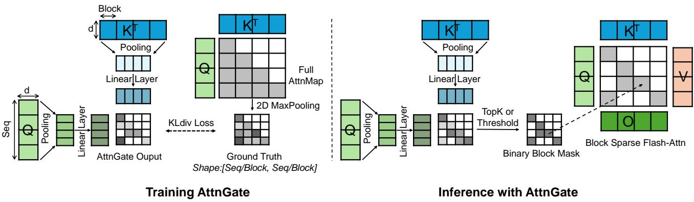
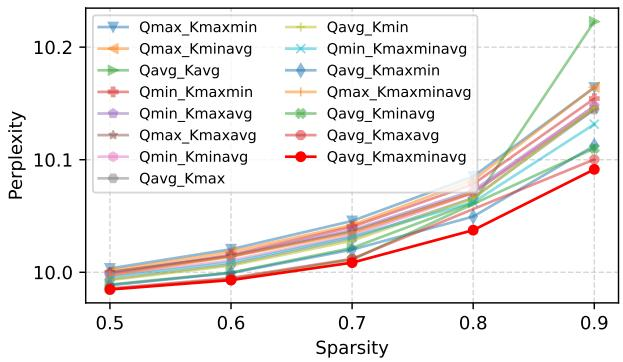
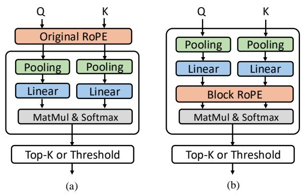
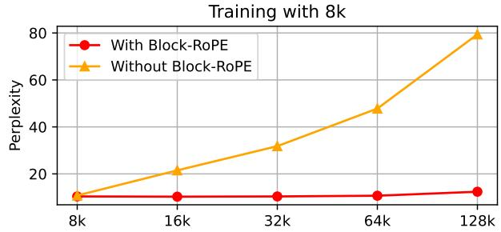
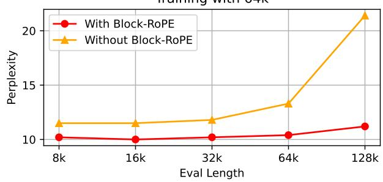
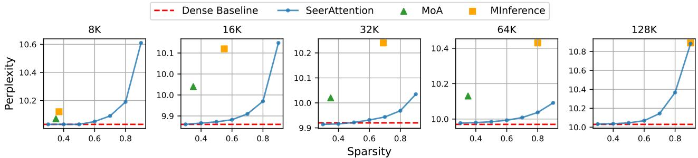
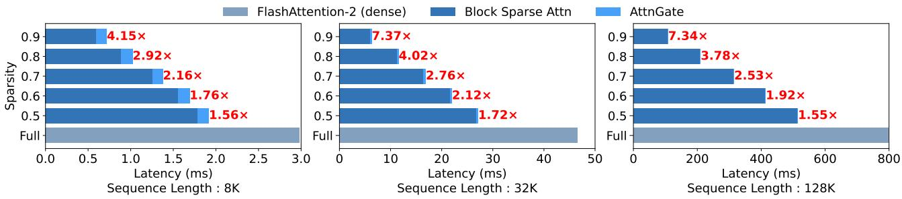
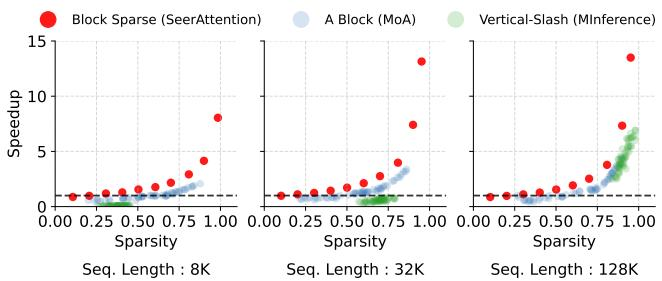

# SeerAttention: 自蒸馏注意力门控实现高效长上下文预填充

## 一、论文概述

| 项目 | 内容 |
|------|------|
| **标题** | SeerAttention: Learning Intrinsic Sparse Attention in Your LLMs |
| **作者** | Yizhao Gao, Zhichen Zeng, Dayou Du, Shijie Cao, Peiyuan Zhou, Jiaxing Qi, Junjie Lai, Hayden Kwok-Hay So, Ting Cao, Fan Yang |
| **机构** | 港大、清华大学等 |
| **论文** | https://arxiv.org/abs/2410.13276 |
| **代码** | https://github.com/Infini-AI-Lab/SeerAttention |
| **发布** | 2024-10-17 |

## 二、核心思想

### 问题定义

注意力机制是现代大语言模型（LLM）的基石，但其二次复杂度 $O(n^2)$ 在长上下文场景下成为效率瓶颈。现有稀疏注意力方法主要依赖**预定义模式或启发式方法**在注意力头级别进行稀疏化，难以动态适应不同的上下文。

**核心问题**：
- 注意力稀疏性是**内在的、动态的**，随输入和注意力头变化
- 现有方法（如 MoA、MInference）使用静态或启发式模式，缺乏通用性
- 需要一种**学习驱动**的方法直接从 LLM 本身学习稀疏性

### 解决方案概述

**SeerAttention** 是一种简单而有效的注意力机制，直接从 LLM 本身学习**块级注意力稀疏性**。

**核心创新**：
1. **AttnGate（注意力门控）**：受 MoE 门控机制启发，通过可学习的门控选择性激活注意力图中的重要块
2. **自蒸馏训练**：使用 2D-MaxPooled 注意力图作为真值，轻量级蒸馏 AttnGate
3. **块稀疏 FlashAttention 内核**：高效实现块级稀疏注意力

**关键公式**：

$$score = \text{softmax}\left(\frac{(W_q P_q(Q)) \cdot (W_k P_k(K))^T}{\sqrt{d}}\right)$$

其中 $P_q$ 和 $P_k$ 是池化操作，将 Q 和 K 沿序列维度下采样。

**关键优势**：
- 学习驱动：直接从 LLM 学习稀疏性，无需预定义模式
- 动态适应：不同输入和头自动调整稀疏模式
- 高效训练：仅需 40 A100 小时完成蒸馏
- 显著加速：128K 序列长度下实现 **7.3×** 内核加速

## 三、技术架构

### 整体框架

**SeerAttention 工作流程**：

1. **AttnGate 计算**：
   - 池化 Q 和 K 沿序列维度（非重叠块）
   - 通过可学习线性层处理
   - 矩阵乘法生成门控分数

2. **自蒸馏训练**：
   - 使用 2D-MaxPooled 全注意力图作为真值
   - KL 散度损失函数蒸馏 AttnGate

3. **推理**：
   - 使用门控分数预测块级稀疏性
   - TopK 或阈值方法选择活跃块
   - 块稀疏 FlashAttention 计算

### AttnGate 设计

**核心组件**：

| 组件 | 说明 | 输出大小 |
|------|------|----------|
| 池化操作 | Avg/Max/Min 池化 Q 和 K | [seq/B, d] |
| 线性层 | $W_q$ 和 $W_k$ 变换 | [seq/B, d] |
| 矩阵乘法 | 生成块级分数 | [seq/B, seq/B] |
| Softmax | 归一化分数 | [seq/B, seq/B] |

**块大小**：$B = 64$，输出大小为原始注意力图的 $\frac{1}{4096}$

#### 池化方法选择

**最优配置**：
- **Q**：AvgPooling
- **K**：Max + Min + AvgPooling（拼接）

**原因**：K 张量通常包含更多异常值，Max 和 Min 池化能更好地提取特征。

#### Block-level RoPE

**问题**：直接使用原始 RoPE 编码的 Q 和 K 会因池化操作丢失相对位置信息。

**解决方案**：
- 使用 RoPE 编码前的 Q 和 K 作为 AttnGate 输入
- 在 AttnGate 中添加**块级 RoPE**
- 使用缩减的 $\theta' = \theta / B$

**优势**：
- 有效学习块级位置信息
- 可外推到更长上下文长度
- 不会过拟合训练数据长度

### 自蒸馏训练

**获取真值**：
- 使用 2D-MaxPooled 全注意力图作为真值
- 语义上：只有当块内所有注意力分数都小时，MaxPooled 结果才小
- 定制 FlashAttention 内核直接输出 MaxPooled 结果

**损失函数**：

$$gt = \text{MaxPool2D}\left(\text{softmax}\left(\frac{QK^T}{\sqrt{d}}\right)\right)$$

$$score = \text{AttnGate}(Q, K)$$

$$loss = D_{KL}(gt \| score)$$

**训练配置**：
- 数据集：RedPajama，分块为 64K
- 学习率：1e-3，余弦衰减
- 批大小：16
- 训练步数：500 步
- 硬件：A100 GPU
- 训练时间：**40 A100 小时**

### 块稀疏 FlashAttention 内核

**设计**：
- 与 FlashAttention 的 tiling 计算方案无缝集成
- 仅计算门控分数指示的活跃块
- 减少 I/O 和计算开销

## 四、核心公式

### AttnGate 计算

$$score = \text{softmax}\left(\frac{(W_q P_q(Q)) \cdot (W_k P_k(K))^T}{\sqrt{d}}\right)$$

### 2D-MaxPool 真值

$$gt = \text{MaxPool2D}\left(\text{softmax}\left(\frac{QK^T}{\sqrt{d}}\right)\right)$$

### KL 散度损失

$$loss = D_{KL}(gt \| score)$$

### 块级 RoPE

$$\theta' = \theta / B$$

其中 $\theta$ 是原始 RoPE 的 theta，$B$ 是块大小。

## 五、实验结果

### 实验设置

**模型**：Llama-3.1-8B-Instruct

**评估基准**：
- **困惑度**：PG19
- **长上下文**：LongBench、RULER
- **短上下文**：MMLU、HellaSwag、ARC-challenge、GSM8K

**基线方法**：
- MoA：离线搜索静态稀疏模式
- MInference：启发式动态稀疏索引
- DuoAttention：区分流式头和密集头

### 困惑度结果

**PG19 测试结果**：
- SeerAttention 在不同稀疏度下提供更好的权衡
- 单个训练的 AttnGate 可在测试时调整 TopK/阈值
- MoA 在 128K 评估时 OOM

### LongBench 结果

| 方法 | 0-4k | 4-8k | 8k+ | 平均 | 平均稀疏度 |
|------|------|------|-----|------|-----------|
| Full Attention | 55.32 | 53.98 | 52.9 | 54.07 | 0.0 |
| MInference | 55.23 | 53.78 | 52.18 | 53.73 | 0.31 |
| MoA | 50.74 | 49.84 | 51.89 | 50.82 | 0.35 |
| DuoAttention | 53.77 | 52.17 | 51.27 | 52.40 | 0.5* |
| **SeerAttention** | **55.43** | **54.49** | 52.69 | **54.20** | 0.50 |

*50% 流式头，实际稀疏度 <50%

**关键发现**：
- SeerAttention 在 0-4k 和 4-8k 测试中甚至超过密集基线
- 最高平均分数（54.20）和最高平均稀疏度（0.50）

### RULER 结果

| 方法 | 4k | 8k | 16k | 32k | 64k | 128k | 平均 | 加速比 |
|------|----|----|-----|-----|-----|------|------|--------|
| Full Attention | 95.53 | 92.37 | 92.01 | 87.63 | 84.39 | 76.26 | 88.01 | 1.00 |
| MInference | 95.53 | 92.64 | 91.37 | 85.71 | 83.24 | 67.02 | 85.92 | 0.83 |
| DuoAttention | 95.64 | 92.08 | 90.71 | 84.75 | 83.24 | 75.32 | 86.96 | 1.09 |
| **SeerAttention** | 95.53 | **92.71** | **92.02** | **88.49** | 83.48 | 73.37 | **87.60** | **1.41** |

**关键发现**：
- SeerAttention 在大多数测试（8k-64k）中达到最佳精度
- 平均精度仅比密集基线低 0.41%
- 最高平均端到端加速：**1.41×**

### 短上下文结果

| 方法 | MMLU | HellaSwag | ARC-c | GSM-8K |
|------|------|-----------|-------|--------|
| Full Attention | 68.1 | 80.1 | 60.7 | 75.7 |
| SeerAttention | 67.9 | 79.8 | 60.2 | 75.6 |
| 平均稀疏度 | 3.4% | 50.4% | 26% | 52.1% |

**关键发现**：
- 精度损失可忽略（如 GSM-8K 仅 0.1%）
- 短上下文下稀疏注意力对延迟提升有限

### 效率评估

#### 内核级加速

**AttnGate 开销**：
- 32K 序列、50% 稀疏度：仅增加 1% 延迟
- 128K 序列：相对开销几乎消失

**块稀疏内核加速**：
- 128K 序列、90% 稀疏度：**7.3× 加速**（相比 FlashAttention-2）
- 加速与稀疏度呈线性关系

#### 与其他方法对比

**SeerAttention vs MInference**：
- MInference 使用 "Vertical-slash" 模式
- SeerAttention 将稀疏性转化为加速更有效

**SeerAttention vs MoA**：
- MoA 使用 "A-shape" 块模式
- SeerAttention 在相同稀疏度下加速更高

### AttnGate 可视化

**观察**：
- AttnGate 学习到有意义的稀疏模式
- 不同注意力头显示不同的稀疏模式
- 长上下文下稀疏性更显著

## 六、核心创新总结

| 创新点 | 说明 | 优势 |
|--------|------|------|
| **AttnGate** | 可学习的块级门控机制 | 直接从 LLM 学习稀疏性 |
| **自蒸馏训练** | 2D-MaxPool 注意力图作为真值 | 轻量级，仅 40 A100 小时 |
| **Block-level RoPE** | 块级相对位置编码 | 可外推到更长上下文 |
| **池化组合** | Q: Avg, K: Max+Min+Avg | 最优困惑度表现 |
| **块稀疏内核** | 与 FlashAttention 集成 | 高效 GPU 实现 |

## 七、技术影响

### 对稀疏注意力的改进

- **学习驱动**：取代预定义模式和启发式方法
- **动态适应**：不同输入和头自动调整
- **高效训练**：仅需 500 步和 40 A100 小时
- **显著加速**：128K 下 7.3× 内核加速

### 与现有方法对比

| 方法 | 稀疏模式 | 训练成本 | 精度 | 加速 |
|------|----------|----------|------|------|
| MoA | 静态搜索 | 高 | 中 | 中 |
| MInference | 启发式动态 | 无 | 中 | 中 |
| DuoAttention | 流式+密集头 | 中 | 中 | 中 |
| **SeerAttention** | 学习驱动 | 低（40h） | **高** | **高** |

### 实际应用价值

- **长上下文预填充**：显著减少预填充延迟
- **灵活权衡**：测试时可调整稀疏度
- **即插即用**：应用于预训练 LLM
- **低训练成本**：快速蒸馏收敛

## 八、局限性

1. **仅预填充阶段**：当前 AttnGate 仅应用于预填充阶段
2. **固定块大小**：块大小 B=64 固定，未探索其他值
3. **均匀稀疏度**：RULER 评估中使用均匀阈值
4. **模型规模**：主要在 8B 模型上验证
5. **解码阶段**：未应用于解码阶段（提及为未来工作）

## 九、相关工作

### 稀疏注意力

- **MoA**：离线搜索静态稀疏模式
- **MInference**：启发式动态稀疏索引
- **DuoAttention**：流式头 + 密集头
- **FlashAttention**：高效密集注意力实现

### 长上下文优化

- **提示压缩**：Jiang et al., 2023; Mu et al., 2024
- **KV 缓存压缩**：共享、驱逐、量化
- **稀疏解码**：Yang et al., 2024; Chen et al., 2024

### 混合专家

- **MoE 门控**：Shazeer et al., 2017; Fedus et al., 2022
- **块级稀疏**：与 FlashAttention tiling 集成

## 十、参考资源

### 论文与代码

- **论文**: https://arxiv.org/abs/2410.13276
- **代码**: https://github.com/Infini-AI-Lab/SeerAttention

### 相关工作

- **FlashAttention**: Dao et al., 2022; Dao, 2023
- **MoA**: Fu et al., 2024
- **MInference**: Jiang et al., 2024
- **DuoAttention**: Xiao et al., 2024

### 基准数据集

- **PG19**: Rae et al., 2019
- **LongBench**: Bai et al., 2023
- **RULER**: Hsieh et al., 2024
- **RedPajama**: Computer, 2023
