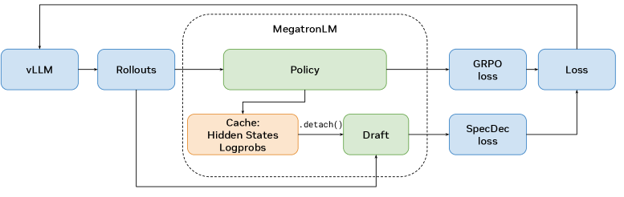
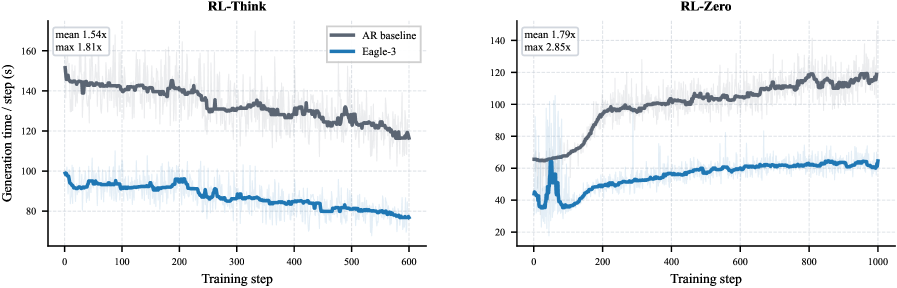
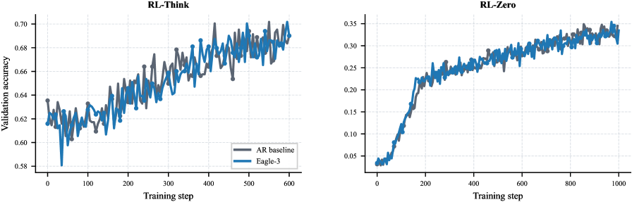
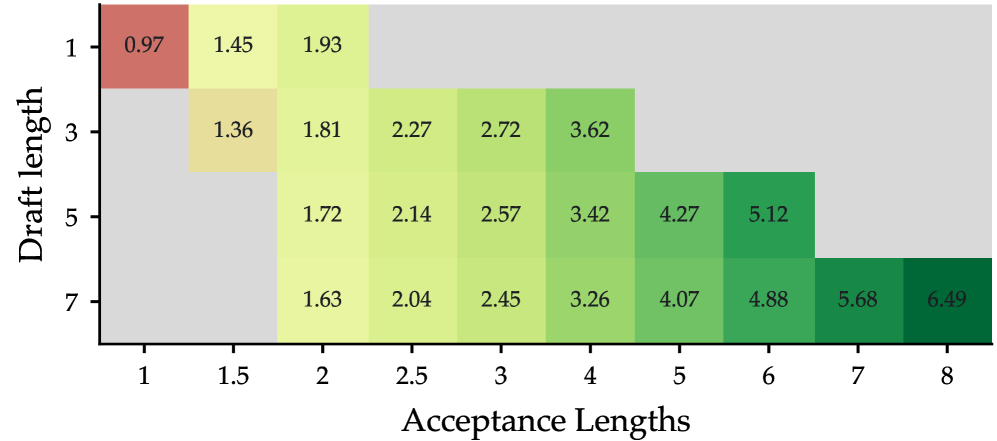
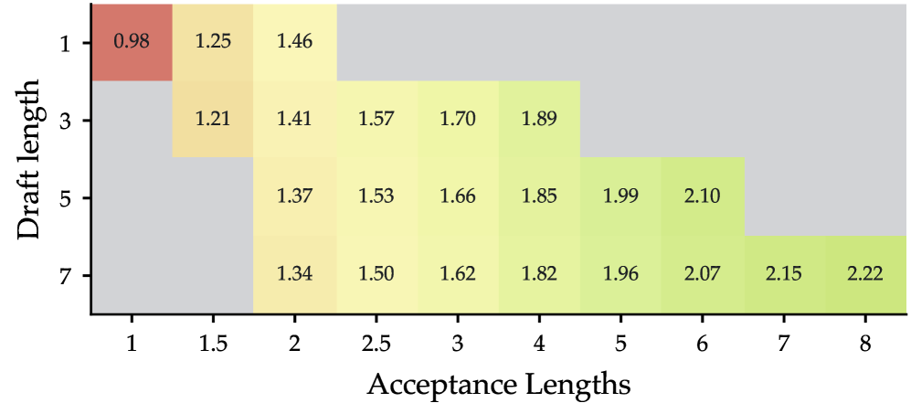
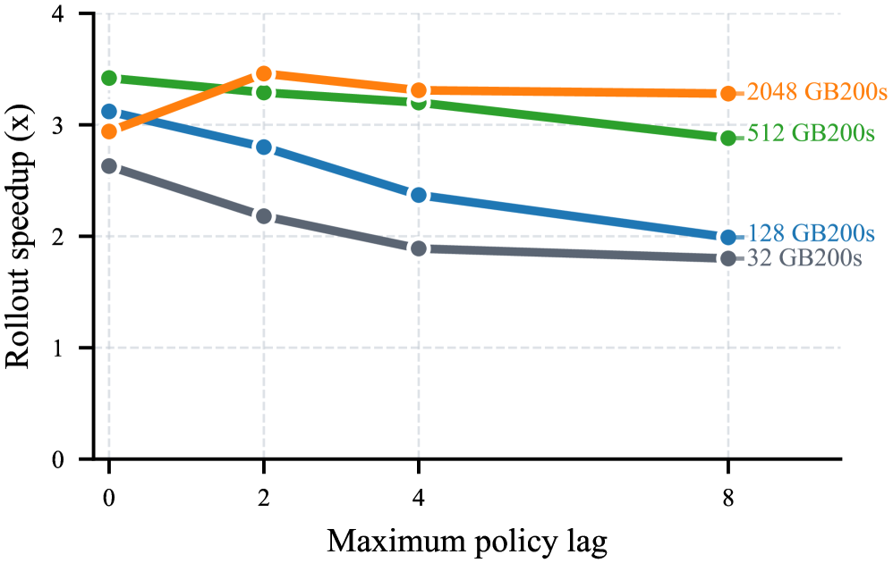
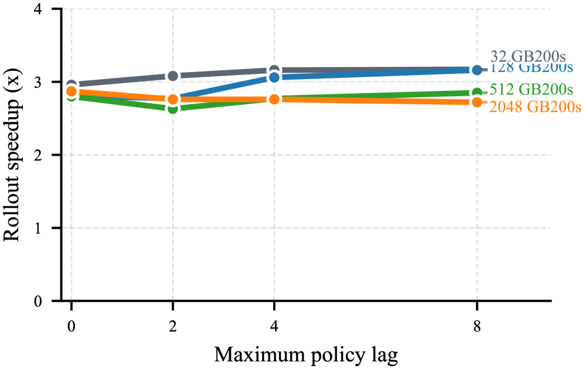

# Accelerating RL Post-Training Rollouts via System-Integrated Speculative Decoding

## 一、论文概述

| 项目 | 内容 |
|------|------|
| **标题** | Accelerating RL Post-Training Rollouts via System-Integrated Speculative Decoding |
| **作者** | Hayate Iso, Tiyasa Mitra, Sudipta Mondal, Rasoul Shafipour, Venmugil Elango, Terry Kong, Yuki Huang, Seonjin Na, Izzy Putterman, Benjamin Chislett, et al. (18 authors) |
| **机构** | NVIDIA |
| **论文** | https://arxiv.org/abs/2604.26779 |
| **代码** | - |
| **发布** | 2026-04-29 |
| **许可** | - |
| **领域** | cs.LG (Machine Learning) |

## 二、核心思想

### 问题定义

前沿语言模型的 RL 后训练越来越多地被自回归 rollout 生成所瓶颈，使得 rollout 加速成为核心系统挑战。

现有效率方法通过改变 rollout 或优化机制来提高吞吐量：
- 异步执行引入策略滞后
- Off-policy 重放和重要性采样
- 低精度生成引入分布不匹配

这些方法有效，但每种都改变了原始问题的采样或优化语义。

### 解决方案概述

**推测解码（Speculative Decoding）** 作为 RL rollouts 的无损加速原语：
- 保持目标模型的输出分布
- Draft 模型一次提议多个 token
- 目标模型通过拒绝程序验证
- 不改变轨迹的采样分布

### 核心成果

- 同步 RL 下 8B 规模 rollout 吞吐量提升 **1.8×**
- 端到端 RL 步骤时间减少 **1.41×**
- 验证精度无变化
- 模拟预测 235B 规模结合异步 RL 可达 **2.5×** 端到端训练加速

## 三、技术架构

### 系统概览

*Figure 1: System overview of NeMo RL with speculative decoding. The vLLM backend produces rollout trajectories, and the policy model (MegatronLM) runs the verifier forward pass for the GRPO policy loss.*

### 核心公式

#### 学习速度分解

$$\text{learning speed} = \text{effectiveness} \times \text{throughput}$$

- **Throughput**：系统每单位时间完成的 rollout 和训练工作量
- **Effectiveness**：从工作中提取的有用学习信号

推测解码针对 throughput 而不改变采样分布，因此 effectiveness 保持不变。

#### 同步 RL 步骤时间分解

$$T_{\text{step}} = T_{\text{data}} + T_{\text{prepare}} + T_{\text{gen}} + T_{\text{logprob}} + T_{\text{train}}$$

- $T_{\text{prepare}}$：权重同步和 rollout 后端准备
- $T_{\text{gen}}$：Rollout 生成（推测解码目标）
- $T_{\text{logprob}}$：当前策略下的 log-probability 重计算
- $T_{\text{train}}$：优势计算和策略优化

#### 步骤级加速上界

$$S_{\text{step}} \leq \frac{1}{R_{\text{gen}}/\alpha + (1 - R_{\text{gen}})}$$

其中：
- $R_{\text{gen}} = T_{\text{gen}} / T_{\text{step}}$：生成占比
- $\alpha$：平均接受长度（每次推测步骤产生的平均 token 数）

**关键洞察**：推测解码仅在 (i) 生成主导步骤时间，且 (ii) 接受长度足够高以抵消验证成本时有效。

### 系统集成

**关键挑战**：
1. 策略每步更新，rollout 引擎必须接收新权重
2. Draft 模型必须与当前策略保持对齐
3. Log-probabilities、KL 惩罚和策略损失必须针对验证器策略计算

**解决方案**：
- vLLM 后端使用推测解码生成 rollout 轨迹
- 策略模型（MegatronLM）运行 GRPO 策略损失的前向传播
- 在线 draft 适配时，隐藏状态和 log-probabilities 被缓存并重用
- 隐藏状态缓存通过梯度分离路径路由到 draft 头

### 核心组件

| 组件 | 说明 | 关键参数 |
|------|------|----------|
| Policy Model | 目标模型 | MegatronLM |
| Draft Model | 草稿模型 | EAGLE-3 / MTP |
| vLLM Backend | 服务后端 | 推测解码支持 |
| Verifier | 验证器 | 拒绝采样 |
| Online Adaptation | 在线适配 | Draft 权重更新 |

### 推测解码机制

**Draft 模型选项**：
1. **预训练 MTP 头**：内置多 token 预测
2. **小型外部 Draft 模型**：独立训练
3. **EAGLE-3**：通用 drafting 路径

**拒绝程序**：
- Draft 提议 k 个 token
- 目标模型并行验证所有 k 个 token
- 接受匹配的 token，拒绝不匹配的
- 保持目标模型的输出分布

## 四、核心创新

| 创新点 | 说明 | 理论/实验依据 |
|--------|------|---------------|
| 无损加速 | 保持目标模型分布 | 验证精度无变化 |
| 系统集成 | NeMo-RL + vLLM | 支持同步/异步 RL |
| 在线 Draft 适配 | 缓存隐藏状态重用 | Draft 与策略对齐 |
| 通用 Drafting 路径 | EAGLE-3 支持任何模型 | 无需原生 MTP 头 |
| 性能模拟器 | 大规模部署预测 | 235B 规模投影 |

## 五、代码实现分析

### 技术栈

- **RL 框架**：NeMo-RL
- **服务后端**：vLLM
- **策略模型**：MegatronLM
- **Draft 模型**：EAGLE-3
- **GPU**：NVIDIA GB200 (186GB HBM3E)
- **互联**：第五代 NVLink

### 关键实现细节

1. **Draft 初始化**：
   - 使用策略在训练提示上生成的响应
   - 离线对齐 draft 到实际 rollout 分布
   - In-domain 初始化提高接受长度

2. **Draft 长度**：
   - 默认 k=3
   - 更长 draft 需要更高接受率
   - 过长 draft 反而降低性能

3. **在线适配**：
   - 缓存隐藏状态和 log-probabilities
   - 梯度分离路径避免干扰策略梯度
   - 对弱初始化有帮助

4. **与异步 RL 组合**：
   - 推测解码与异步执行互补
   - 叠加加速效果

## 六、实验结果

### 步骤时间分解

**实验设置**：
- 模型：Qwen3-8B (RL-Think), Qwen3-8B-Base (RL-Zero)
- 数据集：DAPO-Math-17K
- 验证：AIME-2024
- 硬件：8 GB200 NVL72 节点，4 GPUs/节点

**结果**：

| 阶段 | RL-Think AR (s) | RL-Think Spec (s) | RL-Zero AR (s) | RL-Zero Spec (s) |
|------|-----------------|-------------------|----------------|------------------|
| Data | 0.3 | 0.2 | 0.2 | 0.2 |
| Prepare | 2.1 | 1.6 | 1.9 | 2.1 |
| Generation | 133.6 | 87.0 | 100.0 | 56.6 |
| Log-prob | 17.9 | 18.1 | 17.8 | 18.1 |
| Training | 31.4 | 30.5 | 31.3 | 30.5 |
| **Overall** | 185.3 | **137.4 (1.35×)** | 151.2 | **107.5 (1.41×)** |

**关键发现**：
- 生成占步骤时间 65-72%
- 推测解码减少生成时间 1.54-1.77×
- Log-prob 和训练不变，限制总加速

### Rollout 生成对比

**结果**：

| 方法 | RL-Zero 延迟 | RL-Think 延迟 | 接受长度 |
|------|-------------|---------------|----------|
| Autoregressive | 100.0s | 133.6s | 1.0 |
| n-gram Drafting | 更慢 | 更慢 | 2.05-2.47 |
| **EAGLE-3** | **56.6s (1.8×)** | **87.0s (1.5×)** | 3.0+ |

**关键发现**：
- EAGLE-3 显著减少生成延迟
- n-gram drafting 尽管有非平凡接受长度，但比自回归慢
- EAGLE-3 优于无模型推测基线

### 生成延迟

*Figure 2: (a) Generation latency per training step. EAGLE-3 achieves mean speedups of 1.54× (max 1.81×) on RL-Think and 1.79× (max 2.85×) on RL-Zero.*

### 验证精度

*Figure 3: (b) Validation accuracy (AIME-2024) versus training step. The EAGLE-3 and autoregressive curves overlap closely throughout.*

**关键发现**：
- EAGLE-3 和自回归曲线紧密重叠
- RL-Think 从 ~0.60 上升到 ~0.70
- RL-Zero 从 ~0.05 上升到 ~0.35
- 推测解码不损害训练效果

### Draft 初始化影响

**结果**：
- In-domain 初始化提高接受长度和实现加速
- UltraChat 初始化较弱
- 在线更新帮助弱初始化

### Draft 长度影响

**结果**：
- 接受长度随 k 增加
- 实现加速随 k 下降
- RL-Think 中 k≥5 比自回归慢
- 最优 k 取决于接受率

### 在线 Draft 适配

**结果**：
- 在线更新帮助弱 UltraChat 初始化
- 当 draft 已经良好对齐时，额外收益有限
- 缓存隐藏状态重用减少开销

### 部署规模投影

*Figure 4: (a) Rollout generation speedup*

*Figure 5: (b) End-to-end RL step speedup*

**模拟设置**：
- 模型：Qwen3 family
- Rollout 批大小：4096
- 部署规模：最多 2048 GB200 GPUs
- 精度：FP8

**投影结果**：

| 模型 | Rollout 加速 | 端到端加速 |
|------|-------------|-----------|
| Qwen3-8B | 1.8× | 1.41× |
| Qwen3-235B-A22B | 3×+ | ~2.5× |

### Draft 和接受长度敏感性

*Figure 6: (a) Qwen3-235B-A22B*

*Figure 7: (b) Qwen3-8B*

**关键洞察**：
- 更长 draft 仅在高接受率时有益
- k=7, α=5：4.07× rollout 加速，1.96× 端到端加速
- k=3, α=3：2.72× rollout 加速，1.70× 端到端加速
- 端到端操作点可比，但推测开销更低

### 与其他方法对比

| 方法 | 加速类型 | 分布保持 | 8B 加速 | 235B 投影 |
|------|----------|----------|---------|-----------|
| 异步 RL | 吞吐量 | 否（策略滞后） | - | - |
| Off-policy 重放 | 吞吐量 | 否 | - | - |
| 低精度生成 | 计算 | 否 | - | - |
| **推测解码** | **生成** | **是** | **1.8×** | **2.5×** |

## 七、相关工作

### 推测解码

- **Speculative Decoding**：Draft-then-verify 范式
- **EAGLE/EAGLE-3**：外部 draft 模型
- **Medusa**：多头推测
- **MTP**：多 token 预测

### RL 后训练

- **GRPO**：Group Relative Policy Optimization
- **DAPO**：Direct Alignment from Preferences
- **PPO**：Proximal Policy Optimization
- **NeMo-RL**：NVIDIA RL 训练框架

### RL 效率优化

- **异步 RL**：重叠生成与学习
- **Off-policy 重放**：重用旧轨迹
- **低精度生成**：FP8 推理
- **选择性提示过滤**：跳过无信息提示

## 八、总结

### 核心贡献

1. **无损加速原语**：推测解码保持目标模型分布
2. **系统集成**：NeMo-RL + vLLM 后端支持
3. **通用 Drafting 路径**：EAGLE-3 支持任何模型
4. **在线 Draft 适配**：缓存隐藏状态重用
5. **大规模投影**：235B 规模 ~2.5× 端到端加速

### 技术影响

- **RL 训练效率**：Rollout 生成加速 1.8×
- **无损保证**：验证精度无变化
- **可扩展性**：大规模部署投影有效
- **通用性**：支持多种推测机制

### 局限性

1. **生成占比依赖**：仅在生成主导时有效
2. **Draft 质量依赖**：接受长度决定加速
3. **实现开销**：Draft 模型额外计算
4. **硬件要求**：需要高性能 GPU 集群

### 未来方向

- 优化 Draft 模型质量
- 扩展到更多 RL 算法
- 与其他效率技术组合
- 支持更多模型架构

## 九、参考资源

- **论文**: https://arxiv.org/abs/2604.26779
- **RL 框架**: NeMo-RL
- **服务后端**: vLLM
- **推测解码**: EAGLE-3, MTP
- **模型**: Qwen3-8B, Qwen3-235B-A22B
- **硬件**: NVIDIA GB200
- **相关工作**: GRPO, DAPO, PPO
