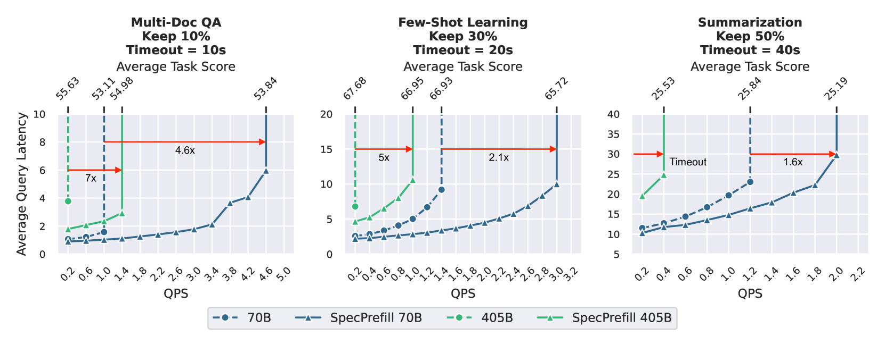
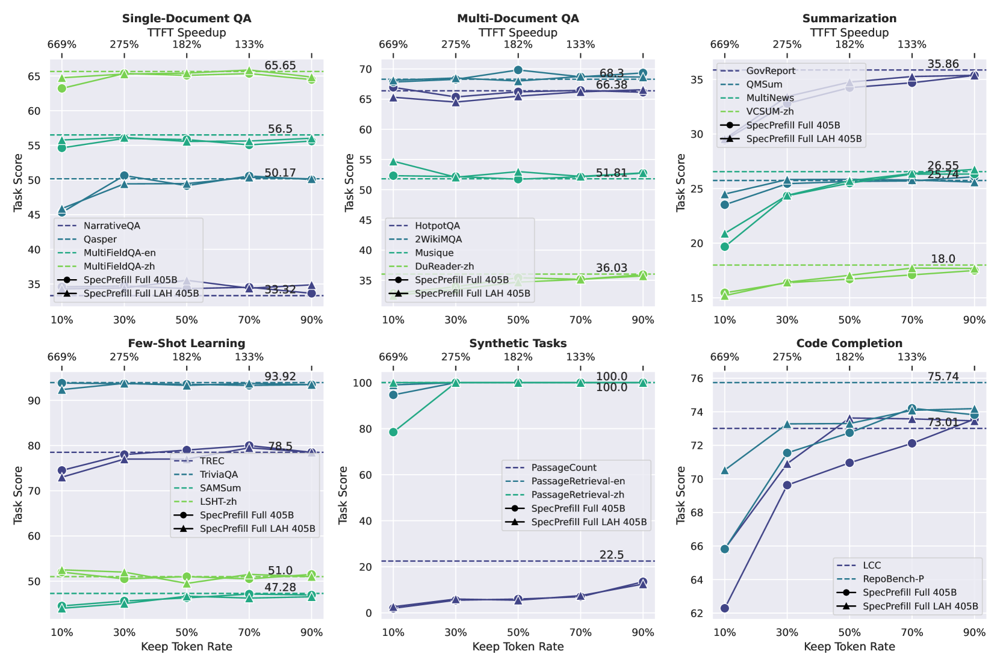
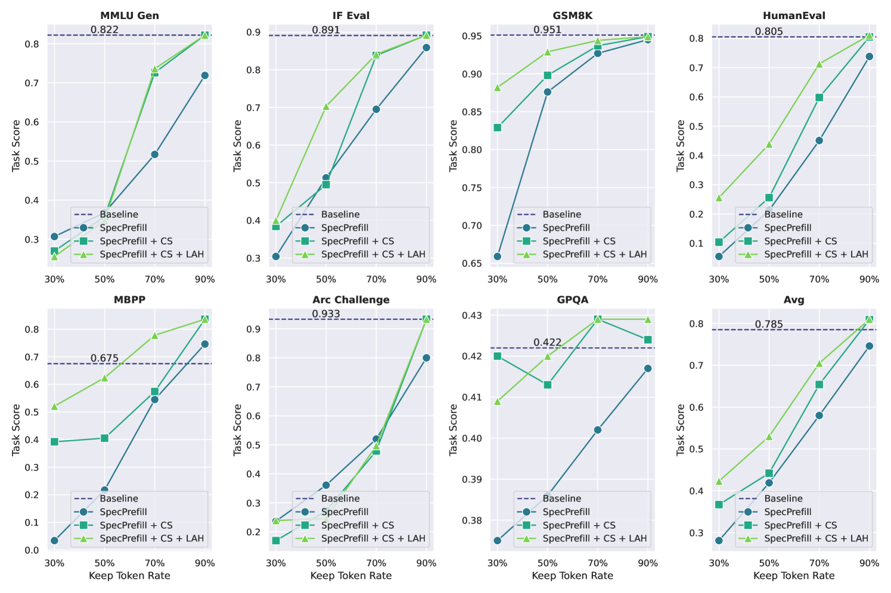
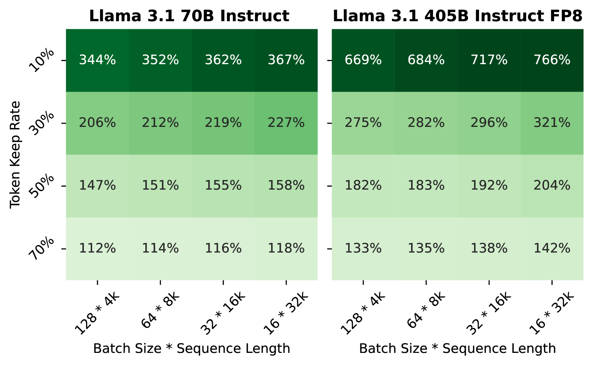
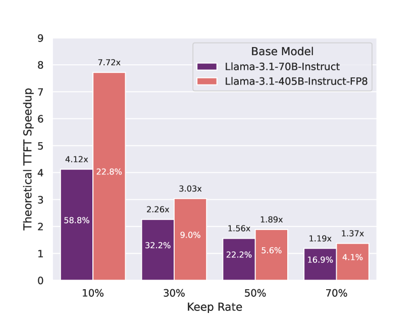
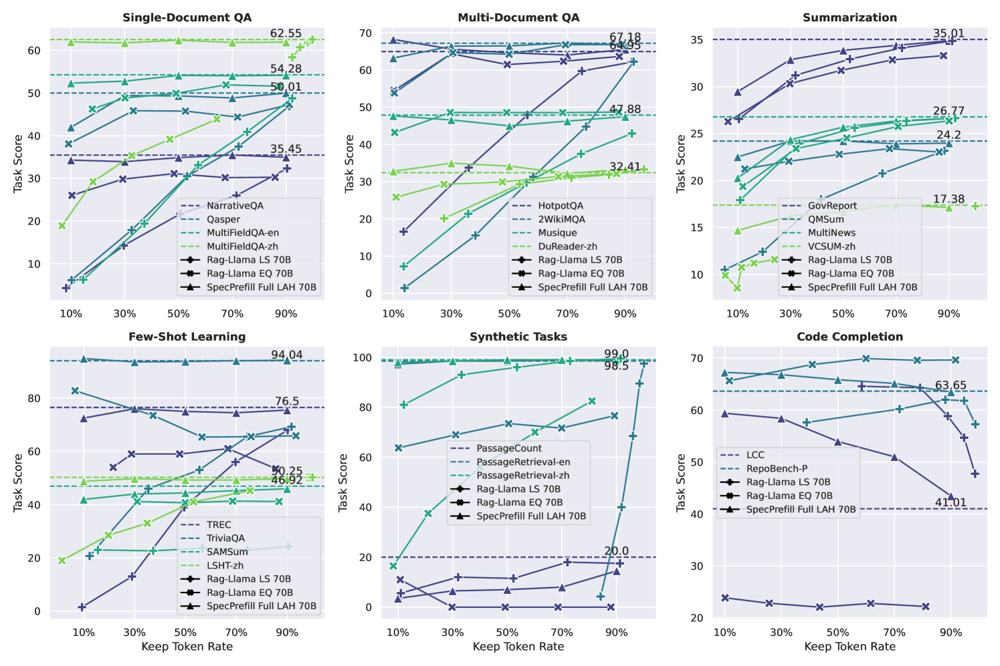

# Speculative Prefill: Turbocharging TTFT with Lightweight and Training-Free Token Importance Estimation

## 一、论文概述

| 项目 | 内容 |
|------|------|
| **标题** | Speculative Prefill: Turbocharging TTFT with Lightweight and Training-Free Token Importance Estimation |
| **作者** | Jingyu Liu, Beidi Chen, Ce Zhang |
| **机构** | Not specified in metadata |
| **论文** | https://arxiv.org/abs/2502.02789 |
| **发布** | 2025-02-05 |
| **许可** | Not specified |

## 二、核心思想

### 问题定义

在现代大语言模型（LLM）推理引擎中，改善首 token 延迟（Time-to-First-Token, TTFT）是一个至关重要的目标。优化 TTFT 可以直接提高最大 QPS，并满足许多关键应用的需求。

然而，优化 TTFT 极具挑战性，因为：
1. **计算密集型**：预填充阶段是计算密集型的
2. **瓶颈转移**：性能瓶颈从自注意力转移到 MLP 部分
3. **先前工作的局限**：需要后训练适配或扩展效率低

### 解决方案概述

**SpecPrefill** 提出了一种无需训练的框架，基于以下洞察加速 LLM 推理的 TTFT：
> LLMs 在仅保留精心选择的 prompt token 子集时，仍能保持足够的质量。

**核心创新**：
1. **投机预填充**：使用轻量级模型推测上下文重要的 token
2. **token 重要性估计**：基于注意力分数的 token 选择
3. **无缝集成**：可与投机解码结合，形成完整的小模型辅助推理范式

**关键优势**：
- 无需训练
- 最大 QPS 提升 7×
- 准确率损失 <5%
- 可与投机解码无缝集成

## 三、技术架构

### 整体框架



**SpecPrefill 工作流程**：
1. 使用轻量级投机模型（speculator）分析 prompt
2. 估计每个 token 的重要性
3. 选择最重要的 token 子集
4. 将选中的 token 及其位置信息发送给主模型

### 核心算法

#### Token 重要性推测

**注意力分数计算**：
$$a_{ij} := \text{Softmax}(Q_{M+j}K^T)_i, \forall 0 \leq i < M, 0 \leq j < N$$

其中：
- $M$：上下文长度
- $N$：前瞻步数（look-ahead steps）
- $a_{ij}$：第 $i$ 个 prompt token 与第 $j$ 个解码 token 的注意力分数

#### 缓解位置偏差的前瞻（Look-Ahead）

**问题**：注意力分数存在多种偏差
- **Sink 现象**：前几个 token 倾向于有更高的权重
- **接近偏差**：靠近输出的 token 倾向于有更高的权重

**解决方案**：解码投机模型 $N$ 步，从新的 $N$ 个 token 获取注意力信息

#### 聚合注意力分数作为 Token 重要性

**聚合策略**：max-mean 聚合

给定形状为 $[N, L, S, H]$ 的注意力分数张量：
- $N$：前瞻 token 数
- $L$：层数
- $S$：序列长度
- $H$：头数

**操作**：
1. 对 $H$ 维取最大值：突出显著 token
2. 对 $L$ 维取最大值：进一步突出
3. 对 $N$ 维取平均值：公平的 token 贡献

#### 块选择和池化去噪

**观察**：位置相近的 token 在重要性上具有相似性

**块选择策略**：
1. 将上下文连续分块
2. 对每个块内的 token 分数取平均
3. 选择 Top-K 块
4. 应用 1D 平均池化平滑跨块分数

#### 位置 ID 恢复

**关键设计**：保留原始位置信息

**示例**：
```
原始位置 ID: [0, 1, 2, 3, 4, 5, 6, 7, 8, 9]
推测位置 ID: [0, 1, 3, 6, 7]
解码位置 ID: [0, 1, 3, 6, 7, 10, 11, 12, ...]
```

其中粗体索引是基于原始位置信息偏移的解码位置。

### 与投机解码的关系

**无缝集成**：
- SpecPrefill 可以与投机解码共享同一个草稿模型
- 投机解码需要上下文的完整前向传播
- SpecPrefill 为后续解码推测提供必要的 KV 信息
- 形成第一个完全由小模型辅助的推理范式

## 四、核心公式

### 注意力分数计算

$$a_{ij} := \text{Softmax}(Q_{M+j}K^T)_i$$

### Token 重要性聚合

$$\text{importance}_i = \frac{1}{N} \sum_{n=1}^{N} \max_{l,h} a_{ijlh}$$

其中 $a_{ijlh}$ 是形状为 $[N, L, S, H]$ 的注意力张量。

### 块选择

$$\text{chunk\_score}_k = \frac{1}{|C_k|} \sum_{i \in C_k} \text{importance}_i$$

选择 Top-K 块：$\arg\max_K \text{chunk\_score}_k$

### TTFT 加速比

$$\text{TTFT speedup} \approx \frac{1}{\text{keep\_rate}}$$

理论上限（假设无其他开销）。

## 五、实验结果

### 实验设置

**模型配置**：
- 主模型：Llama-3.1-70B-Instruct (BF16) 或 Llama-3.1-405B-Instruct-FP8
- 投机模型：Llama-3.1-8B-Instruct (BF16)
- 硬件：8 × NVIDIA H100 或 H200
- 张量并行度：8

**评估基准**：
- LongBench：6 类长上下文任务
- RULER：合成上下文探测
- 标准短任务：MMLU、GSM8K、HumanEval 等

### 查询上下文可压缩性

论文发现三类查询：

| 类型 | 特征 | Token 删除效果 |
|------|------|----------------|
| **信息密集型** | 短且信息密集 | 效果差 |
| **可压缩型** | 长上下文，存在冗余 | 效果好 |
| **噪声型** | 包含噪声 token | 删除后质量提升 |

### LongBench 结果



**关键发现**：
- **Single-Document QA**：仅保留 10% token 仍能保持质量
- **Multi-Document QA**：类似结果
- **Few-Shot Learning**：质量保持良好
- **Summarization**：随 token 删除增加有下降
- **Code Completion**：70B 模型删除某些 token 后质量提升

**模型规模影响**：
- 模型越大，应用 SpecPrefill 后的质量差距越小
- 大模型更好地适应推测的 token 子集

### RULER 合成任务结果

| 任务类型 | 4k | 8k | 16k | 32k |
|----------|-----|-----|------|------|
| Retrieval (Niah Variants) | 99.7 | 99.6 | 99.5 | 99.7 |
| Multi-hop Tracking | 89.6 | 100.0 | 99.1 | 100.0 |
| QA (SQuAD & HotpotQA) | 75.2 | 75.6 | 75.3 | 72.6 |
| Aggregation (CWE & FWE) | 77.9 | 79.7 | 78.5 | 70.0 |

**关键发现**：
- SpecPrefill 在仅使用 10% token 的情况下保持了质量
- 聚合任务是例外（信息密集型，每个词都重要）
- 在大多数上下文长度下，SpecPrefill 甚至帮助提升质量

### 标准短任务结果



**任务覆盖**：
- 通用知识：Generative MMLU, IFEval
- 数学：GSM8K 8 Shots
- 编码：HumanEval, MBPP
- 推理：Arc Challenge, GPQA 8 Shots

**关键发现**：
- 标准任务的 prompt 信息密集，SpecPrefill 在低 keep rate 时效果有限
- 某些任务（如 MBPP 和 GPQA）在删除特定 token 后性能提升
- 平均而言，选择合适的 keep rate 可以保持甚至超越基线

### TTFT 效率基准



**70B 模型结果**：
- TTFT 加速几乎与删除的 token 百分比成正比
- 随着基础模型大小增加，开销几乎可以忽略


**前瞻效果**：
- 8 步前瞻在短上下文任务上提供一致的改进

### 端到端 QPS 改进


**关键结果**：
- **7× 最大 QPS 提升**：Llama-3.1-405B-Instruct-FP8
- **<5% 准确率损失**
- 低 keep rate 下，405B 模型 + SpecPrefill 比 70B 模型更高效

### 理论 TTFT 加速



**理论上限**：
- 假设无其他开销
- TTFT 加速 ≈ 1 / keep_rate

### LongBench 与 RAG 对比



**与 RAG-Llama 对比**：
- RAG-Llama 使用句子级检索
- SpecPrefill 在大多数相同 keep rate 下优于 RAG-Llama
- SpecPrefill 更通用、更灵活

## 六、核心创新总结

| 创新点 | 说明 | 优势 |
|--------|------|------|
| **无需训练** | 利用注意力分数估计 token 重要性 | 即插即用 |
| **投机预填充** | 使用轻量级模型推测重要 token | 计算高效 |
| **前瞻机制** | 缓解位置偏差 | 提高估计准确性 |
| **块选择** | 利用位置相近 token 的相似性 | 减少方差 |
| **位置 ID 恢复** | 保留原始位置信息 | 保持位置敏感任务的性能 |
| **无缝集成** | 可与投机解码结合 | 完整的小模型辅助推理 |

## 七、技术影响

### TTFT 优化

- **7× 最大 QPS 提升**
- **<5% 准确率损失**
- 对大规模 LLM 推理系统至关重要

### 与投机解码的结合

**统一的小模型辅助推理范式**：
- 预填充阶段：SpecPrefill 选择重要 token
- 解码阶段：投机解码加速 token 生成
- 共享同一个草稿模型
- 开销分摊

### 实际应用价值

- **即插即用**：仅需几行代码集成到 vLLM
- **内存节省**：减少 KV cache 分配
- **灵活配置**：用户可根据需求调整 keep rate

## 八、局限性

1. **信息密集型查询**：对于短且信息密集的查询效果有限
2. **聚合任务**：需要每个词的任务（如 CWE）不适用
3. **固定 keep rate**：当前使用固定百分比，未实现自适应策略
4. **顺序实现**：推测过程目前是顺序的，未与主模型解耦

## 九、未来方向

1. **自适应 keep rate**：根据查询可压缩性自动决定保留多少 token
2. **查询重写**：对于信息密集型查询，重写而非直接删除 token
3. **调度优化**：将推测过程解耦为独立调度
4. **更多模态**：扩展到图像等其他领域

## 十、参考资源

### 论文

- **SpecPrefill**: https://arxiv.org/abs/2502.02789

### 相关工作

- **vLLM**: 高效 LLM 推理引擎
- **投机解码**: Leviathan et al., 2022; Chen et al., 2023
- **LongBench**: 长上下文理解基准
- **RULER**: 合成上下文探测套件

### 应用框架

- **vLLM**: https://github.com/vllm-project/vllm
- **OpenAI API**: 用于端到端基准测试
