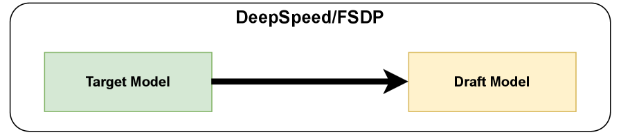
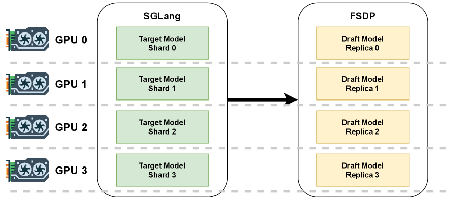
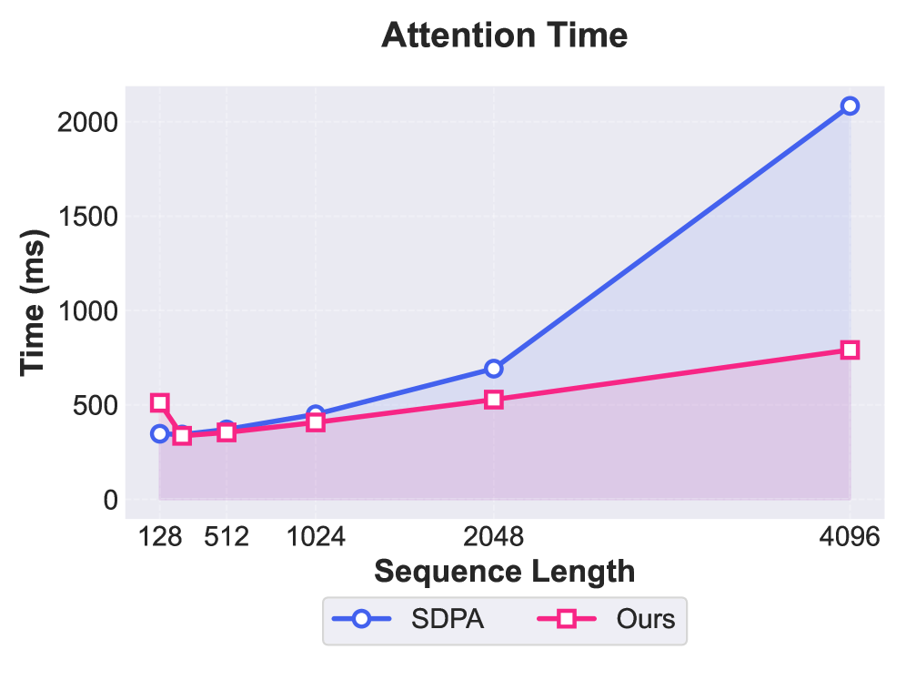
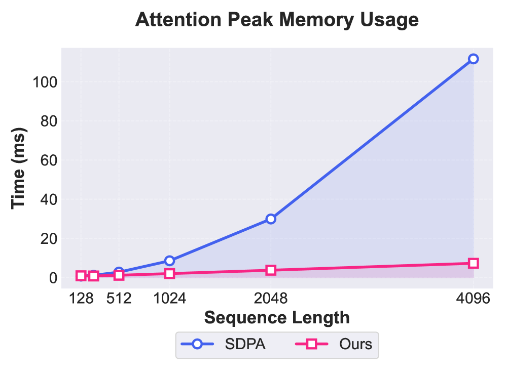
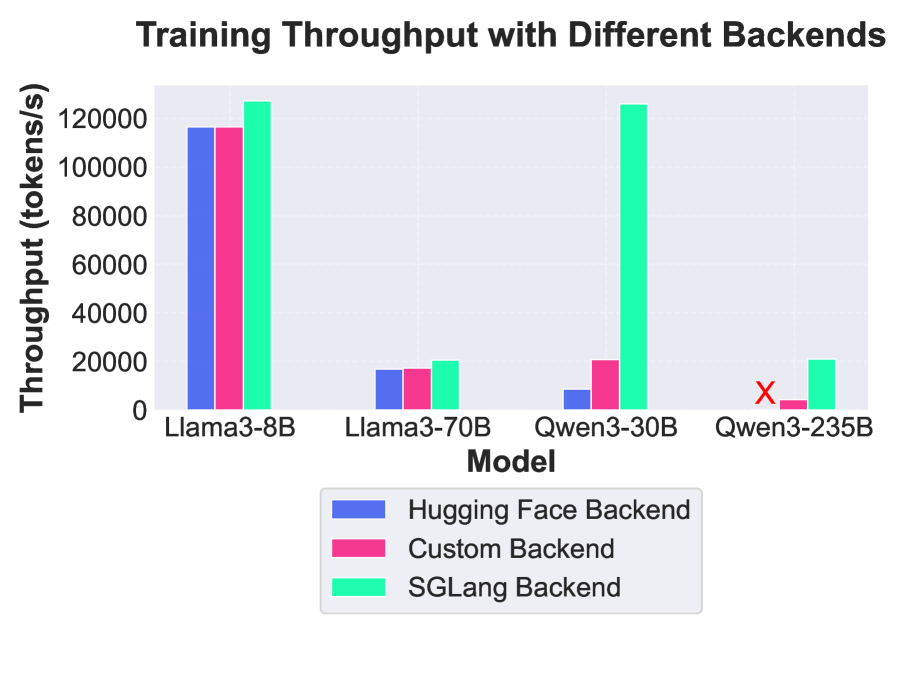
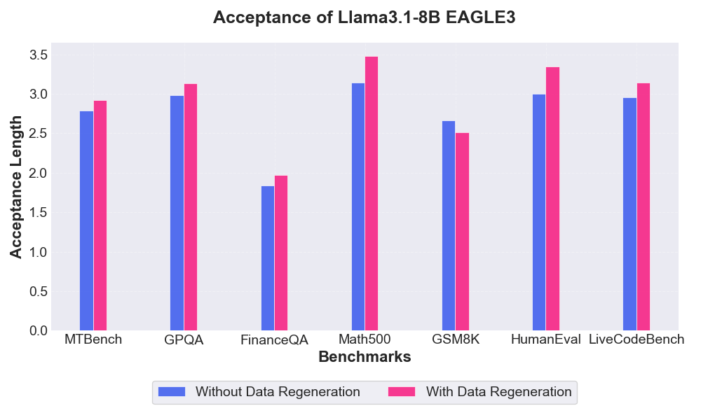
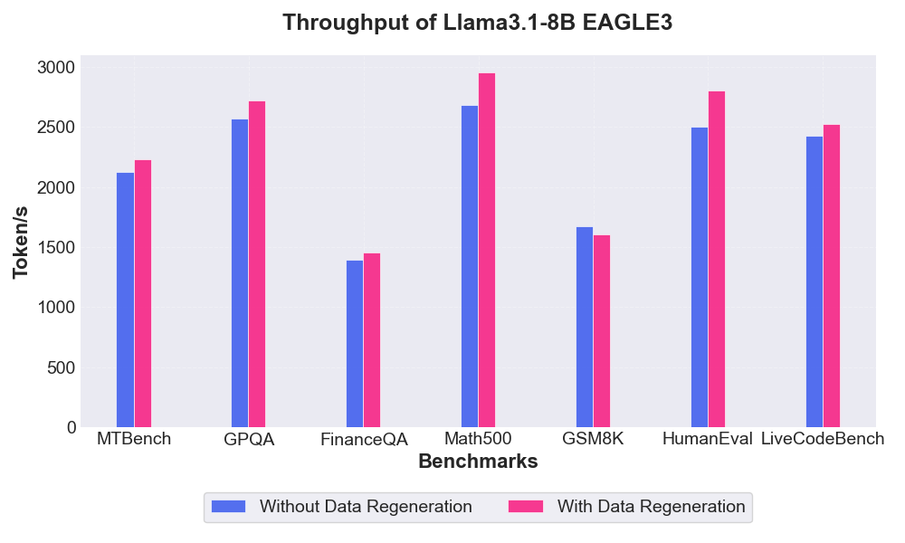
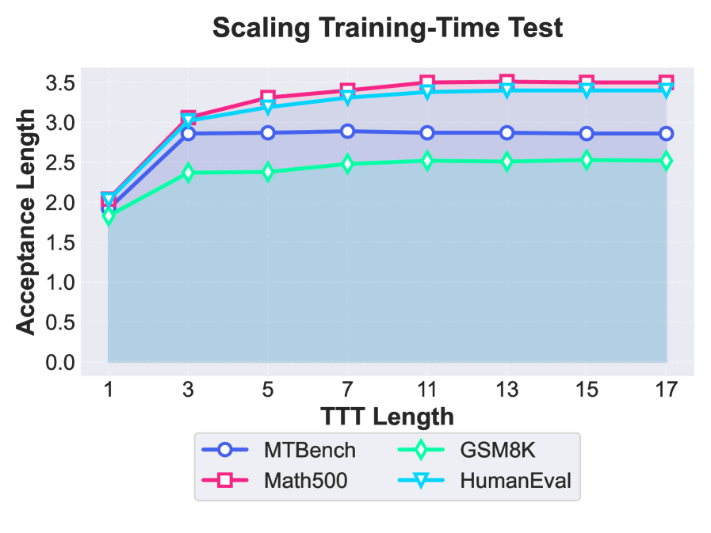

# SpecForge: A Flexible and Efficient Open-Source Training Framework for Speculative Decoding

## 一、论文概述

| 项目 | 内容 |
|------|------|
| **标题** | SpecForge: A Flexible and Efficient Open-Source Training Framework for Speculative Decoding |
| **作者** | Shenggui Li, Chao Wang, Yikai Zhu, Yubo Wang, Fan Yin... |
| **机构** | Multiple institutions |
| **论文** | https://arxiv.org/abs/2603.18567v1 |
| **代码** | https://github.com/ModelTC/SpecForge |
| **发布** | 2026-03-19 |
| **许可** | 开源 |

## 二、核心思想

### 问题定义

大语言模型（LLM）的自回归推理存在高延迟问题。投机解码（Speculative Decoding）通过使用轻量级草稿模型提出多个token进行批量验证来缓解这一瓶颈。然而，投机解码的采用受到以下限制：

1. **缺乏高质量草稿模型**：现有开源实现质量参差不齐
2. **缺乏可扩展的训练基础设施**：现有框架性能低下，无法支持大规模模型训练

**EAGLE-3 训练的关键挑战**：
- **刚性并行策略**：现有实现将目标模型和草稿模型统一处理，使用 FSDP 并行，这对不同规模的模型不是最优的
- **次优的预填充性能**：现有训练框架依赖朴素的模型实现，缺乏推理引擎的优化（如高效注意力核、CUDA Graph 等）
- **缺乏推理引擎集成**：训练框架无法利用生产级推理引擎的优化

### 解决方案概述

**SpecForge** 提出了一个面向生产的开源框架，用于训练投机解码模型，完全支持 EAGLE-3。

**核心创新**：
1. **目标-草稿解耦**：将目标模型和草稿模型分离，使用不同的并行策略
2. **混合并行**：草稿模型使用 FSDP，目标模型使用 SGLang 推理引擎的张量并行
3. **计算优化**：稀疏树注意力和内存高效梯度计算
4. **推理引擎集成**：与 SGLang、vLLM 等生产级推理引擎无缝集成

**关键成果**：
- 训练速度提升高达 9.9×（Qwen3-235B-A22B）
- 发布 SpecBundle：一套生产级 EAGLE-3 草稿模型

## 三、技术架构

### 目标-草稿解耦

传统方法将目标模型和草稿模型统一处理：



SpecForge 将两者解耦：



**解耦的优势**：
- 草稿模型：使用 FSDP（ZeRO Stage 2），适合小规模模型训练
- 目标模型：使用 SGLang 推理引擎，支持张量并行、专家并行、流水线并行
- 两者可以共置在同一 GPU 上，也可以分离到不同 GPU 上

### 混合并行策略

| 组件 | 并行策略 | 说明 |
|------|----------|------|
| **草稿模型** | FSDP (ZeRO Stage 2) | 仅分片优化器状态和梯度，减少通信开销 |
| **目标模型** | SGLang 推理引擎 | 支持 TP、EP、PP，使用 FlashAttention、FlashInfer 等高性能内核 |

**为什么草稿模型使用 ZeRO Stage 2**：
- 草稿模型通常只有目标模型的 3-5% 大小
- 张量并行或流水线并行对小模型不必要甚至有害
- ZeRO Stage 2 的通信开销最小

**为什么目标模型使用 SGLang**：
- SGLang 针对推理进行了深度优化
- 支持 FlashAttention、FlashInfer 等高效注意力内核
- 支持分段 CUDA Graph，将非注意力模块融合为单个内核
- 支持张量并行、专家并行等高级并行策略

### 计算优化

#### 稀疏树注意力（Sparse Tree Attention）

**问题**：EAGLE-3 训练时测试（TTT）步长为 7 时，注意力 logits 占用 80% 的激活内存。

**解决方案**：使用 FlexAttention 计算注意力：

1. **流式计算**：FlexAttention 以 FlashAttention 风格流式计算注意力，避免保存中间激活
2. **BlockMask**：高效预计算可以跳过、部分计算或完全计算的块

**BlockMask 构造算法**：
```python
# 因果掩码
m_causal = (q_i >= kv_i)
m_pad = (kv_i < T)
M_causal = m_causal ∧ m_pad

# 后缀掩码
m_suffix = (kv_i >= Q_LEN)
m_pad = (kv_i mod Q_LEN < T)
m_diag = ((kv_i - q_i) mod Q_LEN = 0)
M_suffix = m_suffix ∧ m_pad ∧ m_diag

# 最终掩码
M = M_causal ∨ M_suffix
```

#### 内存高效梯度计算

**问题**：掩码 softmax 损失的反向传播需要额外的梯度缓冲区。

**解决方案**：使用自定义 Triton 内核（Algorithm 3）：

```python
# 前向传播后，logits 不再需要
# 反向传播时，直接在 logits 张量上存储梯度
s = Σ(p · g)
π = softmax(z)
z = -(p · g - π · s)  # 原地覆盖 logits
```

**内存减少**：30-40%，取决于上下文长度和草稿模型的词汇表大小。





## 四、核心公式

### EAGLE-3 训练损失

$$\mathcal{L}_{\text{EAGLE-3}} = \mathcal{L}_{\text{CE}} = -\sum_{t} \log P(x_t | x_{<t})$$

仅使用标准交叉熵损失，不包含特征预测损失。

### 掩码 Softmax 损失

$$\text{softmax}(z_i) = \frac{e^{z_i}}{\sum_j e^{z_j}}$$

$$\mathcal{L} = -\sum_i p_i \log \text{softmax}(z_i)$$

### 原地反向传播

$$\frac{\partial \mathcal{L}}{\partial z_i} = \text{softmax}(z_i) - p_i$$

在 Triton 内核中，直接在 logits 张量 z 上存储梯度：

$$z \leftarrow -(p \cdot g - \pi \cdot s)$$

其中：
- $p$：目标分布
- $g$：上游梯度
- $\pi$：softmax 概率
- $s$：$\sum(p \cdot g)$

### BlockMask 构造

**因果掩码**：
$$M_{\text{causal}} = (q_i \geq kv_i) \land (kv_i < T)$$

**后缀掩码**：
$$M_{\text{suffix}} = (kv_i \geq Q_{\text{LEN}}) \land (kv_i \bmod Q_{\text{LEN}} < T) \land ((kv_i - q_i) \bmod Q_{\text{LEN}} = 0)$$

**最终掩码**：
$$M = M_{\text{causal}} \lor M_{\text{suffix}}$$

## 五、实验结果

### 端到端性能

**实验设置**：
- 硬件：8 × NVIDIA H200 GPU
- 序列长度：4096
- 批大小：根据 GPU 内存约束调整

| 目标模型 | 框架 | 草稿模型 | 最大批大小 | 步时间(s) | 吞吐量(tokens/s) | 加速比 |
|----------|------|----------|------------|-----------|------------------|--------|
| Llama3.1-8B | EAGLE | ZeRO 2 | 16 | 1.04 | 63015.4 | 1× |
| Llama3.1-8B | **SpecForge** | TP=1, ZeRO 2 | 64 | 2.07 | 126639.6 | **2.01×** |
| Llama3.3-70B | EAGLE | ZeRO 3 | 8 | 2.21 | 14827.1 | 1× |
| Llama3.3-70B | **SpecForge** | TP=4, ZeRO 2 | 16 | 3.18 | 20608.8 | **1.39×** |
| Qwen3-30B-A3B | EAGLE | ZeRO 2 | 8 | 1.12 | 29257.1 | 1× |
| Qwen3-30B-A3B | **SpecForge** | TP=4, ZeRO 2 | 16 | 0.52 | 126030.8 | **4.31×** |
| Qwen3-235B-A22B | EAGLE | ZeRO 3 | 8 | 11.2 | 2025.7 | 1× |
| Qwen3-235B-A22B | **SpecForge** | TP=8, ZeRO 2 | 8 | 1.62 | 20227.2 | **9.99×** |



**关键发现**：
- SpecForge 在所有模型规模上都优于基线
- 最高加速 9.99×（Qwen3-235B-A22B）
- 对于大规模模型，ZeRO 风格的分片导致极低吞吐量，而 SpecForge 通过避免不必要的同步实现了强性能

### 执行后端影响

SpecForge 支持三种执行后端：

| 后端 | 说明 | 性能 |
|------|------|------|
| **Hugging Face** | 使用 Transformers 的模型实现 | 基线 |
| **SGLang (Naive)** | 使用 SGLang 模型，但禁用优化 | 中等 |
| **SGLang (Optimized)** | 启用 FlashAttention、CUDA Graph 等 | 最优 |

**观察**：
- SGLang 后端比 Hugging Face 后端快 2-3×
- 优化后的 SGLang 后端进一步提升 20-30%

### SpecBundle 性能

SpecBundle 是一套生产级 EAGLE-3 草稿模型，涵盖主流开源模型：

**通用基准测试**：

| 目标模型 | 草稿模型 | MTBench | GPQA | FinanceQA |
|----------|----------|---------|------|-----------|
| Llama-3.1-8B | SpecBundle | 2.37× | 2.70× | 1.39× |
| Llama-3.3-70B | SpecBundle | 2.31× | 2.44× | 2.00× |
| Llama-4-Scout | SpecBundle | 2.61× | 2.78× | 4.12× |
| Qwen-30B-A3B | SpecBundle | 1.55× | 1.66× | 1.35× |
| Qwen-235B-A22B | SpecBundle | 1.54× | 1.47× | 1.65× |
| Kimi-K2 | SpecBundle | 1.24× | 1.61× | 1.52× |

**数学和编码基准测试**：

| 目标模型 | 草稿模型 | LiveCodeBench | HumanEval | GSM8K | Math500 |
|----------|----------|---------------|-----------|-------|---------|
| Llama-3.1-8B | SpecBundle | 2.72× | 2.99× | 1.81× | 3.34× |
| Llama-3.3-70B | SpecBundle | 2.60× | 2.68× | 1.59× | 2.69× |
| Llama-4-Scout | SpecBundle | 4.48× | 3.08× | 2.13× | 3.76× |
| Qwen-30B-A3B | SpecBundle | 2.29× | 2.25× | 1.40× | 1.48× |
| Qwen-235B-A22B | SpecBundle | 1.93× | 2.29× | 1.62× | 2.38× |
| Kimi-K2 | SpecBundle | 1.52× | 1.83× | 1.96× | 2.21× |





**关键发现**：
- SpecBundle 在大多数基准测试上优于现有草稿模型
- Llama-4-Scout 在编码任务上表现最好，最高 4.48× 加速
- 数据再生和优化训练策略是性能提升的关键

## 六、训练洞察

### 数据再生的影响

**发现**：数据再生一致地提高了几乎所有基准的接受长度。

| 配置 | 平均吞吐量提升 |
|------|----------------|
| 原始数据 | 基线 |
| 再生数据 | +5.3% |

**原因**：使用目标模型以温度 0.8 重新生成响应，使训练数据更接近实际推理分布。

### 训练时测试（TTT）长度的影响



**发现**：
- TTT 长度从 1 增加到 3 时，接受长度急剧增加
- 最优 TTT 长度是任务相关的：
  - MT-Bench：TTT=3 即可达到强性能
  - Math500/GSM8K/HumanEval：TTT≈13 效果最好
- 增加 TTT 长度会成比例增加训练时间和内存消耗

**实践建议**：
- 对于领域特定训练，先在小数据子集上进行缩放实验，确定合适的 TTT 长度
- 然后在完整数据集上训练

### MoE 模型的草稿模型

| 配置 | 专家数 | MTBench | GPQA | FinanceQA | Math500 | GSM8K | HumanEval | LiveCodeBench |
|------|--------|---------|------|-----------|---------|-------|-----------|---------------|
| Same Params | 2 | 1.16 | 1.05 | 1.07 | 1.17 | 1.05 | 1.2 | 1.14 |
| Same FLOPS | 2 | 1.61 | 1.56 | 1.34 | 1.67 | 1.59 | 1.64 | 1.46 |
| Same FLOPS | 3 | 1.62 | 1.69 | 1.35 | 1.77 | 1.7 | 1.67 | 1.57 |
| Same FLOPS | 4 | 1.63 | 1.7 | 1.36 | 1.79 | 1.72 | 1.69 | 1.59 |
| With Shared Experts | 2 | 1.52 | 1.69 | 1.5 | 1.75 | 1.61 | 1.53 | 1.52 |
| With Shared Experts | 3 | 1.52 | 1.7 | 1.46 | 1.75 | 1.61 | 1.53 | 1.52 |
| With Shared Experts | 4 | 1.53 | 1.69 | 1.47 | 1.81 | 1.67 | 1.64 | 1.54 |
| Dense Draft Model | - | 2.99 | 3.14 | 1.91 | 2.55 | 3.48 | 3.34 | 3.12 |

**观察**：
- 增加专家数可以提高接受率
- 共享专家对性能有轻微负面影响
- 密集草稿模型仍然优于 MoE 草稿模型

## 七、核心创新总结

| 创新点 | 说明 | 优势 |
|--------|------|------|
| **目标-草稿解耦** | 将目标模型和草稿模型分离 | 各组件在最优状态下运行 |
| **混合并行** | 草稿模型用 FSDP，目标模型用 SGLang | 最大化训练效率 |
| **稀疏树注意力** | 使用 FlexAttention 和 BlockMask | 减少 80% 激活内存 |
| **内存高效梯度** | 自定义 Triton 内核原地计算梯度 | 减少 30-40% 内存 |
| **推理引擎集成** | 与 SGLang、vLLM 无缝集成 | 生产级性能 |

## 八、技术影响

### 训练效率提升

- Qwen3-235B-A22B：训练速度提升 9.9×
- Qwen3-30B-A3B：训练速度提升 4.31×
- 显著降低大规模模型的草稿模型训练成本

### 生产级草稿模型

SpecBundle 提供了一套开箱即用的 EAGLE-3 草稿模型：
- 覆盖 Llama、Qwen、Kimi 等主流开源模型
- 在多个基准测试上表现优异
- 可直接部署到生产环境

### 开源生态

- 完全开源的训练框架
- 与主流推理引擎集成
- 降低了投机解码的采用门槛

## 九、局限性

1. **硬件限制**：实验仅在 H200 GPU 上进行，未测试其他硬件
2. **模型规模**：未测试 405B 和 671B 等超大规模模型
3. **MoE 草稿模型**：密集草稿模型仍然优于 MoE 草稿模型，需要进一步研究

## 十、参考资源

### 论文

- **SpecForge**: https://arxiv.org/abs/2603.18567v1

### 代码

- **GitHub**: https://github.com/ModelTC/SpecForge

### 相关工作

- **EAGLE-3**: Li et al., 2025
- **EAGLE**: Li et al., 2024b
- **EAGLE-2**: Li et al., 2024a
- **Speculative Decoding**: Leviathan et al., 2022; Chen et al., 2023

### 应用框架

- **SGLang**: https://github.com/sgl-project/sglang
- **vLLM**: https://github.com/vllm-project/vllm
- **DeepSpeed**: https://github.com/microsoft/DeepSpeed
