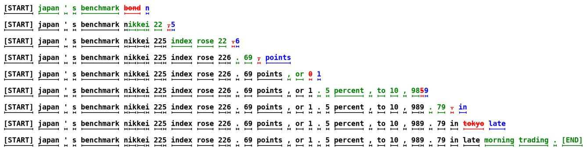
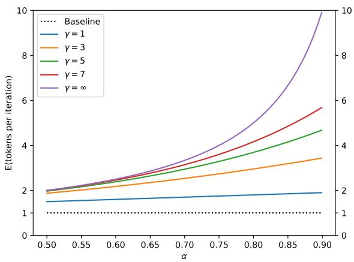
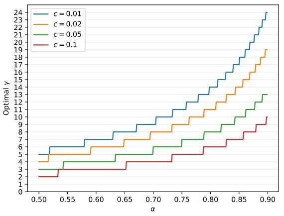
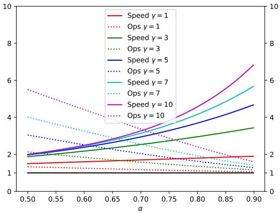
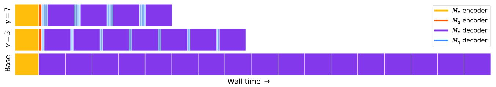

# Fast Inference from Transformers via Speculative Decoding

## 一、论文概述

| 项目 | 内容 |
|------|------|
| **标题** | Fast Inference from Transformers via Speculative Decoding |
| **作者** | Yaniv Leviathan, Matan Kalman, Yossi Matias |
| **机构** | Google Research |
| **论文** | https://arxiv.org/abs/2211.17192 |
| **发布** | 2022-11-30 |
| **会议** | ICML 2023 |
| **许可** | Google Research |

## 二、核心思想

### 问题定义

大型自回归模型（如 Transformer）的推理速度很慢——解码 K 个 token 需要 K 次串行运行模型。这成为了部署大型语言模型的主要瓶颈。

**关键观察**：
1. 困难的语言建模任务通常包含更容易的子任务，这些子任务可以被更高效的模型很好地近似
2. 使用投机执行和新颖的采样方法，可以通过并行运行大模型来加速精确解码，可能同时生成多个 token，且不改变输出分布

### 解决方案概述

**投机解码（Speculative Decoding）** 提出了一种算法，通过并行计算多个 token 来加速自回归模型的采样，且不改变输出。

**核心创新**：
1. **投机采样（Speculative Sampling）**：将投机执行推广到随机设置的新采样方法
2. **投机解码（Speculative Decoding）**：一种解码机制，可以加速自回归模型的解码，无需改变模型架构、训练过程或输出分布

**关键优势**：
- 无需重新训练模型
- 无需改变模型架构
- 保证输出分布完全一致
- 可以直接使用现成的预训练模型

## 三、技术架构

### 整体框架



**示例说明**：上图展示了无条件语言建模的情况。每行代表算法的一次迭代。绿色 token 是近似模型（6M 参数）提出的建议，被目标模型（97M 参数）接受；红色和蓝色 token 分别是被拒绝的建议及其修正。例如，第一行中目标模型只运行了一次，就生成了 5 个 token。

### 核心算法

**投机解码步骤（Algorithm 1）**：

```
输入: 目标模型 M_p, 近似模型 M_q, 前缀 prefix

# 步骤 1: 使用 M_q 自回归地采样 γ 个猜测
for i = 1 to γ do
    q_i(x) ← M_q(prefix + [x_1, ..., x_{i-1}])
    x_i ~ q_i(x)
end for

# 步骤 2: 并行运行 M_p
p_1(x), ..., p_{γ+1}(x) ← M_p(prefix), ..., M_p(prefix + [x_1, ..., x_γ])

# 步骤 3: 确定接受的猜测数量 n
r_1 ~ U(0,1), ..., r_γ ~ U(0,1)
n ← min({i-1 | 1 ≤ i ≤ γ, r_i > p_i(x)/q_i(x)} ∪ {γ})

# 步骤 4: 如果需要，调整 M_p 的分布
p'(x) ← p_{n+1}(x)
if n < γ then
    p'(x) ← norm(max(0, p_{n+1}(x) - q_{n+1}(x)))
end if

# 步骤 5: 返回一个来自 M_p 的 token 和 n 个来自 M_q 的 token
t ~ p'(x)
return prefix + [x_1, ..., x_n, t]
```

### 投机采样（Speculative Sampling）

**核心思想**：从 q(x) 采样来近似从 p(x) 采样

**接受准则**：
- 如果 q(x) ≤ p(x)：接受采样结果
- 如果 q(x) > p(x)：以概率 p(x)/q(x) 接受，否则拒绝

**拒绝后的调整分布**：
$$p'(x) = \text{norm}(\max(0, p(x) - q(x)))$$

**正确性证明**：对于任意分布 p(x) 和 q(x)，通过投机采样得到的 token 与直接从 p(x) 采样的 token 分布完全一致。

## 四、核心公式

### 期望生成 token 数

**定义 3.1（接受率）**：给定前缀 $x_{<t}$，接受率 $\beta_{x_{<t}}$ 是接受 $x_t \sim q(x_t | x_{<t})$ 的概率。

**简化假设**：假设 $\beta$ 是独立同分布的，记 $\alpha = E(\beta)$。

**定理 3.1**：Algorithm 1 生成的期望 token 数为：

$$E(\text{generated tokens}) = \frac{1 - \alpha^{\gamma+1}}{1 - \alpha}$$



### 接受率 α 的计算

**定义 3.2（Levenstein-Kraft 散度）**：
$$D_{LK}(p, q) = \sum_x |p(x) - M(x)| = \sum_x |q(x) - M(x)|$$
其中 $M(x) = \frac{p(x) + q(x)}{2}$

**引理 3.3**：
$$D_{LK}(p, q) = 1 - \sum_x \min(p(x), q(x))$$

**推论 3.4**：$D_{LK}(p, q)$ 是 [0,1] 上的对称散度
- $D_{LK}(p, q) = 0 \iff p = q$
- $D_{LK}(p, q) = 1 \iff p$ 和 $q$ 具有不相交的支撑集

**定理 3.5**：
$$\beta = 1 - D_{LK}(p, q)$$

**推论 3.6**：
$$\alpha = 1 - E(D_{LK}(p, q)) = E(\min(p, q))$$

### 墙钟时间改进

**定义 3.7（成本系数）**：$c$ 是 $M_q$ 单次运行时间与 $M_p$ 单次运行时间的比值。

**定理 3.8**：Algorithm 1 的期望墙钟时间改进因子为：

$$\frac{1 - \alpha^{\gamma+1}}{(1 - \alpha)(\gamma c + 1)}$$

**推论 3.9**：如果 $\alpha > c$，存在 $\gamma$ 使得我们获得改进，且改进因子至少为 $\frac{1 + \alpha}{1 + c}$

### 算术运算数量

**定义 3.10（运算成本系数）**：$\hat{c}$ 是 $M_q$ 每 token 算术运算数与 $M_p$ 每 token 算术运算数的比值。

**定理 3.11**：Algorithm 1 的期望总运算数增加因子为：

$$\frac{(1 - \alpha)(\gamma \hat{c} + \gamma + 1)}{1 - \alpha^{\gamma+1}}$$

**关键洞察**：
- 如果 $\alpha$ 低，算术运算增加量高；反之亦然
- 对于 Transformer 解码器，Algorithm 1 的总运算数可以被同规模 Transformer 编码器的单次运行从上界约束
- 与总运算数不同，总内存访问数可以通过我们的方法减少

### 最优 γ 的选择



给定 $c$ 和 $\alpha$，最优 $\gamma$ 是最大化墙钟时间改进方程的值：

$$\frac{1 - \alpha^{\gamma+1}}{(1 - \alpha)(\gamma c + 1)}$$

由于 $\gamma$ 是整数，可以通过数值方法轻松找到。

## 五、实验结果

### 实验设置

**模型配置**：
- 目标模型 $M_p$：T5-XXL (11B)
- 近似模型 $M_q$：T5-large (800M), T5-base (250M), T5-small (77M)
- 任务：英语-德语翻译 (WMT EnDe), 文本摘要 (CNN/DM)
- 硬件：单个 TPU-v4，批大小为 1
- 采样方法：argmax (temp=0) 和标准采样 (temp=1)

### 墙钟时间改进结果



| 任务 | $M_q$ | 温度 | $\gamma$ | $\alpha$ | 加速比 |
|------|--------|------|----------|----------|--------|
| EnDe | T5-SMALL ★ | 0 | 7 | 0.75 | **3.4×** |
| EnDe | T5-BASE | 0 | 7 | 0.80 | 2.8× |
| EnDe | T5-LARGE | 0 | 7 | 0.82 | 1.7× |
| EnDe | T5-SMALL ★ | 1 | 7 | 0.62 | **2.6×** |
| EnDe | T5-BASE | 1 | 5 | 0.68 | 2.4× |
| EnDe | T5-LARGE | 1 | 3 | 0.71 | 1.4× |
| CNN/DM | T5-SMALL ★ | 0 | 5 | 0.65 | **3.1×** |
| CNN/DM | T5-BASE | 0 | 5 | 0.73 | 3.0× |
| CNN/DM | T5-LARGE | 0 | 3 | 0.74 | 2.2× |
| CNN/DM | T5-SMALL ★ | 1 | 5 | 0.53 | **2.3×** |
| CNN/DM | T5-BASE | 1 | 3 | 0.55 | 2.2× |
| CNN/DM | T5-LARGE | 1 | 3 | 0.56 | 1.7× |

**关键发现**：
- T5-small (77M) 在 $c$ 和 $\alpha$ 之间提供了最佳平衡，实现了最高加速
- $\alpha$ 随近似模型大小的增加而增加
- argmax 采样 (temp=0) 的 $\alpha$ 和墙钟时间改进更高
- 翻译任务的加速比摘要任务更高

### 实验观察到的 α 值

| $M_p$ | $M_q$ | 采样 | $\alpha$ |
|-------|-------|------|----------|
| GPT-LIKE (97M) | UNIGRAM | T=0 | 0.03 |
| GPT-LIKE (97M) | BIGRAM | T=0 | 0.05 |
| GPT-LIKE (97M) | GPT-LIKE (6M) | T=0 | **0.88** |
| T5-XXL (EnDe) | UNIGRAM | T=0 | 0.08 |
| T5-XXL (EnDe) | BIGRAM | T=0 | 0.20 |
| T5-XXL (EnDe) | T5-SMALL | T=0 | 0.75 |
| T5-XXL (EnDe) | T5-BASE | T=0 | 0.80 |
| T5-XXL (EnDe) | T5-LARGE | T=0 | 0.82 |
| LaMDA (137B) | LaMDA (100M) | T=0 | 0.61 |
| LaMDA (137B) | LaMDA (2B) | T=0 | 0.71 |
| LaMDA (137B) | LaMDA (8B) | T=0 | 0.75 |

**关键观察**：
- 比目标模型小约两个数量级的近似模型通常产生 0.5 到 0.9 之间的 α 值
- 调整后的分布越尖锐，α 值越高
- 即使是平凡的 unigram 和 bigram 近似也能产生不可忽略的 α 值

### 简化跟踪图



上图展示了完整编码器-解码器 Transformer 堆栈的简化跟踪图：
- 顶行：投机解码，$\gamma = 7$
- 中行：投机解码，$\gamma = 3$
- 底行：标准解码

## 六、核心创新总结

| 创新点 | 说明 | 优势 |
|--------|------|------|
| **投机采样** | 将投机执行推广到随机设置 | 保证输出分布一致 |
| **投机解码** | 并行运行目标模型和近似模型 | 2-3× 加速 |
| **接受率分析** | 推导 α 与散度的关系 | 理论基础坚实 |
| **最优 γ 选择** | 数值方法找到最优参数 | 实用性强 |
| **通用性** | 适用于任意近似模型 | 灵活部署 |

## 七、技术影响

### 对后续研究的影响

这篇论文是投机解码领域的开创性工作，直接启发了：

1. **EAGLE 系列** (Li et al., 2024-2025)：特征级自回归
2. **Medusa** (Cai et al., 2024)：多头预测
3. **Lookahead Decoding** (Fu et al., 2024)：n-gram 基方法
4. **SpecForge** (2026)：生产级训练框架

### 实际应用价值

- **无需重新训练**：直接使用现有模型
- **无需改变架构**：即插即用
- **输出分布一致**：质量保证
- **易于实现**：生产部署友好

### 理论贡献

- **Levenstein-Kraft 散度**：新的分布距离度量
- **接受率公式**：$\alpha = E(\min(p, q))$
- **墙钟时间分析**：考虑了近似模型成本的完整分析

## 八、局限性

1. **计算资源需求**：需要足够的计算资源支持增加的并发性
2. **内存带宽瓶颈**：在内存带宽受限的场景下效果最好
3. **近似模型选择**：需要手动选择合适的近似模型
4. **固定 γ**：在整个推理过程中使用固定的 $\gamma$ 值

## 九、未来方向

论文提出的未来研究方向：

1. **束搜索兼容性**：进一步研究投机解码与束搜索的兼容性
2. **自定义近似模型**：通过自定义架构或训练程序获得更大改进
3. **层次化算法**：近似模型本身被更快的模型加速
4. **动态 γ**：在推理过程中变化 $\gamma$ 值
5. **其他模态**：将投机解码扩展到图像等其他领域

## 十、参考资源

### 论文

- **Speculative Decoding**: https://arxiv.org/abs/2211.17192
- **Chen et al., 2023**: 独立实现，展示了类似的 2-2.5× 改进

### 相关工作

- **Blockwise Parallel Decoding** (Stern et al., 2018)：仅支持贪婪解码
- **Shallow Aggressive Decoding** (Sun et al., 2021)：仅支持输入复制到输出
- **Adaptive Computation** (Han et al., 2021)：需要改变架构和训练

### 后续发展

- **EAGLE**: https://arxiv.org/abs/2401.15077
- **EAGLE-2**: https://arxiv.org/abs/2406.16858
- **EAGLE-3**: https://arxiv.org/abs/2503.01840
- **SpecForge**: https://arxiv.org/abs/2603.18567
