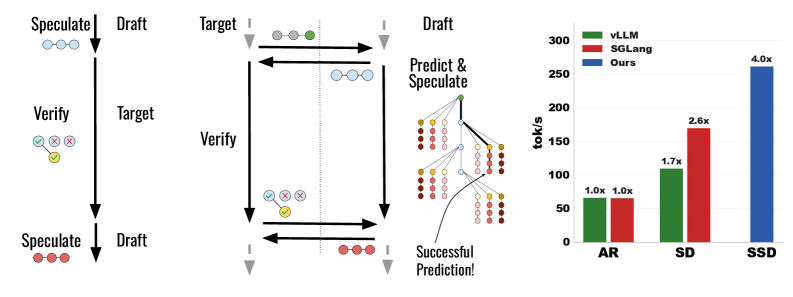
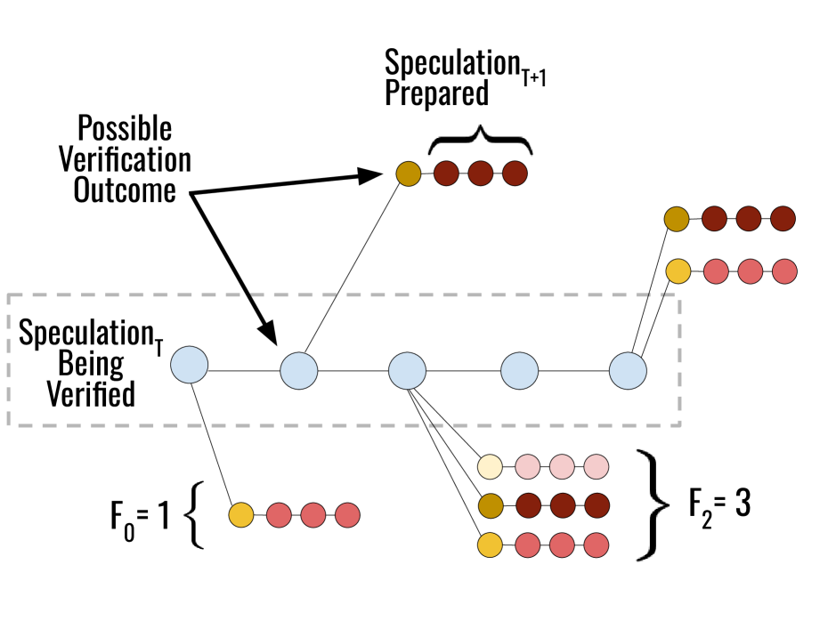
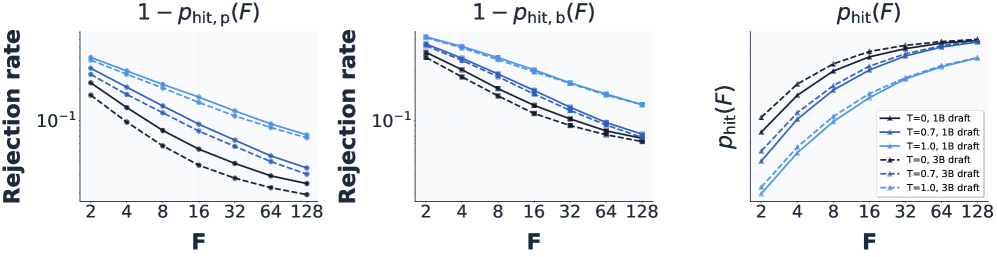
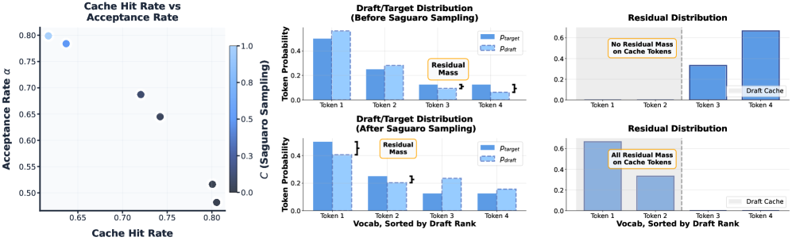
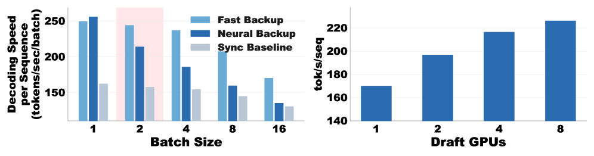
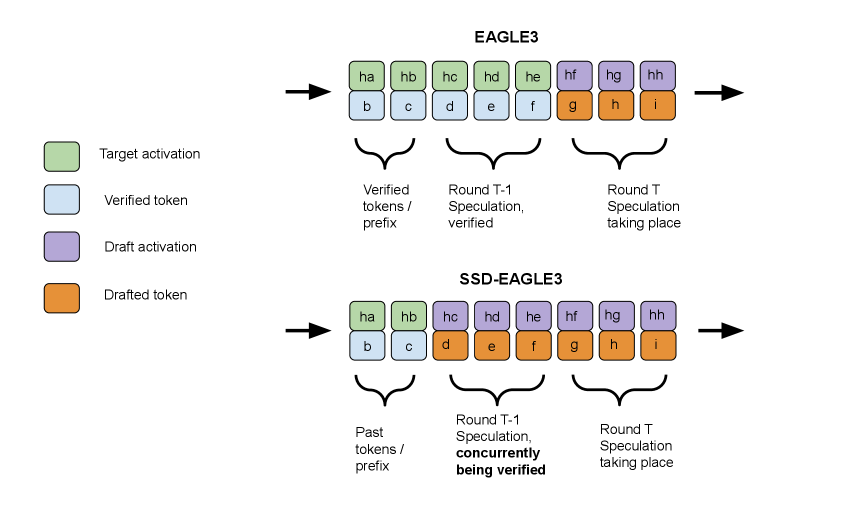
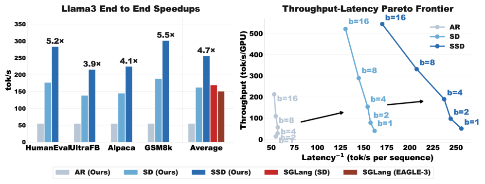

# Speculative Speculative Decoding (SSD) / Saguaro

## 一、论文概述

| 项目 | 内容 |
|------|------|
| **标题** | Speculative Speculative Decoding |
| **作者** | Tanishq Kumar, Tri Dao, Avner May |
| **机构** | Not specified in metadata |
| **论文** | https://arxiv.org/abs/2603.03251 |
| **发布** | 2026-03-03 |
| **许可** | Not specified |

## 二、核心思想

### 问题定义

自回归解码因其顺序性而受到瓶颈限制。投机解码（Speculative Decoding, SD）已成为加速推理的标准方法，通过使用快速草稿模型预测慢速目标模型即将生成的 token，然后通过一次目标模型前向传播并行验证。

然而，**投机解码本身依赖于推测和验证之间的顺序依赖**：验证必须完成才能开始下一次推测。

### 解决方案概述

**投机的投机解码（Speculative Speculative Decoding, SSD）** 引入了一种并行化这些操作的统一框架。

**核心思想**：
- 在 SD 中，草稿模型等待验证完成后才开始下一轮推测
- 在 SSD 中，草稿模型**预测可能的验证结果**，并在验证进行时**预先为所有结果准备推测**
- 如果实际验证结果在预测集中，可以立即返回预先准备的推测，完全消除草稿开销

**关键特性**：
- 与普通投机解码一样是无损的
- 与普通投机解码不同，草稿模型位于与目标模型**不同的硬件**上



**三个主要挑战**：
1. 草稿模型必须正确预测验证结果（包括接受多少 token 和采样哪个 bonus token）
2. 接受率和预测验证结果能力之间的微妙权衡
3. 必须有回退策略处理失败的预测

**Saguaro** 是优化的 SSD 算法实现：
- 平均比优化的投机解码基线快 30%
- 比自回归解码快 5×

## 三、技术架构

### SSD 框架

**核心组件**：
- **验证器（Verifier）**：目标模型，运行在主硬件上
- **推测器（Speculator）**：草稿模型，运行在独立硬件上
- **推测缓存（Speculation Cache）**：存储为可能验证结果准备的推测

**算法流程**：

```
主函数(prompt, target, primary_draft, backup_draft):
    异步启动 speculator(prompt, primary_draft, backup_draft)
    生成的token ← verifier(prompt, target)
    返回 生成的token

验证器(prompt, target):
    target.prefill(prompt)
    等待接收 spec_tokens from speculator
    生成的token ← []
    循环:
        verify_outcome ← target.verify(spec_tokens)
        生成的token.append(verify_outcome.tokens)
        发送 verify_outcome 给 speculator
        如果 end_token ∈ verify_outcome:
            返回 生成的token
        等待接收 spec_tokens from speculator

推测器(prompt, primary_draft, backup_draft):
    primary_draft.prefill(prompt)
    spec_tokens ← primary_draft.speculate(prompt)
    循环:
        发送 spec_tokens 给 verifier
        outcomes ← predict_verify_outcomes(spec_tokens, primary_draft)
        cache ← speculate_for_outcomes(outcomes, primary_draft)
        等待接收 verify_outcome from verifier
        如果 end_token ∈ verify_outcome:
            返回
        如果 verify_outcome ∈ cache:
            spec_tokens ← cache[verify_outcome]
        否则:
            spec_tokens ← backup_draft.speculate(prompt + verify_outcome.tokens)
```

### 推测缓存策略



**问题**：验证结果空间巨大，约为 $(K+1) \times V$，其中 $V$ 是词汇表大小。

**解决**：将验证预测建模为约束优化问题：在预算 $B$ 个验证结果下，如何选择以最大化缓存命中率？

**扇出（Fan-out）定义**：

$$F_k^p := |\{v^T := (k', t^*) \in \mathcal{S}^T \mid k' = k\}|$$

即位置 $k$ 处验证结果缓存中包含的 token 数量。

**Saguaro 验证结果预测算法**：
- 给定扇出策略 $\{F_k^p, F_k^b\}$
- 在草稿 logits 的每个前瞻位置 $k$ 取 top-$F_k$ token
- 添加到推测缓存中

### 理论结果

**定义 11（幂律缓存命中率）**：如果扇出为 $F$ 时缓存未命中的概率是 $F$ 的幂律：

$$1 - p_{\text{hit},*}(F) = 1/F^r \quad \forall F \in \mathbb{N}$$

**定理 12（Saguaro 缓存形状：几何扇出）**：

考虑接受率为 $a_p$ 且具有 $r$ 幂律缓存命中率的草稿模型。在约束 $\sum_{k=0}^{K} F_k^p \leq B$ 下，最优的 $F_k^p$ 值遵循封顶几何级数：

$$F_k = F_0 \cdot a_p^{k/(1+r)} \quad \forall k < K$$

$$F_K = F_0 \cdot a_p^{K/(1+r)} \cdot (1 - a_p)^{-1/(1+r)}$$

其中 $F_0$ 可以选择使得 $\sum_{k=0}^{K} F_k^p = B$。

**直观理解**：
- 验证字符串的长度遵循封顶几何分布
- 如果不太可能接受 $j$ 个 token，就不应该浪费计算在该位置猜测 bonus token



### Saguaro 采样

**问题**：bonus token 从残差分布采样：

$$r(\cdot) \propto \max(p_{\text{target}}(\cdot) - p_{\text{draft}}(\cdot), 0)$$

这个分布难以预测，尤其是当采样温度升高时。

**解决方案**：Saguaro 采样通过显式增加最可能草稿 token 上的残差概率质量来使残差更容易预测。

**权衡**：
- 偏置草稿分布 → 降低接受率
- 但提高缓存命中率



### 备用推测器

**回退策略**：当缓存未命中时，使用备用推测器。

**选择**：
- **快速推测器**：n-gram 模型，延迟极低
- **神经推测器**：小型语言模型，质量更高



**定理 17**：最优备用推测器选择取决于批大小：
- 批大小小：快速推测器更好（延迟低）
- 批大小大：神经推测器更好（质量高）

### EAGLE-3 集成

SSD 可以与 EAGLE-3 集成（SSD-EAGLE-3）：



**关键区别**：
- 标准 EAGLE-3：轮次 $T$ 的草稿几乎完全依赖目标模型特征
- SSD-EAGLE-3：草稿可以依赖缓存中的预计算推测

## 四、核心公式

### 缓存命中率幂律

$$1 - p_{\text{hit},*}(F) = 1/F^r$$

### 几何扇出

$$F_k = F_0 \cdot a_p^{k/(1+r)} \quad \forall k < K$$

$$F_K = F_0 \cdot a_p^{K/(1+r)} \cdot (1 - a_p)^{-1/(1+r)}$$

### 残差分布

$$r(\cdot) \propto \max(p_{\text{target}}(\cdot) - p_{\text{draft}}(\cdot), 0)$$

### 验证结果空间大小

$$|\text{Outcomes}| \approx (K+1) \times V$$

其中 $K$ 是前瞻长度，$V$ 是词汇表大小。

## 五、实验结果

### 实验设置

**模型配置**：
- 目标模型：Llama-3.1-70B-Instruct (TP=4, 4×H100)
- 草稿模型：Llama-3.2-1B
- 批大小：1
- 解码：贪婪解码
- SSD 推测器：独立 1×H100

**数据集**：
- Alpaca（通用对话）
- GSM8K（数学推理）
- UltraFeedback（对话）
- HumanEval（代码生成）

### 端到端性能



**Llama-3.1-70B 结果**：

| 方法 | 平均加速比 | 最大加速比 |
|------|------------|------------|
| 自回归解码 | 1× | 1× |
| 投机解码 (SD) | ~2.5× | ~3× |
| **SSD (Saguaro)** | **~5×** | **~5×** |

**关键发现**：
- SSD 平均比优化的投机解码基线快 30%
- 比自回归解码快 5×
- SSD 在延迟和吞吐量上都推进了 Pareto 前沿
- 在低批大小时收益最大

### 缓存命中率分析

**几何扇出 vs 均匀扇出**：

| 温度 | 几何扇出缓存命中率 | 均匀扇出缓存命中率 |
|------|---------------------|---------------------|
| 0 | ~85% | ~70% |
| 0.5 | ~75% | ~60% |
| 1.0 | ~65% | ~50% |

**关键发现**：
- 几何扇出策略在所有温度下都优于均匀扇出
- 在高温度时优势更明显

### 吞吐量-延迟 Pareto 前沿

**关键发现**：
- SSD 不仅提高最佳解码速度，而且每设备计算效率更高
- 在低批大小时收益最大
- 推进了延迟-吞吐量 Pareto 前沿

## 六、核心创新总结

| 创新点 | 说明 | 优势 |
|--------|------|------|
| **SSD 框架** | 并行化推测和验证操作 | 消除顺序依赖 |
| **推测缓存** | 预先为可能验证结果准备推测 | 立即返回结果 |
| **几何扇出** | 最优缓存形状理论 | 最大化缓存命中率 |
| **Saguaro 采样** | 使残差分布更易预测 | 提高缓存命中率 |
| **备用推测器** | 处理缓存未命中 | 保证无损性 |
| **独立硬件** | 推测器运行在独立设备上 | 真正的并行执行 |

## 七、技术影响

### 对投机解码的改进

- **消除顺序依赖**：推测和验证并行执行
- **30% 速度提升**：相对于优化的 SD 基线
- **5× 加速**：相对于自回归解码
- **无损保证**：输出分布与目标模型完全一致

### 硬件配置创新

**传统 SD**：草稿模型与目标模型共置在同一硬件上

**SSD**：草稿模型位于独立硬件上
- 目标模型：4×H100 (TP=4)
- 草稿模型：1×H100
- 真正的并行执行

### 理论贡献

- **幂律缓存命中率**：经验观察和理论建模
- **几何扇出定理**：最优缓存形状的闭式解
- **权衡分析**：接受率 vs 缓存命中率

## 八、局限性

1. **额外硬件需求**：需要独立设备运行推测器
2. **批大小限制**：在大批大小时收益减少
3. **缓存未命中**：仍需要回退策略
4. **温度敏感性**：高温度时缓存命中率下降

## 九、相关工作

### 投机解码

- **Leviathan et al., 2023**：投机解码开创性工作
- **Chen et al., 2023**：独立实现，类似加速

### EAGLE 系列

- **EAGLE** (Li et al., 2024b)：特征级自回归
- **EAGLE-2** (Li et al., 2024a)：动态草稿树
- **EAGLE-3** (Li et al., 2025)：训练时测试

### 其他加速方法

- **Medusa** (Cai et al., 2024)：多头预测
- **Lookahead Decoding** (Fu et al., 2024)：n-gram 基方法

## 十、参考资源

### 论文

- **SSD/Saguaro**: https://arxiv.org/abs/2603.03251

### 相关工作

- **Speculative Decoding**: Leviathan et al., 2023; Chen et al., 2023
- **EAGLE-3**: Li et al., 2025
- **Medusa**: Cai et al., 2024
