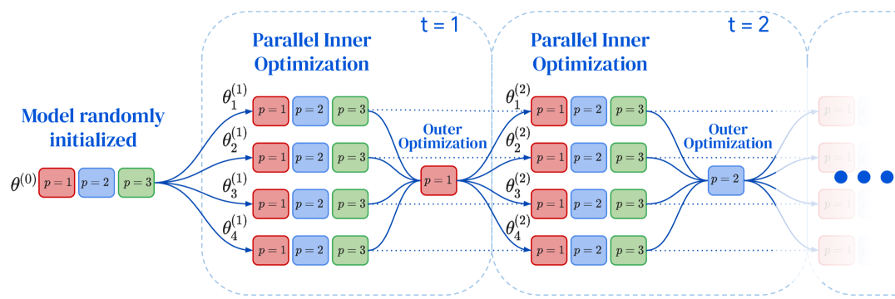
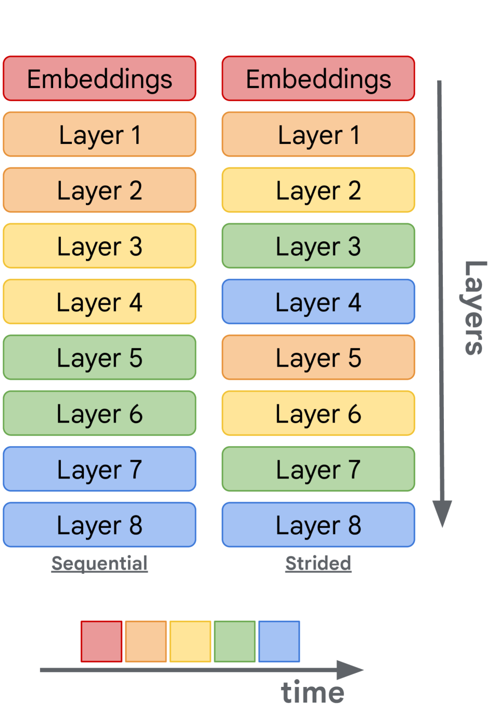
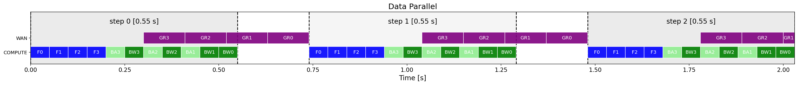
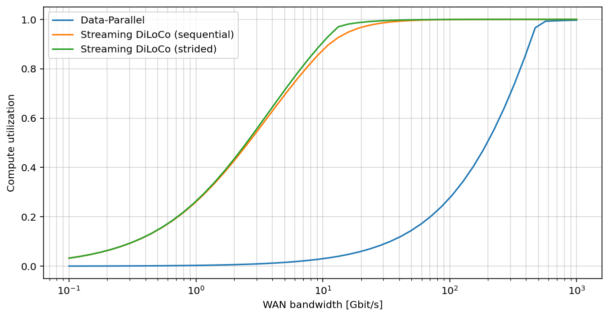
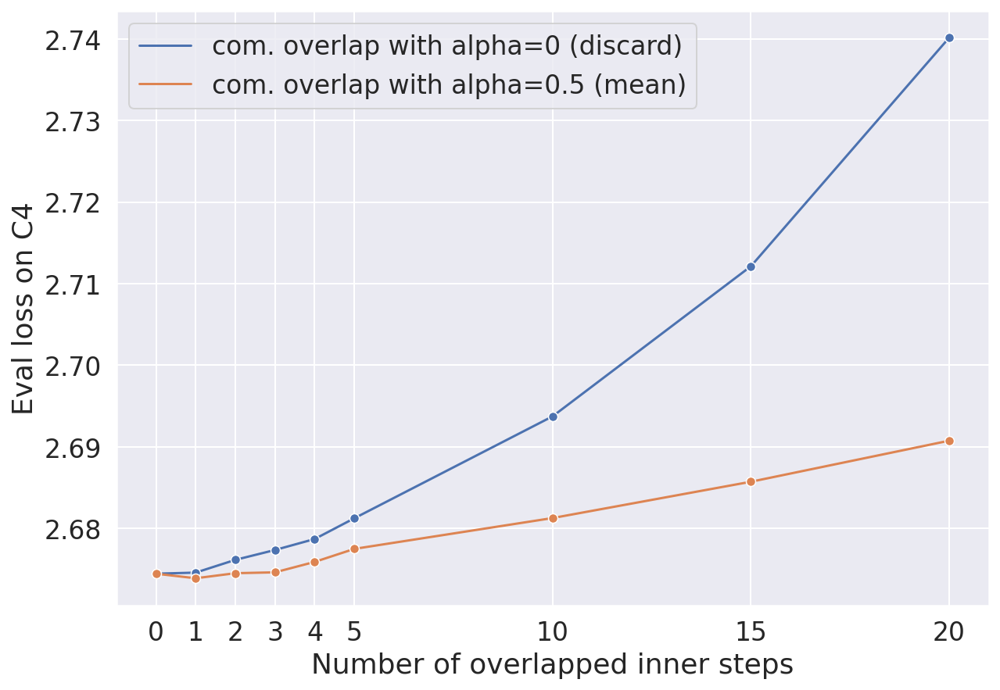
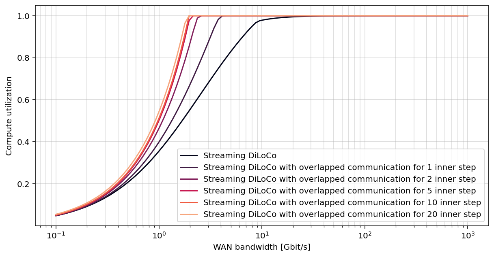
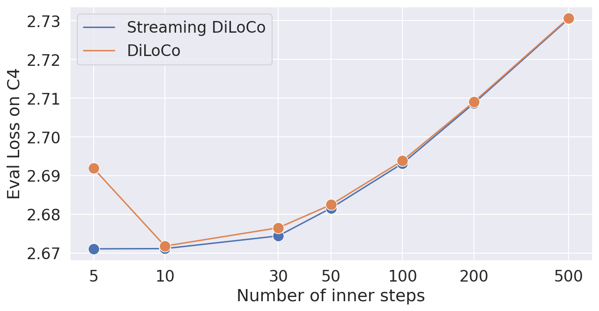

# Streaming DiLoCo with Overlapping Communication: Towards a Distributed Free Lunch

## 一、论文概述

| 项目 | 内容 |
|------|------|
| **标题** | Streaming DiLoCo with Overlapping Communication: Towards a Distributed Free Lunch |
| **作者** | Arthur Douillard, Yanislav Donchev, Keith Rush, Satyen Kale, Zachary Charles, Zachary Garrett, Gabriel Teston, Dave Lacey, Ross McIlroy, Jiajun Shen, et al. |
| **机构** | Google DeepMind |
| **论文** | https://arxiv.org/abs/2501.18512 |
| **代码** | - |
| **发布** | 2025-01-30 |
| **许可** | - |
| **领域** | cs.CL (Computation and Language) |

## 二、核心思想

### 问题定义

大规模语言模型（LLM）训练通常分布 across 大量加速器以减少训练时间。由于内部状态和参数梯度需要在每个梯度步骤中交换，所有设备需要使用低延迟高带宽通信链路 co-locate。

最近的分布式算法如 DiLoCo 放松了这种 co-location 约束：加速器可以分组为 "workers"，workers 之间的同步只在不频繁的时间发生。然而，这些方法中跨 workers 的通信仍然需要与之前相同的峰值带宽，因为同步需要所有参数在所有 workers 之间交换。

### 解决方案概述

Streaming DiLoCo 在三个方面改进 DiLoCo：

1. **流式部分更新（Streaming Partial Updates）**：按顺序同步参数子集，而非一次性全部同步，大幅降低峰值带宽
2. **重叠通信与计算（Overlapping Communication with Computation）**：允许 workers 在同步时继续训练，减少 wall clock 时间
3. **低精度外梯度（Low-precision Outer Gradients）**：量化 workers 交换的数据，进一步降低带宽

### 核心成果

- 将带宽需求降低 **两个数量级（400×）**
- 达到与 Data-Parallel 训练相当的模型质量
- 在 1-5 Gbit/s 带宽下实现 95% 计算利用率
- 为 "分布式免费午餐"（distributed free lunch）奠定基础

## 三、技术架构

### 整体框架图

*Figure 1: Streaming DiLoCo: each replica trains independently for dozens of inner optimization steps, and then synchronizes a single fragment during outer optimization.*

### 流式同步模式

*Figure 2: Streaming pattern: sequential (left) and strided (right). Colors denote the fragment. A different fragment is synchronized each time.*

### 核心公式

#### DiLoCo 基础

DiLoCo 允许 M 个 workers 各自使用内优化器训练 H 步，然后使用外优化器同步：

**内优化器更新**：
$$\theta_m^{(t)} \leftarrow \text{InnerOpt}(\theta_m^{(t-1)}, \nabla \mathcal{L})$$

**外优化器更新**（每 H 步）：
$$\Delta_m^{(t)} \leftarrow \theta_m^{(t-H)} - \theta_m^{(t)}$$
$$\bar{\Delta}^{(t)} \leftarrow \frac{1}{M} \sum_{m=1}^M \Delta_m^{(t)}$$
$$\theta_m^{(t)} \leftarrow \text{OuterOpt}(\theta_m^{(t-H)}, \bar{\Delta}^{(t)})$$

#### Streaming DiLoCo 创新

**1. 流式部分更新**

将模型分为 P 个 fragments，每次只同步一个 fragment：
- Sequential pattern：按顺序同步 fragment 1, 2, ..., P
- Strided pattern：交错同步 fragment 1, 1+P/2, 2, 2+P/2, ...

**2. 重叠通信与计算**

允许 workers 在发送/接收梯度时继续训练：
- 通信延迟被计算覆盖
- 需要 τ 步重叠来完全隐藏延迟

**3. 低精度量化**

将外梯度量化到 4-bit：
- 进一步减少传输数据量
- 对模型质量影响最小

### 核心组件

| 组件 | 说明 | 关键参数 |
|------|------|----------|
| Workers | 独立的训练单元 | M 个 workers，各自维护模型副本 |
| Fragments | 模型参数片段 | P 个 fragments，每次同步一个 |
| Inner Optimizer | 本地优化器 | AdamW |
| Outer Optimizer | 全局同步优化器 | SGD with momentum |
| Overlap Steps | 重叠步数 | τ 步 |

### 计算利用率分析

*Figure 3: Simulation of a schedule interleaving forward passes (in blue), backward passes w.r.t. activations and parameters (resp. in light and dark green), and (outer) gradient reduction (in purple).*

**关键观察**：
- Data-Parallel 在每个步骤都需要全模型梯度通信
- DiLoCo 每 H 步通信一次，但峰值带宽相同
- Streaming DiLoCo 每次只通信一个 fragment，峰值带宽降低 P 倍
- 重叠通信进一步隐藏延迟

## 四、核心创新

| 创新点 | 说明 | 理论/实验依据 |
|--------|------|---------------|
| 流式部分更新 | 按顺序同步参数子集 | 峰值带宽降低 P 倍 |
| 重叠通信与计算 | 训练与通信并行 | 计算利用率提升至 95% |
| 低精度外梯度 | 4-bit 量化 | 带宽进一步降低 4× |
| Sequential vs Strided | 不同同步模式 | Strided 更均匀分布通信 |
| 跨 worker 重叠 | 不同 worker 可以异步重叠 | 进一步降低带宽需求 |

## 五、代码实现分析

### 技术栈

- **训练框架**：基于 JAX/Pathways
- **模型架构**：Transformer-based LLMs
- **并行策略**：Data Parallelism + Tensor Parallelism
- **通信**：gRPC + 低精度量化
- **硬件**：TPU v4/v5

### 关键实现细节

1. **片段化策略**：
   - 将模型分为 P 个 fragments
   - 每个 fragment 对应模型的一层或一组层
   - Sequential 或 Strided 同步模式

2. **重叠实现**：
   - 使用异步通信原语
   - 计算和通信在不同硬件单元上并行
   - 需要 τ 步重叠来完全隐藏延迟

3. **量化方案**：
   - 4-bit 量化外梯度
   - 使用 block-wise quantization
   - 对模型质量影响最小

## 六、实验结果

### 计算利用率

*Figure 7: Compute utilization profile of sequential vs strided pattern for a 100 billion parameters model.*

**模拟设置**：
- 模型规模：1B, 10B, 100B 参数
- 带宽范围：1-300 Gbit/s

**结果**：

| 方法 | 1B 带宽需求 | 10B 带宽需求 | 100B 带宽需求 | 计算利用率 |
|------|------------|-------------|--------------|-----------|
| Data-Parallel | 100 Gbit/s | 200 Gbit/s | 300 Gbit/s | ~50% |
| DiLoCo | 100 Gbit/s | 200 Gbit/s | 300 Gbit/s | ~50% |
| **Streaming DiLoCo** | **1-5 Gbit/s** | **1-5 Gbit/s** | **1-5 Gbit/s** | **95%** |

### 重叠步数影响

*Figure 8: Varying the number of overlapped inner steps τ for α={0,0.5}. A larger τ requires a significantly lower bandwidth.*

**关键发现**：
- 更大的 τ 值需要更低的带宽
- α=0.5 时（量化）带宽需求进一步降低
- τ=8 时可在 1 Gbit/s 下实现 90%+ 计算利用率

### 异步带宽利用

*Figure 9: Estimated compute utilization for a 100B model when increasing τ, the number of inner steps which overlap with communication.*

**结果**：
- 随着 τ 增加，计算利用率单调增加
- 在 τ=16 时达到 95%+ 计算利用率
- 带宽需求从 300 Gbit/s 降至 5 Gbit/s

### 内步数消融

*Figure 13: Varying the number of inner steps H for DiLoCo and Streaming DiLoCo while keeping the total number of steps constant.*

**观察**：
- 更小的 H 意味着更多的通信轮次
- Streaming DiLoCo 在所有 H 值下都表现更好
- H=8 是最佳平衡点

### LLM 扩展实验

**模型规模**：1B, 10B, 100B 参数

**结果**：
- Streaming DiLoCo 达到与 Data-Parallel 相当的训练 loss
- 下游评估准确率可比
- 带宽需求降低 400×

### 与其他方法对比

| 方法 | 峰值带宽 | 计算利用率 | 模型质量 | 延迟容忍 |
|------|----------|-----------|----------|----------|
| Data-Parallel | 高 | 50% | 基线 | 低 |
| DiLoCo | 高（突发） | 50% | 竞争性 | 低 |
| **Streaming DiLoCo** | **低** | **95%** | **竞争性** | **高** |

## 七、相关工作

### 分布式训练

- **Data-Parallel**：标准分布式训练，每个步骤同步所有梯度
- **DiLoCo**：减少同步频率，但峰值带宽相同
- **Federated Learning**：FedOpt 等方法
- **Gradient Compression**：梯度压缩技术

### 通信优化

- **梯度压缩**：减少传输数据量
- **异步 SGD**：异步梯度更新
- **重叠通信**：隐藏通信延迟

### 本工作定位

Streaming DiLoCo 结合了：
- DiLoCo 的低频同步
- 流式更新的低峰值带宽
- 重叠通信的延迟隐藏
- 低精度量化的进一步压缩

## 八、总结

### 核心贡献

1. **流式部分更新**：按顺序同步参数子集，峰值带宽降低 P 倍
2. **重叠通信与计算**：训练与通信并行，计算利用率提升至 95%
3. **低精度外梯度**：4-bit 量化，带宽进一步降低 4×
4. **综合效果**：总带宽需求降低 400×，实现 "分布式免费午餐"

### 技术影响

- **大规模预训练**：在低带宽环境下实现高效训练
- **地理分布式训练**：支持跨地域集群训练
- **成本效益**：降低硬件和网络成本
- **可扩展性**：支持更大规模的模型训练

### 局限性

1. **延迟敏感**：需要足够的重叠步数来隐藏延迟
2. **量化误差**：4-bit 量化可能引入微小误差
3. **同步开销**：仍需要一定的同步机制
4. **实现复杂度**：重叠通信需要复杂的调度

### 未来方向

- 扩展到更大的模型规模
- 探索更低精度的量化
- 与其他分布式训练技术结合
- 优化重叠调度策略

## 九、参考资源

- **论文**: https://arxiv.org/abs/2501.18512
- **基础框架**: DiLoCo, FedOpt
- **后续工作**: Decoupled DiLoCo (arxiv 2604.21428)
- **相关技术**: Gradient Compression, Async SGD, Overlapping Communication
- **硬件**: TPU v4, TPU v5
