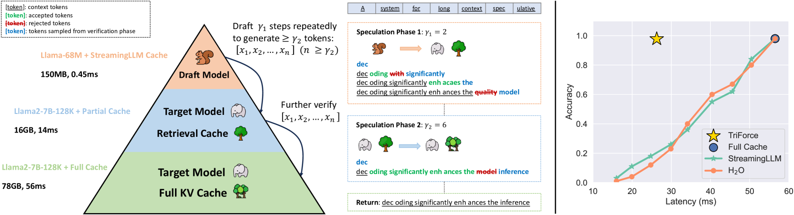
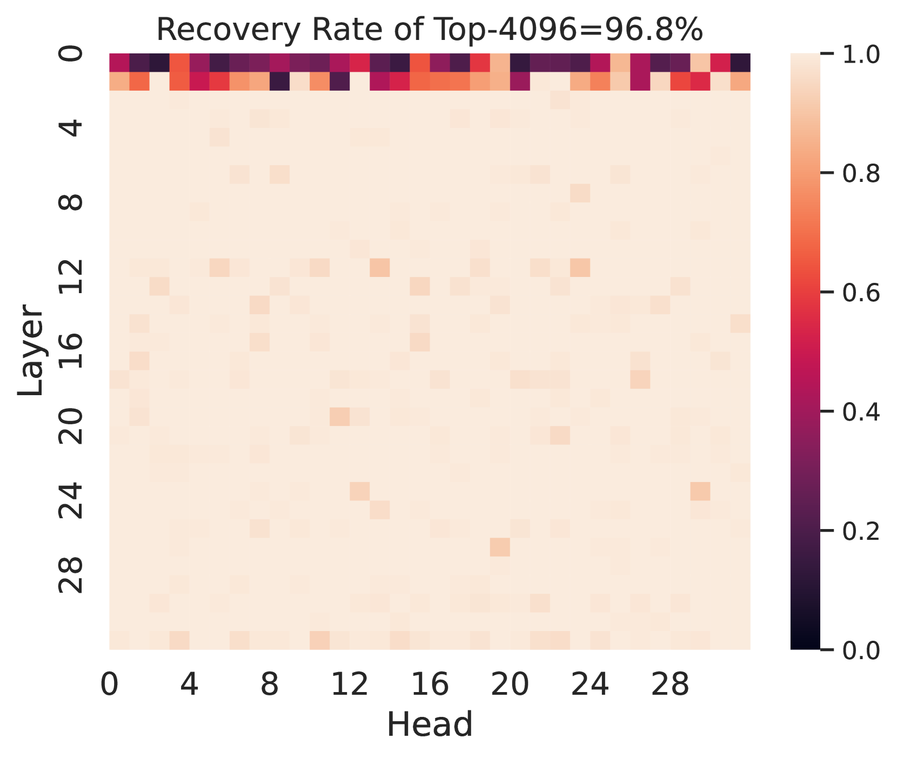
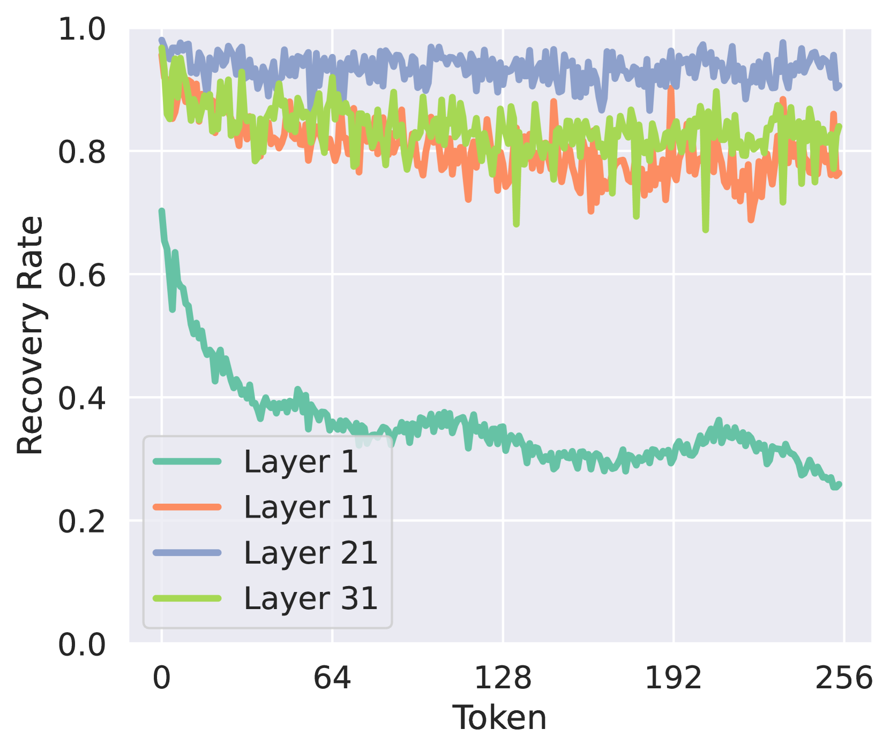
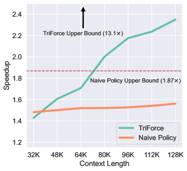
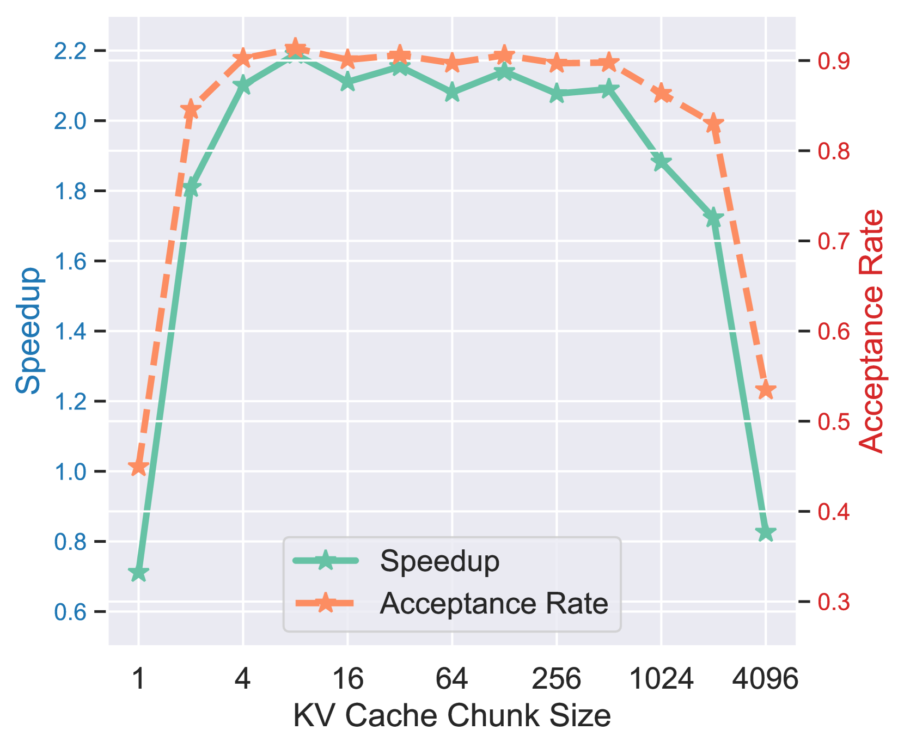
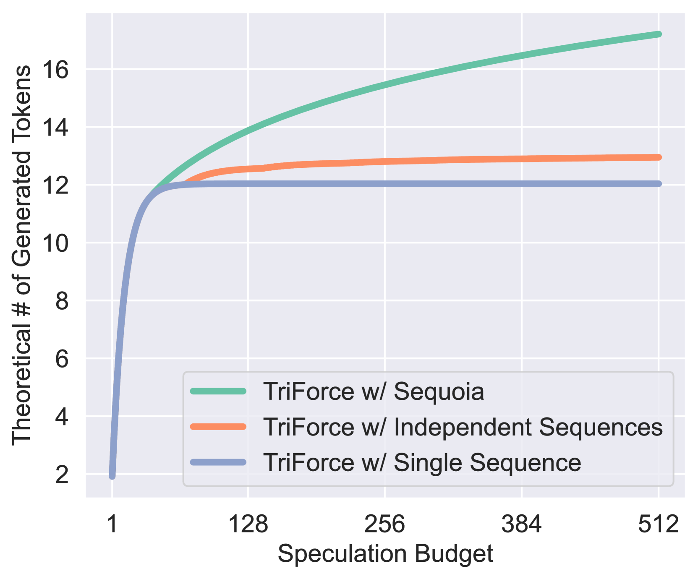
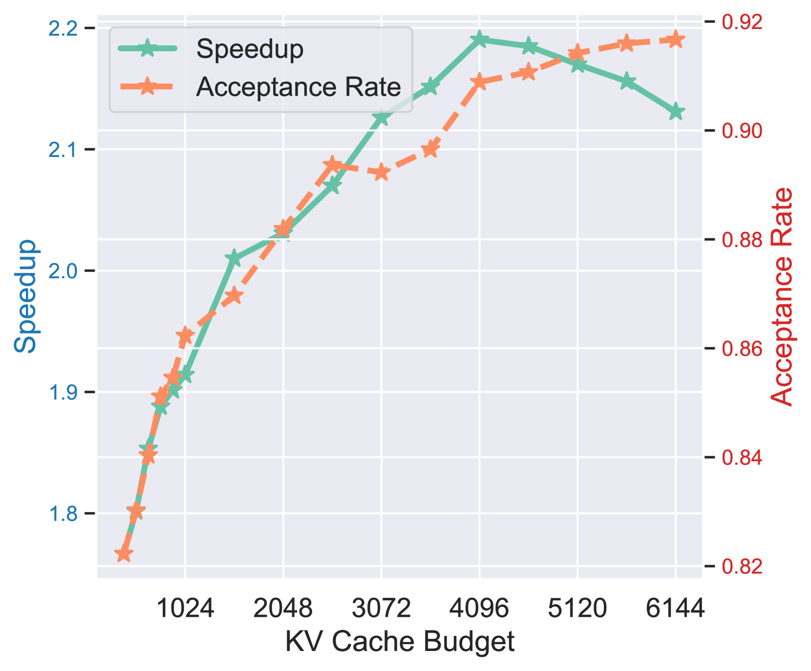

# TriForce: 层次化推测解码实现长序列无损加速

## 一、论文概述

| 项目 | 内容 |
|------|------|
| **标题** | TriForce: Lossless Acceleration of Long Sequence Generation with Hierarchical Speculative Decoding |
| **作者** | Hanshi Sun, Zhuoming Chen, Xinyu Yang, Yuandong Tian, Beidi Chen |
| **机构** | Carnegie Mellon University & Meta AI |
| **论文** | https://arxiv.org/abs/2404.11912 |
| **代码** | https://github.com/Infini-AI-Lab/TriForce |
| **发布** | 2024年4月18日 |

## 二、核心思想

TriForce 是一种层次化推测解码系统，专为长序列生成设计。它通过检索式 KV 缓存选择和层次化推测策略，解决了长序列推理中的 KV 缓存瓶颈问题，实现了无损加速。

### 问题定义

随着大语言模型在长内容生成中的广泛应用，高效长序列推理支持的需求日益增长。然而：

1. **KV 缓存瓶颈**：KV 缓存随序列长度线性增长，成为关键瓶颈
2. **内存访问问题**：自回归生成时需要加载整个 KV 缓存，导致计算核心利用率低和高延迟
3. **现有方法局限**：
   - KV 缓存压缩方法（如 H2O、StreamingLLM）会导致生成质量下降
   - 标准推测解码在长序列场景下效率不高

### 解决方案概述

TriForce 的核心创新：

1. **检索式草稿生成**：使用检索策略从完整 KV 缓存中选择最相关的 token
2. **层次化推测**：建立两层推测层次，分别解决模型权重和 KV 缓存瓶颈
3. **上下文局部性利用**：利用相邻 token 需要相似上下文信息的特性

## 三、技术架构

### 整体框架图



TriForce 采用两层层次化推测：

- **第一层**：小模型 Mq 使用 StreamingLLM 缓存推测大模型 Mp 使用检索缓存
- **第二层**：大模型 Mp 使用检索缓存进行自推测

### 核心观察

#### 观察 1：注意力稀疏性



在 120K 上下文中，仅需 4K token 即可恢复超过 96% 的注意力分数。这表明可以使用部分 KV 缓存作为草稿缓存来实现高接受率的自推测解码。

#### 观察 2：上下文局部性



相邻 token 需要的长上下文信息往往相似。这一观察使得：
- 单次缓存构建可以支持多个解码步骤
- 可以摊销构建草稿缓存的延迟

### 核心公式

#### 检索式草稿生成

将 KV 缓存分成小块，计算查询与每个块平均键的注意力：

$$\text{score}_i = \text{Attention}(q, \text{mean}(K_i))$$

根据分数选择 top-n 个最相关的块构建检索缓存。

#### 层次化推测

1. **第一层推测**：
   - 小模型 Mq 使用 StreamingLLM 缓存生成 γ1 个候选 token
   - 大模型 Mp 使用检索缓存验证这些 token

2. **第二层推测**：
   - 大模型 Mp 使用检索缓存生成候选 token
   - 大模型 Mp 使用完整缓存进行最终验证

### 模型组件

| 组件 | 说明 | 关键参数 |
|------|------|----------|
| **目标模型 Mp** | 完整的大模型 | 使用完整 KV 缓存 |
| **草稿模型 Mq** | 轻量级小模型 | 使用 StreamingLLM 缓存 |
| **检索缓存 Cr** | 从完整缓存中检索 | 4K token 预算 |
| **StreamingLLM 缓存 Cq** | 注意力 sink + 最近 token | 1K token 预算 |

### 算法流程

```
输入: 前缀 [x1,...,xt], 目标模型 Mp, 草稿模型 Mq, 目标序列长度 T

1. 初始化:
   - 预填充 Mp 和 Mq
   - 使用最后一个 token 构建检索缓存 Cr

2. while N < T do:
   - n ← 0
   - while n < γ2 do:
     // 第一层推测
     - Mq 使用 Cq 生成 γ1 个候选 token
     - Mp 使用 Cr 验证这些 token
     - 接受/拒绝并修正

   // 第二层推测
   - Mp 使用 Cr 生成候选 token
   - Mp 使用 Cp 进行最终验证

   - 更新缓存 Cr 和 Cq
```

## 四、核心创新

| 创新点 | 说明 | 理论/实验依据 |
|--------|------|---------------|
| **检索式草稿生成** | 从完整缓存中检索最相关 token | 接受率 0.9878 vs H2O 0.0739 |
| **层次化推测** | 两层推测分别解决不同瓶颈 | 速度提升 2.31x |
| **上下文局部性利用** | 单次缓存构建支持多步解码 | 缓存重建频率降低 |
| **温度鲁棒性** | 在各种温度下保持稳定性能 | T=1.0 时接受率 > 0.9 |

## 五、实验结果

### 长序列生成性能



#### A100 GPU 上的结果

| 方法 | 温度 | 速度提升 | 接受率 |
|------|------|----------|--------|
| **TriForce** | 0.0 | **2.31x** | 0.9237 |
| **TriForce** | 0.2 | 2.25x | 0.9180 |
| **TriForce** | 0.4 | 2.20x | 0.9142 |
| **TriForce** | 0.6 | 2.19x | 0.9137 |
| **TriForce** | 0.8 | 2.08x | 0.8986 |
| **TriForce** | 1.0 | 2.08x | 0.9004 |
| **TriForce** | 1.2 | 2.02x | 0.8902 |
| Retrieval w/o Hierarchy | 0.6 | 1.80x | 0.9126 |
| StreamingLLM w/ Hierarchy | 0.6 | 1.90x | 0.8745 |

### 卸载场景性能



#### RTX 4090 GPU 上的结果

| GPU 配置 | 目标模型 | TriForce (ms) | AR (ms) | 速度提升 |
|---------|----------|---------------|---------|----------|
| 2x RTX 4090 | Llama2-7B-128K | 108 | 840 | **7.78x** |
| 2x RTX 4090 | LWM-Text-Chat-128K | 114 | 840 | 7.37x |
| 2x RTX 4090 | Llama2-13B-128K | 226 | 1794 | **7.94x** |
| 1x RTX 4090 | Llama2-7B-128K | 312 | 1516* | **4.86x** |
| 1x RTX 4090 | LWM-Text-Chat-128K | 314 | 1516* | 4.83x |

*使用 DeepSpeed-ZeRO-Inference 作为基线

### 批量推理性能



| 批量大小 | 上下文长度 | 温度 | 速度提升 | Naive Policy |
|---------|-----------|------|----------|--------------|
| (2, 56K) | (2, 1024) | 0.0 | 1.89x | 1.46x |
| (2, 56K) | (2, 1024) | 0.6 | 1.75x | 1.35x |
| (6, 19K) | (6, 768) | 0.0 | 1.90x | 1.39x |
| (6, 19K) | (6, 768) | 0.6 | 1.76x | 1.28x |
| (10, 12K) | (10, 768) | 0.0 | 1.72x | 1.34x |
| (10, 12K) | (10, 768) | 0.6 | 1.61x | 1.21x |

### 接受率分析



在不同任务上的接受率比较（120K 上下文，4K 预算）：

| 方法 | PG-19 | Needle Retrieval |
|------|-------|------------------|
| Top-K (参考) | 0.9921 | 0.9989 |
| StreamingLLM | 0.9156 | 0.0519 |
| H2O | 0.9179 | 0.0739 |
| **Retrieval** | **0.9649** | **0.9878** |

检索式方法在 Needle Retrieval 任务上显著优于 StreamingLLM 和 H2O，因为它能主动识别最关键的信息。

## 六、相关工作

### KV 缓存驱逐策略

- **StreamingLLM**：保留注意力 sink 和最近 token
- **H2O**：基于累积注意力分数的贪心驱逐
- **局限性**：这些方法会永久丢弃 token，不适合需要保留完整 KV 缓存的场景

### KV 缓存量化

- **INT8/INT4 量化**：减少 KV 缓存的位宽
- **与 TriForce 正交**：可以与 TriForce 结合使用

### 推测解码

- **标准推测解码**：使用小模型生成候选，大模型验证
- **自推测**：使用模型自身进行推测
- **TriForce 创新**：层次化推测，分别解决不同瓶颈

## 七、总结

### 核心贡献

1. **检索式草稿生成**：从完整 KV 缓存中检索最相关 token，实现无损近似
2. **层次化推测系统**：建立两层推测层次，分别解决模型权重和 KV 缓存瓶颈
3. **上下文局部性利用**：利用相邻 token 需要相似上下文的特性提高效率
4. **显著速度提升**：
   - A100 上实现 2.31x 加速
   - 2x RTX 4090 上实现 7.94x 加速
   - 1x RTX 4090 上实现 4.86x 加速
5. **温度鲁棒性**：在各种温度下保持稳定性能

### 技术影响

TriForce 证明了在长序列生成中，通过智能的 KV 缓存管理和层次化推测，可以实现显著的无损加速。其检索式方法相比传统的 StreamingLLM 和 H2O 更能保留关键上下文信息。

### 局限性

1. **模型依赖**：需要一个额外的小型草稿模型
2. **缓存管理**：需要维护多个缓存（完整缓存、检索缓存、StreamingLLM 缓存）
3. **延迟摊销**：需要足够长的生成序列来摊销缓存构建的开销
4. **内存占用**：虽然减少了计算，但仍需要存储完整 KV 缓存

## 八、参考资源

- **论文**: https://arxiv.org/abs/2404.11912
- **代码**: https://github.com/Infini-AI-Lab/TriForce
- **相关论文**:
  - StreamingLLM: https://arxiv.org/abs/2309.17453
  - H2O: https://arxiv.org/abs/2306.14048
  - Speculative Decoding: https://arxiv.org/abs/2211.17192

## 关键图片索引

| 图片 | 说明 | 文件名 |
|------|------|--------|
| Figure 1 | TriForce 架构概览 | `architecture-overview.png` |
| Figure 3(a) | 注意力稀疏性可视化 | `attention-sparsity.png` |
| Figure 3(b) | 自推测接受率 | `self-speculation.png` |
| Figure 3(c) | 上下文局部性 | `context-locality.png` |
| Figure 4 | 检索式草稿生成 | `retrieval-drafting.png` |
| Figure 5 | 长上下文可扩展性 | `scalability.png` |
| Figure 6(a) | 接受率分析 | `acceptance-rate.png` |
| Figure 6(b) | 速度提升比较 | `speedup-comparison.png` |
| Figure 6(c) | 批量推理性能 | `batch-performance.png` |
